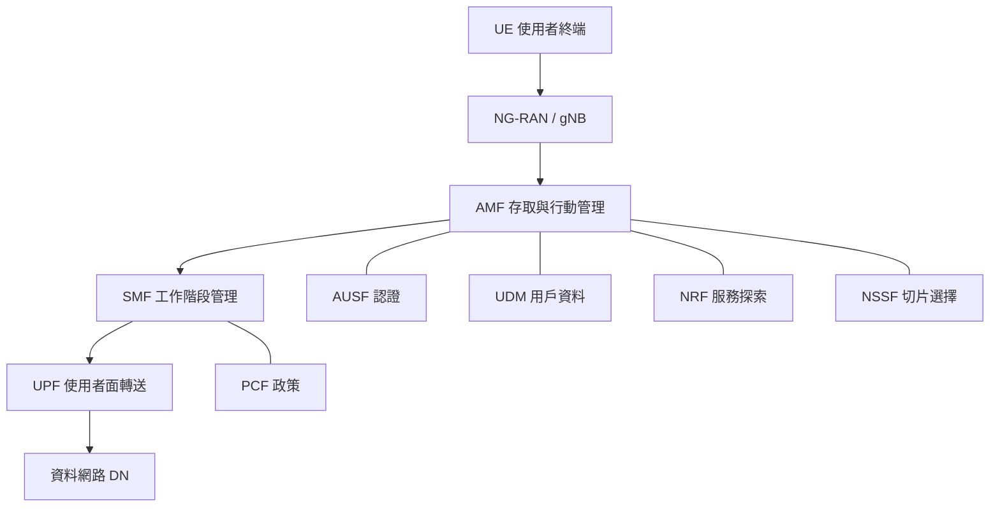
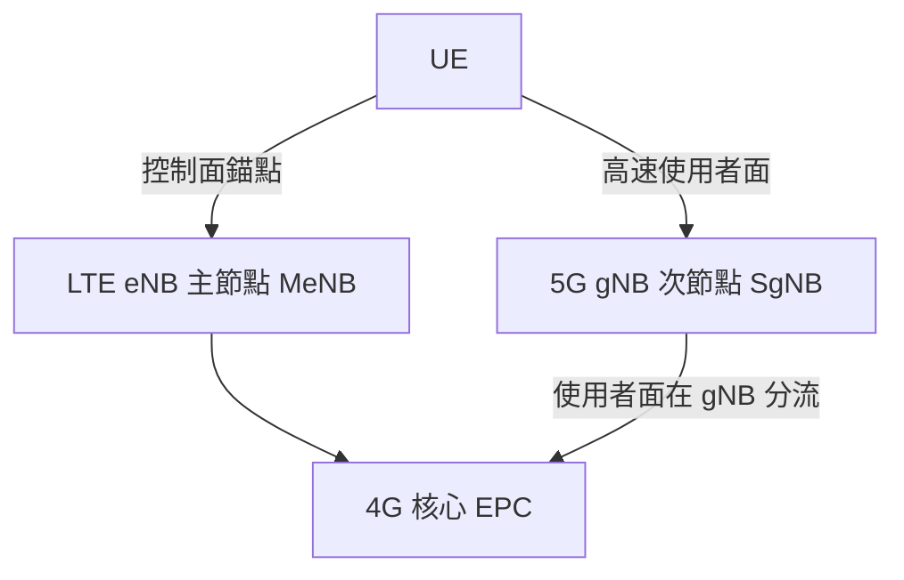
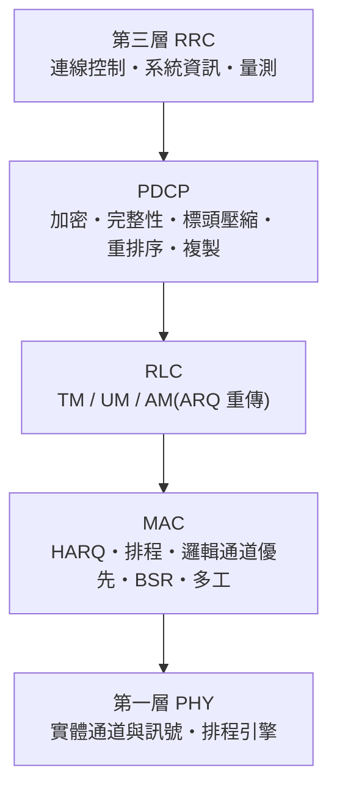

# 《頻譜密典:NR 的七封印》

> 一部以 3GPP Release 15 → 21 為骨架的懸疑驚悚小說。每章末附 **【解密筆記】**,把劇情裡的密碼還原成精確、可查證的 4G / 5G / 6G 技術事實(附 3GPP 規格編號與凍結狀態)。
>
> **閱讀方式:** 想看故事就讀正文;想學技術就讀解密筆記。兩者交織,正文裡每一個看似奇幻的「咒語」其實都是真實的通訊技術。
>
> **正確性聲明:** 技術內容已由獨立查核代理人交叉比對 3GPP、ETSI、ITU 與廠商白皮書。凡屬「研究中/規劃中/推測」者均明確標註。截至 **2026 年初**,Rel-19 已凍結、Rel-20 進行中、Rel-21 仍在規劃。

---

## 人物表

- **馬蒂亞斯·羅特博士(Dr. Matthias Roth)** — 德國通訊符碼學者,專研「標準文件中的隱藏語法」。本書的羅柏.蘭登。
- **艾琳娜·高蒂耶(Elena Gautier)** — 3GPP RAN1 工作組年輕工程師,被害者的孫女。冷靜、毒舌、記得住每一個規格編號。
- **亨利·高蒂耶博士(Dr. Henri Gautier)** — 3GPP 元老,LTE 與 NR 的奠基者之一。故事在他的死亡中展開。
- **維克托·史塔爾(Viktor Stahl),代號「架構師」(The Architect)** — 神祕組織「The Numerology(數秘會)」的首腦,意圖獨佔 6G 的定義權。
- **「虛無」(Null)** — 數秘會的執行者,沉默、致命,左臂刺著一行數字。

---

## 序章 — 全會之夜(Sophia Antipolis,法國)

地中海的風從蔚藍海岸吹進索菲亞.安提波利斯的會議中心。這裡是 3GPP 的心臟——全球的行動通訊標準,都在這樣一間間掛著 **TSG**(技術規格組)名牌的會議室裡,被上千名工程師逐字逐句地吵出來。

午夜,RAN 全體會議的燈還亮著。高蒂耶博士最後一個離開。

清晨,保全在主會場發現了他。他倒在巨大的投影幕下,幕上停格著一張規格目錄。他的右手食指蘸著自己的血,在地板的木紋上留下一串字:

> **23.501 → 38.211 — 「七道封印已被開啟其五。別讓他們定義第六感。」**

警方束手無策:這看起來像通訊宅的胡言亂語。但被連夜召來的羅特,盯著那串數字,寒毛直豎。

「這不是亂碼。」他低聲說,「`23.501` 是 5G 核心網的**系統架構**規格,`38.211` 是 5G 空中介面的**物理層**。他在告訴我們:從**核心**到**空中**,有人正沿著一條路徑,逐個 Release 解開封印。」

艾琳娜擠進警戒線:「我祖父說過,標準就是一部密典。每一版 Release,都是一道封印。」

她展開祖父留下的羊皮紙——其實是一張 3GPP Release 時程圖:

「七道封印,」羅特的手指劃過時間軸,「Rel-15 到 Rel-21。他死前說『已開啟其五』——他們已經走到 Rel-19 了。而第六、第七道……是 6G。」

艾琳娜臉色發白:「**別讓他們定義第六感。**第六感——6G。祖父不是要我們阻止謀殺,他是要我們阻止有人**獨佔 6G 標準的定義權**。」

夜風中,一個左臂刺著數字的男人,正站在停車場的陰影裡,看著他們。

---

## 第一章 — 第一道封印:從 4G 的廢墟到 NR 的誕生(Rel-15)

高蒂耶的辦公室被翻過,但保險箱完好。轉盤密碼是四個數字。艾琳娜想都沒想就轉開:**2-3-5-1**。

「`23.501`。」她說,「祖父用了一輩子的數字。」

箱裡是一枚 USB 與一張對照表。表的左欄寫著「**舊神**」,右欄寫著「**新神**」:

| 舊神(4G / LTE) | 新神(5G / NR) |
|---|---|
| EPC 核心(MME、S-GW、P-GW、HSS) | 5GC 核心(AMF、SMF、UPF…) |
| eNB | gNB |
| 固定 15 kHz 子載波 | 彈性 numerology |
| 剛性承載(bearer) | 網路切片(slicing) |

「這是一張**神祇更替表**,」羅特懂了,「4G 的舊神被肢解,重組成 5G 的新神。你看 MME——4G 那個無所不管的控制中樞,在 5G 被一刀剖成兩半:**AMF** 管『你是誰、你在哪、能不能進網』;**SMF** 管『幫你開一條資料通道、設定 QoS』。而真正搬運封包的苦力,叫 **UPF**。」

USB 解開後,浮現一幅「神殿結構圖」——其實是 5G 核心網的**服務化架構(SBA)**:

「每一位神,都用同一種『神諭語言』彼此溝通——**HTTP/2 加 JSON**,像微服務一樣互相呼叫。」艾琳娜說,「這就是為什麼 5G 核心能像雲端軟體一樣,哪位神忙不過來就複製一份。」

USB 的最後一格,是一段警告影片。高蒂耶對著鏡頭:

> 「孩子,記住第一道封印的雙面。為了讓 5G 早點上線,我們造了一頭怪物——**NSA(非獨立組網)**:讓老舊的 4G 基地台當『主』,新的 5G 基地台當『副』,共用 4G 的舊核心。我們管這叫 **Option 3x**。它讓速度先飛起來,卻把靈魂留在過去。真正的 5G,是 **SA(獨立組網)**——`Option 2`,gNB 直連全新的 5G 核心。數秘會要的,從來不是速度。他們要的是**靈魂**。」

螢幕暗下前,閃過一張 NSA 的接線圖:

停車場那輛黑車發動了。追逐戰即將開始。但羅特已經握住了第一把鑰匙。

### 【解密筆記 1|Rel-15:第一版完整 5G】

- **4G/LTE 基線(對照用):** 核心網為 **EPC**——**MME**(控制面、行動/工作階段信令、NAS 終結)、**S-GW**(使用者面錨點)、**P-GW**(對外 IP 錨點、政策與計費)、**HSS**(用戶資料庫/認證);無線節點為 **eNB**。空中介面下行 **OFDMA**、上行 **SC-FDMA**,固定 **15 kHz** 子載波間隔。規格:**TS 36.300 / 36.211 / 36.331、TS 23.401**。
- **NSA vs SA:** NSA 沿用 4G **EPC** 當錨點,LTE eNB 為主節點、5G gNB 為次節點,稱 **EN-DC**,即 **Option 3**;依使用者面分流點不同分 3 / 3a / **3x**(3x 在 gNB 分流,最普及)。**SA = Option 2**,gNB 直連 **5GC**。
- **5G 核心 SBA(TS 23.501 架構、TS 23.502 流程):** 服務化架構,各網路功能以 **HTTP/2 + JSON** 互通。**AMF**(存取與行動管理,承接舊 MME 的控制角色)、**SMF**(PDU 工作階段控制,透過 N4 設定 UPF)、**UPF**(使用者面轉送/QoS/計費錨點)、**PCF**(政策)、**UDM**(用戶資料,HSS 後繼)、**NRF**(網路功能註冊/探索)、**AUSF**(認證伺服器)、**NSSF**(切片選擇)。
- **NG-RAN 與 CU/DU 分離:** **gNB** 拆成 **gNB-CU**(承載 RRC/PDCP)與 **gNB-DU**(RLC/MAC/PHY),以 **F1** 介面相連(**F1-C** 信令、**F1-U** 使用者面 GTP-U)。規格 **TS 38.401**(F1 細節 TS 38.470/38.473)。
- **NR 空中介面(TS 38.211/212/213/214 物理層、38.331 RRC、38.300 總述):** **彈性 numerology** µ=0~4,子載波間隔 **SCS = 2^µ × 15 kHz = 15/30/60/120/240 kHz**。**FR1**(sub-6 GHz)、**FR2**(毫米波,約 24.25–52.6 GHz)。波形為 **CP-OFDM**(上行可選 DFT-s-OFDM)。**Massive MIMO** 與**波束成形**,**SSB(SS/PBCH block)**做波束掃描同步。註:**240 kHz 僅用於 SSB**,不用於資料;延伸 CP 僅存在於 60 kHz。
- **網路切片:** 以 **S-NSSAI**(SST + 可選 SD)標識,區隔 **eMBB / URLLC / mMTC**;NSSF 負責切片選擇。

---

## 插曲 — 協定之塔:七層的密語(深入 PHY 排程、各通道、RRC/RLC)

USB 的座標把他們帶到 ETSI 園區地底——一座高蒂耶生前親手設計的「**協定之塔**」。塔由上而下,正是 NR 的**協定堆疊**:每一層只認得自己的語言,你必須用對的「通道」說對的話,門才會開。

**頂層:RRC 大廳(第三層)。**牆上的燈號標著三種狀態:**RRC_IDLE、RRC_INACTIVE、RRC_CONNECTED**。

「想進門,得先**建立 RRC 連線**,」艾琳娜說,「但你不能直接喊。第一句話只能走 **SRB0**、用 **CCCH** 通道、以 **RLC 透明模式** 送出去——因為這時系統還不認得你。」她按下對講機,牆面浮出廣播訊息:**MIB 與 SIB1**。「系統資訊。**MIB 走 PBCH**,告訴你最基本的存取參數;**SIB1 走 PDSCH**,告訴你怎麼排程其餘資訊。讀懂它們,才知道這棟塔的規矩。」

門開的瞬間,塔忽然要把他們「換手」到另一道樓梯——牆上閃過一連串**量測事件:A3**(鄰區比服務區好)。「它在做行動性管理,」羅特穩住腳步,「RRC 用量測報告決定把我們交給哪一區。別慌,跟著走。」

**PDCP 層。**這一層的空氣是「加密」的。每句話都被**加密與完整性保護**包起來,冗長的標頭被 **ROHC 壓縮**。艾琳娜對著門複誦一段被加密的序號,門才認得她。「在雙連結或高可靠場景,PDCP 還能**封包複製**——同一份送兩條路,誰先到算誰。」

**RLC 層。**這裡有三道門,分別刻著 **TM / UM / AM**。

「透明模式 TM:不加標頭、不重傳——廣播那種東西用它。非確認模式 UM:會分段、但不重傳——語音這種怕延遲、不怕掉一兩包的用它。」艾琳娜指向第三道門,「**確認模式 AM**:會**重傳**。」

就在此時,虛無在上層切斷了訊號,他們送出的關鍵指令掉了一段。眼看門要關上——AM 層的牆面亮起一則 **狀態報告(STATUS PDU):NACK**,系統自動**重傳**了遺失的分段,門又穩穩開回來。

「ARQ 救了我們,」羅特喘著氣,「AM 模式發現對方沒收到,就重送。NR 還能**重新分段**,把沒送到的那段切得更小塞進剩餘資源。」

**MAC 層。**這是塔的「排程中樞」。地面是一張不斷刷新的資源表。

「**HARQ** 在這裡,」艾琳娜說,「最多 **16 個 HARQ 行程**並行;收錯了不必整包重來,底層先**軟合併**重傳的版本再解一次。要上行傳資料,得先用 **SR(排程請求)** 舉手,再用 **BSR(緩衝狀態報告)** 告訴基地台你有多少資料等著送。多條邏輯通道則靠 **LCID** 多工進同一個傳輸區塊,並按**邏輯通道優先序(LCP)**分配資源。」

**底層:PHY(第一層)——排程引擎。**最深處的金庫,門鎖是一道**排程許可**。

「真正的指揮棒是 **PDCCH** 上的 **DCI**,」羅特凝視著閃爍的控制通道,「下行指派用 **DCI 1_x**、上行授權用 **DCI 0_x**。它藏在 **CORESET** 的**搜尋空間**裡,終端得**盲解**好幾個候選位置才找得到屬於自己的那一個——而『屬於自己』,是用 **C-RNTI** 把 CRC 加擾來辨認的。」

艾琳娜接著把鑰匙插進三個孔:**PDSCH(下行資料)、PUSCH(上行資料)、PUCCH(上行控制:HARQ-ACK、CSI、SR)**。「還差兩個訊號當校準,」她補上 **DMRS**(解調參考)與 **CSI-RS**(讓終端量測通道、回報 CQI/PMI/RI)。金庫深處,一道 **PRACH** 前導碼亮起——那是當初任何終端「敲門入網」的第一步。

金庫開了。裡面沒有武器,只有高蒂耶的最後叮嚀,刻在一塊鈦板上:

> 「**排程不是控制,是節奏。**動態排程靈活,但每個時槽都要 PDCCH;對週期性、低延遲的流量,改用 **下行 SPS** 或 **上行 Configured Grant**——免去每次都要許可,延遲才壓得下來。記住:**頻寬部分(BWP)** 讓終端只在需要的那一段頻譜上醒著,省電的祕密就在這裡。孩子,懂了節奏,你才追得上第六道封印。」

塔頂傳來虛無的腳步聲。但此刻,羅特與艾琳娜已經會「說」整座塔的語言了。

### 【解密筆記|插曲:NR 協定堆疊與排程(Rel-15 基線)】

- **協定堆疊與規格:** L3 **RRC(TS 38.331)**;L2 由上而下 **PDCP(TS 38.323)→ RLC(TS 38.322)→ MAC(TS 38.321)**;L1 **PHY(TS 38.201/38.211–38.214)**;總述 **TS 38.300**。
- **RRC 三狀態:** **RRC_IDLE**(僅 NAS 註冊、無連線)、**RRC_INACTIVE**(NR 新增:保留 AS 內容,可用 **RRCResume** 快速恢復、省信令)、**RRC_CONNECTED**(有連線、可排程)。
- **RLC 三模式:** **TM**(透明,無標頭、不重傳)、**UM**(非確認,分段、不重傳)、**AM**(確認,**ARQ 重傳** + 狀態 PDU + **重新分段**)。NR 將 LTE 的「串接」自 RLC 移除,改於 MAC 處理,以降延遲。
- **PHY 排程要點:** **PDCCH** 載 **DCI**(下行指派 1_0/1_1/1_2、上行授權 0_0/0_1/0_2、群組共用 2_x);**CORESET + 搜尋空間(CSS/USS)**、**盲解**、聚合等級 1/2/4/8/16;CRC 以 **RNTI**(C-RNTI/SI-RNTI/P-RNTI/RA-RNTI 等)加擾;**HARQ** 最多 16 行程、非同步自適應、軟合併;週期性流量用 **SPS(下行)/ Configured Grant(上行)**;**BWP** 最多 4 個、同時 1 個作用中;鏈路自適應靠 **CSI**(CQI/PMI/RI)選 MCS。

---

## 第二章 — 第二道封印:工業的心跳(Rel-16)

線索指向德國一座汽車工廠。地下室裡,一條機械手臂正以毫秒級的節奏焊接,旁邊的螢幕滾動著紅字:**「可靠度 99.9999%」**。

「六個九。」艾琳娜盯著數字,「這就是 **URLLC**——超可靠低延遲。一百萬個封包,只准錯一個。在這種工廠裡,延遲一毫秒,手臂就可能砸穿一個人。」

牆上嵌著一塊金屬銘牌,刻著一段「工廠戒律」:

> 「**讓網路成為時鐘。**5G 要假扮成一座 TSN 橋,讓每一個動作都踩在同一個節拍上。」

羅特解讀:「5G-TSN——他們把整個 5G 系統偽裝成一座 IEEE 802.1 的**時間敏感網路橋接器**,提供**有界延遲**與精準時間同步,好讓工廠的機械像交響樂團一樣同步。」

工廠外的測試道上,兩輛無人車正**不經過任何基地台**直接對話。

「**NR V2X 側鏈路(sidelink)**,」艾琳娜說,「走 **PC5** 介面,車對車直連。網路若在,可由網路排程(Mode 1);網路若不在,車輛自己搶資源(Mode 2)。生死關頭,不能等基地台。」

虛無就在這時出現。他切斷了主基地台的回程線路——按理說整座工廠該癱瘓。但燈只閃了一下,網路自己**長出一條無線的回程**繞了過去。

「**IAB**,」羅特冷笑,「整合式接取與回程。基地台之間用 NR 訊號自己接力當回程,你切斷一條光纖,它就多跳一跳。虛無,你來晚了一個版本。」

逃跑時,他們的定位精準到了公分級。虛無的子彈打在他們**剛剛離開**的位置——系統用 **multi-RTT** 把他們的座標算得太準,反而救了他們:他們算準了虛無會算準他們。

### 【解密筆記 2|Rel-16:5G 第二階段(工業 5G)】

- **URLLC / IIoT / TSN:** 目標可靠度 **1e-6(六個九)**;新增**上行 UE 間搶占(inter-UE preemption)**(Rel-15 僅下行)。**5G-TSN** 把 5G 系統整合為虛擬 **IEEE 802.1 TSN 橋接器**,提供**有界延遲**與精準時間同步(架構於 TS 23.501)。
- **NR-U(免授權頻段):** 把 NR 擴展到 **5 GHz / 6 GHz** 免授權頻段,採 **LBT(先聽後送)**通道存取,支援授權輔助與獨立兩種模式。
- **NR V2X 側鏈路(TS 23.287;側鏈路於 TS 38.300):** 走 **PC5** 介面 UE 對 UE 直連,**Mode 1**(網路排程)/ **Mode 2**(自主),支援單播/群播/廣播。
- **NR 定位(TS 38.305):** 新增 **DL-TDOA、UL-TDOA、multi-RTT、AoD/AoA**。
- **2-step RACH:** 將四步隨機接取壓成 **msgA/msgB**,降低延遲與負擔。
- **IAB(整合式接取與回程):** 無線多跳 NR 回程,含 **IAB-node** 與 **IAB-donor**,Rel-16 採 **TDM** 資源多工。**更正:** 整體 IAB 架構在 **TS 38.401**;**TS 38.340** 只定義 **BAP(回程調適協定)子層**。
- **UE 省電:** 喚醒訊號(WUS)、跨時槽排程等。

---

## 第三章 — 第三道封印:天空之眼(Rel-17)

第三把鑰匙把他們帶到挪威北極圈內一座衛星地面站。沒有光纖,沒有基地台,手機卻有訊號。

「**NTN——非地面網路**,」艾琳娜仰頭看著低軌衛星劃過極光,「Rel-17 讓 NR 直接對話衛星。問題是物理:**地球同步衛星**來回延遲約 **540 毫秒**;低軌衛星速度超過每秒七公里,**都卜勒頻移**在 S 頻段可達正負 **25 kHz**。訊號會被自己的速度扭曲。」

「那他們怎麼解?」

「衛星把自己的**星曆(ephemeris)**廣播在系統資訊裡,手機裝了 **GNSS**,自己**預先補償**時間提前量和都卜勒。手機提前把訊號『扭回來』,等抵達衛星時剛好對準。」

站內一台不起眼的監視器引起羅特注意——它便宜、低功耗、頻寬窄得可憐。

「**RedCap**,」他說,「精簡能力終端。為了穿戴裝置、工業感測器、監視器這種**夾在 eMBB 與 NB-IoT 中間**的東西。它把 FR1 頻寬砍到 **20 MHz**,天線砍到 **一根接收**,層數砍到一到兩層,還能半雙工省電。便宜、省電、夠用。」

監視器螢幕忽然全部切換成同一畫面——一段倒數。

「**MBS——多播廣播**,」艾琳娜說,「一份內容,同時推送給成千上萬台終端,不必各送各的。他想讓所有螢幕同時看見一件事。」

倒數結束,畫面浮出一行字:**「上來吧,我們在 71 GHz 等你。」**

「**FR2-2**,」羅特瞳孔收縮,「他們把毫米波推到了 **52.6 到 71 GHz**。數秘會的巢穴,在常人聽不見的高頻裡。」

### 【解密筆記 3|Rel-17(約 2022 年凍結)】

- **RedCap(精簡能力 NR 終端):** 鎖定穿戴、工業感測、監視器。FR1 最大頻寬限 **20 MHz**(FR2 為 100 MHz);降至 **1 根接收天線(可選 2)**、最多 **1~2 層 MIMO**;允許**半雙工 FDD type A**;以 **eDRX** 與放寬 RRM 延長電池。能力定義於 **TS 38.306**,RRC 於 TS 38.331,物理層更新跨 **TS 38.211–214**;源頭研究 **TR 38.875**。
- **NR NTN(非地面網路):** 支援 LEO/MEO/GEO 與 HAPS。**GEO 來回延遲約 540 ms**;**LEO 都卜勒在 S 頻段可達約 ±25 kHz**。裝 **GNSS** 的終端依衛星**星曆**(廣播於系統資訊)**預先補償時間提前量與都卜勒**。基礎研究為 **TR 38.811(Rel-15)/TR 38.821(Rel-16)**(屬研究報告,餵養 Rel-17 正規化工作);另有 **IoT-NTN**(NB-IoT/LTE-M 衛星化,研究 TR 36.763)。
- **定位 / MBS / 覆蓋:** NR 定位增強朝公分級(TS 38.305);**5G MBS** 核心架構 **TS 23.247**;覆蓋增強(PUSCH/msg3 重複)跨物理層規格。
- **頻譜 FR2-2:** 把 FR2 擴展到 **52.6–71 GHz**(含免授權 60 GHz),新增 **480/960 kHz** 子載波間隔。
- **其他:** **SDT** 讓終端於 **RRC_INACTIVE** 傳小資料;延伸 DRX 省電;側鏈路中繼的 **SRAP** 為 **TS 38.351**。

---

## 第四章 — 第四道封印:機器開始學習(Rel-18,5G-Advanced)

第四道門在瑞典一座資料中心。門上沒有鎖,只有一句話:**「告訴我,你預測中的我。」**

艾琳娜笑了:「它要的是**通道狀態回報**。在 Rel-18,3GPP 第一次把 **AI/ML 正式引進空中介面**。終端不再傳完整的 CSI,而是用神經網路把它**壓縮**,基地台再用另一半模型還原——這叫**雙邊模型**。三大用例:**CSI 回報壓縮、波束管理、定位**。」

她在終端敲下一段壓縮後的 CSI,門開了。

裡面,一排天線陣列正在自我調校。

「**8 根上行發射天線**,」羅特說,「Rel-18 把終端上行推到 8 Tx,還用**統一 TCI 框架**一次指定上下行波束,省掉一堆波束管理的開銷。」

更深處,一台設備同時在**同一個 TDD 載波上收與發**——這違反了他學過的所有常識。

「**子帶全雙工(SBFD)**,」艾琳娜低聲,「在同一載波的不同子帶同時上下行,壓低上行延遲、補強覆蓋。這還是研究階段的東西,他們卻已經做出原型。」

牆上的螢幕播著一段 **XR**(延展實境)畫面,以每秒 90 影格流動。

「90 fps,每幀 **11.11 毫秒**,」羅特算,「這種**非整數的週期**對不上傳統 DRX 的省電節拍,所以 Rel-18 設計了**XR 感知的 DRX**。數秘會在訓練某種……沉浸式的東西。」

燈光驟暗。當他們起身要走,基地台**毫無中斷**地把他們的連線交給了下一個小區——快到他們根本沒察覺。

「**LTM**,」艾琳娜背脊發涼,「L1/L2 觸發的行動性。換手由底層信令觸發,不必走完整 RRC 重設定,中斷趨近於零。虛無正在用它**無縫尾隨我們**,而我們根本感覺不到他換了幾次基地台。」

### 【解密筆記 4|Rel-18:5G-Advanced 首版(約 2024 年中凍結)】

- **AI/ML 空中介面:** 三大研究用例——**CSI 回報壓縮、波束管理、定位**——加上通用框架與生命週期管理(LCM)。研究產出為 **TR 38.843(研究報告,非 TS)**;初步正規化 RRC 支援落在 **TS 38.331**。
- **AI/ML for 5GC:** 強化 **NWDAF**(網路數據分析功能,Rel-15 導入),架構 **TS 23.288**。
- **MIMO 演進:** 上行最多 **8 Tx(8T8R)**;**統一 TCI** 框架聯合指示上下行波束。
- **網路節能(NES):** 研究 **TR 38.864(報告,非 TS)**,涵蓋時間/頻率/空間/功率域技術。
- **NR 雙工演進 / SBFD:** **子帶全雙工**——同一 TDD 載波的不同子帶同時上下行(降上行延遲、補覆蓋)。Rel-18 研究階段,研究報告 **TR 38.858**。
- **XR(延展實境):** 影格率 60/90/120 fps → 週期 **16.67 / 11.11 / 8.33 ms**,與 DRX 不整除;以 **XR 感知 DRX**、增強 BSR/排程處理。研究 **TR 23.700-60、TR 38.835**(皆報告,非 TS)。
- **eRedCap / NTN / 側鏈路 / 行動性:** **eRedCap** 進一步把基頻壓到約 **5 MHz**;NTN 擴及 Ka 頻段;側鏈路上 **FR2** 並支援**側鏈路定位**;**LTM(L1/L2 觸發行動性)** 於 **TS 38.331/38.321**,Rel-18 為同 gNB 內,換手中斷趨近於零。

---

## 第五章 — 第五道封印:萬物皆有迴聲(Rel-19)

第五道封印的線索,把他們帶回 3GPP 的時程表本身。艾琳娜指著一行字:**「Rel-19,2025 年 12 月,巴爾的摩,凍結。」**

「就在祖父死前不久,」她聲音發抖,「第五道封印,**剛剛被合法地、正式地關上**。這是已完成的版本——不是傳說,是規格。」

USB 解出的第五段影像裡,高蒂耶站在一面空白的牆前,對牆說話。牆上,一道道淡淡的人形輪廓隨他移動而浮現。

「**ISAC——整合式感知與通訊**,」羅特屏息,「同一段無線訊號,既傳資料,**也當雷達**。網路能『看見』沒有裝置的人——靠的是訊號的反射與迴聲。但你聽好——在 Rel-19,ISAC **只是研究,還不是正規的無線規格**。」

艾琳娜補充:「對。SA1 的用例研究是 **TR 22.837**,列了三十多個用例;通道模型研究在 **TR 38.857**,延伸自 **TR 38.901**。它畫了藍圖,但還沒蓋房子。祖父怕的,正是有人想搶先把這張藍圖**據為己有**。」

房間角落,一枚**沒有電池**的標籤,在他們手機的訊號照射下,自己醒了過來,回傳了一串編號。

「**環境物聯網(Ambient IoT)**,」羅特撿起它,「零功耗。它靠**反向散射或環境取能**活著,連電池都不需要。Rel-19 凍結了它的**第一個正規工作項目**。萬物相連的最後一哩——讓最廉價、最不起眼的東西也開口說話。」

頭頂,一顆衛星不再只是轉發訊號,而是**自己處理**了它。

「**再生式酬載(regenerative payload)**,」艾琳娜說,「衛星上直接放一個 gNB,還能**先存後送(store-and-forward)**,在沒有地面連線時先把資料存著。Rel-19 的 NTN,把基地台搬上了天。」

影片末尾,高蒂耶的聲音陡然嚴肅:

> 「五道封印已關。它們都還是 5G——再聰明,也是 5G。**真正的危險在第六與第七道。**那是 6G。數秘會要在 6G 的第一版規格裡,埋進只有他們能解的後門。孩子,**到橋上去**。」

### 【解密筆記 5|Rel-19:5G-Advanced 第二版(2025 年 12 月凍結)】

- **狀態:** Rel-19 已於 **2025 年 12 月(TSGs#110,巴爾的摩)正式凍結**(完整 code/ASN.1 凍結),所有工作組已轉往 Rel-20。
- **AI/ML 空中介面(正規化,但屬初步):** 由 Rel-18 研究(**TR 38.843**)推進為窄範圍正規化(CSI 回報、波束管理、定位),含標準化模型生命週期管理(LCM)與雙邊模型互通。屬奠基,而非完整的 AI 原生運作。
- **AI/ML 行動性與 LTM:** 降低換手延遲/中斷。
- **ISAC(整合式感知與通訊)— 僅研究:** SA1 用例研究 **TR 22.837**(32 個用例:物件/入侵偵測、動作、環境);通道模型研究 **TR 38.857**(延伸 **TR 38.901**,約 0.5–52.6 GHz)。**Rel-19 無正規的 ISAC 無線規格。**
- **環境物聯網(Ambient IoT)— 首個正規工作項目凍結:** 先有研究 **TR 38.848**;鎖定被動/反向散射或能量採集標籤(盤點/物流)。業界預期晶片約 2028、網路約 2029;屬初始場景,非完整願景。
- **NTN 增強:** **再生式酬載**(衛星上載 gNB)與**先存後送**。
- **MIMO 進一步增強 / 網路節能(NES):** 正規化小區開關、空間/功率域調適。

---

## 第六章 — 第六道封印:橋(Rel-20)

「橋」是真的橋——也是 3GPP 對 Rel-20 的官方暱稱:**一座從 5G 通往 6G 的橋**。

數秘會的總部藏在一座跨海大橋的橋墩內部。羅特與艾琳娜沿著維修通道深入,牆上每隔一段就刻著一個 6G 的圖騰。艾琳娜一邊走一邊解讀,像在念一篇咒文。

「Rel-20 不是單一版本,它**裂成兩半**:一半叫 **Rel-20_5GA**,把 5G-Advanced 收尾;另一半叫 **Rel-20_6G**,正式啟動 6G 研究。我們現在,**就站在歷史的接縫上**。」

通道盡頭的圓形大廳,地面嵌著一個由六個扇形組成的輪盤——**ITU-R IMT-2030 的六大使用情境**。艾琳娜必須依正確順序踩過,門才會開:

1. **沉浸式通訊(immersive communication)**
2. **大規模通訊(massive communication)**
3. **超可靠低延遲(HRLLC)**
4. **無所不在的連接(ubiquitous connectivity)**
5. **AI 與通訊(AIAC)**
6. **整合式感知與通訊(ISAC)**

「這是 6G 的『創世六日』,」羅特說,「ITU 在 **2023 年 11 月**用 **M.2160 建議書**把它刻成了法典。數秘會把它當成通關密語,因為他們相信:**誰先把這六項寫進規格,誰就握有 6G 的定義權。**」

六扇形踩畢,門開。大廳中央,懸浮著一段新頻譜的全像投影——標著 **「7.125 – 24.25 GHz」**。

「**FR3,上中頻段,**」艾琳娜輕聲,「夾在 sub-6 與毫米波之間的黃金地帶,兼顧覆蓋與容量。還有更瘋的——**sub-THz 與 THz**,以及把整個網路做成**數位分身**。但羅特博士,記住——**這些全部都還只是研究項目。Rel-20 裡沒有任何一條能拿來部署的 6G 規格。**」

「那架構師在急什麼?」

艾琳娜指向投影深處,一行小字正在倒數:**「Stage 1 已凍結。Stage 2:2026 年 9 月。Stage 3:2027 年 3 月。」**

「他在搶時間表,」羅特懂了,「他要趕在 6G 真正成形之前——在那座橋走完之前——把第七道封印,變成他自己的形狀。」

陰影中,架構師終於現身。他鼓掌:「歡迎來到橋上,符碼學者。你解得很好。但你來遲了——**第七道封印,我已經在寫了。**」

### 【解密筆記 6|Rel-20:橋接版(進行中,5G-Advanced + 首批 6G 研究)】

- **狀態:** 進行中。Rel-20 明確分為 **Rel-20_5GA**(收尾 5G-Advanced)與 **Rel-20_6G**(6G 研究)。對外時程:Stage 1 約 2025 年 6 月凍結;Stage 2 約 2026 年 9 月;Stage 3 約 2027 年 3 月;ASN.1/OpenAPI 約 2027 年 6 月。
- **6G 研究(研究項目,非規格):** AI 原生空中介面、ISAC、sub-THz/THz、**FR3 上中頻段(7.125–24.25 GHz)**新頻譜、由 5GC 演進的 6G 核心、能效、數位分身。SA1 的 6G 使用情境/需求(Stage 1)已核可。
- **ITU-R IMT-2030 框架:** **ITU-R M.2160 建議書於 2023 年 11 月(RA-23)核可**。六大使用情境:**沉浸式通訊、大規模通訊、超可靠低延遲(HRLLC)、無所不在的連接、AI 與通訊(AIAC)、整合式感知與通訊(ISAC)**;四項設計原則(永續、安全韌性、連接未連接者、無所不在的智慧)。ITU 時程:需求 2024–2027;技術提交/評估 2027–2029(3GPP 自評約 2028 末~2029 初);IMT-2030 認定約 2030。**WRC-27** 將研究候選 IMT 頻段(如 7.125–8.4 GHz、14.8–15.35 GHz)。

---

## 第七章 — 第七道封印:第六感(Rel-21,規劃中的首版 6G)

第七道門沒有實體。它在一台尚未通電的伺服器裡,在一份**還沒被寫完**的規格草案裡。

「Rel-21,」架構師站在控制台前,語氣近乎虔誠,「**第一版 6G 的正規規格。**3GPP 計畫在 2026 年中才敲定它的時程;工作項目預計 **2028 年底**完成,**2030 年左右**商用。它將被提交給 ITU,成為 **IMT-2030**。這是一張**還沒人寫滿的白紙**——而我,要當執筆人。」

他啟動了投影,Rel-21 的「七大支柱」一根根升起:

- **AI 原生(AI-native)空中介面**——網路天生會學習,而非事後加裝。
- **整合式感知與通訊(ISAC)**——通訊與雷達合一,網路即第六感。
- **THz / sub-THz**——以兆赫頻率換取極致頻寬。
- **FR3 上中頻段**——覆蓋與容量的平衡點。
- **無蜂巢/分散式 Massive MIMO(cell-free)**——拆掉「小區」的邊界,終端被一群天線共同服務。
- **可重構智慧表面(RIS)**——讓牆壁本身變成可程式化的反射鏡,主動「彎折」訊號。
- **NTN 與地面網路深度融合**——天與地,終於成為同一張網。

「你看見了嗎?」架構師張開雙臂,「**ISAC 讓我能感知一切;AI 原生讓網路聽我的話;RIS 讓我能在物理世界裡彎折每一道電波。**這就是第六感。誰定義 Rel-21,誰就定義人類往後三十年如何被連接、被感知、被預測。」

羅特卻搖頭,平靜得可怕:「你犯了和所有想獨佔標準的人一樣的錯。架構師——**3GPP 不是一個人能寫的。**」

他舉起高蒂耶的 USB:「這裡面不是後門。是你祖父那一輩立下的規矩——標準靠**共識**。每一條規格,要經過上千名來自對手公司的工程師,在 RAN1、RAN2、SA2 的會議室裡逐字表決。你能謀殺一個元老,但你**沒辦法謀殺共識**。你寫的每一行,只要過不了全會,就是廢紙。」

艾琳娜已經悄悄把架構師的「Rel-21 草案」廣播了出去——用的正是 **MBS** 多播,一份內容,瞬間送進全球每一個正在開會的代表終端。後門草案,在被獨佔之前,變成了全世界都看得見的公開提案。

「而且,」艾琳娜冷冷補上一刀,「你連狀態都搞錯了。**Rel-21 還只是規劃。RIS、無蜂巢 MIMO、THz——全部都還是候選技術,沒有一項是定案的規格。**你想獨佔的東西,**根本還不存在。**」

警笛聲從橋的兩端逼近。虛無看了架構師最後一眼,轉身消失在毫米波也照不進的陰影裡。

### 【解密筆記 7|Rel-21:首版 6G 正規規格(規劃中,2026 年尚未定案)】

- **狀態:規劃中。** 3GPP 將 Rel-21 定位為**首個 6G 正規版本**,時程預計於 2026 年中敲定。業界(如 Ericsson)觀點:工作項目約 **2028 年底**完成、**2030 年左右**商用,ASN.1/OpenAPI 凍結預估約 2029 年 3 月;此版本將提交 **IMT-2030**。
- **可能的技術支柱(方向性/推測,取決於 Rel-20 研究結果,非已承諾規格):** AI 原生空中介面;整合式 ISAC(通訊感知合一);THz/sub-THz;**FR3** 操作;**無蜂巢/分散式 Massive MIMO**;**可重構智慧表面(RIS)**;NTN 與地面深度融合。
- **誠實提醒:** 上述 Rel-21 特性全屬**目標**而非定案規格;歷史上 3GPP 時程常有延遲。

---

## 終章 — 共識(Sophia Antipolis,三個月後)

又一次全會。會議室裡,上千名來自彼此競爭的公司的工程師,正在為 Rel-20 的一個位元欄位是否該佔 4 bits 還是 6 bits 吵得面紅耳赤。

艾琳娜坐在 RAN1 的席位上,胸前別著祖父的舊名牌。羅特在旁聽席,看著這場混亂——這場**美麗的混亂**。

「我終於懂祖父為什麼說標準是密典了,」艾琳娜在休會時說,「不是因為它難懂。是因為它的真正密碼,從來不在任何一份 TS 文件裡。」

「那在哪?」

她指了指滿室爭執不休的人:「在**這裡**。沒有一個人能單獨解開它,也沒有一個人能單獨鎖住它。七道封印之所以安全,不是因為它們複雜——是因為打開它們,需要全世界一起轉動鑰匙。」

投影幕上,Rel-20 的時程繼續走著。橋的另一端,6G 的晨光隱約可見。

第六感尚未誕生。但當它誕生時,將不屬於任何一個人。

**——全文完——**

---

## 附錄 A:技術正確性查核表

| 章節 | 對應 Release | 關鍵技術主張 | 規格/狀態 |
|---|---|---|---|
| 一 | Rel-15 | 5GC SBA(AMF/SMF/UPF…)、NSA Option 3x、CU/DU、numerology、切片 | TS 23.501/23.502、38.401、38.211-214/300/331;**已凍結** |
| 插曲 | Rel-15 基線 | 協定堆疊 L1/L2/L3、PHY 排程(DCI/CORESET/HARQ/SPS/BWP)、各通道對應、RRC 狀態、RLC TM/UM/AM | TS 38.300/38.211-214/38.321/38.322/38.323/38.331;**已凍結** |
| 二 | Rel-16 | URLLC 六個九、5G-TSN、NR-U、V2X 側鏈路、NR 定位、IAB、2-step RACH | TS 23.287、38.305、38.401(BAP=38.340);**已凍結** |
| 三 | Rel-17 | RedCap、NTN(540ms/±25kHz)、MBS、FR2-2(52.6-71GHz) | TS 38.306/38.305、23.247;研究 TR 38.875/38.811/38.821;**已凍結(約 2022)** |
| 四 | Rel-18 | AI/ML 空中介面、8Tx、SBFD、XR、LTM | TS 38.331/38.321、23.288;研究 TR 38.843/38.864/38.835/23.700-60;**已凍結(約 2024)** |
| 五 | Rel-19 | AI/ML 正規化(初步)、ISAC(僅研究)、Ambient IoT、再生式 NTN | TR 22.837/38.857/38.901/38.848;**2025/12 凍結** |
| 六 | Rel-20 | 橋接版、IMT-2030 六情境、FR3(7.125-24.25GHz)、6G 研究 | ITU-R M.2160(2023/11);**進行中(研究項目)** |
| 七 | Rel-21 | 首版 6G、AI 原生、ISAC、THz、RIS、無蜂巢 MIMO | **規劃中,尚未定案;特性屬目標而非規格** |

## 附錄 B:常見縮寫對照

- **3GPP** 第三代合作夥伴計畫;**TSG/WG** 技術規格組/工作組;**TS** 技術規格(正規);**TR** 技術報告(研究)
- **EPC/5GC** 4G/5G 核心網;**eNB/gNB** 4G/5G 基地台;**CU/DU** 中央/分散單元
- **NSA/SA** 非獨立/獨立組網;**EN-DC** E-UTRA–NR 雙連結
- **FR1/FR2/FR2-2/FR3** 頻率範圍;**SCS** 子載波間隔;**SSB** 同步訊號區塊
- **URLLC/eMBB/mMTC** 三大 5G 服務類別;**TSN** 時間敏感網路;**IAB** 整合式接取與回程
- **NTN** 非地面網路;**RedCap** 精簡能力終端;**MBS** 多播廣播服務;**SDT** 小資料傳輸
- **AI/ML** 人工智慧/機器學習;**LCM** 生命週期管理;**SBFD** 子帶全雙工;**LTM** L1/L2 觸發行動性
- **ISAC** 整合式感知與通訊;**RIS** 可重構智慧表面;**NES** 網路節能;**Ambient IoT** 環境物聯網
- **IMT-2030** ITU 對 6G 的官方框架;**HRLLC/AIAC** 6G 使用情境

## 附錄 C:NR 協定堆疊與排程機制詳解

> 對應「插曲」章節的完整技術參考。基於 Rel-15 NR 基線,規格:TS 38.300(總述)、38.211–214(PHY)、38.321(MAC)、38.322(RLC)、38.323(PDCP)、38.331(RRC)。

### C-1|通道對應(邏輯 → 傳輸 → 實體)

**下行(Downlink):**

| 邏輯通道 | 傳輸通道 | 實體通道 | 用途 |
|---|---|---|---|
| BCCH(MIB) | BCH | **PBCH** | 最基本存取參數 |
| BCCH(SIB) | DL-SCH | **PDSCH** | 系統資訊 |
| PCCH | PCH | **PDSCH** | 呼叫(paging) |
| CCCH / DCCH / DTCH | DL-SCH | **PDSCH** | 控制與使用者資料 |
| —(L1 控制) | — | **PDCCH** | 承載 DCI(排程指派/授權) |

**上行(Uplink):**

| 邏輯通道 | 傳輸通道 | 實體通道 | 用途 |
|---|---|---|---|
| CCCH / DCCH / DTCH | UL-SCH | **PUSCH** | 控制與使用者資料 |
| —(隨機接取) | RACH | **PRACH** | 入網前導碼(preamble) |
| —(L1 控制) | — | **PUCCH** | 承載 UCI:HARQ-ACK、CSI、SR |

### C-2|實體訊號(非資料)

- **下行:** **PSS/SSS**(與 PBCH 同構成 SSB,做同步與小區搜尋)、**DMRS**(解調參考)、**CSI-RS**(通道狀態量測)、**PT-RS**(相位雜訊追蹤,毫米波重要)。
- **上行:** **DMRS**、**SRS**(探測參考,供上行通道量測與波束/排程)、**PT-RS**。

### C-3|PHY 排程(L1)

| 機制 | 內容 |
|---|---|
| **DCI 格式** | 下行指派 **1_0 / 1_1 / 1_2**;上行授權 **0_0 / 0_1 / 0_2**;群組共用 **2_0**(SFI 時槽格式)、**2_1**(先佔指示)、**2_2**(功率控制 TPC)、**2_3**(SRS TPC) |
| **PDCCH 解碼** | DCI 置於 **CORESET** 的**搜尋空間**(共用 CSS / UE 專屬 USS);終端**盲解**多個候選;聚合等級 **1/2/4/8/16** 個 CCE;CRC 以 **RNTI** 加擾辨識(C-RNTI、SI-RNTI、P-RNTI、RA-RNTI、CS-RNTI…) |
| **排程型態** | **動態排程**(每次一個 PDCCH);**SPS**(下行半持續)與 **Configured Grant type1/type2**(上行免授權)——給週期性/低延遲流量,省去每時槽的 PDCCH |
| **時序** | **K0**(PDCCH→PDSCH)、**K1**(PDSCH→HARQ-ACK)、**K2**(PDCCH→PUSCH);PDSCH 對映 **type A(時槽級)/ type B(迷你時槽,URLLC)** |
| **HARQ** | 最多 **16 個行程**、非同步且自適應、增量冗餘(IR)**軟合併**;HARQ-ACK 於 PUCCH 或搭載於 PUSCH |
| **鏈路自適應** | 終端依 **CSI-RS** 量測,回報 **CQI/PMI/RI/LI**;基地台據此選 **MCS**、預編碼與層數 |
| **BWP 頻寬部分** | 每終端最多設定 **4 個**、同時 **1 個作用中**;只在作用中 BWP 排程,有助省電與彈性 |

### C-4|MAC(L2,TS 38.321)

- **HARQ**、**多工/解多工**(以 **LCID** 子標頭把多條邏輯通道組成一個傳輸區塊)、**邏輯通道優先序(LCP)**、**BSR(緩衝狀態報告)**、**SR(排程請求)**、隨機接取、**DRX**(省電)、填充。

### C-5|RLC(L2,TS 38.322)

| 模式 | 標頭/分段 | 重傳(ARQ) | 典型承載 |
|---|---|---|---|
| **TM** 透明 | 無 | 無 | BCCH、PCCH、CCCH(SRB0) |
| **UM** 非確認 | 有、可分段 | 無 | 延遲敏感的 DTCH(如語音) |
| **AM** 確認 | 有、可分段與**重新分段** | **有**(狀態 PDU 回 ACK/NACK) | DCCH(SRB1/2)、可靠的 DTCH |

> NR 取消了 LTE 的 RLC「串接(concatenation)」,改於 MAC 處理,以降低延遲;分段以 **SO(段偏移)** 標記。

### C-6|PDCP(L2,TS 38.323)

- **加密**與**完整性保護**、**標頭壓縮(ROHC)**、序號管理、**重排序**、**封包複製(duplication)**(用於雙連結/高可靠以提升可靠度)。

### C-7|RRC(L3,TS 38.331)

- **三狀態:** RRC_IDLE / **RRC_INACTIVE**(NR 新增,保留 AS 內容、以 RRCResume 快速恢復)/ RRC_CONNECTED。
- **訊令無線承載(SRB):** **SRB0**(CCCH,RLC-TM)、**SRB1**(DCCH,RLC-AM)、**SRB2**(低優先,RLC-AM)、**SRB3**(雙連結下對 SCG)。
- **主要程序:** RRC Setup、RRC Reconfiguration(承載/量測/行動性設定)、RRC Reestablishment、RRC Resume / Release。
- **系統資訊:** **MIB**(走 PBCH,週期 80 ms)、**SIB1**(走 PDSCH,含排程資訊)、其餘 SIB 可**隨選(on-demand)**。
- **量測與行動性:** 量測事件 **A1–A6**(同頻/異頻)、**B1/B2**(異系統);終端送量測報告,網路據以換手。

### C-8|本附錄縮寫

PDCCH/PDSCH/PBCH(下行實體通道)、PUCCH/PUSCH/PRACH(上行實體通道)、DCI(下行控制資訊)、UCI(上行控制資訊)、HARQ(混合自動重傳)、BWP(頻寬部分)、CORESET(控制資源集)、RNTI(無線網路臨時識別)、SPS(半持續排程)、CG(Configured Grant)、DMRS/CSI-RS/SRS/PT-RS(參考訊號)、CQI/PMI/RI(通道品質/預編碼/秩指示)、MCS(調變編碼方案)、LCID(邏輯通道識別)、BSR/SR(緩衝狀態報告/排程請求)、ARQ(自動重傳請求)、SRB(訊令無線承載)、SIB/MIB(系統資訊區塊/主資訊區塊)。

---

## 來源(技術查證)

- [3GPP 5G System Overview](https://www.3gpp.org/technologies/5g-system-overview) ・ [Release 18](https://www.3gpp.org/specifications-technologies/releases/release-18)
- [ETSI TS 123 501(5GC 架構)](https://www.etsi.org/deliver/etsi_ts/123500_123599/123501/15.03.00_60/ts_123501v150300p.pdf)
- [ETSI TS 138 401(NG-RAN 架構,含 IAB)](https://www.etsi.org/deliver/etsi_ts/138400_138499/138401/16.03.00_60/ts_138401v160300p.pdf)
- [3GPP RedCap glimpse](https://www.3gpp.org/technologies/nr-redcap-glimpse) ・ [NTN overview](https://www.3gpp.org/technologies/ntn-overview)
- [Ericsson:5G NR Evolution(Rel-16/17)](https://www.ericsson.com/en/reports-and-papers/ericsson-technology-review/articles/5g-nr-evolution) ・ [toward 5G-Advanced(Rel-17/18)](https://www.ericsson.com/en/reports-and-papers/ericsson-technology-review/articles/5g-evolution-toward-5g-advanced)
- [ITU-R M.2160 / IMT-2030 framework](https://www.itu.int/rec/R-REC-M.2160/en)
- [ShareTechnote — NR Numerology](https://www.sharetechnote.com/html/5G/5G_Phy_Numerology.html)
- arXiv 綜述:Rel-17 RedCap(2203.05634)、5G-Advanced Rel-18(2201.01358)、NR XR(2412.00741)
