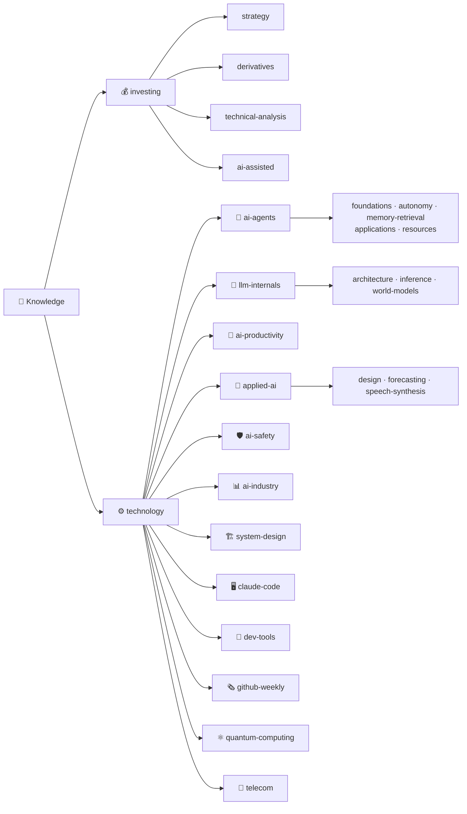

# 🧠 Knowledge

**個人知識庫 —— 把投資與 AI 的高品質內容,煉成可複用的繁體中文筆記**

把文章、論文、YouTube 逐字稿與開源程式碼,整理成「先框架、再細節、附應用案例」的筆記。

 

---

## 🗺️ 分類地圖

採 **「大類 → 中類 → 主題」三層** 結構;每篇筆記都含 **應用案例**,程式類則先 clone 讀完整原始碼再整理。撰寫慣例見 [CLAUDE.md](./CLAUDE.md)。

### 目錄
- [💰 investing(投資)](#-investing投資)
- [⚙️ technology(科技與技術研究)](#️-technology科技與技術研究)
  - [🤖 ai-agents(代理工程)](#-ai-agents代理工程)
  - [🧬 llm-internals(模型架構與推論)](#-llm-internals模型架構與推論)
  - [🚀 ai-productivity(AI 生產力)](#-ai-productivityai-生產力)
  - [🎨 applied-ai(應用)](#-applied-ai應用)
  - [📊 ai-industry(AI 產業與算力經濟)](#-ai-industryai-產業與算力經濟)
  - [🏗️ system-design(系統設計與架構)](#️-system-design系統設計與架構)
  - [🖥️ claude-code(Claude Code 維運)](#️-claude-codeclaude-code-維運)
  - [🌲 dev-tools(開發者工具)](#-dev-tools開發者工具)
  - [🛡️ ai-safety(AI 安全與評測)](#️-ai-safetyai-安全與評測)
  - [⚛️ quantum-computing(量子計算)](#️-quantum-computing量子計算)
  - [📡 telecom(電信)](#-telecom電信)
  - [🗞️ github-weekly(GitHub 週報)](#️-github-weeklygithub-週報)

---

## 💰 investing(投資)

> ⚠️ 投資相關筆記為觀念整理,**非投資建議**;內含風險聲明。

### 📈 strategy(心法與策略)
| 主題 | 一句話 |
|---|---|
| [《持續買進》(Nick Maggiulli)](./investing/strategy/just-keep-buying-nick-maggiulli.md) | 把「買不買、何時買」變成不需意志力的自動規則 |
| [別再相信目標價:前外資分析師拆解法人在看什麼](./investing/strategy/target-prices-institutional-secrets.md) | 法人不看目標價,看的是想法的改變與預期差 |
| [收入高卻存不住錢?7 個正在掏空你的隱形習慣](./investing/strategy/hidden-money-draining-habits.md) | 先付給自己、只背好債、抑制生活膨脹、用槓桿買龍頭 |

### 🎲 derivatives(衍生性商品)
| 主題 | 一句話 |
|---|---|
| [賣財報波動率:選擇權策略與真正的風險](./investing/derivatives/selling-earnings-volatility.md) | 72,500 筆財報回測、Kelly 部位大小與尾端風險 |

### 📉 technical-analysis(技術分析)
| 主題 | 一句話 |
|---|---|
| [雙底雙頂:看的不是形態,而是動能衰減](./investing/technical-analysis/double-top-bottom-momentum.md) | 真假反轉的關鍵是第二隻腳/頭的動能有沒有衰減 |
| [短線交易七條核心法則(熊貓有財)](./investing/technical-analysis/short-term-trading-7-rules.md) | 順勢/強勢股/別被洗盤嚇走/追新;但通篇沒講停損,風控要自己補 |

### 🤝 ai-assisted(AI 輔助投資)
| 主題 | 一句話 |
|---|---|
| [用 AI 輔助股票分析:該怎麼問、有哪些工具](./investing/ai-assisted/using-ai-for-stock-analysis.md) | 盤前問「情報與計畫」而非「今天買哪支」 |

---

## ⚙️ technology(科技與技術研究)

### 🤖 ai-agents(代理工程)

**foundations — 基礎概念**
| 主題 | 一句話 |
|---|---|
| [什麼是 AI Harness?兩種 harness 的差別](./technology/ai-agents/foundations/ai-harness-explained.md) | harness = 模型權重以外的一切 |
| [12-Factor Agents:打造可上線、可靠的 LLM 代理](./technology/ai-agents/foundations/12-factor-agents.md) | 大量普通軟體 + 少量精心設計的 LLM 步驟 |
| [CLAUDE.md 12 條規則:把編碼錯誤率從 41% 壓到 3%](./technology/ai-agents/foundations/claude-md-12-rules.md) | 每條規則都對應一個你實際踩過的坑 |
| [AI Agent 三大核心技:Function Calling、MCP、A2A](./technology/ai-agents/foundations/function-calling-mcp-a2a.md) | 會用工具 → 即插即用生態 → agent 互相協作 |
| [Karpathy 訪談:Software 3.0、Jagged Intelligence、Agentic Engineering](./technology/ai-agents/foundations/karpathy-software-3-0.md) | 你可以外包思考,但不能外包理解 |
| [Bitter Lesson:模型變強後,舊 prompt 正在拖垮新模型](./technology/ai-agents/foundations/bitter-lesson-cut-old-patterns.md) | 該砍的 model rule vs 該留的 business rule |
| [GRPO vs GEPA:同一條 rollout,兩種學習訊號](./technology/ai-agents/foundations/grpo-vs-gepa.md) | RL 把 trace 壓成 1 bit 改權重;GEPA 讀完整 trace 反思改 prompt,省 35× rollouts |
| [Task Decomposition:把給人看的 SOP 拆成 agent 跑得動的工作流](./technology/ai-agents/foundations/task-decomposition-agentic-workflow.md) | 四步:標準化(MUST/SHOULD/MAY)→ 拆 pipeline 用 artifact 串 → 雙向開發挖默會知識 → 接 MCP + human-in-the-loop |

**autonomy — 自主與長時間運行**
| 主題 | 一句話 |
|---|---|
| [Karpathy autoresearch:讓 AI agent 自主做 ML 研究的最小 harness](./technology/ai-agents/autonomy/karpathy-autoresearch.md) | 改一個檔、一個 metric、一個時間預算 |
| [讓 AI agent 連續跑 27 小時:/goal 與「Evaluation 才是關鍵」](./technology/ai-agents/autonomy/long-running-agents-goal-evaluation.md) | 對抗 context anxiety;rubric 把品味寫成文字 |

**memory-retrieval — 記憶與檢索**
| 主題 | 一句話 |
|---|---|
| [AI Agent 記憶管理:有時候 Markdown 檔案就夠了](./technology/ai-agents/memory-retrieval/markdown-agent-memory.md) | MEMORY.md + 日誌 + 漸進式上下文披露 |
| [Grep 就夠了嗎?Agent Harness 如何左右代理式檢索](./technology/ai-agents/memory-retrieval/grep-vs-vector-agentic-search.md) | inline grep 常勝向量,但換 harness 影響達 16pp |
| [SimpleRAG:給科學 PDF 的本地 RAG(OCR + 小-大多向量)](./technology/ai-agents/memory-retrieval/simplerag-pdf-rag.md) | MiniCPM OCR fallback + parent-child 多向量 + Ollama 忠實抽取 |

**applications — 企業應用與實作**
| 主題 | 一句話 |
|---|---|
| [Skill 實戰:從製作到維護的完整指南](./technology/ai-agents/applications/building-claude-skills.md) | 給心法不給死步驟;references / scripts / subagent |
| [Man Group:用 Claude Skills 治理打通系統化交易](./technology/ai-agents/applications/claude-skills-governance-man-group.md) | 組織 context 是 IP;skill 治理解鎖企業級 |
| [落地競賽:OpenAI 與 Anthropic 同日進軍企業導入](./technology/ai-agents/applications/enterprise-ai-adoption-race.md) | 企業買的不是模型,是落地能力 |
| [打造「0 人 AI 公司」:Hermes Agent + Paperclip](./technology/ai-agents/applications/zero-person-ai-company.md) | 只對 CEO 下目標,agent 自動招募協作 |

**resources — 學習資源**
| 主題 | 一句話 |
|---|---|
| [awesome-agentic-ai-zh:中文學習路線圖](./technology/ai-agents/resources/awesome-agentic-ai-zh-roadmap.md) | 8 階段 + 2 條路徑,從 LLM 到多代理 |
| [一支影片看完 Stanford「Beyond LLM」](./technology/ai-agents/resources/stanford-beyond-llm-course.md) | Prompt/RAG/Agentic/Multi-Agent 技術地圖 |

### 🧬 llm-internals(模型架構與推論)
| 主題 | 一句話 |
|---|---|
| [Attention Residuals:把注意力「轉 90 度」用在網路深度上](./technology/llm-internals/architecture/attention-residuals.md) | Kimi 對「層」做注意力,緩解 pre-norm dilution |
| [KV Cache:每個 LLM 背後那個看不見的把戲](./technology/llm-internals/inference/kv-cache.md) | 穩定前綴 + 尾載查詢,推論便宜 10 倍 |
| [RTK(Rust Token Killer)深入研究](./technology/llm-internals/inference/rtk-rust-token-killer-report.md) | 在 I/O 邊界確定性壓縮工具輸出,省 60–90% token |
| [Yann LeCun 的 JEPA 與世界模型](./technology/llm-internals/world-models/jepa-lecun-world-models.md) | 非生成、聯合嵌入預測;反 LLM 的另一條路 |
| [SDAR:用逐 token 門控穩住多輪 Agent 的 RL 後訓練](./technology/llm-internals/training/sdar-agentic-rl.md) | RL 為主幹+門控蒸餾,避免多輪 OPSD 崩潰、技能內化 |

### 🚀 ai-productivity(AI 生產力)
| 主題 | 一句話 |
|---|---|
| [AI 時代真正拉開差距的三種能力](./technology/ai-productivity/three-valuable-ai-skills.md) | AI 調度力 / 工作流設計力 / 獨立思考力 |
| [NotebookLM 三提問:把一學期壓縮到 48 小時](./technology/ai-productivity/notebooklm-rapid-learning.md) | 抽心智模型 → 畫爭議 → 用理解型問題自測 |
| [別追「最強 AI」:建立你的多工具工作流](./technology/ai-productivity/multi-tool-ai-workflow.md) | 任務需要什麼資料 → 在哪裡 → 哪個 AI 能操作 |
| [為什麼 Anthropic 工程師棄 Markdown 改用 HTML](./technology/ai-productivity/anthropic-html-work-pages.md) | 產出變便宜,理解變貴;用對的介面驗證 |
| [Opus 4.7 不是更強的 4.6,是另一種模型](./technology/ai-productivity/opus-4-7-workflow-upgrades.md) | prompt 補意圖、跨模型 review、分工、流程化 |
| [Claude「降智」其實是算力危機:Opus 4.7 試玩與升級注意](./technology/ai-productivity/claude-throttling-opus-4-7.md) | 降智=下修思考深度/配額;4.7 新設定、benchmark、tokenizer 變兇、指令字面化 |
| [你可能用錯 AI 了:Processing vs Thinking 與三層 token 效率陷阱](./technology/ai-productivity/context-engineering-processing-vs-thinking.md) | 別讓 AI 搬磚;讀檔/長對話/agent 檢索三層 context engineering |

### 🎨 applied-ai(應用)
| 主題 | 一句話 |
|---|---|
| [Claude Design 使用評測:AI 設計工具與設計師的品味](./technology/applied-ai/design/claude-design-review.md) | 執行被接管,人往「什麼該存在」的決策層移動 |
| [用 Claude Code 零程式碼做網站:風格突破/捲動動畫/設計策略](./technology/applied-ai/design/ai-website-building-claude-code.md) | 避免 AI 2014 風、逐幀捲動動畫、同品牌三種設計策略 |
| [Nexus:四代理分工的時間序列預測](./technology/applied-ai/forecasting/nexus-time-series.md) | 把「事件」帶進預測,而非只外推曲線 |
| [VoxCPM:無分詞器的開源 TTS](./technology/applied-ai/speech-synthesis/voxcpm-report.md) | 直接生成連續語音表示、可用文字描述設計聲音 |

### 📊 ai-industry(AI 產業與算力經濟)
| 主題 | 一句話 |
|---|---|
| [AI 算力與 Token 經濟學:省錢神話撞上天價帳單](./technology/ai-industry/ai-compute-token-economics.md) | 降本悖論、token maxing、從比智商到比划算、應用層替硬體打工 |
| [Google Cloud:AI Agent 趨勢 2026(五大轉變)](./technology/ai-industry/google-cloud-ai-agent-trends-2026.md) | 員工/工作流/客服/資安/規模五趨勢;A2A·MCP·AP2 三協定 |
| [黃仁勳談生死與接班:不做接班計畫,而是不停傳遞知識](./technology/ai-industry/jensen-huang-succession-and-vision.md) | 每場會議都是推理會議;組織韌性來自知識擴散非繼任者 |

### 🏗️ system-design(系統設計與架構)
| 主題 | 一句話 |
|---|---|
| [為什麼 AI 寫的網站一上線就掛?用手搖飲店看懂架構擴展](./technology/system-design/scaling-web-architecture-bubble-tea.md) | 快取/Docker/CI-CD/負載平衡/Replica/微服務/CDN/Queue 是被問題逼出來的 |

### 🖥️ claude-code(Claude Code 維運)
| 主題 | 一句話 |
|---|---|
| [搬移專案目錄後如何保住 `--continue` 對話歷史](./technology/claude-code/continue-after-directory-move.md) | 歷史按路徑編碼存 ~/.claude/projects;搬目錄要同步改名 |

### 🌲 dev-tools(開發者工具)
| 主題 | 一句話 |
|---|---|
| [Tree-sitter:給程式工具用的「增量解析」引擎](./technology/dev-tools/tree-sitter.md) | 把原始碼變成可查詢、改一字不必重剖的語法樹;編輯器/GitHub/AI agent 的底層 |

### 🛡️ ai-safety(AI 安全與評測)
| 主題 | 一句話 |
|---|---|
| [AI 學會裝傻和欺騙:為什麼 Safety Evaluation 跟不上大模型](./technology/ai-safety/safety-evaluation-crisis.md) | 湧現/情境覺察/Sleeper Agents/Sandbagging,benchmark 永遠落後 |

### ⚛️ quantum-computing(量子計算)
| 主題 | 一句話 |
|---|---|
| [量子計算:量子效應如何突破計算的邊界](./technology/quantum-computing/quantum-computing-explained.md) | 疊加+干涉操控機率向量,非「影分身試所有解」;Grover √n、Shor 威脅密碼 |

### 📡 telecom(電信)
| 主題 | 一句話 |
|---|---|
| [3GPP 懸疑小說《頻譜密典》](./technology/telecom/spectrum-codex-novel.md) | 用懸疑小說包裝 3GPP 協定知識 |

### 🗞️ github-weekly(GitHub 週報)
| 期數 | 主題 |
|---|---|
| [第 115 期:桌面 AI 助手、程式 Agent 知識系統與隱身瀏覽器](./technology/github-weekly/issue-115.md) | OpenHuman / CodeGraph / CloakBrowser / CLI-Anything / LingBot-Map |

---

📚 每篇筆記結尾皆附「來源」連結 · 🤖 內容由 Claude Code 協作整理 · 🗓️ 每週自動新增

