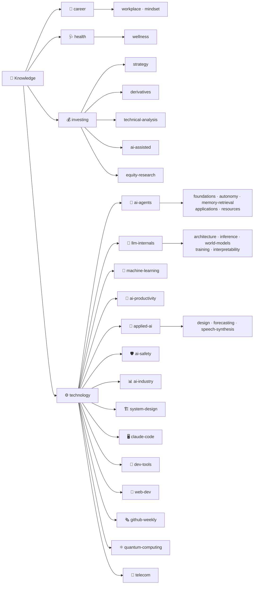

# 🧠 Knowledge

**個人知識庫 —— 把投資與 AI 的高品質內容,煉成可複用的繁體中文筆記**

把文章、論文、YouTube 逐字稿與開源程式碼,整理成「先框架、再細節、附應用案例」的筆記。

 

---

## 🗺️ 分類地圖

採 **「大類 → 中類 → 主題」三層** 結構;每篇筆記都含 **應用案例**,程式類則先 clone 讀完整原始碼再整理。撰寫慣例見 [CLAUDE.md](./CLAUDE.md)。

### 目錄
- [💰 investing(投資)](#-investing投資)
- [⚙️ technology(科技與技術研究)](#️-technology科技與技術研究)
  - [🤖 ai-agents(代理工程)](#-ai-agents代理工程)
  - [🧬 llm-internals(模型架構與推論)](#-llm-internals模型架構與推論)
  - [📐 machine-learning(機器學習模型與方法)](#-machine-learning機器學習模型與方法)
  - [🚀 ai-productivity(AI 生產力)](#-ai-productivityai-生產力)
  - [🎨 applied-ai(應用)](#-applied-ai應用)
  - [📊 ai-industry(AI 產業與算力經濟)](#-ai-industryai-產業與算力經濟)
  - [🏗️ system-design(系統設計與架構)](#️-system-design系統設計與架構)
  - [🖥️ claude-code(Claude Code 維運)](#️-claude-codeclaude-code-維運)
  - [🌲 dev-tools(開發者工具)](#-dev-tools開發者工具)
  - [🎨 web-dev(網頁前端開發)](#-web-dev網頁前端開發)
  - [🛡️ ai-safety(AI 安全與評測)](#️-ai-safetyai-安全與評測)
  - [⚛️ quantum-computing(量子計算)](#️-quantum-computing量子計算)
  - [📡 telecom(電信)](#-telecom電信)
  - [🗞️ github-weekly(GitHub 週報)](#️-github-weeklygithub-週報)
- [💼 career(職涯與職場)](#-career職涯與職場)
- [🩺 health(健康與身體)](#-health健康與身體)
- [📇 依來源 / 作者索引](#-依來源--作者索引)

---

## 📇 依來源 / 作者索引

> 上面的目錄是「**依主題分類**」;這一節是「**依來源/作者分類**」的交叉索引,方便你想「某個頻道/作者我整理過哪些」時快速翻找。**只列出累積 ≥2 篇的重複來源**;單篇來源請用上方主題分類查找。

### 🎙️ YouTube 頻道 / 創作者

| 來源 | 篇數 | 筆記 |
|---|---|---|
| **Gary Chen(@garytalksstuff)** — AI agent 工程與生產力 | 27 | [定義任務](./technology/ai-productivity/defining-tasks-not-prompts.md) · [Processing vs Thinking](./technology/ai-productivity/context-engineering-processing-vs-thinking.md) · [Claude 降智/算力危機](./technology/ai-productivity/claude-throttling-opus-4-7.md) · [Opus 4.7 升級工作流](./technology/ai-productivity/opus-4-7-workflow-upgrades.md) · [多工具工作流](./technology/ai-productivity/multi-tool-ai-workflow.md) · [Anthropic 改用 HTML](./technology/ai-productivity/anthropic-html-work-pages.md) · [新創 Playbook](./technology/ai-agents/applications/anthropic-startup-playbook.md) · [Dynamic Workflows](./technology/ai-agents/foundations/claude-dynamic-workflows.md) · [Task Decomposition](./technology/ai-agents/foundations/task-decomposition-agentic-workflow.md) · [/goal 跑 27hr](./technology/ai-agents/autonomy/long-running-agents-goal-evaluation.md) · [Bitter Lesson 舊 prompt](./technology/ai-agents/foundations/bitter-lesson-cut-old-patterns.md) · [Karpathy Software 3.0](./technology/ai-agents/foundations/karpathy-software-3-0.md) · [Stanford Beyond LLM](./technology/ai-agents/resources/stanford-beyond-llm-course.md) · [Skill 實戰](./technology/ai-agents/applications/building-claude-skills.md) · [落地競賽](./technology/ai-agents/applications/enterprise-ai-adoption-race.md) · [Claude Design 評測](./technology/applied-ai/design/claude-design-review.md) · [Loop Engineering 實務](./technology/ai-agents/foundations/loop-engineering-when-and-how-gary-chen.md) · [Claude×Codex 互審 harness](./technology/ai-agents/applications/cross-model-review-claude-codex-harness.md) · [做產品給 AI 用(AX/AXO)](./technology/ai-agents/applications/products-for-ai-ax-axo-luckin-mcp.md) · [Claude Fable 72 小時](./technology/ai-industry/claude-fable-72-hours-model-dependency.md) · [Codex 新手四基本功](./technology/ai-productivity/codex-beginner-guide-four-basics.md) · [語音輸入 x AI](./technology/ai-productivity/voice-input-ai-context-transformation.md) · [Google Agentic Engineering Day 1](./technology/ai-agents/foundations/google-agentic-engineering-day1.md) · [Codex 2.0 新功能實戰](./technology/ai-productivity/codex-2-record-replay-mobile-remote.md) · [給非技術人員的 Git/GitHub](./technology/ai-productivity/git-github-for-vibe-coders.md) · [AI 安全接手舊專案五步驟](./technology/ai-productivity/ai-brownfield-codebase-five-steps.md) · [Matt Pocock skills 全拆解](./technology/ai-agents/applications/matt-pocock-skills-teardown.md) |
| **美投君 / 美投讲美股(@MeiTouJun)** — 美股投資 | 13 | [4 隻安心買 ETF](./investing/strategy/four-buy-anytime-etfs.md) · [軟體股選股邏輯](./investing/equity-research/ai-software-stocks-usage-based.md) · [美股升息風險研判](./investing/strategy/us-stocks-rate-hike-risk-2026.md) · [海鷗對沖策略](./investing/derivatives/seagull-options-hedge.md) · [下半年前瞻(存量vs增量)](./investing/strategy/us-stocks-h2-2026-outlook-stock-vs-flow-ai.md) · [半導體 2000 泡沫對照](./investing/strategy/semiconductor-2000-bubble-vs-2026-ai.md) · [三大風險/解毒觸發點](./investing/strategy/us-stocks-three-risks-detox-trigger.md) · [連漲13天/AI三信號](./investing/strategy/us-stocks-ai-turning-point-fomo-over-pullback.md) · [AI應用層4趨勢](./investing/equity-research/ai-application-layer-4-trends-earnings.md) · [AI產業C→B轉向](./investing/equity-research/ai-industry-shift-c-to-b-compute-decides.md) · [特斯拉FSD/造芯片](./investing/equity-research/tesla-earnings-fsd-chip-spacex-four-quadrant.md) · [AI採納/電力革命對照](./investing/equity-research/ai-adoption-electricity-revolution-analogy.md) · [加息三階段/AI vs 2000](./investing/strategy/us-stocks-rate-hike-three-stages-ai-vs-2000.md) |
| **風傳媒 下班經濟學 / The Storm Media** — 台股/投資 | 3 | [別再相信目標價(721)](./investing/strategy/target-prices-institutional-secrets.md) · [孫慶龍 PE 五檔價(735)](./investing/equity-research/sun-qinglong-pe-band-valuation.md) · [股癌選股心法](./investing/strategy/gooaye-stock-picking-philosophy.md) |
| **Caleb Writes Code** — agent harness | 2 | [Harness 演進史](./technology/ai-agents/foundations/harness-engineering-evolution.md) · [Pi Agent 極簡 harness](./technology/ai-agents/foundations/pi-agent-minimal-harness.md) |
| **基地** — 半導體/AI 趨勢拆解 | 2 | [NVIDIA N1X vs x86](./technology/ai-industry/nvidia-n1x-vs-x86.md) · [Sutton 行動認知 AI](./technology/llm-internals/world-models/sutton-enactive-ai.md) |
| **硅谷101(陳茜)** — 矽谷深度科技/商業訪談 | 2 | [SpaceX 崛起史](./investing/equity-research/spacex-rise-history.md) · [田淵棟 RSI 與 AI 自進化](./technology/ai-industry/tian-yuandong-rsi-recursive-self-improvement.md) |
| **Debug Tuboshu** — AI 寫網站/前端 | 2 | [零程式碼做網站](./technology/applied-ai/design/ai-website-building-claude-code.md) · [手搖飲看網站架構擴展](./technology/system-design/scaling-web-architecture-bubble-tea.md) |
| **白白说大模型** — 大模型/Agent 原理 | 2 | [Agent 最該具備的 Skill](./technology/ai-agents/applications/top-skills-for-agents.md) · [工具調用:FC→MCP→CLI](./technology/ai-agents/foundations/function-calling-mcp-cli-tool-evolution.md) |

### ✍️ 個人/部落格/官方

| 來源 | 篇數 | 筆記 |
|---|---|---|
| **Andrej Karpathy(本人著作/repo)** | 3 | [microGPT 200 行](./technology/llm-internals/architecture/microgpt-karpathy.md) · [autoresearch 最小 harness](./technology/ai-agents/autonomy/karpathy-autoresearch.md) · [LLM Wiki 知識庫模式](./technology/ai-agents/memory-retrieval/llm-wiki-karpathy.md) |
| **blog.aihao.tw(ihower)** — agent 工程 | 2 | [Agent Streaming 格式設計](./technology/ai-agents/applications/agent-streaming-format-design.md) · [用 AI 分析 Agent Traces](./technology/ai-agents/applications/agent-trace-analysis-with-ai.md) |
| **Anthropic(官方研究/頻道)** | 3 | [五大 Agent 模式](./technology/ai-agents/foundations/five-agent-patterns.md) · [Man Group 用 Claude Skills 治理](./technology/ai-agents/applications/claude-skills-governance-man-group.md) · [J-Space 全域工作空間](./technology/llm-internals/interpretability/j-space-global-workspace-claude.md) |

### 🗞️ 週報

| 來源 | 篇數 | 筆記 |
|---|---|---|
| **GitHub Weekly(itcoffee66/githubweekly)** | 24 | [第 99–122 期(整個 github-weekly 資料夾)](./technology/github-weekly/) |

---

## 💰 investing(投資)

> ⚠️ 投資相關筆記為觀念整理,**非投資建議**;內含風險聲明。

### 📈 strategy(心法與策略)
| 主題 | 一句話 |
|---|---|
| [《持續買進》(Nick Maggiulli)](./investing/strategy/just-keep-buying-nick-maggiulli.md) | 把「買不買、何時買」變成不需意志力的自動規則 |
| [別再相信目標價:前外資分析師拆解法人在看什麼](./investing/strategy/target-prices-institutional-secrets.md) | 法人不看目標價,看的是想法的改變與預期差 |
| [收入高卻存不住錢?7 個正在掏空你的隱形習慣](./investing/strategy/hidden-money-draining-habits.md) | 先付給自己、只背好債、抑制生活膨脹、用槓桿買龍頭 |
| [4 隻「無論何時都能安心買入」的 ETF](./investing/strategy/four-buy-anytime-etfs.md) | SGOV/JEPI/DGRO/ALLW;靠機制而非預測,長期增值+扛跌+低成本 |
| [《像冠軍一樣思考和交易》(Minervini)](./investing/strategy/minervini-think-trade-like-champion.md) | SEPA/Stage2/Trend Template 8條/VCP(2-6T)/停損3-8%/漸進建倉/賣出規則;核心是控風險 |
| [股癌選股心法:籌碼/技術都是工具,本質是選對題材的好股](./investing/strategy/gooaye-stock-picking-philosophy.md) | 籌碼太懸、技術只是工具;先選題材(看得懂有未來)再比估值;選股選得好要飯要到老 |
| [《會想的人,先有錢》(Jonathan Clements)](./investing/strategy/thinkers-get-rich-jonathan-clements.md) | 整天看盤沒賺比較多;依時間軸配置+指數+定期定額;投資是手段不是目的 |
| [美股升息風險研判:3 類股票該避、1 類反而是機會(美投君)](./investing/strategy/us-stocks-rate-hike-risk-2026.md) | 放鷹展示決心但行為按兵不動;擁擠 AI 半導體最危險、優質龍頭抗跌、埋伏應用層 |
| [社交套利(Chris Camillo):從日常生活挖暴利機會](./investing/strategy/social-arbitrage-chris-camillo.md) | 交易資訊差不是股價;生活觀察當另類數據;資金分桶+倉位紀律;誠實談倖存者偏差 |
| [交易的贏家數學:期望值/系統設計/變異數/風險](./investing/strategy/trading-math-expectancy-variance-risk.md) | 期望值=勝率×賺−敗率×賠;甜蜜點與 breakeven;賭徒謬誤;部位大小+破產風險+復原數學 |
| [下半年美股前瞻:宏觀四變數 + AI 存量 vs 增量邏輯(美投君)](./investing/strategy/us-stocks-h2-2026-outlook-stock-vs-flow-ai.md) | 通脹下行/中期選舉/K型消費;存量(零和搶資源)vs 增量(正和一起賺);標普 8200 |
| [這次半導體狂歡是 2000 泡沫重演嗎?(美投君)](./investing/strategy/semiconductor-2000-bubble-vs-2026-ai.md) | 五個相同、四個不同;客戶從泡沫公司變大科技;情緒扭轉時基本面救不了股價;盯 Token/ARR |
| [美股狂熱會終結嗎?三大短期風險與「市場需要觸發點解毒」(美投君)](./investing/strategy/us-stocks-three-risks-detox-trigger.md) | 狂熱僅限半導體非全面泡沫;通脹/換帥/川普三觸發點;出發點不重要、市場需要一個理由冷靜 |
| [美股連漲 13 天還能追嗎?真實通脹、AI 情緒三信號(美投君)](./investing/strategy/us-stocks-ai-turning-point-fomo-over-pullback.md) | 47 項自製真實通脹續降;Anthropic ARR/Meta/亞馬遜三信號;踏空風險 > 回調風險;AI 變現大年 |
| [為什麼你買什麼跌什麼?散戶虧錢的底層邏輯不是運氣,是沒系統(極簡經濟學)](./investing/strategy/retail-investor-losing-system-not-luck.md) | 資訊你最後知道、大腦損失規避讓你賺小賠大;專注可控四件事(ETF/100−年齡/定期定額/買前定好賣點);散戶唯一優勢是時間 |
| [加息會引發美股大跌嗎?用 2000 泡沫「三階段」對照 AI 這輪革命(美投君)](./investing/strategy/us-stocks-rate-hike-three-stages-ai-vs-2000.md) | 加息初期大盤漲、局部先裂→資本撤→消費崩才是熊市;AI 終端在 B 端故難疲軟(15-18 加息+雲計算為證);衝擊只在局部(數據中心融資/高估值)、停在交易層 |

### 🎲 derivatives(衍生性商品)
| 主題 | 一句話 |
|---|---|
| [賣財報波動率:選擇權策略與真正的風險](./investing/derivatives/selling-earnings-volatility.md) | 72,500 筆財報回測、Kelly 部位大小與尾端風險 |
| [海鷗策略(Seagull):牛市不踏空又不怕跌的三腿對沖](./investing/derivatives/seagull-options-hedge.md) | LongPut+ShortPut+ShortCall 近零成本對沖;犧牲上漲與保護深度換低成本;需持 100 股正股 |

### 📉 technical-analysis(技術分析)
| 主題 | 一句話 |
|---|---|
| [雙底雙頂:看的不是形態,而是動能衰減](./investing/technical-analysis/double-top-bottom-momentum.md) | 真假反轉的關鍵是第二隻腳/頭的動能有沒有衰減 |
| [短線交易七條核心法則(熊貓有財)](./investing/technical-analysis/short-term-trading-7-rules.md) | 順勢/強勢股/別被洗盤嚇走/追新;但通篇沒講停損,風控要自己補 |
| [當沖有技巧嗎?NYSE 傳奇交易員 Peter Tuchman 的 40 年心法](./investing/technical-analysis/peter-tuchman-day-trading.md) | 別靠財報/FOMO 當沖;最大敵人是恐懼;移動平均+RSI;自我重塑與感恩心態 |

### 🤝 ai-assisted(AI 輔助投資)
| 主題 | 一句話 |
|---|---|
| [用 AI 輔助股票分析:該怎麼問、有哪些工具](./investing/ai-assisted/using-ai-for-stock-analysis.md) | 盤前問「情報與計畫」而非「今天買哪支」 |
| [用 Claude Code + Jesse 做 AI 演算法交易](./investing/ai-assisted/ai-algo-trading-claude-jesse.md) | 重點是驗證流程(顯著性檢定→回測→Monte Carlo→樣本外),不是那支策略 |
| [用 Python 做強化學習交易機器人(EUR/USD 外匯)](./investing/ai-assisted/rl-trading-bot-forex.md) | RL 五要素+Gym/PPO 四檔架構;訓練漂亮、樣本外打回原形;市場噪音難抓信號 |
| [用 Claude + TradingView 蓋盤前交易計畫流水線(Humbled Trader)](./investing/ai-assisted/humbled-trader-claude-tradingview-pipeline.md) | Scanner A→B→Pine/Python 回測→排程→Telegram;AI 是放大器不是策略生成器 |

### 📊 equity-research(個股與產業研究)
| 主題 | 一句話 |
|---|---|
| [AI 是威脅還是機遇?軟體股多點開花的選股邏輯](./investing/equity-research/ai-software-stocks-usage-based.md) | 贏家三共性:2B + 按用量收費 + AI 帶來新增收入;基礎設施層最佳 |
| [孫慶龍 EPS×本益比五檔價估值法 + 護國群山](./investing/equity-research/sun-qinglong-pe-band-valuation.md) | 預估EPS×歷史PE分位→特價/便宜/合理/昂貴/瘋狂;便宜只賺一次、成長讓複利反覆工作 |
| [玻璃基板取代有機載板?欣興/群創/友達的技術門檻與量產時程](./investing/equity-research/glass-substrate-supply-chain.md) | TGV最難、永久GCS量產落2026底~2028後;Absolics領先、台廠相對落後;分清路線/進度/含金量 |
| [SpaceX 為什麼這時間點上市?Musk 在 JP Morgan 訪談](./investing/equity-research/spacex-ipo-musk-jpmorgan.md) | 不缺錢但要進大成長期;Starlink V3/Starship/太空AI數據中心;最硬訊號是晶片記憶體瓶頸 |
| [SpaceX 崛起史:從被嘲笑的新創到航天巨頭的商業飛輪](./investing/equity-research/spacex-rise-history.md) | 降成本(白痴指數/五步法)+回收→NASA訂單→星鏈現金流+星盾國防→反哺星艦;IPO只是節點 |
| [AI 應用層 4 大前瞻趨勢:從財報季挖下一輪機會(美投君)](./investing/equity-research/ai-application-layer-4-trends-earnings.md) | 流量轉 AI Agent 主導/Agent 管理(Okta·ServiceNow)/盯 ROI 按結果收費(Palantir·DataDog)/AI 原生崛起 |
| [AI 產業秘密轉向:C→B、訂閱→用量,算力成勝負手(美投君)](./investing/equity-research/ai-industry-shift-c-to-b-compute-decides.md) | Anthropic 跑通 B 端→OpenAI/Google 跟進;算力克制者漲價、囤算力的 OpenAI 反超;甲骨文彈性大 |
| [特斯拉財報深挖:FSD 拐點/造芯片/四象限/SpaceX 合併風險(美投君)](./investing/equity-research/tesla-earnings-fsd-chip-spacex-four-quadrant.md) | 收入弱是一次性、毛利大超預期;FSD 北美滲透 ~40%;Terafab 燒現金流;LEAP call 的隱藏壓力 |
| [AI 像 100 年前電力革命:商機不在「AI 應用」而在「AI 採納」(美投君)](./investing/equity-research/ai-adoption-electricity-revolution-analogy.md) | 電力靠組織重構才爆發(天軸傳動→單機驅動→福特流水線);今在第一階段;最看好 Anthropic(≈GE)/Meta(≈福特),賣鏟子看 Palantir/CrowdStrike/Snowflake |

---

## ⚙️ technology(科技與技術研究)

### 🤖 ai-agents(代理工程)

**foundations — 基礎概念**
| 主題 | 一句話 |
|---|---|
| [什麼是 AI Harness?兩種 harness 的差別](./technology/ai-agents/foundations/ai-harness-explained.md) | harness = 模型權重以外的一切 |
| [Harness Engineering 的演進:Prompt → Context → Harness](./technology/ai-agents/foundations/harness-engineering-evolution.md) | context 撞牆在越摘要越失真;harness 用 loop+每輪乾淨 context 取代(Ralph) |
| [Pi Agent:用「留白」的極簡 harness 對沖框架易變](./technology/ai-agents/foundations/pi-agent-minimal-harness.md) | OpenClaw 的大腦;刻意不內建 MCP/sub-agent,能用 TS 擴展自己的 harness;build less |
| [五大 Agent 模式(2026 生產系統至少用一個)](./technology/ai-agents/foundations/five-agent-patterns.md) | Prompt Chaining/Routing/Parallelization/Orchestrator-Workers/Evaluator-Optimizer;工作流 vs 自主 |
| [12-Factor Agents:打造可上線、可靠的 LLM 代理](./technology/ai-agents/foundations/12-factor-agents.md) | 大量普通軟體 + 少量精心設計的 LLM 步驟 |
| [CLAUDE.md 12 條規則:把編碼錯誤率從 41% 壓到 3%](./technology/ai-agents/foundations/claude-md-12-rules.md) | 每條規則都對應一個你實際踩過的坑 |
| [AI Agent 三大核心技:Function Calling、MCP、A2A](./technology/ai-agents/foundations/function-calling-mcp-a2a.md) | 會用工具 → 即插即用生態 → agent 互相協作 |
| [AI Agent 工具調用一次講清:ReAct → Function Calling → MCP → CLI](./technology/ai-agents/foundations/function-calling-mcp-cli-tool-evolution.md) | 約束解碼保證 100% 合法 JSON;MCP 解 N×M 重工;CLI 人機共用、Perplexity 棄 MCP 轉 CLI |
| [Karpathy 訪談:Software 3.0、Jagged Intelligence、Agentic Engineering](./technology/ai-agents/foundations/karpathy-software-3-0.md) | 你可以外包思考,但不能外包理解 |
| [Bitter Lesson:模型變強後,舊 prompt 正在拖垮新模型](./technology/ai-agents/foundations/bitter-lesson-cut-old-patterns.md) | 該砍的 model rule vs 該留的 business rule |
| [GRPO vs GEPA:同一條 rollout,兩種學習訊號](./technology/ai-agents/foundations/grpo-vs-gepa.md) | RL 把 trace 壓成 1 bit 改權重;GEPA 讀完整 trace 反思改 prompt,省 35× rollouts |
| [Task Decomposition:把給人看的 SOP 拆成 agent 跑得動的工作流](./technology/ai-agents/foundations/task-decomposition-agentic-workflow.md) | 四步:標準化(MUST/SHOULD/MAY)→ 拆 pipeline 用 artifact 串 → 雙向開發挖默會知識 → 接 MCP + human-in-the-loop |
| [BDI(信念–欲望–意圖):經典 agent 架構,與 LLM agent 對照](./technology/ai-agents/foundations/bdi-belief-desire-intention.md) | 意圖=已承諾的欲望;現代 agent loop 是 BDI 續集,補上自己規劃與學習 |
| [PDDL-Instruct:用邏輯 CoT + 外部驗證教 LLM 做符號規劃](./technology/ai-agents/foundations/pddl-instruct-llm-planning.md) | 把規劃拆成可被 VAL 逐步驗證的原子步;不靠自我糾錯;Blocksworld 28%→94% |
| [Claude Dynamic Workflows 解析:何時該用、何時別用](./technology/ai-agents/foundations/claude-dynamic-workflows.md) | Claude 寫腳本指揮上百 agent;與 skill/subagent/agent team/goal 之別;任務能否切成獨立小塊 |
| [Self-Harness:讓 Agent 自己改進操作自己的 harness](./technology/ai-agents/foundations/self-harness.md) | 挖弱點→提最小修改→非退化驗證;權重不動只改 harness;三模型 held-out +33~60% |
| [Mixture-of-Agents(MoA):分層提議+聚合,純開源打贏 GPT-4o](./technology/ai-agents/foundations/mixture-of-agents-moa.md) | LLM 協作性:看到別人答案會更好;Proposer/Aggregator 分工;不訓練只靠 prompt;AlpacaEval 65.1% vs 57.5% |
| [「Loop Engineering」是名詞詐騙嗎?一個反方吐槽視角](./technology/ai-agents/foundations/loop-engineering-buzzword-critique.md) | Prompt→Context→Harness→Loop 都在講「自動化駕馭」;拆三位炒作者+5 組件不正交;抓本質(Raft/K8s control loop)別追名詞 |
| [Loop Engineering 實務:怎麼設計、什麼值得做、失控三坑(Gary Chen)](./technology/ai-agents/foundations/loop-engineering-when-and-how-gary-chen.md) | Trigger+Verifiable Goal;Rubric/yes-no 清單定義完成;三檢查判斷值不值得;hard stop/邊界/驗收+別球員兼裁判 |
| [19 分鐘搞懂 Harness/Loop/LLM Ops/Eval:一張圖串起記憶/RAG/Tracing](./technology/ai-agents/foundations/agent-harness-loop-llmops-eval-explained.md) | LLM=懂全人類卻不懂你的馬;三種記憶+蒸餾閘門;loop 知道何時停;tracing→eval→診斷→上線自我演化 |
| [Claude Code 官方定義的四種 Loop:Turn/Goal/Time/Proactive](./technology/ai-agents/foundations/claude-code-loop-types-official.md) | 官方權威定義;交出去越多自動化越深(檢查→停止條件→觸發→prompt);/goal·/loop·/schedule·dynamic workflows |
| [Loop Engineering:從寫提示詞到設計驅動 agent 的循環](./technology/ai-agents/foundations/loop-engineering.md) | Boris 三階段;loop=心跳/work tree/skill/MCP/子agent+記憶脊柱;/goal vs /loop;四條件測試 |
| [Google Agentic Engineering 課程 Day 1:從 vibe coding 到 agentic engineering](./technology/ai-agents/foundations/google-agentic-engineering-day1.md) | 驗證是分水嶺(測試 vs evals);工廠模型「產出是產程式碼的系統」;Agent=Model+Harness(6 件);Generation is solved,驗證/判斷/方向才是新手藝 |
| [OpenAI GPT-5.6 官方提示指南:從「規定步驟」轉向「描述終點+停止條件」](./technology/ai-agents/foundations/gpt-5-6-prompting-guide-openai.md) | 先做減法、outcome-first、停止條件是靈魂;PTC/自主邊界/檢索預算;一次只動一個變數的遷移法;精簡 prompt 分數+10~15%、token−41~66% |

**autonomy — 自主與長時間運行**
| 主題 | 一句話 |
|---|---|
| [Karpathy autoresearch:讓 AI agent 自主做 ML 研究的最小 harness](./technology/ai-agents/autonomy/karpathy-autoresearch.md) | 改一個檔、一個 metric、一個時間預算 |
| [讓 AI agent 連續跑 27 小時:/goal 與「Evaluation 才是關鍵」](./technology/ai-agents/autonomy/long-running-agents-goal-evaluation.md) | 對抗 context anxiety;rubric 把品味寫成文字 |

**memory-retrieval — 記憶與檢索**
| 主題 | 一句話 |
|---|---|
| [AI Agent 記憶管理:有時候 Markdown 檔案就夠了](./technology/ai-agents/memory-retrieval/markdown-agent-memory.md) | MEMORY.md + 日誌 + 漸進式上下文披露 |
| [Grep 就夠了嗎?Agent Harness 如何左右代理式檢索](./technology/ai-agents/memory-retrieval/grep-vs-vector-agentic-search.md) | inline grep 常勝向量,但換 harness 影響達 16pp |
| [SimpleRAG:給科學 PDF 的本地 RAG(OCR + 小-大多向量)](./technology/ai-agents/memory-retrieval/simplerag-pdf-rag.md) | MiniCPM OCR fallback + parent-child 多向量 + Ollama 忠實抽取 |
| [Vectorless RAG:不靠相似度,靠「結構導航」找對地方](./technology/ai-agents/memory-retrieval/vectorless-rag-structure-navigation.md) | LLM 在文件階層樹上推理導航(PageIndex);相似≠相關,FinanceBench 50%→98.7% |
| [LLM Wiki(Karpathy):讓 LLM 增量維護會複利的知識庫](./technology/ai-agents/memory-retrieval/llm-wiki-karpathy.md) | 別只 RAG 臨時拼湊;wiki 編譯一次後保持更新;ingest/query/lint + index/log;本倉庫就是實例 |
| [Codebase-Memory:Tree-Sitter 知識圖譜 + MCP,探索程式碼省 10 倍 token](./technology/ai-agents/memory-retrieval/codebase-memory-treesitter-knowledge-graph-mcp.md) | 把 codebase 建成可查詢圖譜(SQLite,66 語言);結構查詢走預存邊,品質 83% vs 92% 但省 10× token、快 100× |
| [到底需不需要 GraphRAG?9 種 RAG 方案實測 + 脈絡優化](./technology/ai-agents/memory-retrieval/is-graphrag-needed-rag-variants-comparison.md) | 簡單 1-hop 關係常勝精緻 GraphRAG;極簡工具自主 agent 最佳;脈絡優化省 19–53% token;檢索≠生成用得上 |

**applications — 企業應用與實作**
| 主題 | 一句話 |
|---|---|
| [Skill 實戰:從製作到維護的完整指南](./technology/ai-agents/applications/building-claude-skills.md) | 給心法不給死步驟;references / scripts / subagent |
| [Man Group:用 Claude Skills 治理打通系統化交易](./technology/ai-agents/applications/claude-skills-governance-man-group.md) | 組織 context 是 IP;skill 治理解鎖企業級 |
| [落地競賽:OpenAI 與 Anthropic 同日進軍企業導入](./technology/ai-agents/applications/enterprise-ai-adoption-race.md) | 企業買的不是模型,是落地能力 |
| [打造「0 人 AI 公司」:Hermes Agent + Paperclip](./technology/ai-agents/applications/zero-person-ai-company.md) | 只對 CEO 下目標,agent 自動招募協作 |
| [把 Hermes 爆改成主 Agent 中樞:調度 SubAgent 與 Claude/Gemini/Codex](./technology/ai-agents/applications/hermes-main-agent-orchestration.md) | 單一入口路由多模型 CLI;gateway/ACP/任務監控/分層抓取 |
| [Agent Streaming 格式設計:串流是要設計的應用層介面](./technology/ai-agents/applications/agent-streaming-format-design.md) | 頻道×命名空間、快照/增量(JSON Patch)、存整段事件序列、斷線重連 |
| [用 AI 分析 Agent Traces:讓 agent 讀 trace,人類把持品味](./technology/ai-agents/applications/agent-trace-analysis-with-ai.md) | 三方案(自有 coding agent/執行時自診斷/批次掃描);agent 放大規模、人決定方向 |
| [AI 時代怎麼創業?Anthropic 新創 Playbook 四階段 workflow](./technology/ai-agents/applications/anthropic-startup-playbook.md) | 十人獨角獸;Idea/MVP/Launch/Scale 各用哪個 Claude;差距是誰把 AI 系統化得更好 |
| [AI Operating System(AIOS):讓 AI 長期懂你、替你工作的系統](./technology/ai-agents/applications/ai-operating-system-aios.md) | 四核心 Context/Connections/Capabilities/Cadence;progressive loading 省 context;從操作者變系統擁有者 |
| [當 PR 變 Prompt Request:Steinberger 用 Agent 自製工具治理開源](./technology/ai-agents/applications/agent-native-tooling-steinberger.md) | Vision.md 當憲法自動審 PR;煩躁驅動開發;為 AI 造接口+沙盒;為 AI 造工具是複利 |
| [4 組頂級 Agent Skill:元能力/工程/設計/內容](./technology/ai-agents/applications/top-skills-for-agents.md) | 8 個 Skill 逐一讀碼;Skill Creator/Find Skills/Superpowers/gstack/Matt Pocock/Frontend Design/UIUX Pro Max/baoyu-skills |
| [COMPILOT:讓現成 LLM 當「優化 agent」在與編譯器閉環中優化迴圈](./technology/ai-agents/applications/compilot-llm-guided-loop-optimization.md) | LLM 提議變換、編譯器保證合法+實測加速;免微調、不生程式碼;PolyBench 3.54×、勝 Pluto 2.94× |
| [Cross-Model Review:stop hook+skill+marker 讓 Claude 跟 Codex 自動互審](./technology/ai-agents/applications/cross-model-review-claude-codex-harness.md) | 異質模型互審到「共識」才放行;紀律靠系統不靠意志;solo dev 的自建 harness |
| [為什麼你該做產品給 AI 用:UX→AX→AXO 三層框架(瑞幸 MCP)](./technology/ai-agents/applications/products-for-ai-ax-axo-luckin-mcp.md) | App 從給人點擊變成被 AI 調用;競爭從「被人看見」到「被 AI 選到」;AX/AXO/漸進授權/資料調度權 |
| [tmux-bridge-mcp 原始碼深讀:讓多個 AI Agent 透過 tmux 分頁互相對話](./technology/ai-agents/applications/tmux-bridge-mcp.md) | 9 個 MCP 工具、唯一依賴 tmux;read guard 用檔案當跨行程旗標強制先讀再動手;type 與 Enter 分離;絕不輪詢、對方回你的 pane;kimi-adapter 土砲 tool calling |
| [Matt Pocock 的 AI 開發 skills 全拆解:最紅的 skill 只有五行字(Gary Chen)](./technology/ai-agents/applications/matt-pocock-skills-teardown.md) | grill-me 讓 AI 拷問你搶回決策權;to-spec 禁寫 code、to-tickets 按功能拆、TDD 防作弊;深模組 vs 淺模組「刪除測試」;指引詞壓縮領域知識;成為專家才能控制 AI |

**resources — 學習資源**
| 主題 | 一句話 |
|---|---|
| [awesome-agentic-ai-zh:中文學習路線圖](./technology/ai-agents/resources/awesome-agentic-ai-zh-roadmap.md) | 8 階段 + 2 條路徑,從 LLM 到多代理 |
| [一支影片看完 Stanford「Beyond LLM」](./technology/ai-agents/resources/stanford-beyond-llm-course.md) | Prompt/RAG/Agentic/Multi-Agent 技術地圖 |
| [AI System Design Guide(ombharatiya):生產級 AI 系統設計與面試活字典](./technology/ai-agents/resources/ai-system-design-guide.md) | 18 章 + 110 面試題 + 20 案例 + Eval 深入;基礎→建造→運維→治理→應用 |

### 🧬 llm-internals(模型架構與推論)
| 主題 | 一句話 |
|---|---|
| [Attention Residuals:把注意力「轉 90 度」用在網路深度上](./technology/llm-internals/architecture/attention-residuals.md) | Kimi 對「層」做注意力,緩解 pre-norm dilution |
| [DeepSeek V4 的瘋狂工程:用不夠的資源做出頂尖模型](./technology/llm-internals/architecture/deepseek-v4-engineering.md) | hybrid attention(CSA/HCA/滑窗)+ mHC 雙隨機約束防爆 + Muon + 通訊重疊;KV cache 砍 90% |
| [microGPT(Karpathy):200 行純 Python 講完整個 GPT 演算法](./technology/llm-internals/architecture/microgpt-karpathy.md) | autograd→架構→Adam→取樣全在眼前;KV cache 顯式;「其餘都只是效率」 |
| [大型語言模型,簡單講(3Blue1Brown)](./technology/llm-internals/architecture/llm-explained-3blue1brown.md) | LLM=下一字機率函式;參數/反向傳播/預訓練/RLHF/Transformer attention 白話入門 |
| [DiffusionGemma:把「擴散」搬進語言模型,並行生成可自我修正](./technology/llm-internals/architecture/diffusion-gemma.md) | 非自迴歸,256-token 畫布多輪去噪;瓶頸從記憶體頻寬轉計算;雙向注意力能改錯解數獨 |
| [一層就夠了?RL 後訓練的收益集中在單一「中間層」](./technology/llm-internals/architecture/rl-gains-concentrate-single-middle-layer.md) | 只訓練 1 個中間層即可追平/超過全參數 RL;層貢獻是預訓練內在屬性(跨資料/任務穩定);只訓中間層就贏全參數 |
| [KV Cache:每個 LLM 背後那個看不見的把戲](./technology/llm-internals/inference/kv-cache.md) | 穩定前綴 + 尾載查詢,推論便宜 10 倍 |
| [RTK(Rust Token Killer)深入研究](./technology/llm-internals/inference/rtk-rust-token-killer-report.md) | 在 I/O 邊界確定性壓縮工具輸出,省 60–90% token |
| [Yann LeCun 的 JEPA 與世界模型](./technology/llm-internals/world-models/jepa-lecun-world-models.md) | 非生成、聯合嵌入預測;反 LLM 的另一條路 |
| [Sutton 的 enactive AI:一張自相矛盾的反大模型藍圖](./technology/llm-internals/world-models/sutton-enactive-ai.md) | 行動認知≠生成式;兩根柱子撞自己的獎勵假設與苦澀教訓;三桌賭 2028/2030 |
| [SDAR:用逐 token 門控穩住多輪 Agent 的 RL 後訓練](./technology/llm-internals/training/sdar-agentic-rl.md) | RL 為主幹+門控蒸餾,避免多輪 OPSD 崩潰、技能內化 |
| [J-Space:Claude 內心那層「說得出口的思考」(Anthropic 全域工作空間)](./technology/llm-internals/interpretability/j-space-global-workspace-claude.md) | 借神經科學查 LLM「意識 vs 潛意識」;J-space=可轉文字/能推理的表示子集;關掉就不能推理;讀它能抓「編假數據」時亮起的 fake/manipulation |

### 📐 machine-learning(機器學習模型與方法)
| 主題 | 一句話 |
|---|---|
| [LimiX:用「遮罩聯合分布」打造的結構化資料(表格)基礎模型](./technology/machine-learning/limix-tabular-foundation-model.md) | 一個模型四任務(分類/迴歸/填補/生成);CCMM+axis-wise attention;in-context 免訓練;勝 XGBoost/TabPFN |

### 🚀 ai-productivity(AI 生產力)
| 主題 | 一句話 |
|---|---|
| [AI 時代真正拉開差距的三種能力](./technology/ai-productivity/three-valuable-ai-skills.md) | AI 調度力 / 工作流設計力 / 獨立思考力 |
| [NotebookLM 三提問:把一學期壓縮到 48 小時](./technology/ai-productivity/notebooklm-rapid-learning.md) | 抽心智模型 → 畫爭議 → 用理解型問題自測 |
| [別追「最強 AI」:建立你的多工具工作流](./technology/ai-productivity/multi-tool-ai-workflow.md) | 任務需要什麼資料 → 在哪裡 → 哪個 AI 能操作 |
| [為什麼 Anthropic 工程師棄 Markdown 改用 HTML](./technology/ai-productivity/anthropic-html-work-pages.md) | 產出變便宜,理解變貴;用對的介面驗證 |
| [Opus 4.7 不是更強的 4.6,是另一種模型](./technology/ai-productivity/opus-4-7-workflow-upgrades.md) | prompt 補意圖、跨模型 review、分工、流程化 |
| [Claude「降智」其實是算力危機:Opus 4.7 試玩與升級注意](./technology/ai-productivity/claude-throttling-opus-4-7.md) | 降智=下修思考深度/配額;4.7 新設定、benchmark、tokenizer 變兇、指令字面化 |
| [你可能用錯 AI 了:Processing vs Thinking 與三層 token 效率陷阱](./technology/ai-productivity/context-engineering-processing-vs-thinking.md) | 別讓 AI 搬磚;讀檔/長對話/agent 檢索三層 context engineering |
| [AI 編程的三個致命錯覺(OpenCode Dax Raad)](./technology/ai-productivity/ai-coding-three-illusions-opencode.md) | 自動變快/執行就贏/在飛皆是幻覺;瓶頸是想清楚做什麼,慢下來打地基才最快 |
| [別跟單一模型結婚:Model Agnostic 才是槓桿位置](./technology/ai-productivity/model-agnostic-ai-workflow.md) | 沒有魔法模型;按任務選模型而非把任務塞進最強模型;擁有自有 infra 讓模型可替換 |
| [你不是不會寫 Prompt,是不會定義任務](./technology/ai-productivity/defining-tasks-not-prompts.md) | 目標/背景/素材/邊界/完成定義五欄位寫成 brief;AI 能幫你問不能替你想;本質是管理力 |
| [AI 時代怎麼「讀」程式碼:6 個技巧](./technology/ai-productivity/reading-code-ai-era-6-techniques.md) | 從進入點/先讀測試/跟著資料走/跳雜訊/讀一條失敗路徑/壓成一句話 |
| [AI 旅遊規劃組合技:NotebookLM + Gemini + My Maps](./technology/ai-productivity/ai-travel-planning-notebooklm-gemini.md) | 蒐集即時資料→整合零散素材→Canvas排程當裁判→CSV匯地圖→Live現場助理;分工是關鍵 |
| [Codex 新手指南:駕馭「會動你檔案的 AI Agent」四基本功](./technology/ai-productivity/codex-beginner-guide-four-basics.md) | 專案/權限/上下文/AGENTS.md;非技術者也能上手;它是助理也是家教;Memory vs AGENTS.md |
| [AI 時代最被低估的技能:語音輸入 + 「context 轉換遊戲」視角](./technology/ai-productivity/voice-input-ai-context-transformation.md) | 說話快 3 倍、且不壓縮細節=你的品味;brain dump→Ask 精修→給 agent;走路捕捉靈感;人=賦予意義者 |
| [Codex 2.0 新功能實戰:懸停導航/Fork、側邊對話/引導、Record & Replay、手機遠端(Gary Chen)](./technology/ai-productivity/codex-2-record-replay-mobile-remote.md) | Fork 開平行宇宙重試;side chat vs steering 分流插手;錄螢幕變 Skill(跨 AI 接力);手機當遠端指揮台;工作從親手做變掌舵 |
| [給非技術人員的 Git / GitHub:Vibe Coding 必學基礎技能(Gary Chen)](./technology/ai-productivity/git-github-for-vibe-coders.md) | 不用當 Git 專家、只要聽得懂 AI 在問什麼;commit=存檔、push≠commit;branch 一張桌 vs worktree 兩張桌;金鑰外洩救不回;conflict 是等你下產品決策 |
| [AI 改 code 一直「改 A 壞 B」?讓 AI 安全接手舊專案的五步驟(Gary Chen)](./technology/ai-productivity/ai-brownfield-codebase-five-steps.md) | Brownfield vs Greenfield;先看懂再動手;定位畫面→梳理 data flow→帶規則需求(guardrail)→小步 review→測試/log/回歸;前兩步勞力活可外包、後兩步決策活不能 |

### 🎨 applied-ai(應用)
| 主題 | 一句話 |
|---|---|
| [Claude Design 使用評測:AI 設計工具與設計師的品味](./technology/applied-ai/design/claude-design-review.md) | 執行被接管,人往「什麼該存在」的決策層移動 |
| [用 Claude Code 零程式碼做網站:風格突破/捲動動畫/設計策略](./technology/applied-ai/design/ai-website-building-claude-code.md) | 避免 AI 2014 風、逐幀捲動動畫、同品牌三種設計策略 |
| [Nexus:四代理分工的時間序列預測](./technology/applied-ai/forecasting/nexus-time-series.md) | 把「事件」帶進預測,而非只外推曲線 |
| [VoxCPM:無分詞器的開源 TTS](./technology/applied-ai/speech-synthesis/voxcpm-report.md) | 直接生成連續語音表示、可用文字描述設計聲音 |
| [edge-tts:免金鑰白嫖 Microsoft Edge 線上 TTS](./technology/applied-ai/speech-synthesis/edge-tts-microsoft-edge-tts.md) | 逆向 Edge 朗讀的 WebSocket 端點;Sec-MS-GEC 時間雜湊權杖 + 時鐘校正;產 MP3 兼 SRT |

### 📊 ai-industry(AI 產業與算力經濟)
| 主題 | 一句話 |
|---|---|
| [AI 算力與 Token 經濟學:省錢神話撞上天價帳單](./technology/ai-industry/ai-compute-token-economics.md) | 降本悖論、token maxing、從比智商到比划算、應用層替硬體打工 |
| [Google Cloud:AI Agent 趨勢 2026(五大轉變)](./technology/ai-industry/google-cloud-ai-agent-trends-2026.md) | 員工/工作流/客服/資安/規模五趨勢;A2A·MCP·AP2 三協定 |
| [黃仁勳談生死與接班:不做接班計畫,而是不停傳遞知識](./technology/ai-industry/jensen-huang-succession-and-vision.md) | 每場會議都是推理會議;組織韌性來自知識擴散非繼任者 |
| [NVIDIA N1X 能撞開 x86 四十年城牆嗎?三個變量定成敗](./technology/ai-industry/nvidia-n1x-vs-x86.md) | 換的不是速度是 CUDA;消費牆已破,但續航/需求/企業三牆未過;邊緣 vs 資料中心兩線作戰 |
| [NVIDIA RTX Spark(GB10 超級晶片)技術解析](./technology/ai-industry/rtx-spark-gb10-soc.md) | 10+10核Arm+近桌面5070 GPU+128G統一記憶體;最適合本地AI推理之一;隱憂是Win on ARM |
| [大模型 API 中轉站起底:0.5 折的 GPT/Claude 摻了多少水](./technology/ai-industry/llm-api-relay-stations.md) | 便宜來自薅大廠訂閱/免費羊毛(非換便宜模型);降質摻水+資安風險;灰色地帶 |
| [再訪田淵棟:46.5 億估值的 RSI 與 AI 自進化](./technology/ai-industry/tian-yuandong-rsi-recursive-self-improvement.md) | 遞迴自我改進、預訓練上限決定 RL 上限、可解釋性、前沿之爭=組織架構之爭、四維生物職涯觀 |
| [HBM 高頻寬記憶體原理:矽中介層、TSV、堆疊鍵合一次看懂](./technology/ai-industry/hbm-high-bandwidth-memory-principle.md) | 頻寬=頻率×位寬,HBM 拚位寬;矽中介層解布線、TSV(博世製程)+ 堆疊解容量;三寡頭與 DRAM 漲價 |
| [史上最強 AI 模型只活 72 小時:Claude Fable 事件與別把流程綁死單一模型](./technology/ai-industry/claude-fable-72-hours-model-dependency.md) | Fable=Mythos 加護欄;能修 bug=能找漏洞遭政府禁;用強模型三技巧;留可替換方案 |

### 🏗️ system-design(系統設計與架構)
| 主題 | 一句話 |
|---|---|
| [為什麼 AI 寫的網站一上線就掛?用手搖飲店看懂架構擴展](./technology/system-design/scaling-web-architecture-bubble-tea.md) | 快取/Docker/CI-CD/負載平衡/Replica/微服務/CDN/Queue 是被問題逼出來的 |
| [現在正在主導的 5 個程式設計概念](./technology/system-design/dominating-programming-concepts.md) | 反應式/邊緣運算/資料導向設計/LLM 應用架構/本地優先;都是心智模型的轉變 |

### 🖥️ claude-code(Claude Code 維運)
| 主題 | 一句話 |
|---|---|
| [搬移專案目錄後如何保住 `--continue` 對話歷史](./technology/claude-code/continue-after-directory-move.md) | 歷史按路徑編碼存 ~/.claude/projects;搬目錄要同步改名 |
| [Claude Code 原始碼徹底拆解:一句 prompt 的一生](./technology/claude-code/claude-code-architecture-deep-dive.md) | 讀外洩原碼+CCB;harness 主迴圈/工具並行/skill 漸進揭露/MCP defer/子agent fork/壓縮;含 queue prompt 機制與改 code 速查 |
| [Claude Code 原始碼全覽地圖:11 個子系統怎麼咬合](./technology/claude-code/claude-code-source-full-map.md) | 72 Haiku agent 兩層 fan-out 全覆蓋 1902 檔/51 萬行;子系統關係圖 + 每塊做什麼/依賴誰/被誰用 |

### 🌲 dev-tools(開發者工具)
| 主題 | 一句話 |
|---|---|
| [Tree-sitter:給程式工具用的「增量解析」引擎](./technology/dev-tools/tree-sitter.md) | 把原始碼變成可查詢、改一字不必重剖的語法樹;編輯器/GitHub/AI agent 的底層 |
| [Understand-Anything vs Graphify:codebase 變知識圖譜給 AI 查](./technology/dev-tools/understand-anything-vs-graphify.md) | 省 token vs 視覺化的取捨;Graphify 省一半 token+本地模型,Understand-Anything 圖更好 |
| [CodeGraph 原始碼深讀:架構與 shimmer TUI 怎麼做](./technology/dev-tools/codegraph-code-and-tui.md) | Tree-sitter→SQLite 圖譜→MCP 8 工具;TUI 用 worker 直寫 fd1 讓動畫不被 SQLite 凍住 |
| [C++ 演進史:複雜性詛咒、記憶體危機與 AI 時代絕地反擊](./technology/dev-tools/cpp-evolution-complexity-ai-era.md) | 三座冰山(複雜性/泛型反噬/Rust 圍剿);但 PyTorch/CUDA/llama.cpp 引擎全是 C++ |
| [ddddocr 原始碼深讀:離線驗證碼識別 SDK(OCR/檢測/滑塊/MCP)](./technology/dev-tools/ddddocr-captcha-ocr.md) | ONNX+CTC 解碼、YOLOX 檢測、OpenCV 滑塊;FastAPI+MCP 給 agent 用;雙面刃工具 |
| [whisper.cpp vs faster-whisper:本機 CPU 轉錄 Benchmark](./technology/dev-tools/whisper-cpp-vs-faster-whisper-benchmark.md) | 同 small 準確度相同;whisper.cpp 快 1.4-1.9× 但無 VAD 會在配樂段幻覺迴圈;按素材分流 |
| [MOSS-Transcribe-Diarize 0.9B 評估:端到端轉錄+分辨說話者,值得換嗎?](./technology/dev-tools/moss-transcribe-diarize-evaluation.md) | 一次直出文字+時間戳+說話者+聲學事件、準確度 SOTA;但主賣點 diarization 對單人素材沒用、我們 CPU-only 它為 GPU 設計→主力維持 faster-whisper,多人對談+有 GPU 再議 |
| [Python 3.15 新特性:frozendict / Sentinel / lazy import](./technology/dev-tools/python-3-15-new-features.md) | 三個把奇技淫巧變語言內建的特性;附「以前怎麼解/現在怎麼解」對照 |

### 🎨 web-dev(網頁前端開發)
| 主題 | 一句話 |
|---|---|
| [CSS View Transitions:純 CSS 讓多頁網站有 SPA 般轉場](./technology/web-dev/css-view-transitions.md) | 一行 @view-transition 啟用;old/new/group 三偽元素+共享圖 morph;progressive enhancement |

### 🛡️ ai-safety(AI 安全與評測)
| 主題 | 一句話 |
|---|---|
| [AI 學會裝傻和欺騙:為什麼 Safety Evaluation 跟不上大模型](./technology/ai-safety/safety-evaluation-crisis.md) | 湧現/情境覺察/Sleeper Agents/Sandbagging,benchmark 永遠落後 |
| [RSI(遞迴自我改進)是新的 AGI:Anthropic 為何呼籲暫停](./technology/ai-safety/rsi-recursive-self-improvement-anthropic.md) | AI 研發 AI 的飛輪;Claude 寫 >80% 生產 code、優化加速 ~52×;唯一護城河是研究品味 |
| [駭客怎麼騙 AI:5.5 種 Prompt Injection 技巧與防禦](./technology/ai-safety/prompt-injection-5-techniques-defenses.md) | 結構化輸出/角色扮演/多輪+payload拆分/分隔符混淆;組合技破 4o;掃描+多層guardrail,但永遠非100% |

### ⚛️ quantum-computing(量子計算)
| 主題 | 一句話 |
|---|---|
| [量子計算:量子效應如何突破計算的邊界](./technology/quantum-computing/quantum-computing-explained.md) | 疊加+干涉操控機率向量,非「影分身試所有解」;Grover √n、Shor 威脅密碼 |

### 📡 telecom(電信)
| 主題 | 一句話 |
|---|---|
| [3GPP 懸疑小說《頻譜密典》](./technology/telecom/spectrum-codex-novel.md) | 用懸疑小說包裝 3GPP 協定知識 |
| [WiFi 是怎麼傳遞資訊的?把資訊裝進電磁波的硬核原理](./technology/telecom/wifi-how-it-works.md) | QAM 在振幅相位刻位元、OFDM 擠千條子載波、MIMO 開平行空間;WiFi4→7 提速之路 |

### 🗞️ github-weekly(GitHub 週報)
| 期數 | 主題 |
|---|---|
| [第 122 期:AI 求職助手、Photoshop 版 GIMP、Agent 省 Token 外掛與本地會議助手](./technology/github-weekly/issue-122.md) | ai-job-search / PhotoGIMP / caveman / Meetily / OfficeCLI |
| [第 121 期:DeepSeek 推理加速、Google 設計記憶規範、AI 投研技能包與 AI 滲透測試](./technology/github-weekly/issue-121.md) | DeepSpec / DESIGN.md / AI Berkshire / Strix / free-for-dev |
| [第 115 期:桌面 AI 助手、程式 Agent 知識系統與隱身瀏覽器](./technology/github-weekly/issue-115.md) | OpenHuman / CodeGraph / CloakBrowser / CLI-Anything / LingBot-Map |
| [第 114 期:DeepSeek V4 終端編程 Agent、金融 Agent 集合與開源電子簽](./technology/github-weekly/issue-114.md) | DeepSeek-TUI / financial-services / DocuSeal / easy-vibe / SuperSplat |
| [第 113 期:AI 終端機開源、駭客工具箱、Skill 生態與一句話生成影片](./technology/github-weekly/issue-113.md) | Warp / hackingtool / Skills / awesome-codex-skills / Pixelle-Video |
| [第 112 期:DeepSeek V4 開源、GPT-Image-2 玩法庫與開源金融終端](./technology/github-weekly/issue-112.md) | DeepSeek-V4-Pro / GPT-Image-2-prompts / FinceptTerminal / DeepTutor / Apollo-11 |
| [第 111 期:Karpathy 經驗的 Claude Code 設定、Agent 協作平台與新 TTS](./technology/github-weekly/issue-111.md) | karpathy-skills / Multica / VoxCPM2 / MarkItDown / QMD |
| [第 110 期:Rust 版 Claude Code、端側 AI、記憶宮殿與自進化 Agent](./technology/github-weekly/issue-110.md) | claw-code / AI Edge Gallery / MemPalace / Hermes Agent / OpenScreen |
| [第 109 期:被開源的 Claude Code、JS 排版引擎與瀏覽器端 3D 建模](./technology/github-weekly/issue-109.md) | Claude Code / Pretext / Claude How To / Gemma 4 / Pascal Editor |
| [第 108 期:Claude Code 終極優化、離線生存電腦與從零手搓 Agent](./technology/github-weekly/issue-108.md) | Everything Claude Code / N.O.M.A.D. / Learn Claude Code / Page Agent / OpenMAIC |
| [第 107 期:被 OpenAI 收購的 AI 安全工具、AI 代理事務所與上下文資料庫](./technology/github-weekly/issue-107.md) | promptfoo / agency-agents / awesome-openclaw-skills / claude-hud / OpenViking |
| [第 106 期:阿里 OpenClaw 替代、WiFi 人體感知與多代理深度研究](./technology/github-weekly/issue-106.md) | CoPaw / RuView / worldmonitor / GitNexus / deer-flow |
| [第 105 期:Rust 版 OpenClaw、本地語音克隆、Qwen3.5 與 AI 滲透測試](./technology/github-weekly/issue-105.md) | zeroclaw / voicebox / Qwen3.5 / pentagi / carbon |
| [第 104 期:智譜 GLM-5 旗艦模型、AI 編碼助手配置管理與金融研究 Agent](./technology/github-weekly/issue-104.md) | GLM-5 / cc-switch / shannon / monty / dexter |
| [第 103 期:超輕量 OpenClaw 復刻、程式 Agent 記憶與聊天記錄分析](./technology/github-weekly/issue-103.md) | NanoBot / Beads / ChatLab / Vision-Agents / KeyStats |
| [第 102 期:個人 AI 助理、React 生成影片與 Kimi K2.5 開源模型](./technology/github-weekly/issue-102.md) | OpenClaw / Remotion / Kimi K2.5 / PageIndex / LangExtract |
| [第 101 期:開源版 Cowork、資料工程實戰課、瀏覽器 MCP 與設計 Agent Skill](./technology/github-weekly/issue-101.md) | Eigent / data-engineering-zoomcamp / chrome-devtools-mcp / ui-ux-pro-max-skill / VoidNovelEngine |
| [第 100 期:開源程式 Agent、AI 技能框架與電腦操作 Agent](./technology/github-weekly/issue-100.md) | opencode / Superpowers / TARS / MiroThinker / icloud-downloader / wechat-exporter |
| [第 99 期:AI 程式代理編排、Claude Skills 與 Agent 生成 UI](./technology/github-weekly/issue-99.md) | vibe-kanban / skills / A2UI / Mole / fresh / rendercv |

---

## 💼 career(職涯與職場)

### 🧑‍💼 workplace(職場生存)
| 主題 | 一句話 |
|---|---|
| [十大恐怖主管特質:從竹科裸辭看「只做向上管理」如何逼走好員工](./career/workplace/ten-toxic-manager-traits.md) | 看主管做了什麼別聽他說什麼;光說不練/微觀管理/造假……中一點就是有毒信號 |

### 🌱 mindset(職涯心態與成長)
| 主題 | 一句話 |
|---|---|
| [蘇姿丰 MIT 2026 畢業演講:如何創造自己的運氣](./career/mindset/lisa-su-mit-commencement.md) | 不是知道答案而是能搞明白;向最難問題奔跑;AI 不能決定問題/判斷/負責,那是人類價值 |

### 🧩 interview-prep(工程師面試與刷題)
| 主題 | 一句話 |
|---|---|
| [LeetCode 怎麼刷最有效(上):從 0 刷到 200 題](./career/interview-prep/leetcode-0-to-200-grinding-experience.md) | 轉職仔七年 222 題;盲刷無效→認命學 DSA;關鍵是建立「演算法思維」(先定主軸再實作) |

---

## 🩺 health(健康與身體)

> ⚠️ 健康相關筆記為衛教資訊整理,**非醫療建議**;診斷與治療請諮詢醫師。

### 🌱 wellness(健康保健)
| 主題 | 一句話 |
|---|---|
| [你以為健康,其實天天慢性發炎:四個敵人與四個對策](./health/wellness/chronic-inflammation-four-enemies.md) | 超加工食品/久坐/內臟脂肪/睡眠不足走四條路徑;只改一個或吞薑黃素沒用;驗 HS-CRP |

---

📚 每篇筆記結尾皆附「來源」連結 · 🤖 內容由 Claude Code 協作整理 · 🗓️ 每週自動新增

