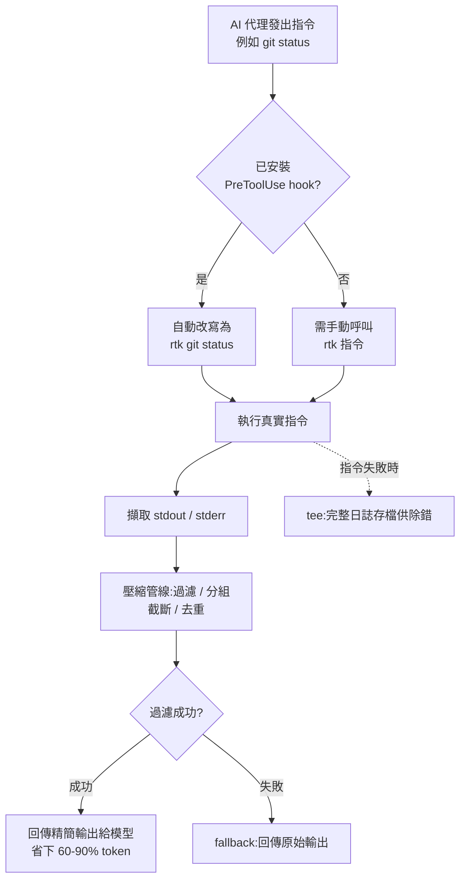

# RTK(Rust Token Killer)深入研究報告

**主題分類:** AI / 節省 Token 的開發者工具
**研究對象:** [rtk-ai/rtk](https://github.com/rtk-ai/rtk)
**官方網站:** https://www.rtk-ai.app/
**研究日期:** 2026-05-22

---

## 1. 摘要

RTK(「Rust Token Killer」)是一個開源的命令列 **代理(proxy)** 工具,夾在 AI 編碼助理與 shell 之間。當代理執行一般開發指令(`git status`、`cargo test`、`grep`、`npm install`…)時,RTK 會先執行真正的指令,接著 **過濾並壓縮輸出**,才把結果回傳到模型的上下文視窗。

主打數據是:在常見開發指令上 **降低 60–90% 的 LLM token 消耗**,以 **單一 Rust 二進位檔、零執行期相依** 的形式交付,每次呼叫 **額外負擔 <10 毫秒**。在一段具代表性的 30 分鐘 Claude Code 工作階段(混合 TypeScript / Rust 專案)中,專案回報 token 從 **約 118,000 降到約 23,900(整體約降 80%)**。

核心洞見:對 LLM 而言,大多數 CLI 輸出都是 *雜訊*(樣板訊息、進度條、重複行、通過的測試紀錄、空白)。把雜訊去掉既能 **降低 API 成本**,也能 **延長可用上下文視窗**,讓代理能進行更長的工作階段才需要壓縮(compaction)。

---

## 2. 它解決什麼問題

AI 編碼代理的運作方式,是讀取終端機輸出再餵回模型上下文。原始指令輸出冗長,且大多與模型決策無關:

- 測試套件印出上千行,但代理只需要 **失敗** 的部分。
- `git status` / `git diff` 噴出大量內容,真正重要的只有 **變更的路徑或 diff 區塊**。
- `ls`、`find`、`grep` 可能回傳又長又重複的清單。
- 建置 / lint 工具在少數幾行 **錯誤** 周圍堆滿進度、耗時與成功訊息。

每一行都讓 token 成本付出兩次:模型讀它一次,並間接擠佔上下文視窗、迫使更早截斷 / 壓縮。RTK 的論點是:用一個確定性的、理解指令語意的過濾器,就能移除約 89% 的雜訊,而不失去代理真正需要的訊號。

---

## 3. 運作原理(架構)

### 3.1 指令代理模式
RTK 採 **指令代理** 結構。`main.rs` 用 **Clap** 解析呼叫,透過 `Commands` enum 將指令路由到對應工具 / 生態系的 **專屬過濾模組**。每個過濾器:

1. 執行底層的真實指令(例如 shell 出去跑 `cargo test`)。
2. 擷取 stdout / stderr。
3. 把輸出送進 **壓縮管線**。
4. 將精簡後的結果回傳給呼叫者(代理)。

### 3.2 過濾管線
共有四種核心策略(依各指令輸出形態調校):

| 策略 | 作用 |
|---|---|
| 智慧過濾 | 丟掉雜訊行(進度、時間戳、通過的案例、橫幅)。 |
| 分組 | 把相似 / 相關項目彙整成精簡摘要。 |
| 截斷 | 保留最相關的脈絡,修掉長尾。 |
| 去重 | 收合重複 / 相同的行。 |

### 3.3 fallback 與「tee」安全機制
- **fallback 模式:** 過濾若因任何原因失敗,直接回傳 *原始* 輸出——RTK 應只負責瘦身,絕不弄壞工作流程。
- **失敗時 tee:** 指令失敗時可把完整未過濾輸出存到磁碟,讓代理(或人)在真的出錯時檢視完整日誌。此為可設定的「tee」模式。

### 3.4 透明自動改寫 hook
這是最重要的使用體驗。執行:

```
rtk init --global      # 或:rtk init -g
```

會在代理(預設為 Claude Code / Copilot)中安裝一個 **PreToolUse hook**。該 hook 會在執行 *之前* **透明地把 Bash 指令改寫** 成對應的 `rtk` 版本(`git status` → `rtk git status` 等)。代理照常下達一般指令,RTK 攔截並壓縮輸出。專案稱此做法可達成「100% RTK 採用率」,且模型完全不需改變行為。

> **注意:** Claude Code 的 *內建* 工具(Read、Grep、Glob)會繞過 Bash hook。要在這些工作流程上獲得節省,代理必須明確呼叫 `rtk read` / `rtk grep`,或被引導去用 shell。

### 3.5 指標 / 追蹤
有一個 **以 SQLite 為基礎的追蹤** 層(`src/core/tracking.rs`)記錄節省 token 的指標,使用者可透過 `rtk gain` 指令查看實際成效。

### 3.6 指令流程圖



---

## 4. 原始碼結構

```
src/
├── main.rs               # Clap 進入點;將 Commands enum 路由到過濾模組
├── core/
│   └── tracking.rs       # SQLite token 節省指標
└── cmds/                 # 每個生態系一個資料夾;各自有 README 與 //! 文件
    ├── system/           # ls, tree, grep, find, wc, env, json, log, deps(與語言無關)
    ├── git/              # git, gh (GitHub CLI), gt (Graphite), diff 工具
    ├── rust/             # cargo、test/error 執行器
    ├── go/               # go test/build/vet, golangci-lint
    ├── js/               # npm, pnpm, npx, vitest, jest, tsc, eslint, prettier, next, prisma, playwright
    ├── python/           # ruff, pytest, mypy, pip
    ├── ruby/             # rake, rails test, rspec, rubocop
    ├── dotnet/           # dotnet CLI, binlog, trx, format 報告
    ├── jvm/              # JVM 系工具
    └── cloud/            # aws, docker, kubectl, curl, wget, psql
```

每個 `cmds/*` 子目錄都附自己的 README,說明檔案職責、解析策略與跨指令相依——對貢獻者相當友善的慣例。

---

## 5. 支援的指令範圍

橫跨以下類別共 100+ 指令:

- **檔案操作:** `ls`、`cat`/`read`、`grep`、`find`、`diff`、`tree`、`wc`
- **Git 工作流程:** `status`、`log`、`diff`、`add`、`commit`、`push`(例如 push 只回傳簡短的 `ok main`)
- **測試執行器:** `jest`、`vitest`、`pytest`、`cargo test`、`go test`、`rspec`(通常 **只顯示失敗**)
- **建置 / lint:** `tsc`、`eslint`、`cargo clippy`、`ruff`、`mypy`、`rubocop`、`golangci-lint`
- **套件管理:** `npm`、`pnpm`、`pip`、`bundle`、`dotnet`
- **雲端 / 容器:** AWS CLI、Docker、Kubernetes(`kubectl`)
- **VCS 託管 CLI:** GitHub CLI(`gh`)、Graphite(`gt`)

---

## 6. Token 節省基準

官方回報數據(專案自行量測,視為廠商宣稱):

| 來源 / 範圍 | 降幅 |
|---|---|
| 整體,30 分鐘 Claude Code 工作階段(約 118k→約 23.9k) | **約 80%** |
| 跨 2,900+ 真實指令的平均雜訊移除 | **約 89%** |
| `cargo test` | **約 91.8%** |
| 測試執行器(整體) | 約 90% |
| `git add` / `commit` / `push` | 高達 **約 92%** |
| `git status` | **約 80.8%** |
| `find` | **約 78.3%** |
| `grep` | **約 49.5%** |

宣稱的效能目標:啟動額外負擔 **<10 毫秒**、記憶體 **<5 MB**、節省 **60–90%**。

---

## 7. 安裝與使用

**安裝**(多種方式):
```
brew install rtk                                   # Homebrew
cargo install --git https://github.com/rtk-ai/rtk  # Cargo
curl ... | sh                                      # 快速安裝腳本(Linux/macOS)
# 或從 GitHub Releases 下載預編譯二進位(macOS / Linux / Windows)
```

**設定透明 hook:**
```
rtk init -g                 # 預設 Claude Code / Copilot
rtk init -g --agent gemini  # 或 cursor、cline、windsurf 等
```

**直接使用(不透過 hook):**
```
rtk git status
rtk read src/main.rs
rtk grep "TODO" src/
rtk cargo build
rtk pnpm list
```

**分析與探索:**
```
rtk gain        # 顯示 token 節省統計
rtk discover    # 找出更多可優化的機會
```

**設定:** `~/.config/rtk/config.toml`(TOML)。支援指令排除清單與 tee 模式(失敗時保存完整未過濾輸出)。

---

## 8. AI 工具整合模式

RTK 透過三種機制支援 13+ 種代理平台:

1. **Hook 式**(Claude Code、GitHub Copilot):PreToolUse hook 透明改寫 Bash 指令。
2. **外掛式**(OpenCode 等):用 TS / Python 外掛在執行前攔截指令。
3. **指示式**(Windsurf、Cline):以專案範圍的規則檔指示代理優先使用 `rtk`。

相容於:Claude Code、Cursor、Gemini CLI、Aider、Copilot,以及「任何會讀取終端機輸出的 AI 助理」。

---

## 9. 工程慣例(出自 CLAUDE.md)

- **語言:** Rust(約佔程式碼 92%)。
- **不使用 async** — 刻意採單執行緒(維持二進位小而快)。
- **`anyhow::Result` + `.context()`** 進行錯誤傳遞。
- **嚴格禁止 `unwrap()`** 於正式程式碼。
- **`lazy_static!`** 用於所有 regex 樣式。
- 提交前要求 **零 clippy 警告**。
- **品質關卡:** `cargo fmt --all && cargo clippy --all-targets && cargo test --all`。
- 透過 `bash scripts/test-all.sh` 跑冒煙測試。

這是一個紀律嚴明、效能優先的程式碼庫——對一個全部價值都建立在「近乎零成本中介層」的工具而言,十分貼切。

---

## 10. 專案現況與治理

- **熱度:** 約 52.8k GitHub stars、約 3.2k forks、175+ releases(高動能專案)。
- **核心團隊:** Patrick Szymkowiak(創辦人)、Florian Bruniaux、Adrien Eppling。
- **社群:** Discord + 開放 GitHub 貢獻。

> **來源衝突——授權與遙測:** 倉庫自身文件(擷取到的 README/CLAUDE.md)聲明採 **Apache License 2.0**,並有 **可選加入(opt-in)、匿名、彙總式遙測**(不含原始碼、路徑、機密或個資;以 `rtk telemetry status` / `forget` 管理)。另一篇第三方部落格則宣稱 **MIT 授權、無遙測**。**請以倉庫的 `LICENSE` 檔與遙測文件為準**,使用前直接查證。

---

## 11. 評析

**優點**
- 針對真實且日益擴大的成本痛點(代理 token 開銷),提出簡單且確定性的解法。
- 零設定的「透明 hook」是正確的 UX——不需重訓模型或改 prompt。
- 安全設計:fallback 回原始輸出 + 失敗時 tee,理論上不會弄壞工作流程。
- 逐指令調校比通用文字摘要更可靠(沒有幻覺風險;它是確定性過濾,而非用 LLM 壓縮另一個 LLM 的輸入)。

**限制 / 需權衡的風險**
- **本質上有損。** 由過濾器決定什麼是「雜訊」;過於激進的過濾可能丟掉代理其實需要的一行(例如某個能解釋後續失敗的警告)。fallback 只在 *指令* 失敗時觸發,不會在 *資訊* 遺失時觸發。
- **內建工具繞過。** 在 Claude Code 中,Read/Grep/Glob 會跳過 hook,所以節省取決於代理是否選擇走 shell。
- **廠商自報基準。** 60–90% 是專案自己的數字;實際節省高度取決於工作型態(以檔案讀取為主 vs 以跑測試為主,差異很大)。
- **維護面積。** 100+ 指令 × 多種輸出格式 = 隨工具版本變更而持續需要維護解析器。

**結論。** RTK 是針對「代理 token 膨脹」務實且工程紮實的解答。對於大量進行代理式編碼(尤其是測試 / 建置 / git 迴圈密集)的團隊,其成本與上下文視窗的節省很可能相當可觀。正確的採用方式是 **量測你自己的 `rtk gain`**,而非直接套用標題百分比;並保持失敗時 tee 開啟,確保除錯時仍能取得完整日誌。

---

## 12. 對「節省 Token」這個領域的意義

RTK 體現了一個值得追蹤的更廣模式:**在 I/O 邊界做確定性、理解工具語意的輸出壓縮**,而非用 LLM 做摘要。可遷移的關鍵想法:

- 在 **冗長的來源處**(指令本身)就壓縮,而不是等它已經進到上下文才處理。
- 對工具輸出 **優先用確定性過濾** 而非模型摘要——更便宜、更快、且不會幻覺出錯誤訊息。
- 永遠保留一條 **無損逃生口**(原始 fallback / tee),讓壓縮永不阻礙除錯。
- **逐工作型態量測** 實際節省,而非相信全域平均。

---

## 來源

- [rtk-ai/rtk — GitHub](https://github.com/rtk-ai/rtk)
- [RTK — Rust Token Killer(官網)](https://www.rtk-ai.app/)
- [rtk/CLAUDE.md at master](https://github.com/rtk-ai/rtk/blob/master/CLAUDE.md)
- [rtk/INSTALL.md at master](https://github.com/rtk-ai/rtk/blob/master/INSTALL.md)
- [rtk/CONTRIBUTING.md at master](https://github.com/rtk-ai/rtk/blob/master/CONTRIBUTING.md)
- [I Tried RTK (Rust Token Killer) — jangwook.net](https://jangwook.net/en/blog/en/rtk-rust-token-killer-llm-cost-optimization-guide-2026/)
