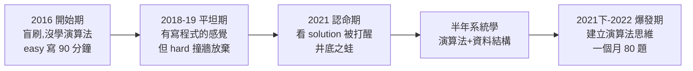
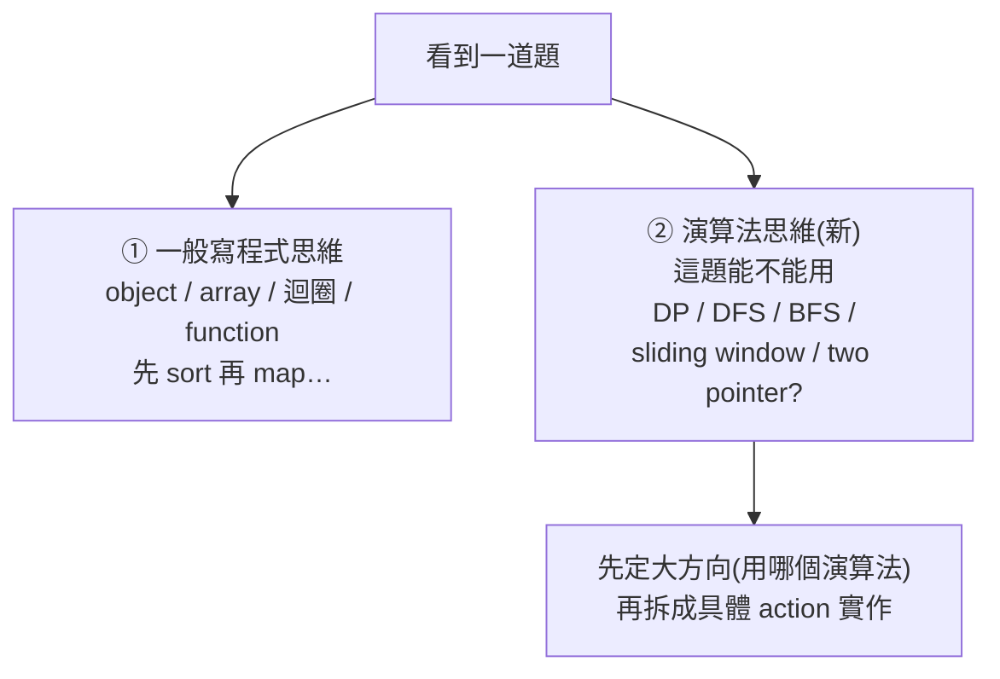

# LeetCode 怎麼刷最有效(上):從 0 刷到 200 題的真實心路歷程與方法

> 整理自 YouTube「宇先程式」(鄭阿軒)〈#4 LeetCode 怎麼刷最有效(上):從 0 刷到 200 題經驗分享!〉(2023-12-29,約 38 分鐘)。這是**上集**,主軸是作者**七年、222 題(86 easy / 117 medium / 19 hard)的真實刷題歷程**——一個 2016 年從資策會出來、**完全沒學過演算法與資料結構**的轉職仔,如何從「easy 寫 90 分鐘」一路撞牆、認命、最後爆發。下集才講完整策略與資源,但本集已藏了最關鍵的那個轉折:**「一般寫程式思維」→「演算法思維」**。
>
> 重點不在炫技,而在**一個沒有 CS 背景的人怎麼把演算法從零學起來、怎麼面對「井底之蛙」的打擊**。對轉職者、自學者特別有共鳴。

---

## 一句話總結

- 222 題裡,**前 50 題分散在前五年**,最後 **150 題集中在半年的爆發期**一口氣寫出來。
- 真正的分水嶺**不是寫題量,而是「認命去系統學演算法+資料結構」之後建立的「演算法思維」**——在那之前,寫再多 hard 也是用蠻力硬湊的「廢 code」。
- 結論:**沒有捷徑,只能慢慢練;但用對方法可以大幅縮短走冤枉路的時間。**

---

## 1. 開始期(2016):盲刷的下場

作者資策會出來時,前端、後端、資料庫、資料分析、雲端都熟,**唯獨完全沒碰演算法與資料結構**(培訓班通常不教,因為工作上「不那麼即時用得到」)。聽前輩說「寫 LeetCode 很難很好玩、寫得越好薪水越高」,就在**毫無方向下盲刷**。

戰績很慘:
| 題目 | 難度 | 花費時間 |
|---|---|---|
| #292 Nim Game | Easy | 5 分鐘(以為自己是天選之人) |
| #258 Add Digits | Easy | 15 分鐘 |
| #202 Happy Number | Easy | **90 分鐘**(從天選之人變天選白痴) |
| #1 Two Sum | Easy | 寫成 **double for 迴圈 O(n²)**,1889ms 的「廢 code」 |

> **關鍵教訓**:Two Sum 寫成兩層迴圈、面試時直接被請回家。這階段「**只寫得出 easy、寫不出 medium、最久一題 90 分鐘**」——作者說「我連丟履歷的勇氣都沒有」。**盲刷不會自動長出演算法能力。**

> 補充觀念:LeetCode 的**執行時間(ms)**是跑完所有測試 case 的耗時,反映程式 performance;同一題 O(n²) 的 1889ms 對上 O(n) 的 125ms,差距就是「有沒有演算法概念」。

---

## 2. 平坦期(2018-2020):有「寫程式的感覺」但 hard 撞牆

工作兩年後培養出「寫程式的感覺」:Two Sum 會用**一個 map** 寫成 O(n)(125ms);easy 5–10 分鐘、medium 約 25 分鐘能寫一點。**但經典題如 #5 Longest Palindromic Substring 完全寫不出來**(Wrong Answer / TLE)。

2019 年「嚣張期」決定挑戰 hard,隨手選了 **#354 Russian Doll Envelopes(俄羅斯娃娃信封)**——結果**一整天 8–9 小時還是 Wrong Answer**,從此不敢碰 hard。

> **為什麼停滯?** 作者點出多數應用型工程師的真實處境:**寫 B2B / web / API,工作上根本用不到演算法**,反而 DB schema 規劃、雲端 deploy(GCP/AWS)、monitoring、log 分析、災難復原(disaster recovery)這些**即戰力更優先**(他這期還考了 GCP Professional Architect 證照)。所以演算法一直被排到後面——**這也是它對很多人「學不下去」的根因:缺乏即時的工作驅動力。**

---

## 3. 認命期(2021):被 solution 打醒的「井底之蛙」

工作穩定後,新年新希望:**至少寫出一題 hard**。剛好朋友面試都遇到 **#51 N-Queens(N 皇后,演算法經典題)**。作者沒學演算法硬幹,**花了 5 小時 12 分鐘**才寫出來(220ms),用一格格掃描、放皇后就把十字與斜線畫叉的土法。一度很驕傲——

**直到他去看 LeetCode 的 Solution 頁籤**:別人用 `placeQueen` + `isPlacedValid` **兩個 function 就搞定**(90ms)。成就感瞬間歸零。

> **三個被打醒的領悟:**
> 1. **「我寫這麼多,比不上別人短短幾行」**——演算法在 hard 題上的成效差距是數量級的。
> 2. **「井底之蛙」**:沒有演算法核心思維,只能憑小腦袋硬湊,結構凌亂。
> 3. **轉職者的「面對資工人士的心魔」**:工作這麼久還是輸一截。
>
> 推論:**「我原本工作那一套已經不敷使用了。想再往上、去挑戰更難的世界,得學新方法、新知識。」**

於是他做了關鍵決定:**認命,從頭系統學資料結構與演算法。**

---

## 4. 轉折點:從「寫程式思維」到「演算法思維」

作者上 PTT 搜「資料結構演算法 推薦」,選了**陽明交大的開放式課程**,花**半年**(一週 2–3 個時段)學完約八九成:

- **演算法**:Big-O、binary search、greedy、divide & conquer、**DP(最愛,全新領域)**、DFS / BFS。
- **資料結構**:linked list、tree、hash、map、stack、queue。
- 心得:DP 很好玩;「證明」很無聊但還是跟著寫(「寫完就睡著了」「精神折磨」)。

**最重要的產出是「演算法思維」的建立**——看到題目時開始有兩種並行的思路:

> **這是核心 takeaway**:演算法是「**包裝好的解決方式**」——很多問題的核心機制其實在問類似的概念,遇到 A 概念用 DP、遇到 B 概念用 DFS。**有演算法思維的人看到深水題,是「先抓一個主軸解法,再往主軸實作」;沒有的人是「想做 a、想做 b、想做 c,試試看能不能拼出來」,而且問他用什麼演算法也答不出來。**

這呼應作者另一個觀念 **「七成思考」**:**先想清楚要用什麼演算法、怎麼解(七成),再開始 coding(三成)。** 以俄羅斯娃娃為例:知道用 DP → 先 sort → 再用 DFS 一個個掃 → 掃的過程做比對,**三個 action 先確定,才動手寫**。

---

## 5. 兩個實戰方法

1. **用 Tag 鎖題型、專攻一類**:LeetCode 的 tag 能鎖定題型(像數學分三角函數、排列組合、機率),挑一類**集中狂寫**(作者專攻 DP)。過程中還撿到課堂沒教、面試卻真的遇到的 **monotonic stack(單調堆疊)**,以及 DP 的 **bottom-up vs top-down**、**linear vs binary search** 的實作差異。
2. **寫完一定看 Solution,然後「蓋牌重寫」**:看完高讚解法、理解其觀念後,**把別人的方法蓋住、自己重寫一遍**,真正內化。

---

## 6. 爆發期(2021下-2022):雪恥與量變到質變

2021/11 回頭再戰俄羅斯娃娃,**一眼看出是 DP**(下面 tag 也標 dynamic programming)。雖然第一版 1328ms(beats 5.45%,PR5)、改到 700ms 仍 PR5,**但這次只花 25 分鐘**(對比當年 5 小時什麼都做不到);再照詳解改出 **252ms 的 O(n log n)** 解法。

接著進入爆發期:**面試前兩個月瘋狂寫,一個月寫 80 幾題,4–5 個月共 150 題**。戰績演進:

| 難度 | 開始期 | 爆發期 |
|---|---|---|
| Easy | 30–90 分鐘 | 5–10 分鐘(邊看電視邊寫,調劑身心) |
| Medium | 寫不出來 → 25 分鐘 | **20 分鐘內** |
| Hard | 5 小時還寫不出 | 平均 **30 分鐘**(最久 40) |

> **面試現實**:online coding 常是「2 小時 3 題(medium / medium-hard)」,作者寫完還加 comment 說明邏輯 + **time / space complexity 分析**,約 100–120 分鐘內交卷,一週後進二面。要進「6 個 Tamama」(科技獨角獸 / FAANG 類)等級,**題目要刷到變直覺反應**。

---

## 應用案例 / 怎麼用這套經驗

- **如果你也是轉職/自學、卡在「盲刷無效」**:先停下盲刷,**認命花一段時間(作者半年)系統學完 DSA + 演算法**(找一門講得好的開放式課程從頭走完),再回頭刷題——這比「硬刷一千題」有效得多。
- **刻意訓練「演算法思維」**:拿到題先別急著 coding,**強迫自己先問「這題能不能用 DP / DFS / BFS / two pointer / sliding window?」**,定好主軸再拆 action 實作(七成思考、三成 coding)。
- **用 tag 專攻一類**:別亂槍打鳥。鎖定一個題型(如 DP)集中寫到有手感,再換下一類。
- **每題寫完看 solution + 蓋牌重寫**:把高讚解法的觀念內化成自己的,而不是寫完就過。
- **必寫題(作者清單)**:Two Sum(E)、#5 Longest Palindromic Substring(M)、#45 Jump Game II(M)、#51 N-Queens(H)、#354 Russian Doll Envelopes(H)。
- **管理心態(尤其轉職者)**:會經歷「井底之蛙」「面對資工人的心魔」的打擊——**把它當成意識到自己不足、該升級的訊號**,而非否定自己。對照 [[lisa-su-mit-commencement]]「向最難的問題奔跑」。
- **手感會生疏但回得快**:長期沒練會生疏,但**有爬過這條曲線**的人,面試前寫個 3–5 題就能快速回到狀態。
- **務實期待**:應用型工作平常用不到演算法是常態;刷題主要是**為了通過面試這道關卡**,別因為工作用不到就否定它的價值。

> 延伸:本筆記為**上集(歷程)**;下集涵蓋完整策略(人物背景、四個階段、練習方法、選題技巧)與學習資源,屆時可另開一篇互連。對照本庫 [[ten-toxic-manager-traits]](職場生存)、[[lisa-su-mit-commencement]](職涯心態)。

---

## 來源

- 宇先程式(鄭阿軒),〈#4 LeetCode 怎麼刷最有效(上):從 0 刷到 200 題經驗分享!〉,YouTube:<https://youtu.be/dJc-h7ui8wc>(2023-12-29,約 38 分鐘)
- 本文依該片**官方 zh-TW 字幕**整理。影片參考資源:binary search、monotonic stack 教學連結;學習課程為陽明交大開放式課程(演算法 / 資料結構)。必寫題清單見影片說明欄。
