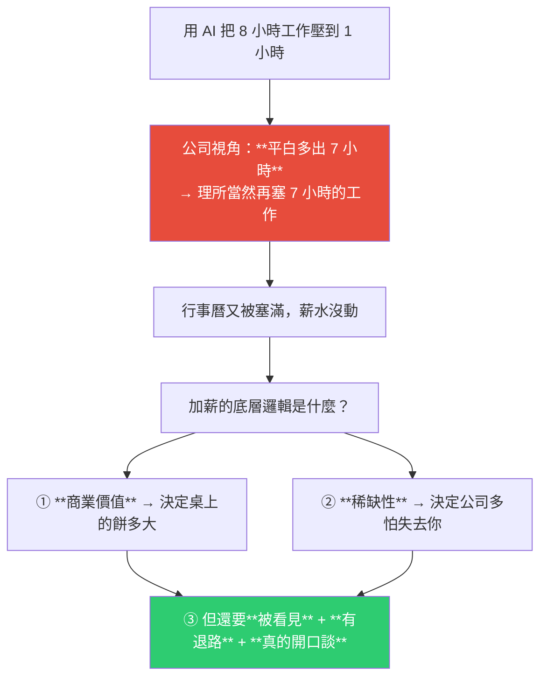
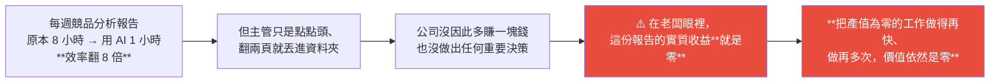
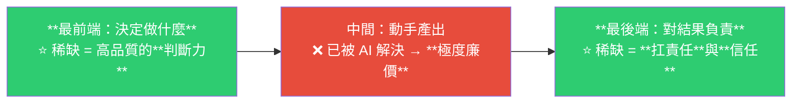
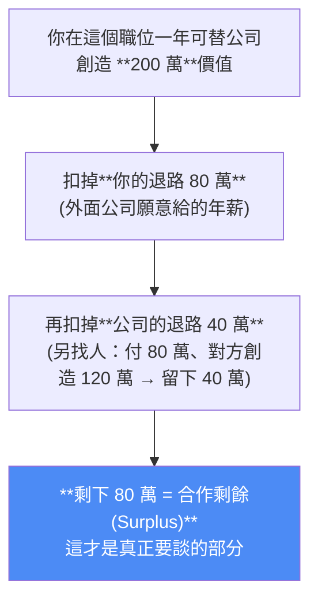
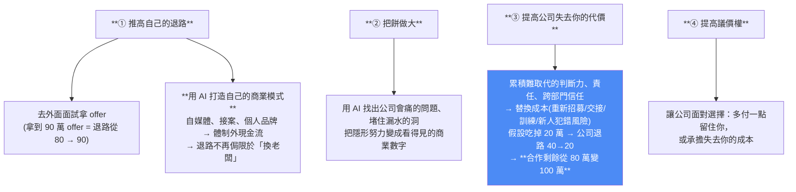

# 學了那麼多 AI,為什麼還是沒加薪?——省下的時間 85% 被雜事吃掉,以及納許議價怎麼算你該開多少

> 整理自 YouTube「Gary Chen」〈學了那麼多 AI,為什麼還是沒加薪?〉(2026-08-08,約 20 分鐘,官方 zh-TW 字幕)。作者自陳是與朋友、客戶對談後的感悟,**純屬個人觀點**。
>
> 核心一句話:**效率從來不是加薪的理由。薪水是價格,不是獎金。**

---

## 一句話總結



**丹麥兩位經濟學家觀察約 2.5 萬名工作者**:很多人確實靠 AI 省下時間,**但這些多出來的時間約有 85% 又被拿去處理原本工作裡的其他雜事**。

---

## 一、加薪的底層邏輯:薪水是「價格」

> **薪水不是老闆用來獎勵你很辛苦或做事很快的獎金。薪水的本質,是公司為了買下你的能力來解決特定問題,在市場上開出的價格。**

既然是價格,**漲價只有兩個原因**:

| 原因 | 對應 |
|---|---|
| **它變得更有價值了** | 你替公司創造了**新的商業價值** —— 賺到原本賺不到的錢,或省下原本省不下的成本。**沒有這塊新價值,公司根本沒有多餘預算,也沒有理由多付你錢。** |
| **它變稀缺了** | 你**有多難被取代**。就算你真的幫公司省了一大筆錢,**但如果市場上隨便找個人都會用這個工具、做到一樣的事,公司為什麼要幫你加薪?用原本的薪水請別人就好。** |

> **只有當公司發現「失去你,這份價值就會跟著消失,而且很難找人接手」時,你的價格才會上漲。**

---

## 二、第一步:創造商業價值(而不是提高效率)

### 關鍵概念:邊際生產力

> **公司每多付你一塊錢、你每多花一小時,到底能幫公司「多」賺回多少實質收益?**
>
> ⭐ **老闆看的是實質收益有沒有變多,不是你做完了幾個任務。**

### 那個很痛的例子



**而如果省下的 7 小時只是讓主管塞給你更多這類零產值雜事** —— **你只是在同樣的薪水下做了 8 倍的白工。**

### ⭐ 換一個問題問自己

| ❌ 錯的問法 | ✅ 對的問法 |
|---|---|
| 「我還有哪一件工作可以交給 AI?」 | 「**公司現在最頭痛、卻一直解決不了的問題是什麼?我能不能用 AI 幫忙搞定它?**」 |
| → 陷入盯著待辦清單的迴圈,變成**效率很高但沒創造新價值的打工仔** | → 累積真正的談判籌碼 |

### 找問題的四個切入點

1. **哪一件事正在浪費公司的錢?**
2. **哪一個流程一直讓客戶或同事等?**
3. **哪一種錯誤每個月都在重複發生?**
4. **哪一個重要決策因為資料太亂、整理太慢而遲遲沒辦法做?**

> ⚠️ **順序非常重要:先寫下你希望改變的結果,再決定用什麼工具。**
>
> **從工具出發** → 很容易做出一套很炫但根本沒人需要的自動化流程;
> **從結果出發** → Claude Code 也好、ChatGPT 也好,都只是解題工具。

---

## 三、第二步:建立稀缺性(價值板塊正在移動)

### 殘酷的證據

> 國外一份針對 **5000 名客服人員**的研究發現:導入 AI 之後,**進步最多的反而是原本表現比較弱的新手** —— **AI 把高手的經驗打包,讓新手瞬間開外掛追上來。**

**所以**:如果你把職涯全押在「我做事比別人快十倍、產量比以前大」,**這是完全沒有護城河的** —— 一旦全公司都導入 AI,高效率產出瞬間變成所有人的基本功。

### ⭐ 稀缺性往流程的兩端移動



**前端的稀缺是判斷力**:當任何人都能叫 AI 一秒吐出十個企劃案時,**價值就轉移到了「選擇」** —— 誰能在一堆眼花撩亂的 AI 輸出中過濾掉瞎掰的雜訊、準確挑出真正可行、能帶來回報的方向?

> **AI 負責跑腿,但路線必須是你畫的。** 老闆願意付高薪買的是**你替公司定義問題、決定做什麼與不做什麼的決策品質**。

**後端的稀缺是扛責任與信任**:任何人都能把問題丟給 AI、再把建議轉傳給老闆 —— **「幫忙出主意」已經不值錢了**。真正值錢的是:

> **「我幫你想,而且如果中間出錯了,我承擔後果、我來修。」**

而且 **AI 沒辦法走到隔壁部門去說服那個很難搞的業務主管,也沒辦法用一杯咖啡的時間安撫暴跳如雷的客戶。**

> ⭐ **別人可以偷走你寫的 skill,但他沒辦法複製你過去兩年幫公司踩過坑、並解決問題的信譽。**

---

## 四、第三步:讓決策者看見(努力在 AI 時代很容易隱形)

**為什麼難**:當你千辛萬苦打通一個流程,主管看到的畫面通常只有「這個月團隊變快了」;**加上 AI 工具是公司買的、資料是公司的**,決策者很自然會覺得**這是新工具帶來的效益,不一定是你的功勞**。

### ❌ 苦勞紀錄 vs ✅ 無法造假的證據

「我用了多少新工具、寫了幾百個 Prompt」= **苦勞紀錄,只能證明你很忙**。
而「我很會用 AI」在現在**已經是一句空話,每份履歷都能寫**。

**要拿出的是決策者看得懂、而且無法造假的三件事:**

| # | 證據 |
|---|---|
| 1 | **商業數字的改變** —— 改善前後,時間、成本、錯誤率差了多少? |
| 2 | **實際的影響力** —— 這套流程有多少其他部門的人真的在用? |
| 3 | **你扛下的責任** —— 你只負責丟個點子,還是連後續維護與品質都一併扛下來? |

**影片給的報告範本結構**(清楚呈現「原本什麼問題 → 帶來什麼商業結果 → 承擔了什麼責任」):

```
這份報表原本每週要花 8 小時、每月平均出錯 3 次；
我用 AI 重新設計了檢查流程後，現在每週只要 2 小時，
而且過去兩個月零失誤；
目前財務跟業務部都在用這套流程，
而我會持續負責它的維護。
```

### ⚠️ 而且老闆幾乎不會主動幫你加薪

> **站在公司的角度,只要你不開口,最省錢的做法就是先裝死** —— 用原來的薪水就能留住你,幹嘛主動增加成本?

---

## 五、⭐ 納許議價:你到底該開多少?

**把上班想成你和公司一起合作做生意**:公司提供資金、品牌、客戶與資源;你提供時間、能力與判斷。**薪資談判就是在談「這段合作創造出來的價值最後怎麼分」。**

納許議價先問兩件事:**①談不攏時雙方各自還能得到什麼(退路)?②繼續合作能多創造多少價值?**

### 影片的完整算例



**議價權相同時怎麼分?** 納許的做法是**把雙方各自從合作中多拿到的錢相乘,找乘積最大的分法**:

| 分法 | 乘積 | 結果 |
|---|---|---|
| 80 全給你 / 公司 0 | 80 × 0 = **0** | 公司跟你合作等於直接換人,沒理由接受 |
| 0 / 公司拿 80 | 0 × 80 = **0** | 你留下來沒拿到任何額外好處 |
| **各 40** | 40 × 40 = **1600** | ✅ **乘積最大 → 平分** |

**但真實職場議價權很少相同:**

| 情境 | 你分到 | 你的年薪 |
|---|---|---|
| 公司議價權較強 | 20 萬 | 80 + 20 = **100 萬** |
| 議價權相當 | 40 萬 | 80 + 40 = **120 萬** |
| **你很難取代 + 手上有真的可接受的 offer** | 60 萬 | 80 + 60 = **140 萬** |

> ⭐ **公式:你的薪水 = 你的退路 + 你靠議價權分到的合作剩餘。**
>
> **價值決定桌上有多大一塊餅,議價權決定這塊餅最後怎麼分。**

---

## 六、提高薪水的四條路



### 第④條的實戰要點

- **找對真正能決定薪資的人**;
- **抓時機**:在公司編列預算、調整職務或規劃下年度目標**之前**;
- **提出明確的交換條件**(把成果、承擔的責任、期望的角色與薪資一次講清楚);
- **底薪不能動就繼續談**職級、專案獎金、分潤;
- ⚠️ **不要接受一句模糊的「之後再看看」** —— **要把條件、數字和時間點談清楚。**

---

## 七、你卡在哪一關?

| 症狀 | 卡在 | 該做什麼 |
|---|---|---|
| AI 用得很溜,但只是提早下班、或被塞更多雜事 | **第一關:沒創造商業價值**(掉進**執行力陷阱**) | 停止繼續優化自己的待辦清單;去找公司一直解決不了、一直在漏錢的痛點,用 AI 解掉並**大膽把責任扛下來**;讓角色往**前端判斷 + 後端責任**移動 |
| 已幫公司省錢創造價值,但老闆裝死、你不敢開口 | **第二關:沒把成果轉成籌碼** | 蒐集證據、換算成商業數字、說清楚承擔了什麼責任與替換成本;**更新履歷去面試或開始接案建立退路**;找決定薪資的人提出明確要求 |
| 公司體制僵化,做出貢獻也無法調整職級/角色/薪資 | **第三關:選錯談判戰場** | **在沒有重新定價空間的地方,餅做再大也分不到** → 把 AI 省下的時間拿去接案、做內容、建立個人品牌,或找願意替這套能力重新出價的公司 |

---

## 八、應用案例

### 案例 1|把「我省了多少時間」改寫成「公司多賺/少賠了多少」

最快的自我檢驗:**把你最近三個 AI 成果,各寫一句給老闆看的話。** 如果每一句都是「原本要 X 小時,現在只要 Y 小時」而**沒有下一句(所以公司多賺/省了 Z)**,那你就在第一關。

**改寫模板**:
```
原本狀態（含錯誤率／等待時間／成本）
→ 我做了什麼
→ 改善後的數字
→ 誰在用（影響範圍）
→ 我持續承擔什麼責任
```

### 案例 2|用四個切入點做一次「痛點盤點」

拿一張紙寫下公司裡:①正在浪費錢的事 ②讓人等的流程 ③每月重複發生的錯誤 ④因資料太亂而卡住的決策。

**然後挑「④」下手** —— 因為決策卡住的損失最大、也最容易被決策者感知到,而這恰好是 AI 最能幫上忙的地方(整理、彙整、初步分析)。

### 案例 3|檢查你的職涯押注押在哪一段

```
□ 我的優勢是「做得比別人快」嗎？   → ⚠️ 沒有護城河，全公司導入 AI 就被拉平
□ 我的優勢是「判斷做什麼」嗎？     → ✅ 前端稀缺
□ 我的優勢是「扛責任 + 跨部門信任」嗎？ → ✅ 後端稀缺
```

那句話值得抄下來:**「別人可以偷走你寫的 skill,但他沒辦法複製你過去兩年幫公司踩過坑、並解決問題的信譽。」**

### 案例 4|算一次自己的納許議價四個數字

即使不談判,算一次也很有價值:

| 數字 | 你的值 |
|---|---|
| **你的退路** | 外面實際拿得到的 offer(**不是你自認的市場行情**) |
| **公司的退路** | 換人後公司還能留下多少(含替換成本) |
| **合作剩餘** | 你創造的價值 − 你的退路 − 公司的退路 |
| **議價權** | 稀缺性 + 外部選項 + 你能不能承受談不攏 |

**最常見的問題是第一個數字是「想像的」** —— 沒去面試就不知道自己的退路到底多少,而**沒有退路就沒有議價權**。

### 案例 5|⚠️ 這套框架的邊界

作者自己標明「純屬個人觀點」,採用前也該注意幾點:

- **數字是示範用的**(200 萬價值、80 萬退路都是假設),**真實情況下「你創造多少價值」往往很難精算**,而這正是模型最關鍵的輸入。
- **納許議價假設雙方資訊對稱且理性** —— 真實談判裡公司通常握有更多資訊(薪資帶、預算、其他人的薪水)。
- **拿 offer 當籌碼有風險**:部分公司文化會將此視為不忠誠;而且**你要真的準備好走**,否則是虛張聲勢。
- **影片帶 Patreon 推廣**(完整文章與算薪 Prompt 在付費端),閱讀時納入考量。

📌 對照本庫 [[six-ai-agent-trends-next-year]] 的結論:**AI 時代真正拉開差距的是「把話說清楚、會分配任務、判斷得出什麼叫做得好」** —— 那三項恰好就是本片說的「前端判斷力」。

### 案例 6|對本倉庫的映射

我們這個知識庫本身其實就是案例 4 裡「**打造自己的商業模式 / 個人品牌**」那條路的雛形 —— 179 篇繁中筆記、有明確主題與持續更新節奏。

**但依本片的邏輯,它目前還停在「累積」階段**:要變成真正的退路,需要的是**可被外部看見與定價的形式**(公開分享、內容產出、或轉化成可交付的能力)。**知識本身不是退路,被市場認可的知識才是。**

---

## 重點回顧(TL;DR)

- **⭐ 效率不是加薪的理由**:丹麥研究約 2.5 萬名工作者 —— **AI 省下的時間約 85% 又被雜事吃掉**;省下時間在公司眼裡通常只等於「你可以做更多事」。
- **薪水是價格不是獎金**:漲價只有兩個原因 —— **變得更有價值**(創造新商業價值)或**變稀缺**(難被取代)。
- **邊際生產力**:老闆看的是**實質收益有沒有變多**,不是你完成幾個任務。**把產值為零的工作做再快、做再多次,價值依然是零。**
- **⭐ 換問題**:別問「還有哪件工作能交給 AI」,要問「**公司最頭痛卻解決不了的問題是什麼**」;四個切入點:浪費錢的事 / 讓人等的流程 / 每月重複的錯誤 / 因資料亂而卡住的決策。**先定結果再選工具。**
- **稀缺性往兩端移動**:中間的「執行產出」已被 AI 弄得極度廉價(5000 名客服研究:**進步最多的是新手**);**前端稀缺 = 判斷力**(AI 跑腿,路線你畫)、**後端稀缺 = 扛責任與跨部門信任**(「幫忙出主意已經不值錢」)。
- **讓人看見**:AI 時代努力容易隱形(功勞被歸給工具)。要拿**無法造假的三種證據**:商業數字改變 / 影響範圍(誰在用)/ 你扛的責任。**「我很會用 AI」已是空話。**
- **⚠️ 老闆不會主動加薪**:只要你不開口,**裝死是最省錢的做法**。
- **⭐ 納許議價**:**薪水 = 你的退路 + 議價權 × 合作剩餘**;合作剩餘 = 你創造的價值 − 你的退路 − 公司的退路。議價權相同時平分(乘積最大)。**價值決定餅多大,議價權決定怎麼分。**
- **四條路**:①推高退路(拿 offer / **用 AI 做副業建立體制外現金流**)②把餅做大 ③**提高公司失去你的代價**(替換成本會直接壓低公司退路、放大合作剩餘)④提高議價權(找對人、抓預算時機、**談清楚條件數字時間點,不接受「之後再看看」**)。
- **三關診斷**:只是提早下班/被塞雜事 = **執行力陷阱**;有成果但不敢開口 = **沒轉成籌碼**;公司無重新定價空間 = **選錯戰場**(那就把時間拿去外面開新局)。

---

## 來源

- Gary Chen(YouTube),〈學了那麼多 AI,為什麼還是沒加薪?〉(2026-08-08,約 20 分鐘):<https://www.youtube.com/watch?v=aZEmxJ9ivzg>
  - 本文依該片**官方 zh-TW 字幕**整理(非 Whisper 轉錄)。
  - 影片時間戳:0:00 學 AI 卻沒加薪 / 1:10 加薪的底層邏輯 / 3:07 創造商業價值 / 5:57 建立稀缺性 / 8:59 讓老闆看見 / 10:35 納許議價算薪水 / 14:56 提高薪水的四條路 / 18:25 你卡在哪一關。
  - ⚠️ **作者自陳「純屬個人觀點」**;片中引用的丹麥 2.5 萬人研究與 5000 名客服研究**未在影片中給出出處**,本文未另行查核;納許議價的數字全為示範假設。作者另在 Patreon 提供完整文章與算薪 Prompt,本文僅整理影片中公開說明的方法。
- 延伸(本庫):[未來一年的 6 個 AI Agent 趨勢](../../technology/ai-agents/foundations/six-ai-agent-trends-next-year.md)(判斷力才是金字塔底層) · [2026 Agent 工程師能力與面試題](../../technology/ai-agents/foundations/production-agent-engineer-skills-2026.md) · [什麼樣的 Agent 專案能給履歷加分](../../technology/ai-agents/applications/agent-project-resume-enterprise-grade.md)(用工程語言重構履歷)
