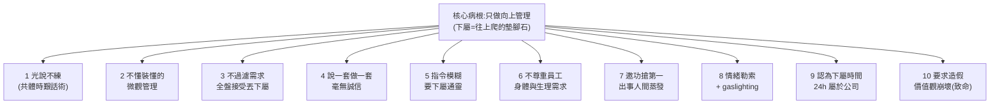

# 十大恐怖主管特質:從竹科裸辭看「只做向上管理」如何逼走一個好員工

> 來源:YouTuber **小電Dian**(交大畢業、前竹科工程師)的影片〈我從竹科裸辭的真正原因!十大最恐怖的主管特質,最後一點最致命〉。她在離職沉澱兩個多月後,把過去一年多在「魔王專案」裡遇到的有毒主管,拆成十個可辨識的特質。本筆記把這十點整理成「**識別 → 為什麼有毒 → 該怎麼自保**」的職場避雷指南。

---

## 一句話總結

判斷一個主管值不值得跟,**永遠不要聽他說了什麼,要看他實際做到了什麼**。一個「只做向上管理(managing up)」的主管,會把下屬的專業、健康、責任感,全部當成自己往上爬的墊腳石——這十個特質就是這條核心邏輯的不同變形。

---

## 十大特質逐項拆解

### 1. 光說不練:用「共體時艱」騙你賣命

**故事:** 部門被交接到一個沒人想接、接到就有人離職的「大魔王客戶」專案。主管為了在高層面前展現企圖心,**提前兩個月**就把別的部門的事搶過來做,害自己部門工作量暴增;過年排班他舉手要全部門加班,結果**班表上沒有他自己的名字**。每當下面有怨言,他就放大招:「大家再撐一下,這客戶很重要,顧好了獎金分紅一定變多。」結果一整年下來,**錢沒變多,只有壓力和工作量暴增**。

**為什麼有毒:** 在幫下屬爭取到任何「實質利益」之前,就先要大家共患難——他最後爭取的永遠是他自己的未來,不是你的。

**自保:** 看主管的「行為」不看「說詞」。對照故事裡另一位中階主管:把自己排連假第一天、主動扛下大部分問題——這才是有肩膀。

### 2. 毫無專業,卻是極端的細節控制狂(Micro-management)

**故事:** 主管要對大客戶報告,但投影片從不自己做,丟給下屬整理。下屬交出初版後,他**站在背後**一頁一頁指揮:「這字放大、這表加欄位、第三頁移到第一頁」,把原本有邏輯的報告打亂;拿去報告時還會講錯重點、甚至把不該講的講出去,衍生出更多 action item,最後加班收尾的都是下屬。

**為什麼有毒:** 距離技術遙遠本來可以理解,但好主管會「給團隊專業信任」,聽完脈絡後自己微調;無能的主管才靠糾結字體大小、排版來刷存在感。

**自保:** 不需要替他的無能與控制慾買單。

### 3. 不會過濾需求:客戶說什麼就全盤接受,轉頭丟下屬

**故事:** 客戶任何不合理要求,主管都「跪著答應」,甚至**主動把 deadline 往前提**來展現配合度。連續兩三個月,他常常早上 10 點因客戶一句話,就要下屬下午 2 點生出一份「做實驗→整理數據→分析→做投影片」的完整報告;交出去後傍晚又帶回新需求要隔天早上再生一版。同一主題的報告,兩個多月內**改了 80 幾版**。

**為什麼有毒:** 中階主管該當「防火牆」,過濾不合理需求、爭取資源與時間。有求必應不會換來尊重,只會換來無止境的剝削——客戶會得寸進尺,日後想協商還會被反咬「你之前不是都做得出來?」

**自保:** **管理對方的期望值**。覺醒後的做法:時間太趕就交一版完成度三四成的,明說「時間就這麼短只能這樣,要完整版最快明天下午」,別讓人覺得你 100% 都能達成。

### 4. 說一套做一套,毫無誠信

**故事:** 下屬請主管「這個還沒驗證的數據先別告訴客戶,以免誤導」,主管當面答應,**隔天會議上卻直接講給客戶聽**,讓客戶抓著窮追猛打、出一堆延伸作業,嚴重干擾開發與除錯方向。

**為什麼有毒:** 誠信是團隊合作的底線。一個會對外背叛團隊共識的主管,代表他隨時能為個人利益出賣你——你永遠不知道他何時會從背後捅你一刀。

### 5. 指令與目標永遠不明確,要下屬「通靈」

**故事:** 主管接了一個聽起來很怪的緊急需求,下屬問「規格、格式、具體怎麼做?」,他竟理直氣壯回:「**如果我知道我就自己做了**,就是要你們想辦法。」等下屬照自己理解做出初版,他靈感才來:「我覺得客戶要的不是這樣……再幫我改。」陷入無止境修改。

**為什麼有毒:** 這種主管的藉口是「我在培養你的獨立思考」,實際只是在逃避自己的責任。

### 6. 不把下屬當人:無視身體與生理需求

**故事(兩段):**
- 下屬整天沒吃東西,傍晚血糖過低快暈倒,拿起便當吃一口,主管冷冷說:「**那我也沒吃啊**」——逼他放下飯繼續做事,飯冷了也沒胃口。
- 三年前下屬得 A 型流感發燒近 40 度,第三天勉強戴口罩上班,主管不是關心,而是說:「**你那個流感就不要去驗,不就不會確診、可以來上班了嗎?**」周會還公開宣導:「請病假觀感不佳,先把特休彈休用完再考慮請病假。」——**直接公然違反勞基法**。

**為什麼有毒:** 這種主管只 care 他的 KPI、績效、高層眼光,完全不 care 你的死活。

**自保:** 別用「以大局為重 / 要負責任」綁架自己的基本權益與健康。公司少一份報告、少一個員工不會倒,但**你健康垮了沒有任何人能為你負責**。當一個環境連你生病、吃飯的生理需求都不尊重,它已經不是一份正常的工作。

### 7. 邀功搶第一,出事人間蒸發

**故事:** 下屬親自向客戶報告「為何這代產品因技術限制無法達標、下代已在優化」,客戶非常滿意(幾個月後出差還特地來稱讚)。但主管為了邀功,在公司高層會議**腦補出一套根本不可行的「優化方案」**,還趁下屬請假時在客戶面前推翻下屬報告、把這方案承諾給客戶。引爆兩顆炸彈:對內高層下令所有相關部門配合(大家在 mail loop 大戰),主管卻**人間蒸發**,叫下屬去回信當炮灰,被各部門連環追殺好幾天;對外已向客戶承諾,只好硬做一個明知沒用的東西,浪費大量時間資源。下屬的專業度被徹底毀掉——這埋下了他想離職的種子。

**為什麼有毒:** 功勞他搶、黑鍋你背,你成了那個執行、負責、承受一切卻無從決定的人。

### 8. 情緒勒索與精神操控(gaslighting / 煤氣燈效應)

**故事:** 升管理職後,主管常用「你現在是主管了,要負更多責任」把份內事丟給下屬;下屬求救,他不解決反而**比慘**:「你又沒每天跟客戶開會,你不知道我也很想離職、也睡不好,但我還不是撐下來了?」製造罪惡感。下屬反映體制問題,他反過來指責:「是不是你工作分配能力有問題才這麼累?」

**為什麼有毒:** 這是心理學上的 **gaslighting**——扭曲事實、否定你的感受,讓受害者開始自我懷疑、失去自信,而且當下很難察覺(她也是離職後才意識到)。

**自保:** 學會 **課題分離**:做好自己份內的事、該反映的反映;主管不理、不幫忙解決,那是「他失職、他的問題」,不是你的問題。別再內耗自我懷疑——這是這種環境下唯一能自保的方法。

### 9. 認為下屬的 24 小時都屬於公司

**故事(三段):** 下屬用下班時間學日文,主管隔排回頭酸:「你還有時間學日文?是不是太閒、我給的工作量不夠多?」;專案空檔下屬事情做完準時下班,被叫進小房間:「我看你最近比較早下班,有時還比我早。」(之前加班到半夜一兩點、沒加班費時卻沒人關心);下屬下班/週末經營 YouTube、IG(刻意不提公司、不在上班時間發),仍被約談「心力要放工作上」,還時不時暗示「我都有在看你發的文」——讓他覺得被全天候監控、快窒息。

**為什麼有毒 / 自保:** **如果你一開始沒幫自己設好底線,別人也不會幫你畫界線。** 你建立的「任勞任怨、委屈往肚裡吞」形象,會讓善良與負責變成被視為理所當然的義務;等你想變回正常人,被你寵壞的「巨嬰」反而會指責你「你以前不是很願意加班嗎?怎麼變了?」——你越體貼,他只會越得寸進尺。

### 10. 要求造假,價值觀徹底崩壞(最後一根稻草)

**故事:** 主管為討好客戶,要求**憑空捏造原本不存在的數據**(用 AI 生成、Excel 亂數、Python 寫),還在周會公開說「這就是一份工作,請大家服從指令」。為了圓一個謊要說更多謊,被迫做出第二、三、四版假數據。第二次更荒謬:主管自己對客戶講錯了時間軸,卻為了不認錯,要下屬「**根據他講錯的時間生一份假數據**」,還說「你太糾結真正的入口時間了」。而且這些造假指令**全都口頭交代、不留 email/Teams 記錄**——一旦東窗事發,主管可以撇清「那是交給小主管負責的」,下屬要背鍋。

**為什麼致命:** 這違背了她的專業訓練與良知(「我念交大、受專業訓練,難道是為了在這做假數據?」)。她照鏡子對自己說「我不想變成這樣的人」,當天就決定離職。

---

## 離職前一天的「經典面談」——有毒主管的完整現形

提離職前一天(因分紅隔天才入帳,還沒攤牌),主管把她找進小房間談了近 50 分鐘,而她**只講了約 5 分鐘**,其餘全是主管自說自話,完整展演了前述所有特質:

| 主管說的話 | 背後的特質 |
|---|---|
| 開頭假裝關心身體狀況(她已明說失眠、自律神經失調) | 完全沒 get 到危險訊號(特質 6) |
| 「做假報告沒你想的嚴重,只是修改格式讓客戶滿意」 | 扭曲事實 gaslighting(特質 8、10) |
| 「出大事的話大家一起承擔」 | 說一套做一套的空話(特質 4) |
| 「在職場上,聽話就有錢;想往上爬就做老闆不想做的事」 | 灌輸壓榨下屬往上爬的價值觀 |
| 「底下的人要哀就讓他們哀,安撫一下就好,事情還是要做好」 | 把下屬當工具(核心病根) |
| 「你這麼消極很不負責任,負面情緒會傳染影響別人」 | 情緒操控、責任全推給你(特質 8) |
| 「壓力太大可以退回去當基層工程師」 | 自以為只給你兩個選擇:當乖棋子 or 降職 |

**她的第三種選擇:**「老娘不幹了,這爛遊戲我不陪你玩,直接登出。」隔天分紅一入帳就寄出離職預告信。離職面談時主管問離職原因,她說「我看不到這份工作的意義」,主管回:「**工作哪需要什麼意義?工作不就是為了錢嗎?**」——她的回應點出全片核心:

> 工作是為了賺錢沒錯,但不代表要出賣身心健康、出賣靈魂、違背良心。「如果真要違背良心,那我去詐騙集團工作就好,可能還賺更多、還不用繳稅。」

---

## 給讀者的應用案例:怎麼用這十點避雷

1. **面試 / 試用期就觀察(對應特質 1、2):** 問主管「上一個專案你怎麼幫團隊爭取資源/擋需求?」聽他舉的是「我做了什麼」還是「我說服大家撐住」。只會講願景、講不出具體爭取行動的,先列警訊。
2. **入職第一天就設底線(對應特質 9):** 下班就下班、私人時間是私人時間,別一開始就營造「我可以無限加班」的形象。界線是你自己畫的,畫得晚會被當「變了」。
3. **遇到不合理 deadline,管理期望值(對應特質 3):** 用「我能在 X 時間做到 Y 完成度,要更完整需要到 Z 時間」回應,而不是硬擠出 100%。
4. **保留證據(對應特質 10):** 凡是「口頭交代、不留紀錄」的灰色指令,自己用 email「確認一下我的理解」回覆留痕;要求做違法/造假的事,守住底線並評估退場。
5. **辨識 gaslighting,做課題分離(對應特質 8):** 當主管反覆讓你自我懷疑,提醒自己「做好份內事 + 該反映的反映」之後,他不處理就是他的問題,停止內耗。
6. **把健康當第一優先(對應特質 6):** 生病該休就休、該吃飯就吃飯。「公司不會倒,但你的健康垮了沒人負責。」
7. **檢查清單:** 影片結尾的呼籲——如果你主管中了這十點中任何一點(尤其第 10 點造假),這就是有毒環境的信號;你永遠有「不一樣的選擇」,離開不是失敗,是拿回人生自主權。

---

## 來源

- 小電Dian,〈我從竹科裸辭的真正原因!十大最恐怖的主管特質,最後一點最致命〉,YouTube:<https://youtu.be/KeRBNTOITEo>
- (本筆記內容依影片逐字稿整理;逐字稿以 CPU Whisper 聽寫,可能有少量同音字誤差。)
