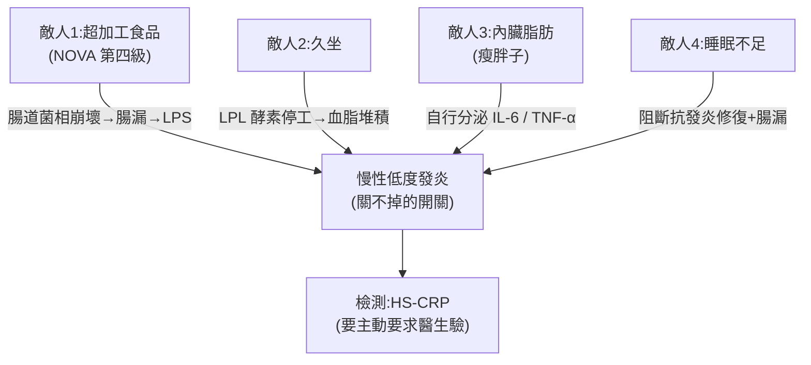

# 你以為健康,其實天天慢性發炎:四個敵人與四個對策

> 來源:Dr. Grace〈你以為健康,其實天天慢性發炎〉。主題是**慢性低度發炎(chronic low-grade inflammation)**——它不會痛、感覺不到,但一直存在,在你看不見的地方改變生理。影片拆出四個推動發炎的「敵人」,每個走**不同的機制路徑**,所以只改一件事往往無效;對應四個不需大改變的對策。

> ⚠️ **非醫療建議**:本筆記為衛教資訊整理,不構成診斷或治療。個人健康狀況請諮詢醫師。

---

## 一句話總結

發炎本是身體在「打仗」——短期能救命(癒合傷口、清除感染);但**慢性低度發炎**是那個關不掉的開關。它由**四個獨立路徑**同時驅動:超加工食品、久坐、內臟脂肪、睡眠不足。**關鍵觀念:四個開關要一起調,只改一個(或只吞一顆薑黃素)不會有效**,因為每個敵人走的是不同的發炎機制。

> **為什麼難察覺:** 一般健檢看不出來,除非醫生特別驗 **CRP / HS-CRP**。很多人是「問題大了才發現,發炎其實已經好多年」。

---

## 敵人 1|超加工食品:那些「你以為健康」的東西

用 **NOVA 食品分類系統**(依加工程度分四級)判斷:**第四級 = 超加工食品**。判準不是熱量或脂肪,而是——**裡面有沒有你家廚房不會用到的成分**(乳化劑、修飾澱粉、人工香料、穩定劑…)。

| 你以為健康 | 真相 |
|---|---|
| **盒裝豆漿** | 現打豆漿(黃豆+水+少許糖)是低加工;但為了放幾週不壞,盒裝版加了糖、乳化劑、穩定劑 → 第四級。(早餐店加一匙糖**不會**讓它變第四級) |
| **養樂多** | 標榜益生菌,但一小瓶約 **10–14 克糖**;糖對腸道是傷害——「標榜修復腸道的東西在偷偷傷害它」 |
| **運動飲料** | 多半是水+糖+甜味劑+人工香料+鮮豔色素,典型第四級,不是每天喝的健康飲料 |
| **全麥吐司** | 「全麥」兩字不改變成分;市售吐司為了軟、放幾天,加改良劑、乳化劑 → 都算第四級 |
| **沙拉醬 / 重口味豆乾** | 放了膠體、人工香料、醬料、糖、鹽、調味料 → 加工食品 |

**機制(走腸道):** 腸道約有 **38 兆細菌**管你的免疫、代謝、發炎。超加工食品直接攻擊它們——哈佛研究發現飲食改變**24–48 小時**就足以改變腸道菌相組成(不是幾個月,兩天而已)。菌相一亂 → 腸壁變弱 → 縫隙出現(腸漏)→ 死菌碎片(**LPS,脂多醣**)滲入血液 → 啟動身體的**發炎總開關**,而且**關不掉**。這還會經由腸道菌影響血清素、cortisol,直接與大腦溝通,牽動情緒、睡眠、免疫、自體免疫疾病風險。

> **對策:** 買東西**翻到背面看成分表**;列了一堆你廚房不會放的東西(膠體、乳化劑、修飾澱粉、香料、一堆糖)就是第四級——**包括那些被標為「健康食品」的**。從日常中挑一個超加工食品換掉開始。

---

## 敵人 2|久坐:運動「抵不掉」久坐

**今天你坐了幾小時?** 早上去健身房,**不會**把之後久坐的時間抵掉——這兩件事**身體是分開計算的**。2014 年起的研究發現:久坐上班族的發炎指標與胰島素阻抗較差,**與他們有沒有運動無關**(就算有運動還是會發炎)。

> 「你的椅子想讓你發炎,比你的健身還努力。」你可以跑 5 公里,但其他時間都坐著,發炎指標仍偏高。

**機制:** 久坐時一種酵素 **LPL(Lipoprotein Lipase,脂蛋白脂解酶)** 會停止運作——它的工作是清除血液中的脂肪。一旦不動它就停工,脂肪在血中待太久 → 發炎反應上門。久坐還造成 **gluteal amnesia(臀肌失憶)**:臀肌忘記怎麼用力、骨盆前傾、血液積在小腿、流到大腦的血流下降(所以一個下午後專注力潰散,有時的疲憊不是工作累,是沒在動)。

> **對策:** **每 30 分鐘起來動 2 分鐘**(研究支持的時間門檻)。作者自己在桌上貼 sticky note 寫「get up」。

---

## 敵人 3|內臟脂肪:給「體重數字看起來還好」的人

脂肪不是都一樣:**皮下脂肪**(皮膚底下、看得到)vs **內臟脂肪**(包覆內臟、看不到、體重計量不到)。**BMI 正常 ≠ 內臟脂肪沒問題**。

> **瘦胖子(skinny fat)**:針對亞洲族群的研究發現,亞洲人在體重比西方人低得多時,就已累積大量內臟脂肪——因為 **BMI 標準本來就是用西方人數據做的,不是為亞洲人設計**。一個 BMI 完全正常的台灣女性,內臟脂肪可能已持續讓她發炎一段時間。

**機制:** 內臟脂肪不是放著的死組織,它**會自己分泌**發炎細胞激素(**IL-6、TNF-α**)進入血液——**不需任何訊號觸發,有自己的時間表,每天都在跑**。它還加速膠原蛋白分解、改變臉部脂肪分布(眼下凹陷、下顎線消失)——**睡再多也改善不了**。「鏡子裡看到的疲憊感,很多是內臟脂肪造成的,不只是歲月。」

> **對策:** **肌力訓練比有氧運動更能針對性減少內臟脂肪**(這個差別很重要)。

---

## 敵人 4|睡眠不足:抗發炎修復被阻斷

**你上一次睡滿 8 小時、中途沒醒是什麼時候?** 深度睡眠時身體製造**抗發炎分子**、清除當天累積的損傷。而且身體是「累積」的——**週末補眠很難把之前沒睡好的補回來**。

**機制:** 腸道產生的褪黑激素是大腦的約 **400 倍**,它不是用來幫助睡眠,而是**調節腸道功能、直接在腸道發揮抗發炎作用**。睡眠規律被打亂 → 腸道褪黑激素分泌也跟著亂 → **主動增加腸道通透性**(與敵人 1 同一個腸漏機制)。所以「腸道」和「睡眠」從兩個方向跑同一個系統。

> **一晚**睡不足 6 小時,CRP 就明顯上升(不是幾個月)。一項涵蓋 72 人的研究 + 超過 5 萬人的系統分析發現:睡眠障礙與不正常睡眠時間,與 CRP、IL-6 等發炎指標持續相關,**排除其他風險因素也一樣**。

> **對策:** **固定的睡眠時間** 和 **睡眠總時數** 同等重要。

---

## 怎麼檢測:主動要求驗 HS-CRP

一般健檢通常不驗慢性發炎,要**主動要求醫生**驗 **HS-CRP(高敏感度 C 反應蛋白)**——比一般 CRP 更敏感,能抓到標準 CRP 抓不到的低度發炎。費用通常不高。

| HS-CRP 數值 | 意義 |
|---|---|
| **> 1** | 已是低度發炎狀態 |
| **> 3** | 相當顯著,與心血管疾病風險增加**約 2 倍**相關 |
| **> 10** | 急性發炎(可能是感染或受傷) |

> 數值不是固定的:**持續調整飲食 + 規律活動 + 優化睡眠,12 週內可讓 HS-CRP 下降 20–30%。**

---

## 應用案例:一個「自以為健康」的上班族日常

影片點破的典型矛盾——**你以為每件事都做對了,卻還在發炎,因為四個開關沒一起改**:

> 你優化了飲食,但還是**坐了 8 小時**;你有去健身房,但**早餐是第四級的盒裝豆漿+全麥吐司**;你覺得睡得還可以,但**腸道兩天前就因飲食改變了**。

**四敵人四對策,都不需大改變,挑能立刻做的開始:**
1. **超加工食品** → 從日常挑**一個**換掉(例:盒裝豆漿 → 早餐店現打豆漿;運動飲料 → 水)。
2. **久坐** → 每 **30 分鐘**起來動 **2 分鐘**;桌上貼「get up」。
3. **內臟脂肪** → 加入**肌力訓練**(別只做有氧);BMI 正常也別大意,亞洲人尤其。
4. **睡眠** → 固定上床時間,顧好總時數。

> **重要提醒:** **薑黃素只針對其中一條路徑**,無法重建腸道菌相、也補不了另外三個系統。這是 **lifestyle change**,不是靠一顆補充品解決。

---

## 來源

- Dr. Grace,〈你以為健康,其實天天慢性發炎〉,YouTube:<https://www.youtube.com/watch?v=I-PMiyYZkrs>(2026-06-06)
- 影片提及文獻:NOVA 食品分類系統;哈佛腸道菌相飲食研究(24–48 小時);2014 年起久坐與發炎/胰島素阻抗研究;亞洲族群內臟脂肪與 BMI 研究;睡眠與 CRP/IL-6 的 72 人研究及逾 5 萬人系統分析。
- **該片無字幕,逐字稿以 CPU 版 faster-whisper 轉錄取得,非官方字幕**;專有名詞(如 LPS、LPL、IL-6、TNF-α、HS-CRP、NOVA)已校正,可能仍有少量聽寫誤差。
