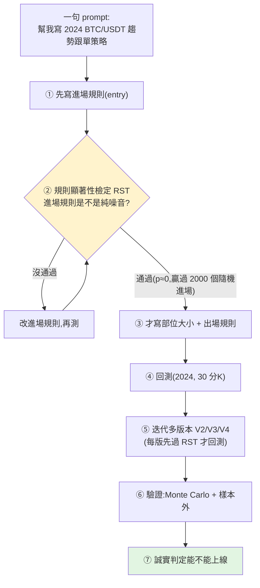

# 用 Claude Code + Jesse 做 AI 演算法交易:重點是「驗證流程」,不是那支策略

> 一支實戰影片:用 **Opus 4.8 + Claude Code +(Jesse 框架的)MCP**,從**一句 prompt** 讓 AI agent
> 寫出一個比特幣趨勢跟單策略、做回測、**用統計顯著性檢定排除「純運氣」**、反覆迭代到獲利,
> 再用 **Monte Carlo + 樣本外** 壓力測試。誠實結論:**這支策略還不能上線**——但真正的收穫是那套**可重複的開發/驗證工作流**。
>
> 整理自 YouTube「Algo-trading with Saleh」影片(英文,約 17 分鐘)。
> **⚠️ 非投資建議**;作者亦聲明僅供教育用途。演算法交易風險高,回測漂亮 ≠ 實盤會賺。

---

## 工具鏈

- **Claude Code**(作者用 **Max $100 方案**跑 Opus 4.8,說沒撞過上限;Pro 方案可能會撞限)。用終端機版(比桌面 App 快一點)。
- **Jesse**(Python 演算法交易框架):`jesse run` 起 dashboard,同時**對外開一個 MCP server**;
  依官方文件一行指令把它接進 Claude Code(作者把 port 改成 9000)。
- **`AGENTS.md`(agent.md)**:每個 Jesse 專案都附,告訴模型「該怎麼行為」,升級 Jesse 會自動更新;把它 attach 進 session。

> 對照本庫 [[task-decomposition-agentic-workflow]]:這正是「**接真實工具(MCP)+ 讓 agent 照規格(AGENTS.md)執行**」的具體案例。

---

## 核心工作流(一句 prompt 啟動,但刻意分步驟)

作者**故意不要**叫 agent「一路跑到回測漂亮為止」,而是**分步驟**,好示範一般人怎麼用它逐步開發策略。

### 關鍵概念:Rule Significance Test(RST)——先確認進場規則有「edge」再蓋上層

這是整套流程最值得學的一點:**在花力氣寫部位大小、出場規則之前,先驗證「進場規則本身不是運氣」。**

- 做法:把這個進場規則,和 **2000 個隨機進場變體**比較。若它**贏過每一個**、且 **p 值 ≈ 0**(遠低於閾值),
  就判定「進場規則有統計顯著性、不是 random noise」。
- 為什麼重要:一個「永遠做多」的策略在牛市當然賺錢,但那**不代表它有預測力**。RST 把「運氣」和「真 edge」分開。
- **agent 的價值**:就算你看不懂顯著性檢定,agent 會幫你跑、並用白話寫出結論;但你仍要有判斷力(見下)。

### 第一版:有 edge ≠ 會賺錢

agent 先做了 **Donchian 突破 + EMA 趨勢** 策略(收盤突破前高且高於 EMA 才做多)。RST 通過,但**回測淨利為負**:
**交易太多(208 筆)、手續費拖累**,平均盈虧比 2.20(趨勢策略的典型)。
> agent 給了誠實 takeaway:**策略有 edge,不代表會印鈔**;交易太密 → 被手續費吃掉。經典解法是加濾網、減少交易。

### 迭代:V3 勝出 + 「什麼修好了它」

叫 agent 再迭代 3 版(V2/V3/V4,**每版都先過 RST 再回測**)。**V3 獲利**:Sharpe **2.11**、最大回撤僅 **-17%**、
交易 **86 筆**、勝率低但平均盈虧比 ≈ **4**(趨勢策略典型:贏少次但贏很大)。

agent 解釋**什麼修好了它**:進場規則從來不是問題(RST 每次都過);真正的問題是
**在牛市裡做空一直失血、出場太緊 + 手續費拖累**——**拿掉做空、放寬出場、用更慢的突破**,就從虧轉盈。

---

## 驗證:別只信回測(這段是重點)

回測漂亮**不能**直接上實盤,至少要再做:

1. **Monte Carlo —— trades(打亂成交順序)**:測「如果先遇到的是輸的單會怎樣」=部位大小的穩健度。
   結果:最差 5% 情境最大回撤 **-23%**(原回測 -17%)、最好 5% 為 -8.5%。→ 你扛得住 -23% 嗎?
2. **Monte Carlo —— candles(合成資料壓力測試)**:用「依原始行情特性生成的合成資料」跑,測**過擬合**與穩健度。
   結果:原回測 Sharpe **2.48**,最好 5% **3.41**(比原始高 = 好現象)、**中位數 1.87**(比原始低)。
   → 作者判讀:**「不算過擬合,但也稱不上超穩健」**(原始結果落在中位數與最佳之間)。
3. **樣本外(out-of-sample)**:同策略丟到沒參與開發的年份。
   - **2023:獲利(+62%)** ✅
   - **2025:崩掉** ❌——**只要不在明確上升趨勢,這支 long-only 趨勢策略就垮**。

> **誠實判定:不可上線(not production-ready)。** long-only 趨勢跟單在牛市(2024)被「美化」了;
> 在盤整/空頭會大賠。作者說至少要它在非上升段「別賠那麼多」,或另外開一支 **short-only** 策略來互補。

---

## 真正的 takeaway

> 「這支影片的重點**不是給你一支策略**,而是給你一個**能省下無數小時、用來開發與評估你自己策略的工具**。」

- **AI 把『苦工』自動化**:寫策略、跑顯著性檢定、回測、Monte Carlo、讀 Sharpe/回撤——agent 都能代勞並用白話解釋。
- **但判斷權仍在你**:RST 過 ≠ 會賺、回測好 ≠ 實盤好、單一年份好 ≠ 穩健。**最後「能不能上線」是人決定的**,
  而且這支影片最有價值的部分,正是 agent + 作者**主動把自己的策略證偽**(2025 樣本外失敗)。
- **流程 > 結果**:可複用的是「**先驗證進場有 edge → 再蓋上層 → 多版本迭代 → Monte Carlo + 樣本外**」這套紀律。

---

## 應用案例

- **你想用 Claude Code 開發自己的交易策略**:照這套流程——先讓它寫進場規則並跑 RST(過了才繼續),
  避免把時間浪費在「進場根本是運氣」的策略上;每次迭代都重跑 RST。
- **回測很漂亮、想直接上線**:先強迫自己做兩種 Monte Carlo(打亂成交順序測部位穩健度、合成資料測過擬合)
  + **至少一段樣本外**;像影片那樣,2024 很美但 2025 崩,就是「別上線」的明確訊號。
- **看不懂 Sharpe / p 值 / Monte Carlo**:可以讓 agent 解讀,但要保留「它說 OK 我也要問:換個市況還成立嗎?」的懷疑
  ——呼應本庫 [[using-ai-for-stock-analysis]]「問情報與計畫,而不是叫它直接給答案」。
- **嚴謹回測的心態**:和 [[selling-earnings-volatility]] 一樣,重點是「結果經不經得起隨機性與尾端風險的考驗」,而非單一漂亮數字。

---

## 一句話總結

> Opus 4.8 + Claude Code + MCP 確實能從一句話幫你把交易策略**寫出來、測出來、還幫你讀懂結果**;
> 但它最大的價值不是「給你一支會賺的策略」(影片那支 2025 就崩了),而是把**嚴謹的開發與證偽流程**自動化:
> **先證明進場有 edge,再層層驗證到你敢/不敢上線。** 工具負責苦工,風險判斷仍是你的。

---

## 來源

- YouTube:[Opus 4.8 + Claude Code + MCP = King of Algo Trading!(Algo-trading with Saleh)](https://www.youtube.com/watch?v=1SLbe0k6x4I)
- [Jesse 演算法交易框架](https://jesse.trade) — 開源 Python 回測/實盤框架,內建 MCP server。
- 延伸:本庫 [[task-decomposition-agentic-workflow]](MCP + 分步驟 agent 工作流)、[[using-ai-for-stock-analysis]]、[[selling-earnings-volatility]]。
