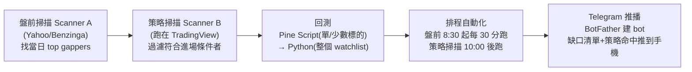

# 用 Claude Code + TradingView 蓋一條「盤前交易計畫」流水線(Humbled Trader 實作)

> 一支英文實作影片(Humbled Trader,約 31 分鐘):一位**自稱完全不懂程式**的十年全職交易者,用 **Claude Code + TradingView 桌面版 + Python**,從零搭出一條完整的**盤前交易計畫流水線**——盤前缺口掃描 → 策略掃描 → Pine Script/Python 回測 → 排程自動化 → Telegram 推播到手機,最後加碼示範 TradingView 自家 beta 的「Remix AI」。
>
> 整理自 YouTube 自動英文字幕。**⚠️ 非投資建議**;作者自己反覆強調的核心金句:「**AI 不會自動讓你賺錢;沒有真實交易經驗,AI 產出的只是 slop(垃圾)。**」AI 只是放大你既有的 edge 的工具,不是策略生成器。

---

## 一句話總結

**這不是「叫 AI 幫我選股」,而是「把我這個老交易員的盤前 SOP 用 AI 自動化」。** 價值在於那條**可重複、可排程、會主動推播**的流水線,而策略本身(趨勢跟單 trend-join long)只是個讓你照著改的「起點 foundation」。作者誠實點出每個環節的限制與繞法,值得當成「散戶版 Loop」的範本(對照 [[loop-engineering]] 的「心跳 + 自動驗證 + 推播收件箱」)。

---

## 環境前提(作者踩過的坑)

| 項目 | 要求 / 坑 |
|---|---|
| Claude | 裝 **Claude Code 桌面版**;訂閱**至少 $20/月**才夠用(作者本人用 $100 Max plan) |
| TradingView | **必須桌面版(不能用 web)**;需付費訂閱(最便宜 essential 約 $13–15/月)才能做連線 |
| 作業系統 | 作者實測 **MacOS 才接得起來**;Windows 桌面版檔案格式不同接不起來——「我不是技術人,遇到問題就叫 AI 幫我解」 |
| 連線方式 | 複製作者 blog 上的 prompt 到 Claude Code 安裝 **TradingView MCP**(來自一個 ~2.9k stars 的開源 repo);裝完**重啟 Claude**,新 session 跑 `TV health check` 確認連上 |

> 連上後 Claude 能**讀取圖表的 candlestick 與背後 source code**、**即時切換時間框架、在圖上畫線標註**(示範:幫 Intel 畫 52 週高低、日內高低、盤前高低)。

---

## 流水線五步拆解

### ① 盤前缺口掃描(Scanner A)
- 目的:每天開盤前掃出**當日 top gappers**(大漲缺口股)。
- 作者的篩選條件(可自調):**較前日跳空 >5%、股價 >$3、盤前量 >50K**。
- 資料源:tickers 與漲幅抓 **Yahoo Finance**,新聞催化劑(catalyst)briefing 抓 **Benzinga**。
- 輸出格式:`ticker / 價格 / 缺口% / 一句催化劑`,每天存成一個**帶日期的 JSON 檔**。
- **關鍵繞法**:TradingView 連線**不能一次掃全市場**,只能掃「你指定的一籃子股票」。所以作者用「先用外部資料源做廣掃(Scanner A)、再把結果餵進 TradingView 策略掃描(Scanner B)」這招繞過。

### ② 策略掃描(Scanner B,跑在 TradingView 上)
- 讀 Scanner A 的結果,逐一判斷哪些**符合進場/出場條件**。
- 作者的 trend-join long 五條件(全中才觸發進場):①只在**早上 10:00 後**跑、②價格 > 昨日日線高、③昨收 > 200 SMA、④價格 > 今日盤前高、⑤價格 > 今日日內高(=高位突破、追強勢)。
- **與 Scanner A 的差別**:Scanner B **必須跑在 TradingView**(這就是 Claude↔TradingView 連線的用武之地),且 **TradingView 桌面版要開著、charting 分頁要 active**。

### ③ 回測:Pine Script → Python
- **Pine Script(在 TradingView 上)**:叫 Claude「用 Pine Script 回測剛剛的策略,MU 五分鐘線跑到底」。它會自動建一支 Pine 策略,給出每筆交易、淨 P&L、勝率、profit factor 等。示範:MU 14 筆 +$1,200、profit factor 2.48(但作者強調**只是單一標的、且 AMD 那段本就特別強**,別過度樂觀)。
- **痛點 → 換 Python**:Pine Script **能回測的標的數有限**。於是叫 Claude「改用 Python 回測同一策略,擴展到我 watchlist 的 ~30 檔、最近 30 天」。Python 版**快很多**,一次跑完 32 檔、$10,000 帳戶、勝率 54%。
- **誠實話**:這只是「foundation strategy」,條件很嚴(交易筆數少、但作者偏好高勝率高報酬);**真正的工作是交易者自己進去改進場規則、跨更多標的測試**。作者自己也還在迭代。

### ④ 排程自動化
- 叫 Claude 把兩個 scanner 排程:盤前掃描**8:30 起每 30 分跑一次到 14:00**(一天 12 次);策略掃描**10:00 後才開始、比盤前掃描晚 5 分鐘跑**(因為要吃前者結果),跑到 14:30。
- Claude 約 5 分鐘就排好,並列出所有 job 時程與產生的檔案。

### ⑤ Telegram 推播到手機
- 叫 Claude 把每次排程跑完的結果**用指定格式推到 Telegram**(Scanner A 缺口清單 + Scanner B 命中清單)。
- 設定法:在 Telegram 搜 **BotFather → 建新 bot → 取得 token → 丟給 Claude** 存起來;記得**主動對 bot 按 start** 啟用。
- 成果:每天 8:30 收到「盤前 gapper 預覽(ticker/漲幅/催化劑)」,10:00 後收到「trend-join long watchlist(候選命中)」,盤中每 30 分更新。

---

## 加碼:TradingView 自家「Remix AI」(public beta)

- 作者做完才發現 TradingView 推了 beta 的 **AI Chart Co-pilot / Remix**(需裝 Chrome 擴充、一樣要付費訂閱)。
- 優點:**回測能跑的標的比 Claude+MCP 多很多**(可一次跑 watchlist 90 天、15 分線);也能直接生成盤前缺口掃描。
- 限制:**不能排程、不能推 Telegram**——只能每天早上**手動 on-demand 跑**。「Claude 那邊的某些限制 Remix 能解,但 Remix 又有它自己的限制。」

---

## 最大限制 & 作者的下一步

- **Pine Script 只能回測,不能把策略變成自動下單系統。** 作者說他已經在用 **Interactive Brokers API** 實單跑這套回測過的策略,下一支影片會講 step-by-step。
- 反覆強調的底線:**「AI 不能讓你賺錢;你這個人還是得學會怎麼交易、得有自己的策略。」**

---

## 應用案例 / 可借鏡之處

- **「廣掃用外部資料、精篩用 TradingView」的兩段式繞法**:任何「平台不能一次掃全市場」的限制,都可以用「便宜的外部廣掃 → 把候選餵進貴/受限的平台精算」來繞——這招通用。
- **把盤前 SOP 寫成 prompt 流水線**:你每天手動做的「掃缺口→看催化劑→過策略條件」,只要規則明確就能交給 Claude 排程 + 推播,人只負責**看推播做決策**(正是 Loop Engineering 的「自動驗證 + 收件箱」精神,見 [[loop-engineering]])。
- **回測引擎按需求換**:標的少用 Pine Script(圖上直觀),標的多就請 Claude 改寫 Python(快、可批次)——對照 [[ai-algo-trading-claude-jesse]] 強調的「重點是可重複的驗證流程,不是那支策略」。
- **本筆記讀者(你)的對照**:你本機已接 TradingView MCP,影片這套「Scanner A→B→回測→排程→Telegram」可直接當你自建盤前流水線的藍圖;但務必記住作者的 caveat——**先有交易經驗,AI 才是放大器**。

---

## 來源

- Humbled Trader,〈I Built an AI Trading System With Claude + TradingView〉,YouTube:<https://www.youtube.com/watch?v=IqvnryFzZD4>(2026-06-06)
- 內容整理自該片**英文自動字幕**(逐字稿經去重整理,非官方人工字幕,可能有少量辨識誤差)。作者的 prompt 與連結放在其 blog(影片說明欄)。
