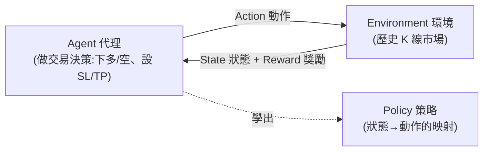

# 用 Python 做強化學習交易機器人:在 EUR/USD 外匯訓練 AI Agent

> 來源:CodeTrading〈Reinforcement Learning Trading Bot in Python | Train an AI Agent on Forex (EURUSD)〉。用 Python + Gym + Stable-Baselines3(PPO),在 EUR/USD 小時線歷史資料上訓練一個**強化學習(RL)交易 agent**:讀價格、下多空、設停損停利、從輸贏中學出策略——很像人類交易者靠經驗試錯進步。本筆記整理它的 RL 概念、四個 Python 檔的程式架構,以及最重要的——**樣本外結果為何不如預期、給了什麼真實教訓**。

> ⚠️ **非投資建議。** 本筆記與影片皆為**教育用途**,聚焦演算法交易、AI 與強化學習的觀念與實作,不構成任何投資建議;範例結果不代表實盤可行。

---

## 一句話總結

RL 交易 agent 的本質,是把「交易」變成一個**「試錯 + 獎勵」的學習問題**:agent 在歷史資料的環境裡反覆下單,賺錢給正獎勵、賠錢給負獎勵,慢慢調出一套讓權益曲線上升的策略(policy)。它**很有潛力但很難 fine-tune**——因為**市場資料噪音極大,模型很難從噪音裡抓到真正的信號**。影片最誠實的一課:在訓練資料上漂亮上升的權益曲線,換到**樣本外資料就不如預期**。

---

## 強化學習的五個核心概念(套到交易)

| 概念 | 在交易裡是什麼 |
|---|---|
| **Agent(代理)** | 做交易決策的模型:下多單/空單、設定停損(stop-loss)與停利(take-profit)距離 |
| **Environment(環境)** | agent 操作的地方——這裡是歷史 K 線市場 |
| **Action(動作)** | agent 能採取的操作(不交易 / 做多 / 做空,搭配 SL/TP) |
| **Reward(獎勵)** | 依動作結果給正或負值(與盈虧成正比) |
| **Policy(策略)** | agent 目前學到的「狀態→動作」決策模式 |

> **類比訓練狗:** 狗做對給獎勵、做錯獎勵為零或負。但 **AI agent 沒有對獎勵的內在動機**,是被「**寫死成去最大化獎勵值**」——某動作拿到更多獎勵,未來它就被賦予更高機率。(這正呼應 [[sutton-enactive-ai]] 裡爭論的「獎勵假設」——RL 的好壞由外部獎勵函數定義。)這是 **model-free** 方法:agent 不靠環境地圖,直接從互動的試錯中學。

---

## 程式架構:四個 Python 檔

不用 Jupyter,拆成四個檔案。訓練資料 EUR/USD 小時線 **2020–2023**,樣本外測試 **2023–2025**。

| 檔案 | 做什麼 |
|---|---|
| **`indicators.py`** | `load_and_preprocess_data(csv)`:讀 CSV、清理、排序,用 pandas-ta 加技術指標——**RSI14、MA20/MA50、ATR、MA20 slope**(其實只是相鄰兩根均線值的差,不是真迴歸斜率)。**想改良就在這裡加自訂指標。** |
| **`trading_environment.py`** | 定義 `ForexTradingEnvironment`(繼承 `gym.Env`)。`window_size=30`(讀最近 30 根 K 含指標再決策);停損選 **60/90/120 pips**、停利選 **60/90/120 pips**(數值是隨意設的);action:0=不交易、1=做多或做空;起始 equity **$10,000**;`get_observation` 回傳最近 30×特徵的 numpy 陣列;`calculate_reward` 用每筆 PnL(正獎勵=PnL×10000,負則為負);`reset` / `render`(畫權益曲線)。 |
| **`train_agent.py`** | 用 **Stable-Baselines3 的 PPO**;`DummyVecEnv` 包裝;`total_timesteps=50000`;訓練後存成 `model_eurusd.zip`。 |
| **`test_agent.py`** | 載入存好的模型,在 **2023–2025 樣本外** 資料上**只交易不訓練**(deterministic predict),畫權益曲線。 |

**幾個務實細節:**
- **停損停利同根 K 都被觸及怎麼辦?** 不用 tick 資料就不知道誰先觸發 → **保守一律當成虧損**(給負獎勵),不自欺。
- **為何用 PPO**:交易資料噪音大、連續,PPO 是這類金融場景較合適的模型之一。
- **動作選項越多 → 訓練越久、算力越貴**,所以範例刻意保持最簡。

---

## 結果與真實教訓

- **訓練資料**:權益曲線穩定上升——agent 學會跟著正獎勵的動作走,建出讓 equity 隨交易增長的 policy。
- **樣本外(2023–2025)**:**不如預期**(但「不算太差」)。作者誠實點出原因與改進方向:

| 問題 | 改進方向 |
|---|---|
| 特徵太少(只有幾個經典指標) | 加更多/自訂、對交易真正有資訊量的指標 |
| 停損停利選項太少(只有 60/90/120) | 更細的級距(如 30–100 pips,每 5 pips 一檔) |
| 50,000 timesteps 可能**過擬合** | 試 10,000 steps(影片實測:換 10k 後樣本外曲線略不同、前期偏正) |

> **核心教訓:** **RL 用於交易很有潛力,但不好 fine-tune——因為市場噪音極大,模型常難從噪音中抓到真正的趨勢信號。** 在訓練集漂亮 ≠ 樣本外能用,**樣本外驗證才是關鍵**。

---

## 應用案例 / 怎麼用這份知識

- **想自己動手玩**:下載影片的四個 Python 檔,從 `indicators.py` 換成你自己的指標、在 `trading_environment.py` 調 SL/TP 級距與 reward 設計、在 `train_agent.py` 調 timesteps,**親眼看參數如何即時影響權益曲線**——這是理解 RL 與過擬合最快的方式。
- **把它當「驗證流程」的教材**:這支影片最有價值的不是那個策略,而是它示範了「**訓練集表現好但樣本外打回原形**」這個演算法交易的核心陷阱。要把策略當真,必須做嚴謹的樣本外/前推驗證——這與本庫 [[ai-algo-trading-claude-jesse]](用 Claude Code + Jesse 做 AI 演算法交易,重點是顯著性檢定→回測→Monte Carlo→樣本外)是同一個信念:**重點是驗證流程,不是那支策略本身。**
- **觀念校準**:RL agent「沒有內在動機、被寫死去最大化獎勵」——所以**獎勵函數的設計(reward shaping)決定了它學到什麼**;reward 設不好(如沒處理 SL/TP 同觸、沒考慮交易成本/滑價),學出來的策略會在實盤崩掉。
- ⚠️ 再次提醒:**外匯/槓桿交易風險高,RL bot 在樣本外尚且不穩,切勿據此實盤;非投資建議。**

---

## 來源

- CodeTrading,〈Reinforcement Learning Trading Bot in Python | Train an AI Agent on Forex (EURUSD)〉,YouTube:<https://youtu.be/oW4hgB1vIoY>(2025-12-12)
- 用到的工具:Python、pandas / pandas-ta、OpenAI Gym(`gym.Env`、observation/action spaces)、Stable-Baselines3(PPO)、`DummyVecEnv`。
