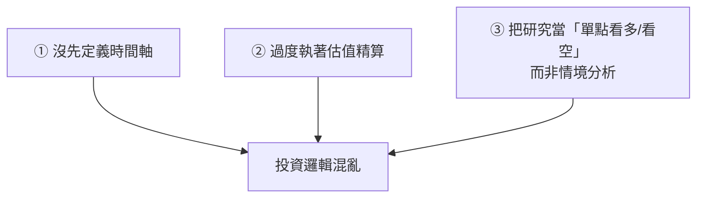

# 別再相信目標價:前外資分析師拆解法人到底在看什麼

**主題分類:** 投資 / 法人視角與投資心法
**來源:** YouTube《下班經濟學 721》〈別再相信目標價?前外資分析師:破解法人不能說的秘密!ft. 余鎮文 Vincent〉(風傳媒 The Storm Media,2026-05-04,約 25 分;依繁中逐字稿整理)
**整理日期:** 2026-05-28

> ⚠️ **聲明:** 觀念分享、非投資建議。講者 Vincent 為前 JP Morgan 分析師(11 年)、曾任 long-short 避險基金,2024 年離開法人、現為個人工作室。

---

## 1. 最重要的一句:目標價完全不看

> 「**目標價是最不重要的事情**——你想調多少就調多少。」

法人看賣方報告時,真正在意的是兩件事:

1. **分析師「想法的改變」來自哪裡:** 他變更樂觀還是更悲觀?背後的 **證據與事實** 是什麼?把報告拆成 **事實 vs 意見** 來讀。
2. **賣方知道什麼、與自己想法的落差:** Buy side 自己也分析;去蒐集「賣方現在知道了什麼」,**兩者的落差往往就是 generate alpha 的機會**。

**市場共識(consensus)** 也不是「目標價共識」,而是 **營收/獲利預估** 的共識(如 Bloomberg 把所有賣方未來 2–3 年估值彙整成平均/中位數)。真正關鍵是 **預期差**:股價要續漲,實際表現必須 **超過共識**;放空則期望 **低於共識**。

---

## 2. 散戶最常犯的三個錯誤

1. **沒先判斷時間軸:** 看 **3–6 個月** → 只在意 **新聞熱點與 incremental(邊際)改變**(假設現況大家都知道,只在意「變更好/更壞」);看 **3–5 年** → 不必在意短期熱點,要看 **競爭結構、護城河有無改變、估值是否到了該下手的點**。**時間軸應是你的第一考量。**
2. **過度執著估值技巧:** 估值是 **藝術**——「**我寧願大略地對,也不要很精細地錯。**」DCF 假設太多,動一點就能算出不同目標價;抓最重要的幾個點就好。**最大的機會常來自「估值方法的改變」**(見下節記憶體案例)。
3. **把研究當單點報告(看多/看空):** 更重要的是 **情境分析(What if)**——無法準確預測未來,但要有一本 **行動手冊**:「如果發生 X,我就做 Y」,多條路線事先備好。

---

## 3. 應用案例:記憶體如何從「循環股」變「成長股」(估值方法改變)

- **舊框架:** 記憶體是 **景氣循環股**,用 **PB(股價淨值比)** 看,交易在約 **0.6–0.8 倍 PB**(PB 看 downside / 最慘情況,低點買、回到不錯點賣)。
- **新爭論:** AI 循環下記憶體成了關鍵零組件、結構性供需緊張、年年賺錢且擴產後仍有好價格 → 應改用 **成長股** 角度,給 **PE(本益比)15–20 倍**(PE 看未來展望)。
- **兩者心態完全不同**——能在估值上保有彈性、知道方法的限制,才抓得到這種「估值重評」的大機會。

**情境分析範例(需求破壞):** HBM 太熱 → 產能被挪去做 HBM → 其他記憶體價格續漲 → PC/手機吃不起 → 下修出貨量(需求被移走);又如 Google 一篇宣稱能降低 **KV Cache** 需求的論文(他記得叫 TurboQuant,**後來發現有烏龍成分**)。重點:**當價格/利潤高到一個程度,客戶一定會用技術改革或規格調整來少用它 → 「需求破壞」**。所以別只看「現在供不應求就以為會持續很久」,要一直想 **什麼會改變這個供需狀態**。

> 註:這裡的 KV Cache 正是 [[kv-cache]] 講的那個推論期快取——記憶體需求與 LLM 推論成本直接相關,是「技術細節↔投資供需」的好例子。

---

## 4. 總經視角:遛狗理論與 AI 生產力循環

- **科斯托蘭尼「遛狗理論」:** 主人=經濟體、狗=市場;狗時而跑前(漲過頭)、時而落後,但 **始終牽著線、在主人掌握中**。
- **AI 是十年/百年一見的生產力循環**:主人(經濟)可以走更快,所以狗(市場)現在跑前一點是被未來生產力提升所支撐的——Vincent **不那麼悲觀**。
- **黃仁勳的 AI 五層:** 能源 → GPU/晶片 → 基礎建設 → 模型 → 應用。過去 2–3 年是大 CSP(Google/Amazon/Microsoft)的巨大資本開支循環;市場擔心「資本開支是否到盡頭」——用棒球比喻 **可能才第三局**。
- **要警覺的訊號:** ① AI 落地速度(AI 原生公司一張白紙、調整快;老公司要改工作流、慢);② **分化**(不只模型層,連底層也會,如 SpaceX 的太空資料中心若 cost/token 低於地面就改變競爭格局);③ **私人信貸市場**——AI 循環很大一筆錢靠信貸,若收益不好、借出去的錢拿不回或「剃頭」,會傳導到整體金融市場。

---

## 5. 應用案例:他自己怎麼配置(以及散戶的真正優勢)

- **為何 60–70% 放大盤被動 ETF:** 在法人時,能力圈被資源放大(見得到 CEO/CFO、有賣方服務);變回個人後能力圈變小。**ETF 最大價值=用很低成本「不掉隊」**——維持資產排名、心裡踏實、不會操作錯造成家庭財務壓力。買 **大盤被動型**(不買產業型 ETF,因為那等於你已在表達板塊輪動觀點、要花更多心思)。留 **30–40%** 滿足選股慾望。
- **散戶相對法人的兩大優勢:**
  1. **機動靈活:** 法人建一個部位可能要兩週(流動性限制);個人一兩天就佈好,**有很多「吃豆腐」的空間**。
  2. **能果斷改變想法:** 法人分析師改推薦有職涯風險、得有技巧地、慢慢地溝通壞消息以維持信任;散戶 **沒這顧慮,可以殺進殺出、果斷轉向**。

> 落地心法:**先定義時間軸 → 用對的估值框架(並留意框架本身會不會被重評)→ 備好情境行動手冊 → 看報告只看「想法改變+事實」不看目標價 → 用大盤 ETF 守住基本盤、用小部位發揮靈活優勢。**

---

## 來源

- [YouTube《下班經濟學 721》:別再相信目標價?前外資分析師 ft. 余鎮文 Vincent(風傳媒)](https://youtu.be/Ec1jRVQ_YZU)
