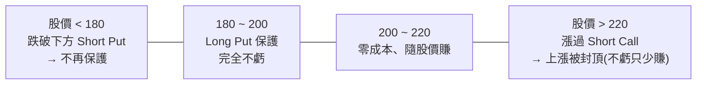

# 海鷗策略(Seagull):牛市中「不踏空又不怕跌」的三腿期權對沖

> 整理自 YouTube「美投讲美股(美投君)」〈高手是如何在牛市中赚钱的?1招让你告别踏空,无惧下跌!〉(2026-06-14,約 22 分鐘)。主題是用 **海鷗(Seagull)三腿期權策略**,在牛市持股的同時對沖短期回撤——既不必擔心離場踏空、也不必硬扛下跌。
>
> **⚠️ 非投資建議**,僅為觀念與策略結構的整理;選擇權有時間價值與尾端風險,操作前請自行評估、用測試/小額驗證。內文已濾掉影片中的期權課程廣告段落。

---

## 一句話總結

**海鷗 = 1 張 Long Put +(在更低履約價)1 張 Short Put +(在更高履約價)1 張 Short Call**,用兩張「賣方腿」收的權利金,去抵掉那張「買來保命」的 Long Put 的成本,**把對沖做到接近零成本**。代價是:**犧牲一部分上漲潛力(漲過上方 Call 不再多賺)+ 犧牲一部分保護深度(跌破下方 Put 不再保護)**,換取「低成本、高容錯」。它是**對沖(hedge)**,不是做空——前提是你**手上要有 100 股正股**要保護。

> 高手投資不只是「牛市賺錢」,而是「**安心賺錢**」:即便判斷錯,也不傷筋骨、不造成不可挽回的損失。海鷗正是這種**容錯極高**的策略。

---

## 為什麼需要它:牛市的兩難

2 個月反彈近 35%、AI 基礎層公司翻倍,但風險同時累積(通膨抬頭、地緣風險、AI 也面臨質疑);上週五美股單日大跌 5%。現階段持股(無論大盤指數或個股)都不踏實:**離場怕踏空大牛市,加碼又怕實實在在的回檔。** 海鷗讓你「不動正股、用更靈活的期權對沖」,避開「賣早踏空 / 賣晚承擔損失 / 賣了不知何時買回 / 頻繁買賣觸發稅務」這一堆麻煩。

---

## 結構與損益:從 Protective Put 加兩條腿

最原始的對沖是給 100 股買一張 **Protective Put**(保護性賣權),但**太貴**——例:NVDA 一個月到期的 ATM(價平)Put 要約 $1000,股價沒跌這 $1000 就打水漂。海鷗就是在這張 Long Put 上**再加兩條賣方腿**來把成本補回來:

**範例(NVDA 股價 200):**
| 腿 | 動作 | 履約價 | 權利金 |
|---|---|---|---|
| ① Long Put(買,保命) | 買 | 200(ATM) | −$1000 |
| ② Short Call(賣,在上方) | 賣 | 220 | +$500 |
| ③ Short Put(賣,在下方) | 賣 | 180 | +$500 |
| **合計成本** | | | **≈ $0** |

**效果**:股價 200→180 的這段**完全保護、一點不虧**;跌破 180 就保護不到。股價上漲沒關係,因為零成本照樣賺;但漲超過 220 的那部分賺不到(被封頂,**只是少賺、不會虧**)。

> **關鍵認知**:所謂「零成本」其實不是真的免費——你是**犧牲了一部分上漲潛力 + 一部分保護深度**去換來零成本。配置時這點必須清楚。

---

## 三個真實案例(作者自述,均為對沖整體或個股)

**① 2026-03-09 伊朗戰爭、油價飆升(對沖整體持倉)**
判斷市場低估戰爭與油價通膨風險。**用 QQQ 海鷗對沖整體倉位**(把持倉想成等同 QQQ 正股):QQQ ~600,買 2 張 ATM 600 Long Put(各 $720),上方賣 620 Call、下方賣 580 Put → 成本壓到**每張 $180(−75%)**,到期一個月。結果到期 QQQ 跌到 **563**,達到最大收益、**賺 $3640**(等於幫他彌補 $3640 虧損)。**局限**:600→580 保護得好,但 588→563 這段(超出預期的跌幅)就沒保護了——海鷗的問題就是「超預期的那部分無法保護」。

**② 6 月初 加息威脅(對沖整體持倉,結果沒跌)**
QQQ ~710,買 2 張 ATM 710 Long Put、上方賣 750 Call、下方賣 680 Put → 成本約 **$300**,保護 710→680。錄影時 QQQ ~720(**沒跌**)。**這算失敗嗎?不**——海鷗是對沖、不是做空;整體持倉沒跌本來就該高興,而成本只有 $300、可損失空間很小。**只要 QQQ 在 680–750 大區間內波動,都是最理想情況**,能安心抱股。需警惕:跌破 680(保護不夠)或漲過 750(少賺上方,**紀律:漲過 750 立刻關倉**——通常漲過上線也代表風險已消散)。

**③ (計畫中)Tesla 個股海鷗**
Tesla 是長期持倉,短期面臨 SpaceX 上市的虹吸效應 + 宏觀壓力、且短期缺催化劑。Tesla ~400,做一個月 **360 / 400 / 450** 的海鷗,按週五價格只需約 **$200 權利金**,保護約 **$4 萬**的 Tesla 倉位:擔憂兌現可彌補下方約 **10%** 虧損,判斷錯了上方仍有約 **15%** 上漲空間不受影響——**進可攻、退可守**。

---

## 實操四要點

1. **正股選擇**:理論上任何正股都可做海鷗對沖,沒特別限制;**唯一前提是你必須持有 100 股正股**(這是要對沖的標的)。若沒有正股還做一樣的海鷗,那叫「用海鷗看跌」,思路完全不同(不在此討論)。
2. **到期時間**:**別選太長,建議最長不超過一個月**。時間太長時持有過程價格變化很小,而且很多對沖效果要等**接近到期**才會徹底釋放;長天期反而增加不確定性、得不償失。
3. **行權價**:第一步先選最重要的 **Long Put = ATM(價平)**(既要對沖,就從現價開始保護最合理);再選下方 Short Put 的距離(=你要保護的跌幅,如 10% 就擺在跌 10% 的位置);最後依「股價若不跌、最高能漲到哪」去選上方 Short Call。**不必執著零成本**——花點小錢維持心理踏實是有價值的,只要對上下極值的幅度安心就夠。
4. **後續處理**:正常**持有到到期**(保護的是這段時間的價格,不是投機)。兩種特殊情況:
   - **暴漲、漲過上方 Short Call** → 這是海鷗最大風險,**通常直接關整組倉**(漲過上線往往代表風險已消散);若仍要對沖,**關掉整組再開新的,別只 roll 單一條腿**(各腿到期時間不同會讓未來風險難控)。
   - **暴跌、跌破下方 Short Put** → 一般**不做處理、等到期**(沒等到期達不到最大收益);覺得對沖強度不夠就**再加一個對沖**即可。

---

## 應用案例 / 怎麼用這套思路

- **持有想長抱、但短期有明確風險事件的標的時**(財報、重大事件、加息、地緣)→ 不必賣股,用海鷗在「一段時間 + 一個跌幅區間」內做針對性保護,事件過了就關倉。
- **整體倉位想對沖** → 把持倉視為等同某大盤 ETF(如 QQQ),直接做該 ETF 的海鷗(免得逐檔對沖)。
- **配置心法**:先定「下方要保護多少%」(Long Put=ATM、Short Put 擺在該跌幅),再定「上方願意讓出多少漲幅」(Short Call)。**不必硬湊零成本**;天期一個月內;漲過上方 Call 就按紀律關倉。
- **它的價值在「容錯」**:你不需要精準擇時(不必知道何時跌何時漲),即便判斷錯,損失也只是那點權利金(或少賺封頂的上漲),**持股體驗大幅變好、間接讓你少犯不必要的錯**。
- **底線**:海鷗的對沖**不會讓你虧錢,衝擊量就只是手續費/權利金**,把風險控制在可控範圍。呼應巴菲特:「**第一條,不要虧錢;第二條,永遠別忘記第一條。**」

> 延伸:對照本庫 [[selling-earnings-volatility]](賣財報波動率:選擇權策略與真正的風險)——同樣強調「期權不是賭博,是管理風險/部位的工具箱」與尾端風險意識;以及 [[trading-math-expectancy-variance-risk]](控風險求生存、容錯比擇時重要)。

---

## 來源

- 美投讲美股(美投君),〈高手是如何在牛市中赚钱的?1招让你告别踏空,无惧下跌!〉,YouTube:<https://www.youtube.com/watch?v=ByBLjNA3MvY>(2026-06-14)
- **該片無字幕,逐字稿以 CPU 版 faster-whisper(`vad_filter=True`,small 模型,zh)轉錄取得,非官方字幕**;選擇權專有名詞(Long/Short Put/Call、ATM、Protective Put、Seagull)與案例數字(QQQ 600/580/620、563、$3640;710/680/750;Tesla 360/400/450)依語音還原,可能有少量聽寫誤差,實際以原片為準。**非投資建議**;內文已略去影片中的期權課程廣告。
