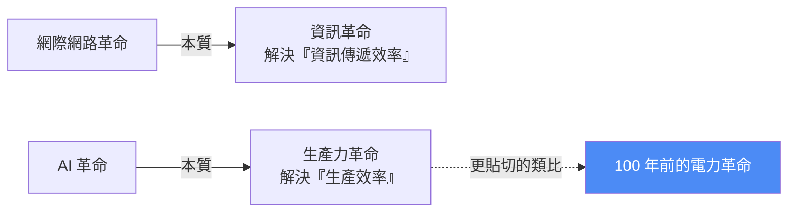
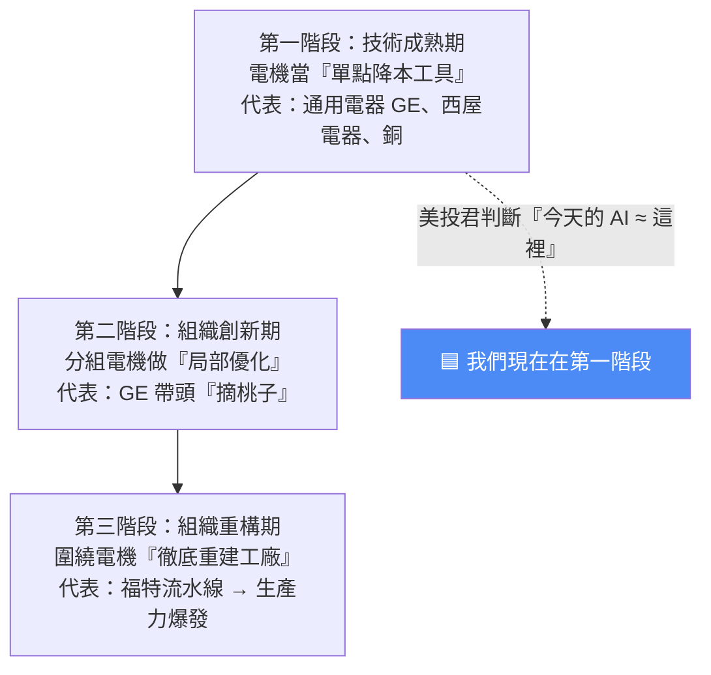

# AI 像 100 年前的電力革命:真正的商機不在「AI 應用」,而在「AI 採納」(美投君)

> ⚠️ **本筆記為觀念與產業框架整理,非投資建議。** 內容為美投君(美投讲美股)個人觀點的摘要,提及個股僅為說明框架,不構成買賣建議;投資有風險,請自行判斷。
> 📝 該片無字幕,逐字稿以 CPU faster-whisper 轉錄取得、非官方字幕,可能有少量聽寫誤差。

---

## 一、核心命題:為什麼 AI 這麼強,企業生產力卻沒質變?

美投君的開場疑惑:AI 作為劃時代技術,單點能力(寫程式、做數據、生成內容)明明已經遠勝從前,**但商業上卻幾乎看不到哪家企業因為用了 AI 而生產效率爆發**。這是為什麼?下一個大機會又在哪?

他的關鍵主張:**大家最愛拿 AI 類比「網際網路革命」,但這個類比並不貼切、甚至誤導。**

於是他去翻了電力革命的歷史,想從中找到今天 AI 發展的蛛絲馬跡——結果找到大量相似之處,不只解釋了今天的「不合理現象」,更指出了未來的方向與投資機會。

---

## 二、歷史對照:電力革命為什麼「拖了十幾年」才爆發?

### 起點:1882 年,但早期電力≈早期 ChatGPT

- 公認的電力元年是 **1882 年**,愛迪生在曼哈頓建起「珍珠街發電站」,主打產品是**電燈**。
- 但早期電燈就像**早期的 ChatGPT**:讓人眼前一亮,卻**跟提升生產力還沒什麼關係**。
- 真正的生產力,得等**電動機(電機)進入工廠**才開始。

### 卡關:換了心臟,身體還是舊的

100 多年前美國最核心的產業是製造業,工廠當時以**蒸汽機**為動力。新發明的發電機/電機效率遠勝蒸汽機(最早期就能省下約 20% 煤炭成本),照理說用電機替代蒸汽機是「再自然不過」的事。但:

- **1899 年**(第一座發電站的 17 年後),採用電機的工廠只有可憐的 **5%**;
- **1909 年**也不過 **25%**;
- 更慘的是,連那些採用了電機的工廠,**效率提升也乏善可陳**。

> 🔎 **這正是今天 AI 的翻版**:企業都說自己「在用 AI」,但真正鋪開用的少之又少(除了 coding 等少數領域),而且**幾乎沒幾家公司因為用了 AI 而生產效率爆發**。如出一轍。

**原因:「天軸傳動(line-shaft)」的舊架構。** 蒸汽機時代,整廠靠**一台巨大蒸汽機**供動力,天花板上架設數千英尺的傳動軸與皮帶,把動力統一輸送到各機器。電機來了,工廠只是把大蒸汽機拆掉、**換上一台大發電機**,其餘照舊。問題在於:

1. **省的成本有限**:煤只佔工廠總成本不到 5%,費大勁只省一點,資本家不買單。
2. **舊架構拖累新動力**:蒸汽機工廠是「全有或全無」——蒸汽機一開,所有機器一起轉;傳動軸或蒸汽機任一零件壞了,**整廠停產**。機器擺放、運行模式全繞著蒸汽機的物理限制而建。
   - 美投君的比喻:**給垂暮老人換一顆年輕的心臟,讓他跑 1000 公尺,還是跑不了**——因為肌肉、骨骼、神經整套系統都老了。問題不只在「動力源」。

### 破局:分組驅動 → 流水線 → 咆哮的 20 年代

工程師發現電機和蒸汽機的根本差異:**蒸汽機的動力被固定在某個物理位置,電卻能透過電線送到工廠任何角落。** 於是新架構誕生:

- **分組驅動 / 單機驅動電機(unit drive):** 不再是一台大電機帶全廠,而是**一個車間、一組、甚至每一台機器各配一顆獨立電機**。

這一點小改變帶來想像不到的效率躍升:

| 舊(天軸傳動) | 新(分組/單機驅動) |
|---|---|
| 機器位置被蒸汽機物理限制綁死,原料/半成品在廠內搬來搬去 | **機器位置改成跟著「生產流程」走**,大幅提效 |
| 擴廠困難:多加一兩台機器,蒸汽機可能就帶不動 | 隨手加顆電機帶幾台設備,**輕鬆擴產** |
| 全有或全無:週末加班或某機故障就得全開/全停 | **局部開關、局部檢修**,不必全廠停產 |

把這套玩到極致的就是 **福特(Ford)**:融合單機驅動 + 從屠宰場借來的**流水線**理念,造車效率暴增 → 車價大降、銷量爆發 → 福特成為全球第一大汽車公司 → 引爆整個美國製造業 → **1920 年代生產力史無前例大爆發,史稱「咆哮的 20 年代(Roaring Twenties)」**。

> **一句話總結歷史教訓:** 電力革命真正的爆發點,不在電機的發明、也不在蒸汽機的替代,而在**工廠組織架構圍繞電力的徹底重構**。技術創新只是前提,**組織重構才是爆發的關鍵**。

---

## 三、三階段模型:我們現在在哪?

美投君把電力革命的三大困難,對應成三個階段——並用來定位今天的 AI:

**三大困難(也是為何拖十幾年):**
1. 更小的電機技術上不好做,加上配套設施佈局,技術落地花很長時間。
2. 對單一企業主而言**可見回報不高**(只看到省的那點煤),得等「第一個摘桃子的人」跑通,別人才看得清 → 早期採納動力不足。
3. 最關鍵:**改動成本太高**。舊工廠都以蒸汽機為核心而建,要拋棄能賺錢的老廠、按電力邏輯重建新廠,沉沒成本太大,沒明確回報前沒老闆願意試。

### 各階段的「受益者」對照今天

- **第一階段(技術成熟期)= 今天最接近的階段:**
  - 當年受益的是**電力設備公司(GE、西屋)**——不管哪家工廠改造成功、哪種用電方式勝出,發電機/電機/變壓器總歸要用 → **對標今天的 AI 大模型廠**(不管企業組織怎樣,只要大家還在探索 AI,模型用量就停不下來)。
  - **銅(及絕緣材料、碳製品):** 電走到哪、銅鋪到哪,是當年確定性最高的上游,且當時做高品質銅有技術壁壘 → **對標今天的 AI 基礎層半導體**。
  - **⚠️ 煤炭的反例(重要):** 煤炭當年也是典型基礎層(用電必燒煤),早期表現不錯,**卻成了 20 年代大牛市裡最蕭條的行業**。原因:①能效大幅提升(每度電耗煤從 1900 年代的 6 磅多,降到 1930 年前後的 1.5 磅,用煤量少 4 倍);②**替代能源出現**(石油、天然氣興起,發電轉向油電/水電)→ 煤炭徹底出局。
    - **教訓:不是所有「技術層/基礎層」公司都能在革命中持續利好;那些互相能替代、容易被取代的技術層公司,很容易被技術革新與新競爭者衝擊。** 放到今天的 AI 技術層,「想必各位心中也有答案」。
- **第二階段(組織創新期)= 通用電器:** GE 不只賣設備、自己也有工廠,於是**當第一個摘桃子的人**,在自家工廠激進推分組小電機。當時股東覺得瘋狂(ROI 划不來),但 GE 硬幹——為了**給所有企業打個樣**,路一旦跑通,自家電機設備才能真正打開銷路(利益驅動 + 對組織創新的信念)。
- **第三階段(組織重構期)= 福特:** 圍繞電機徹底重建工廠、打造流水線,徹底釋放電力生產力,又給其他工廠再打一次樣 → 資本市場狂歡。

---

## 四、推論到今天:機會不在「AI 應用」,而在「AI 採納」

美投君的核心投資結論:

> **眼下最近的機會,反而不在於 AI 應用,而在於 AI 採納(adoption)。很多人找錯了方向。**

理由:現在所有組織都是**圍繞「人」搭建**的,而 AI 優化的是「人的腦力」,所以必須**圍繞 AI 重新搭建組織**才能真正釋放生產力。而人本組織天然不適用於 AI:

- **AI 需要、但人本組織做不到/不在意的:** 跨部門數據打通、每個任務的完整背景資訊(人類靠默契,AI 必須寫清楚)。
- **人本組織在意、但 AI 不在意的:** 專業分工(AI 什麼都會,不需分部門)、資訊物理隔離(AI 可同時處理大量資訊,降低溝通需求)。

這就解釋了「AI 明明很強卻遲遲不爆發」——**本質是組織架構問題**。大企業和 100 年前一樣猶豫,仍停留在「換蒸汽機」式的單點替代邏輯。

### 誰會率先跑出「AI 採納」?

破局需要一個先驅者率先摘桃子。美投君歸納先驅者三特點,並據此點名:

| 先驅者特點 | 說明 |
|---|---|
| ① 自身有足夠高的生產力提升空間 | 值得為它大動干戈 |
| ② 本身就是技術革新的引領者 | 有能力做 |
| ③ 有利益驅動 | 成功不只自己受益,還能擴展業務(如 GE 賣更多電機) |

- **他最看好兩家:**
  - **Anthropic ≈ 當年的通用電器(GE):** 手握最前沿革命性技術;若自己內部打通新組織形式,不只自身提效,還能賣出更多模型用量;且是三大模型中 **2B 基因最純粹**的,最可能完成轉型。
  - **Meta ≈ 當年的福特:** 看似是大科技中最不起眼的,但在 AI 採納上有得天獨厚優勢——**創始人掌控的公司**更可能做顛覆性改革;祖克柏本就酷愛「重構」;目前是內部應用 AI 最激進的公司之一(甚至不惜得罪員工、錄螢幕來訓練自己的 AI)。
  - **對比其他大科技:** Google / Apple / Microsoft / Amazon「大公司病」較重;Tesla 敢創新但組織重構的緊迫性不足、提效空間不及 Meta。
- **另一類受益者:幫別人實現「AI 採納」的公司**(順著現況正推):
  - **Palantir:** 透過前端佈署工程師(FDE)為每家企業客製化解決運營痛點——「你別自己搞 AI 採納了,我幫你搞」。
  - **數據打通/資安卡脖子環節:** 圍繞 AI 重構的重點是打通企業內部數據,但數據儲存/傳輸/安全是卡脖子問題 → **Cloudflare、CrowdStrike(網路安全)、Snowflake(數據庫)、ServiceNow(Agent 管理軟體)** 都是必不可少的一環,AI 採納需求上升,它們需求同步增加。
  - **做小模型的公司:** 大模型收集公司內部數據有權限/安全問題;若「每人一個小模型」收集個人數據、再按場景與權限分享,情況會好很多(但具體標的目前還看不清)。

### 價值先落在「存量」,再長出「增量」

從歷史看,生產力價值**先出現在存量**(給既有商業提效),之後才出現全新商業模式:電力先幫紡織、造車等蒸汽機時代既有行業提效,**之後**才長出冰箱、洗衣機這類全新應用。AI 亦然——所以「現在遠遠還沒觸及 AI 的最大價值」。

---

## 五、應用案例:這個框架怎麼用?

1. **判斷自己在週期哪一站:** 若你認同「現在是第一階段(技術成熟期)」,那麼**確定性最高的仍是賣鏟子的**(模型廠、AI 半導體),但要警惕「煤炭式」易被替代的技術層。
2. **選「AI 採納先驅」而非「AI 應用故事」:** 用三特點(提效空間×技術引領×利益驅動)去篩,美投君篩出 Anthropic 與 Meta;你也可以用同一把尺去檢驗任何一家喊「我們 All-in AI」的公司,看它是**真的重構組織**還是只是「單點替換」。
3. **佈局「賣鏟子給採納者」的一環:** 若相信 AI 採納會爆發,資安/數據庫/Agent 管理(CrowdStrike、Snowflake、ServiceNow、Palantir 等)是「不管誰勝出都要用」的水電煤。
4. **對自己公司/團隊的啟示(非投資):** 別只把 AI 當「幫某個部門單點提效」的工具——若組織流程、數據權限、協作方式仍圍繞人本設計,瓶頸(平頸)會卡死整體效率。真正的躍升來自**圍繞 AI 重構工作流**。

---

## 六、重點回顧(TL;DR)

- AI 是**生產力革命**,更該類比**電力革命**而非網際網路。
- 電力革命拖十幾年才爆發,關鍵不是換動力源,而是**組織架構重構**(天軸傳動 → 分組/單機驅動 → 福特流水線 → 咆哮 20 年代)。
- 三階段:技術成熟期(GE/西屋/銅=模型廠/AI 半導體)→ 組織創新期(GE 摘桃子)→ 組織重構期(福特爆發)。**今天的 AI ≈ 第一階段。**
- 最大機會**不在 AI 應用、而在 AI 採納**;瓶頸是組織圍繞「人」而非「AI」搭建。
- 先驅者三特點 → 最看好 **Anthropic(≈GE)** 與 **Meta(≈福特)**;幫別人採納的 **Palantir / CrowdStrike / Snowflake / ServiceNow** 是水電煤;警惕「煤炭式」易替代的技術層。
- 價值**先存量提效、再增量創新**。

---

## 來源

- 影片:[AI竟与100年前电力革命如此相似?90%的人都看错方向,历史已指明最大商机!(美投讲美股 @MeiTouJun,2026-07-12)](https://youtu.be/0kvj3lbJqoY)
  - ⚠️ 該片無字幕,逐字稿以 **CPU 版 faster-whisper(small)** 轉錄取得、**非官方字幕**,可能有少量聽寫誤差。
- 延伸對照(本庫):[AI 產業秘密轉向:C→B、算力成勝負手](./ai-industry-shift-c-to-b-compute-decides.md)、[AI 應用層 4 大前瞻趨勢](./ai-application-layer-4-trends-earnings.md)、[AI 算力與 Token 經濟學](../../technology/ai-industry/ai-compute-token-economics.md)
