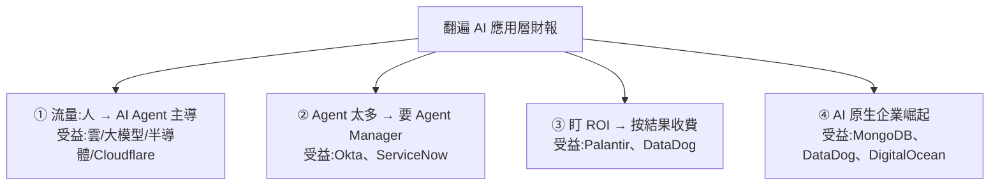

# AI 應用層 4 大前瞻趨勢:從財報季挖出的下一輪機會(流量、Agent 管理、ROI、AI 原生)

> 整理自 YouTube「美投讲美股(美投君)」〈AI 商业发展暗藏 4 大前瞻趋势!提前埋伏这些机会,押注下一轮 AI 暴涨?〉(2026-06-21,約 21 分鐘)。作者與團隊把所有 AI 應用層軟體公司的財報與管理層發言一家家翻,歸納出**四個尚未被市場充分消化的前瞻趨勢**,並各自點名相關受益公司。
>
> **⚠️ 非投資建議**;點名的公司是「受益邏輯」不等於「值得投資」,個股仍需具體分析。這些標的現階段普遍不受市場重視(焦點在 AI 基礎層)、股價疲軟、短期持股體驗不佳。內文已濾掉付費產品推廣。

---

## 一句話總結

**下一輪 AI 大機會在「應用層」,但比基礎層更難投、要更有選擇性。** 從財報季挖出的四個趨勢:① 互聯網流量正從「人主導」轉向「AI Agent 主導」;② 企業內部大量 Agent 帶來「Agent 管理(AI Observability)」新需求;③「無腦衝 AI」結束、企業開始盯 **ROI**、催生「按結果收費」;④ **AI 原生企業**集體崛起,服務它們的公司率先受益。

---

## 趨勢 ①:互聯網流量從「人」轉向「AI Agent 主導」

- **證據**:Shopify AI 引流流量同比 **+8 倍**、相關訂單 **+13 倍**;Adobe 稱 AI 給零售網站流量 **+7 倍**;Cloudflare 數據——**北美機器流量已占 68.4%**(超越人類),全球在 6 月初**機器流量首次歷史性超過人類**。
- **為何暴增**:Cloudflare CEO(Matthew Prince)例子——「我找一台相機會訪 5 個網站;交給 AI Agent,它會訪 5000 個」→ 同一任務,**Agent 訪問量是人類的約 1000 倍**。
- **關鍵洞察**:這波流量暴增**不增添整體商業價值,只是把經濟效益在產業鏈上「再分配」**(多出 token 成本、雲成本、監控成本)。中端產品要嘛讓利、要嘛倒逼自己把銷售從「人對人」改成「Agent 對 Agent」(後者更持久、必然發生)。
- **受益**:直接受益是**雲計算**(更多訪問=更多伺服器,Agent 還要搜索/調 API/訪資料庫)、**大模型**(token 消耗↑)、**半導體**;流量入口層的 **Cloudflare**(流量識別/訪問控制,但非純按量收費,靠需求膨脹帶動付費產品轉換)。廣告商 **Google/Meta** 可能換形態延續(SEO → **GEO**,讓 Agent 更好找到你)。

---

## 趨勢 ②:企業內部 Agent 爆量 → 需要「Agent Manager(AI Observability)」

- **規模**:微軟 CEO 納德拉——未來企業可能是「200 萬員工 + 2000 萬個 Agent」;黃仁勳(GTC)——10 年後英偉達可能「7.5 萬員工 + 750 萬個 AI Agent」。
- **新問題 = 新機會**:Workday——企業現有的權限/安全/政策/監管不變,**AI 要按這些要求執行才有回報**;Okta——未來每個 Agent 都需要**身份、權限、生命週期、關閉機制**。業內把這需求叫 **AI Observability**,像「員工多了要 Manager,Agent 多了要 Agent Manager」。
- **受益**:① 管身份權限的 **Okta**(把「AI Agent / 非人類身份的監管」列為戰略重點,財報後漲約 30%);② 監控管理 Agent 工作流的 **ServiceNow**(推出 **AI Control Tower** 監管公司所有 Agent/模型/身份)。
- **質疑與回應**:大模型會不會自己做掉這塊?作者認為**威脅存在但沒那麼危險**——短期是迫在眉睫需求,只有這些公司有最多經驗資源;且 Okta/Cloudflare 本身就是 OpenAI 的客戶(側面證明沒那麼容易被取代);長期大模型有能力但不一定做(有更值錢的事,最好是合作而非競爭)。**但這風險仍要留意,不能無腦看好。**

---

## 趨勢 ③:「無腦衝 AI」結束,企業開始盯 ROI → 「按結果收費」

- **證據**:HubSpot——AI 成本無限增加、客戶卻看不清結果,於是**把定價從「按量」改成「按結果」**(AI 該輸出 **Outcome 而非 Output**);Oracle——簡化定價、和客戶價值對齊(面試 Agent 按篩選候選人數量收費、酒店 Agent 按交易比例收費)。企業已對「按量收費的無底洞」不滿。
- **兩個投資含意**:
  1. **「按結果收費」成新趨勢**(軟體公司從席位收費 → 按量收費 → 按結果收費)。做得最好的是 **Palantir**——提供具體可衡量的結果(幫航空優化航線、幫能源優化油氣生產),甚至**用戶使用前就能算出 ROI**;若 AI ROI 議題發酵,Palantir 或重回焦點。
  2. **幫企業省 token 是巨大市場**(算力貴、短期解決不了)。**DataDog** 的 **LLM Observability** 監控每一次 AI 調用的 token 與花費、像查賬般還原「哪些任務殺雞用牛刀、哪裡還有節省空間」(OpenAI 是其客戶)。

---

## 趨勢 ④:AI 原生企業集體崛起,服務它們的公司率先受益

- 除了 OpenAI/Anthropic,市面上有大量大大小小的 **AI 原生企業**正形成不容忽視的商業力量(成長極快 + 近兩年拿了大量一級市場風投、很有錢)。財報季看到眾多公司把服務向 AI 原生傾斜、且本身適配的率先增長。
- **受益**:**MongoDB**(業績亮眼因 AI 原生客戶表現好、資料庫對 AI 原生有差異化優勢)、**DataDog**(財報後漲 30%,部分因新增兩大 AI 原生客戶)、**DigitalOcean**(自稱專門服務 AI 原生客戶)。多數專門服務商還沒上市。作者類比:互聯網龍頭的影響力持續了多久?AI 原生企業也將如此,且才剛開始。

---

## 應用案例 / 怎麼用這套思路

- **投 AI 別只盯基礎層,往「應用層 + 賣鏟子」找被忽略的機會**:四條線索——流量入口(Cloudflare)、Agent 管理(Okta/ServiceNow)、ROI/省 token(Palantir/DataDog)、AI 原生賣水人(MongoDB/DataDog/DigitalOcean)。這些現在不受市場重視、股價疲軟,正是「前瞻埋伏」的代價與機會。
- **看財報季就看「管理層在講什麼新問題」**:新問題 = 新機會(Agent 太多→要管理;AI 花錢看不到結果→要按結果收費)。作者的方法就是「一家家翻財報、讀管理層發言」找趨勢。
- **判斷軟體公司能否吃到 AI 紅利**:看它有沒有**從席位收費 → 按量 → 按結果**轉型;本身就按量/最先完成調整的最早受益。
- **埋伏疲軟標的的期權工具**:作者現階段考慮用 **Risk Reversal**(超低埋伏策略)——情緒逆轉時能靠 IV 反轉獲利,短期就算橫盤或再跌一陣容錯也高。⚠️ 選擇權有尾端風險,需自行評估。
- **務必記得**:受益邏輯 ≠ 值得投資,仍要看業務/財報/估值/風險具體分析;大模型自己下場做這些的威脅要持續留意。

> 延伸對照:本庫 [[ai-software-stocks-usage-based]](AI 軟體選股/使用量收費,同作者)、[[us-stocks-h2-2026-outlook-stock-vs-flow-ai]](存量 vs 增量邏輯)、[[ai-compute-token-economics]](token 經濟)、[[products-for-ai-ax-axo-luckin-mcp]](GEO/AX——為 Agent 設計產品)。

---

## 來源

- 美投讲美股(美投君),〈AI 商业发展暗藏 4 大前瞻趋势!提前埋伏这些机会〉,YouTube:<https://www.youtube.com/watch?v=-ih9NBMHiU8>(2026-06-21,約 21 分鐘)
- **該片無字幕,逐字稿以 CPU 版 faster-whisper(`vad_filter=True`,small,zh)轉錄,非官方字幕**;公司名與數字(Cloudflare 機器流量 68.4%、Shopify +8×/+13×、Okta/DataDog 漲 30%、納德拉 200 萬員工+2000 萬 Agent、黃仁勳 7.5 萬+750 萬)依語音還原,可能有聽寫誤差,實際以原片為準。**非投資建議**。
