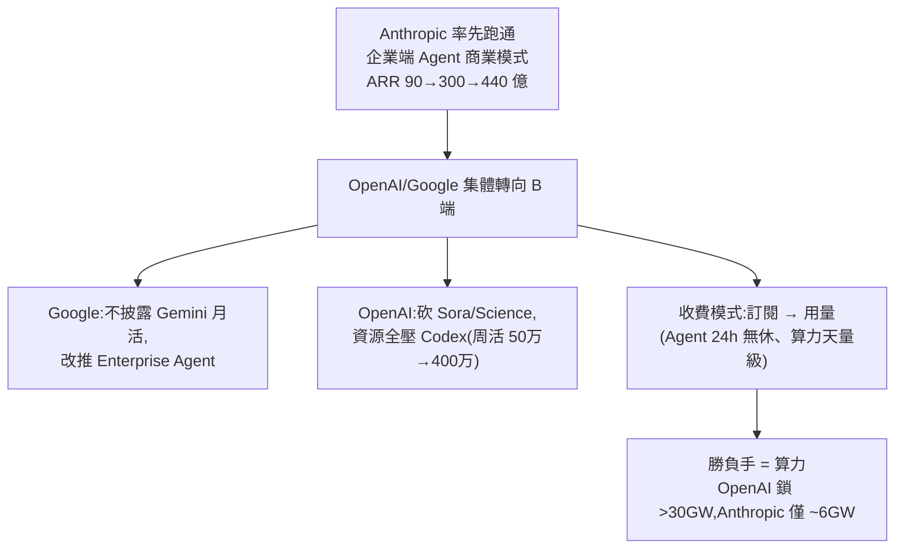

# AI 產業秘密轉向:大模型集體從 C 端轉 B 端、訂閱轉用量,而「算力」成了現階段的勝負手

> 整理自 YouTube「美投讲美股(美投君)」〈AI 产业已秘密转向!趁市场未动,这 3 大机会抓紧布局!〉(2026-05-03,約 22 分鐘)。作者觀察到大科技財報季一個「隱密卻可能徹底改變 AI 產業」的共同變化:**所有大模型公司幾乎不約而同地從 C 端(消費者)轉向 B 端(企業 Agent)**——並推導出「現階段誰勝出,關鍵在算力」。
>
> **⚠️ 非投資建議**;點名公司為受益邏輯、非個股推薦。內文已濾掉付費產品推廣。

---

## 一句話總結

**大模型集體「C 端 → B 端」戰略轉向已定局**(Anthropic 率先證明企業端 Agent 商業模式跑通),隨之而來的是**收費模式從「訂閱」轉向「用量」**、以及一個關鍵判斷:當模型能力與 Agent 應用都難拉開差距時,**現階段決定勝負的是「算力」**——這反而讓「花錢最瘋狂囤算力」的 OpenAI 可能後來居上。

---

## 1. 訊號:大模型集體「C 端 → B 端」轉向

- **Google**:這次財報**居然沒披露 Gemini 月活**(去年股價起飛的關鍵數據),轉而高調宣布 **Gemini Enterprise**(企業端 Agent)訂單環比 +40%——寧可拋開 7.5 億規模的大數據、去講幾百萬付費席位的小數據。
- **OpenAI**:更極端。過去一個月悄悄**關停 Sora、暫停成人模型、砍掉 AI for Science、大裁員**,所有資源集中到 **Codex**(對標 Anthropic 的 Claude Code,加入 MCP/Skill 後能做編程外的工作流)。Codex 周活 **50 萬 → 4 月初 300 萬 → 兩周後 400 萬**;OpenAI 企業端收入已超總收入 **40%**、年底前將和消費端持平。
- **根源是 Anthropic**:一個月前公布 ARR 從年初 90 億 → 一季 300 億(現 440 億),**率先證明企業端 Agent 商業模式徹底跑通**。過去兩年大模型拼 C 端入口/用戶規模/補貼,但 C 端**付費意願差、場景分散、黏性差**;Anthropic 的變現成功讓 OpenAI/Google 醒悟——與其在不確定的 C 端砸錢,不如去已驗證的 B 端賺錢。

---

## 2. 商業模式:訂閱收費 → 用量收費

- **訂閱制只適合成本穩定**(像健身卡,用戶舉多少鐵健身房成本不變);但 AI **實實在在燒算力**,不同用戶算力消耗天差地別,Agent 24 小時無休更是天量級。固定訂閱費大模型吃不消 → 必然轉向**用量收費**(基礎訂閱費 + 有限算力,要更多就訂更貴或直接按量),這正是 Claude 已驗證、變現效率極高的模式,會帶動收入與**利潤**大幅增長。
- 作者親身:用 Claude 做資料收集/數據分析,token 總不夠、一月花幾百美元;公司程序員是重度消耗者。「**作為老闆願意花嗎?願意——token 再貴也沒有再招一個程序員貴;員工用 AI 越多,越省我錢。**」→ Agent 模式「勾引你花越來越多錢、還心甘情願」= 大模型巨大變現潛力。

> 這條和本庫 [[ai-application-layer-4-trends-earnings]]「席位 → 用量 → 按結果收費」是同一條主線。

---

## 3. 三大受益方向:被「變現擔憂」耽誤最狠的股票

大模型收入/利潤集體釋放的爆發點很近 → 之前被 AI 變現擔憂壓最狠的,未來反彈可能最猛:

1. **雲計算企業**:過去半年因「巨大資本開支能否看到回報」承壓、一提開支就被市場懲罰,三大雲廠遠期僅 24 倍 → 有望估值修復復甦。
2. **OpenAI 陣營**:上輪 OpenAI 處漩渦中心(激進簽單、財務受質疑),連累 NVIDIA/AMD/Vertiv/甲骨文等 → 擔憂解除帶來上行。
3. **AI 基礎層**:之前擔心資本開支今年後放緩(因變現不足);但變現確立後大公司更有底氣投入——本季大科技仍瘋狂加碼,**連最保守的微軟都從 1300 億提升到 1900 億**,管理層先於華爾街看到變現潛力。

---

## 4. 核心判斷:現階段的勝負手是「算力」

分三層看「誰會先跑出來」:

| 層 | 兩年前 vs 現在 |
|---|---|
| **① 模型技術層** | 兩年前是決定性(OpenAI 靠它拿 90% 份額);**現在各家能力難拉開差距,不再決定性** |
| **② Agent 應用層** | 過去半年的決定性因素,領先者 Anthropic;**但優勢難保持**——Codex 一季就迎頭趕上(50 萬→400 萬 <3 個月) |
| **③ 算力層(現階段真正勝負手)** | Agent 時代算力消耗指數級增加;應用層難拉開差距 → **誰掌握更大算力誰更有優勢** |

> **最精彩的反轉**:Anthropic 一直是三大中**算力投入最克制**的,卻最先跑通商業模式;ARR 起飛後發現**算力跟不上、想補卻買不到(還貴一大截)**,只能給用戶變相漲價(同價降低可用 token),X/Reddit 上已有程序員抱怨 Claude 算力不足轉投 Codex。相反,**OpenAI 過去被詬病的「到處吞算力」現在成了優勢**:未來幾年鎖定 >30GW 算力(Anthropic 僅約 6GW、加未定訂單最多不超 10GW),且早用便宜價格囤了一大堆。諷刺的是,這些算力當年撒網搞 Sora/Science/成人模式都無疾而終、被嘲笑,如今全集中到 Codex 反而助推起飛。**「花錢最克制的最先跑通變現,花錢最瘋狂的反而最可能成最後贏家。」**
>
> 結論(現階段,非長期):一直被打壓的 **OpenAI 很可能後來居上**、在 Agent 時代重奪優勢,市場還沒完全意識到。

---

## 5. 順產業鏈找 Alpha:解決「算力瓶頸」成全體重中之重

新一輪「囤算力軍備競賽」將到來 → 基礎層新增長動能,且系統性降低資本開支風險(市場不再因投入恐懼、反而擔心投入不足)= 大科技結構性利好。**解決算力瓶頸**不再只是基礎層的事,而是**整個 AI 產業鏈全體要解決的巨大商機**:

- **基礎層**:**ASIC 自研晶片**(成本低效率高,緩解通用算力瓶頸)→ 博通、Marvell、Google;NVIDIA 下一代晶片迭代也是突破關鍵。
- **模型層**:性能重要性降低、算力重要性提高;「性能較差但能提供更多算力」的公司會受青睞;算法層解決算力瓶頸成重要迭代方向(中國模型做得不錯)。
- **雲計算**(作者最看好、最先被市場認可):離變現端最近、此前承壓、估值修復 + AI 東風。四大雲(亞馬遜/微軟/Google/甲骨文)都受益;現階段特別看好**甲骨文**——資本開支承壓最大、和 OpenAI 綁定最深、股價還趴在地上,**壓力越大彈性越強**,雙重壓力釋放或帶更大反彈。
- **軟體層**:AI 時代軟體優勢不在技術,而在**「定義需求的能力」**。Agent 消耗大量 token 因很多任務從零跑、不斷打磨;**流程一旦固定,同任務 token 消耗大幅降低**——軟體公司最擅長「依場景定義流程」,能撬動這個優勢提供更高效的算力使用、也解決非 AI 專業人士的門檻。

---

## 應用案例 / 怎麼用這套思路

- **看財報季要看「戰略轉向」而非只看業績數字**:Google 不披露月活、OpenAI 砍產品全押 Codex——這種「不約而同的動作」比單季 EPS 更能預示產業拐點。
- **判斷 AI 公司變現力,看它有沒有從「訂閱」轉「用量/按結果」**:訂閱制在 Agent 時代注定吃不消;最先轉用量的最早釋放利潤。
- **現階段選 AI 標的,把「算力」當第一性指標**:模型能力/應用層都難拉開差距時,**誰算力多誰贏**;留意「算力克制者(如 Anthropic)漲價/降 token」與「囤算力者(如 OpenAI)反超」的信號。
- **布局被「變現擔憂」錯殺的板塊**:雲計算(尤其承壓最大、綁 OpenAI 最深的甲骨文)、OpenAI 供應鏈、ASIC(博通/Marvell)、能「定義流程省 token」的軟體公司。壓力越大、彈性越強。
- **⚠️ 這是「現階段」判斷,長期還有更多變量**:別把「OpenAI 會贏」當定論;作者自己也強調現在下結論還早。

> 延伸對照:[[us-stocks-h2-2026-outlook-stock-vs-flow-ai]](存量/增量邏輯)、[[ai-application-layer-4-trends-earnings]](應用層 4 趨勢/按結果收費)、[[semiconductor-2000-bubble-vs-2026-ai]](基礎層週期)、[[ai-compute-token-economics]](算力/token 經濟)、[[cross-model-review-claude-codex-harness]](Claude vs Codex 實戰體感)。

---

## 來源

- 美投讲美股(美投君),〈AI 产业已秘密转向!趁市场未动,这 3 大机会抓紧布局!〉,YouTube:<https://www.youtube.com/watch?v=cgKUgAJE3cs>(2026-05-03,約 22 分鐘)
- **該片無字幕,逐字稿以 CPU 版 faster-whisper(`vad_filter=True`,small,zh)轉錄,非官方字幕**;公司名與數字(Gemini Enterprise +40%、Codex 50万→400万、OpenAI B 端 >40%、Anthropic ARR 90→300→440 億、微軟資本開支 1300→1900 億、OpenAI >30GW vs Anthropic ~6GW、雲廠 24×)依語音還原,可能有聽寫誤差,GW 等單位以原片為準。**非投資建議**。
