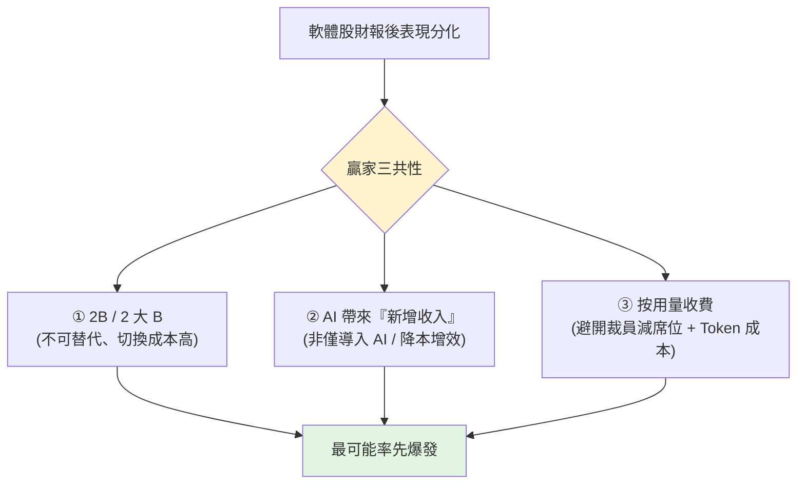

# AI 是威脅還是機遇?軟體股多點開花的選股邏輯

> 過去半年,SaaS 軟體股被「AI 顛覆論」血洗(軟體股 ETF **IGV 一度跌近 40%**,Figma 一度跌 85%)。
> 但最近財報季,部分軟體股財報後爆發(Snowflake +36%、Datadog +32%、Atlassian +30%、Twilio +24%、Figma +13%,
> 加上資安股 CrowdStrike / Palo Alto / Fortinet),而**多數軟體股即使業績亮眼仍被市場懲罰**。這矛盾背後的選股邏輯是什麼?
>
> 整理自「美投讲美股」影片。**⚠️ 非投資建議**,僅為觀念整理;個股有風險,請自行判斷。
> **逐字稿取得方式:該片無字幕,以 CPU 版 faster-whisper(zh)轉錄,公司名已校正,可能仍有少量誤差。**

---

## 贏家的三個共性(財報季驗證)

作者與分析師團隊研究數十家軟體股財報,歸納出**財報後大漲公司的三個共同特徵**:

### 1. 是 2B,尤其是「2 大 B(大企業)」軟體
- 不是 2C、也不是 2 小 B。這和「所有大模型企業今年都從 C 端轉向 B 端」不謀而合——大模型往 B 端轉,自然帶動 B 端服務型企業的業務升級與成長。
- **B 端不可替代性更強、用戶敏感度更低**:贏家幾乎都是各自行業龍頭、深耕多年、有龐大用戶與複雜生態,企業很難離開。
- 反例:**Intuit**(TurboTax 個人報稅這種 2C 服務)就更容易被大模型衝擊,財報下跌。

### 2. AI 已帶來「新增收入」——不是只「導入 AI」或「降本增效」
**市場只獎勵「用 AI 功能帶來新的、可預見收入」的公司。**
- 反例一 **Shopify**:AI adoption 走在最前面、幾乎鋪滿工作流,但**收入中規中矩 → 股價仍大跌**。
- 反例二 **Workday**:用 AI 內部優化、利潤遠超預期,但**收入平平 → 股價仍大跌**。
- 正例:Snowflake(Cortex/Intelligence 兩個 AI 工具開始貢獻收入,營收 YoY +34% 還在加速;>100 萬美元大客戶 779 家、+29%)、
  Datadog(AI workload 帶動監控需求暴增、AI-native 客戶 +20%,新 GPU 監控產品拿下兩個超大 AI 客戶)、
  Twilio(Voice AI 客服帶動營收從 12% 加速到 16%)、Atlassian(按用量計費的 AI 助手 Rovo,點數用量環比 +20%、淨收入留存率拉到 120%)、
  Figma(營收 +46%、連兩季加速;Pro 團隊付費轉化 YoY +150%)。

### 3. 商業模式是「按用量收費(usage-based)」,且成功兌現
- Snowflake / Datadog / Twilio 本就純按量收費,如今在流量基礎上**疊加 AI 加價**;Atlassian / Figma 原本按席位(seat)收費,
  AI 出來後**單獨開一檔按量收費的 AI 模組**——真正把股價推上去的,正是財報揭露的這部分。
- **為何市場偏愛按量收費?** 因為傳統「席位制」在 AI 時代有兩個硬傷:
  1. 市場擔心 **AI 帶來裁員 → 席位減少 → SaaS 永久少掉用戶席位**。
  2. AI 時代 **Token 變成軟體公司自己的成本**:以前 SaaS 高毛利、多一個用戶幾乎零邊際成本;現在用戶燒 Token 要公司掏錢,**用越多、公司虧越多**,AI 反而成了成本負擔。
- **按量收費同時避開這兩點**:就算 AI 造成裁員,用量也不會降(例:設計師變少,是因為一個設計師能做更多,而 AI 降低門檻反而帶來更多設計需求);
  Token 成本本身也是按量,可輕易轉嫁。**按量收費還能直接從 Agentic AI 用量中受益。**

> ⚠️ 反向:**背離這三點的公司**(2C、只導入 AI 沒新增收入、純席位制),想得到市場認可難度更大。

---

## 更深一層的研判

### AI 顛覆風險「已被 priced in」
作者認為 AI 顛覆軟體股的風險**確實長期存在、會系統性壓低整個行業估值**;這些大漲公司的亮眼財報**並沒有消除長期顛覆擔憂**,
只證明它們「短期活得不錯」。但關鍵是:**即使顛覆擔憂沒緩解,市場仍因短期業績兌現而給予獎勵**——這代表經過大半年估值重構,
**AI 顛覆風險可能已被充分 price in**。風險被定價後,機會反而更值得關注;且 AI 讓軟體更好用、門檻更低,從第一性原理看「產品更好用 → 更多人花更多錢」。
→ 不想選個股,**軟體股 ETF IGV** 是當前報酬風險比不錯的選擇。

### 最值得關注:基礎設施層軟體
偏「基礎設施層」的軟體更可能率先獲益、風險更低:**Datadog、Twilio、Snowflake**——有的是 AI 大模型必備、有的是雲廠商必備配套、有的是大公司底層服務商。
核心在於**它們的需求直接跟 AI Agent 用量掛鉤**:Agent 用越多、收入越高;且越靠近基礎層,AI 帶來的價值越好計算。
**作者判斷 2026 是 Agentic AI 爆發年**,這類公司上漲潛力高、確定性相對強。

### 資安股:需求確定,但「消息驅動」非「業績驅動」
CrowdStrike、Palo Alto、Fortinet 也是 AI 時代必備基礎設施。但其上漲是**消息面驅動**:4 月初某前沿大模型因「太強、可能帶來資安問題」而延後發布,
讓市場意識到資安軟體的巨大需求 → CrowdStrike、Palo Alto 近乎翻倍。**但已出財報的 Cloudflare、Zscaler 表現並不好**——
所以需求確定性強,**業績能否及時兌現仍有變數**。

### 尷尬的一類:靠「AI 功能」想轉身的老牌軟體
像 **Microsoft、Salesforce、Shopify**:AI 功能講得華麗,但真正貢獻卻乏善可陳。老牌多為席位制,被迫轉用量收費(如 GitHub Copilot、M365 Copilot)。
但**光改收費模式救不了他們,真正問題是跟不上大模型迭代**:
> M365 Copilot 還停在上一代「**Context Engineering**(AI 理解上下文來解決問題)」,而大模型已進入「**AI Agent / Harness Engineering**(AI 直接執行任務)」時代。
> 於是用戶寧願把 Office 接進大模型去執行任務,也不用內嵌的 Copilot。

**任何自研 AI 應用的軟體公司都會碰到這難題**:總慢大模型一拍,上一代功能剛打磨好,大模型下一代就可能直接顛覆使用邏輯。
所以**單純的「AI 功能」建不起新護城河——AI 能力如今更像一種商品(commodity),誰都能用、效果差不多**。
作者因此對「想靠一個 AI 小功能就翻身」的公司(如 Atlassian)持較謹慎態度。

> 但這不代表軟體公司沒機會。引領這波 AI 應用的最可能仍是**前沿大模型**;軟體公司「光喝湯」就有巨大成長潛力。
> **AI 時代它們真正的優勢不再是技術能力,而是:定義需求的能力、已建立的複雜生態、對資料安全/合規/效率的解決方案。**

---

## 選股法總結

| 維度 | 偏好 |
|---|---|
| 客群 | **2B / 2 大 B** > 2C / 2 小 B |
| AI 與營收 | **AI 已帶來可預見的新增收入** > 只導入 AI / 只降本增效 |
| 收費模式 | **按用量收費**(或成功引入用量模組)> 純席位制 |
| 層次 | **基礎設施層**(直接掛鉤 AI Agent 用量,價值好計算、確定性高)最佳 |
| 整體 | AI 顛覆風險已 price in → 軟體股整體報酬風險比高,**IGV ETF** 適合廣度曝險 |

---

## 應用案例

- **想參與軟體股反彈但怕選錯:** 直接用 **IGV**(軟體股 ETF)做整體曝險——作者認為此刻整體報酬風險比高,且 AI 顛覆風險已被定價。
- **想挑個股:** 用「2B + 按量收費 + AI 已帶來新增收入」三濾網,並優先看**基礎設施層**(需求直接跟 Agent 用量掛鉤);
  例如 Snowflake / Datadog / Twilio 這類「AI 用越多、它賺越多」的公司。
- **看到老牌軟體喊 AI 功能就想追:** 先問「這 AI 功能有沒有變成**可預見的新增收入**?還是只是降本增效 / PR?」——
  Shopify、Workday 即使 AI 做得好,收入沒兌現照樣大跌。且自研 AI 功能難建護城河(會慢大模型一拍)。
- **理解「席位制 vs 用量制」的 AI 時代差異:** 這正是本庫 [[context-engineering-processing-vs-thinking]] 講的「Token 變成成本」在商業模式上的延伸——
  席位制吃不下 Token 成本,用量制能轉嫁;而 [[ai-harness-explained]] 的 Context vs Harness 之分,正是老牌 Copilot 落後的根因。

---

## 一句話總結

> 軟體股不是被 AI 一鍋端,而是**分化**:**2B、按用量收費、且 AI 真的帶來新增收入**的(尤其基礎設施層、需求直接掛鉤 Agent 用量)會率先爆發;
> 純席位制、只會喊 AI 功能、收入沒兌現的會繼續被罰。AI 顛覆風險大致已被定價,軟體股整體進入「報酬風險比偏高」的時點——
> 但別無腦看多,**它們的長期顛覆風險你也要心知肚明**。

---

## 來源

- YouTube:[AI 是威脅?還是機遇?軟體股多點開花預示什麼?(美投讲美股)](https://www.youtube.com/watch?v=tUI3ITjo2Bw) — **該片無字幕,逐字稿以 CPU 版 faster-whisper 轉錄,公司名已校正。**
- 延伸:本庫 [[context-engineering-processing-vs-thinking]](Token 成本)、[[ai-harness-explained]](Context vs Harness Engineering)。
- 相關標的/工具:軟體股 ETF **IGV**;Snowflake、Datadog、Twilio、Atlassian、Figma、CrowdStrike、Palo Alto、Fortinet、Cloudflare、Zscaler、Microsoft、Salesforce、Shopify、Workday、Intuit。
