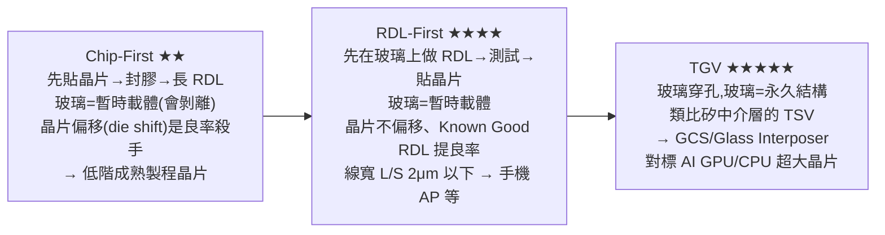

# 玻璃基板取代有機載板?欣興、群創、友達的技術門檻與量產時程拆解

> 來源:永豐 RichClub 產業熱話〈玻璃基板取代有機載板?欣興、群創、友達的技術門檻與量產時程拆解〉。AI 晶片邁向 2 奈米以下、封裝面積大增,傳統有機(ABF)載板在**熱膨脹係數失配、翹曲控制、高頻介電損耗**上已達物理極限,玻璃基板被視為下一代解方。本筆記拆解玻璃基板的技術優劣、三條製程路線(Chip-First / RDL-First / TGV)、三大應用與量產時程,以及全球與台廠(欣興、群創、友達、彩晶、力成、台積電)的相對位置。

> ⚠️ **非投資建議。** 本筆記為產業資訊整理,僅供觀念參考,不構成任何買賣建議;個股題材含金量與量產時程仍待驗證,投資請自行查證並自負盈虧。

---

## 一句話總結

玻璃基板的價值在於**「CTE 可調匹配矽、表面超平整、介電損耗極低、可做矩形大面板」**,正好補上 ABF 載板在大型 AI 封裝的死穴;但它**良率仍低、TGV(玻璃穿孔)難度最高、上游材料/設備集中在少數國際大廠**,真正永久性(GCS / Glass Interposer)的量產普遍落在 **2026 底~2028 之後**。**看這個題材不能只看「誰有玻璃製程」,要分清三件事:切入路線、量產進度、題材含金量**——很多「跟漲股」只是題材聯動,不是實質轉型。

---

## 為什麼是玻璃?五種基板比較

| 維度 | **玻璃基板** | 有機載板 ABF/BT | 矽中介層 | 傳統 PCB | 陶瓷 |
|---|---|---|---|---|---|
| 熱膨脹 CTE | **可調控、匹配矽** | 與矽失配嚴重 | 與矽完全匹配 | — | — |
| 翹曲控制 | **極佳** | 差(大尺寸殺手) | 極佳 | 差 | — |
| 尺寸擴展 | **矩形大面板** | 有上限 | 受 12 吋晶圓限制 | 無限制 | 有限 |
| 介電損耗 | **極低(高頻佳)** | 中等 | 高 | 高 | 偏高 |
| 通孔技術 | TGV(雷射改質+蝕刻) | 雷射鑽孔+化學鍍銅 | TSV(成熟) | — | — |
| 量產成熟度 | **試量產階段** | 完全成熟 | 完全成熟 | 完全成熟 | 成熟 |

- **玻璃優勢**:CTE 匹配矽解決翹曲、表面超平整適合微影、低介電損耗利於高頻(CPO/6G)、可放大為矩形大面板、可內嵌主被動元件。
- **玻璃劣勢**:**脆性高易微裂、TGV 填銅難、良率仍低、成本高、上游玻璃與關鍵設備集中於少數國際大廠**。
- **關鍵背景**:目前 AI 晶片仍 **100% 採用 ABF 有機載板**;矽中介層(TSMC CoWoS-S 主力)受 12 吋晶圓尺寸限制,**無法支援超大型 AI 封裝(如 NVIDIA Rubin)**——這是玻璃的機會。

---

## 三條製程路線:Chip-First / RDL-First / TGV

前兩者回答「先放晶片還是先做線路」,TGV 回答「訊號怎麼垂直穿過玻璃」。**關鍵差異在「玻璃是暫時載體還是永久結構」:**

- **TGV 難度最高(★★★★★)**:同時挑戰雷射改質均勻性、蝕刻選擇性、**填銅無孔洞**、**整片良率**(一片上千萬顆孔,少數異常就整片報廢);玻璃脆,鑽孔易產生隱形**微裂**導致後段失效。**TGV 是把玻璃從「暫時」變「永久」的關鍵,也是 GCS 與 Glass Interposer 的必要條件。**

---

## 三大潛在應用與量產時程

| 應用 | 定位 | 最接近商業化者 | 量產時程 |
|---|---|---|---|
| **Glass Interposer(玻璃中介層)** | AI 晶片 / HBM / CoWoS 替代 | 最受關注但**時程最遠**;用 Low-CTE 超薄玻璃(Corning/AGC/SCHOTT/NEG) | **2028 以後** |
| **GCS(玻璃核心 IC 載板)** | ABF 載板的進階替代 | **Absolics(SK 集團)最領先** | Absolics 2026 底、SEMCO 2027 |
| **CPO 光電共封裝** | 高密度、低損耗光學背板 | 友達主攻 | 仍需 2–3 年 |

---

## 全球與台廠布局

**全球技術分層(由領先到落後):**
- **Absolics(SK 集團,韓/美)**:**唯一進入「試量產出貨」階段**,2025 底完成量產準備、向 **AMD、AWS 送樣 pre-qualification**,2026 底量產。
- **Samsung SEMCO(韓)**:首座 mini 量產線,目標 **2027 量產**;2026/04 傳 **Apple** 評估採購用於 AI 伺服器晶片「Baltra」。
- **Intel**:2025/07 新 CEO Lip-Bu Tan 改採購、2026/01 於 NEPCON Japan 展出 **EMIB + GCS 樣品**,表態 3 年內商業化。
- **AMD**:與 Absolics pre-qualification,**MI400 系列**為潛在採用。
- 上游玻璃:**AGC(市占第一)、Corning(領跑但虧損)、SCHOTT(低 CTE/Df 配方,供 Intel/SEMCO)、NEG**。
- 其他:DNP(2028 量產,LIDE 式 TGV)、LG Innotek(Gumi 試產)、Ibiden(仍探索);中國沃格光電(GCP 領跑)、京東方(與 Corning 簽 3 年 MOU)。

**台廠相對位置:**

| 公司 | 路線 | 進度與時程 |
|---|---|---|
| **欣興(3037)** | 玻璃核心層 + ABF 壓合(上游玻璃委日韓) | 董座曾子章 12 年前啟動研發;**產線 2026 下半年趨穩、下游真正量產落 2028 後**;Intel 研發夥伴;**台灣載板廠中唯一公開承諾玻璃量產時程者** |
| **群創(3481)** | FOPLP + GCS + TGV | G3.5 玻璃產線(已完全折舊、有成本優勢);**FOPLP Chip-First 已量產**(PMIC/RF IC 等成熟品,但已非發展重點);RDL-First 還需 1–2 年、**TGV 仍在實驗室**;傳與台積電策略合作但未正式公告 |
| **友達(2409)** | **CPO 玻璃光通訊**(差異化,不走 FOPLP) | 30 年玻璃 know-how 用於 CPO 模組;已與國際 AI/光通訊大廠系統級測試,**2–3 年內商轉**;董座彭双浪 2026/02 表態「光通訊模組未來會轉成玻璃製程」 |
| **彩晶(6116)** | 無實質布局 | **無公開量產/試產計畫**;2026 多次跟隨群創 FOPLP 題材跳漲,屬「面板族群跟漲股 / 題材聯動受惠股」,**非實質轉型** |
| **力成(6239)** | 先進封測 FOPLP | 2026 積極擴 FOPLP;2026/2027 年資本支出上修**逼近 400 億元** |

**台積電 CoPoS**:嘉義 AP7 試產線預計 **2026/6 完工、2027 小量試產、2028–2029 量產**;也與環球晶合作**方形矽基板**(不一定用玻璃)。封測 Amkor 與 Intel 結 EMIB 戰略夥伴、亞利桑那廠 2026 上線並與 TSMC 共址。

---

## 對投資人的重點(原文觀點)

- **分清三層,別只看「有沒有玻璃製程」**:① **切入路線**(Chip-First/RDL-First/TGV、暫時載體 vs 永久 GCS)② **量產進度**(試量產 vs 實驗室)③ **題材含金量**(實質訂單 vs 跟漲)。
- **題材聯動 ≠ 實質轉型**:彩晶是典型「跟漲股」,投資人需審慎區別。
- **台廠普遍落後 Absolics/SEMCO 的成因**:(a) 韓國國家級補助 + 財閥垂直整合;(b) 美國 Intel/Absolics 有 CHIPS 法案資金;(c) 日本 Ibiden 從 ABF 客戶基礎延伸;(d) 台積電以晶圓代工龍頭直接定義規格;(e) 台灣面板廠長期專注顯示,封裝為轉型方向、需時間累積客戶驗證。
- **時程現實**:真正永久性 GCS/Glass Interposer 的量產多落 **2026 底~2028 後**——題材會「市場早就在炒、放量在 2027–2028」,別被情緒帶著走(呼應本庫 gooaye agent 近期立場對「玻璃基板放量時間點」的提醒)。

> 相關筆記:[[ai-software-stocks-usage-based]](AI 軟體股選股邏輯)、[[sun-qinglong-pe-band-valuation]](EPS×PE 估值);先進封裝/CoWoS/TGV 題材亦見 gooaye agent 記憶層(EP648 起多次談玻璃基板、放量 2027–2028)。

---

## 來源

- 永豐 RichClub 產業熱話,〈玻璃基板取代有機載板?欣興、群創、友達的技術門檻與量產時程拆解〉:<https://www.sinotrade.com.tw/richclub/industry/玻璃基板取代有機載板-欣興-群創-友達的技術門檻與量產時程拆解-產業熱話-6a1e82dfb55a18bfaf06a4cb>
- 文中提及公司/數據(Absolics、SEMCO、Intel、AMD、Apple、欣興、群創、友達、彩晶、力成、台積電 CoPoS 等時程)均為原文整理,實際量產時程與訂單仍待驗證。
