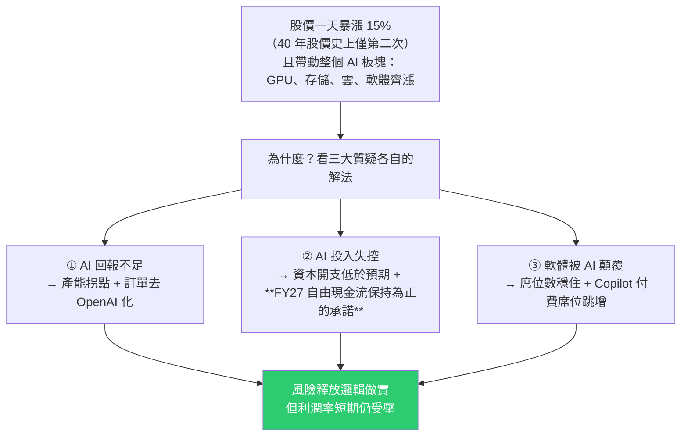
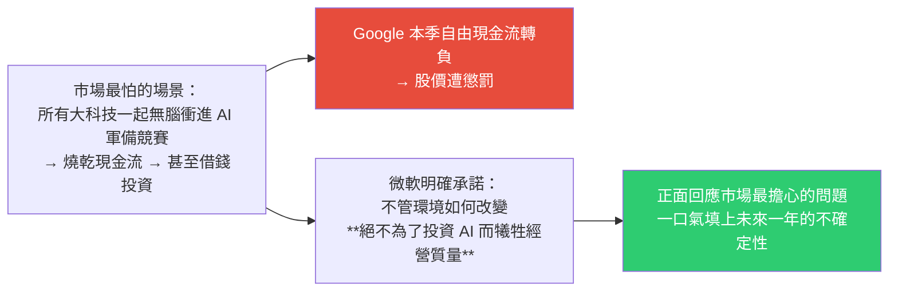
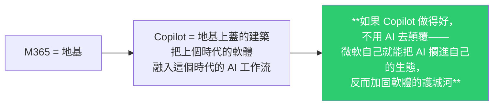
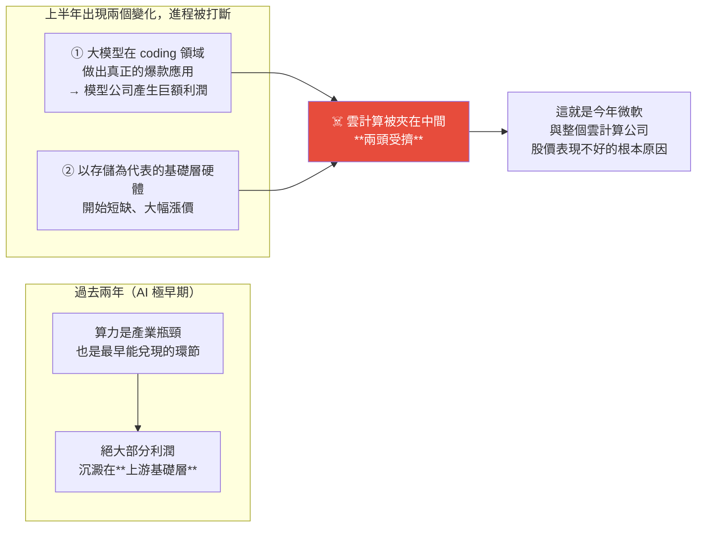

# 微軟財報大漲 15% 的真正原因:三大質疑逐一拆解,以及 AI 價值鏈的位移

> ⚠️ **本文為教育與知識整理用途,非投資建議。** 內容整理自 YouTube 頻道 **美投君 / 美投讲美股**〈微軟史無前例大反轉!蟄伏一年,巨頭終於準備好起飛了?〉(2026-08-02,約 23 分鐘)。所有數據均為影片中的說法,投資決策前請自行查核原始財報。
>
> 核心框架一句話:**微軟的業務其實變化不大,真正變的是「市場對它的擔憂」。股價下跌是質疑造成的,股價回升也是質疑緩解帶來的——所以該看的不是財報裡所有數字,而是「最大的質疑在哪、公司做了什麼回應」。**

---

## 一句話總結



---

## 先講方法論:為什麼不逐條看數字

影片作者的立場很明確,而且這點比個股結論更有遷移價值:

> 市面上散戶接觸到的資訊充斥著對這份財報的誤讀——大家關注的是「Azure 收入增長多少」「記帳方式改了什麼」,甚至開始暢想 AI 時代的性感故事。**這些或許有用,但都不是終點。**
>
> **對當前的微軟而言,比起攤開分析財報所有數據,更重要的是理解這家公司的投資邏輯:它的業務變化不大,真正的變數是市場的擔憂。股價漲跌跟實際業績有關係,但不是最關鍵的。**

所以整支影片的結構就是:**三大質疑 × 這次財報給了什麼回應。**

---

## 質疑一|AI 回報不足

### 背景

微軟是所有大科技裡**最早投入 AI 的**,但回報並不理想:Azure 雲收入雖有提升,**卻已連續四個季度增速觸頂**;軟體與應用端更是幾乎看不到明確的 AI 回報。

### 回應 A:Azure 增速出現拐點

| 指標 | 數字 |
|---|---|
| 本季 Azure 年增 | **43%** |
| 上季 | 39.5% |
| 市場樂觀預期 | 41.5% |
| **下季指引** | **提速到 45%** |

管理層解釋超預期來自兩點:**CPU/GPU 機群效率提升**、**流程改進讓產能比預期更早上線**。

> **這確實突破了連續一年的增長平靜。**

### 回應 B(作者認為這才是關鍵):真正的變數是「產能」不是「收入」

> **只看收入有點「看天吃飯」的意思,投資者幾乎完全無法預測。Azure 業務真正的變量不是收入,而是產能。**
>
> **需求完全不必擔心,真正限制增長的是「可落地使用的算力規模」——需求再高,數據中心落不了地也是白搭。**

作者提到他在財報前就分享過微軟產能的追蹤圖並據此預測本季 Azure 會有不錯表現:

| 產能指標 | 變化 |
|---|---|
| 6 月產能 | **突然跳升** |
| 年增 | **超過 120%** |
| 環比 | 超過 50% |
| 管理層說法 | **未來兩年整體產能還要再翻一倍** |

> **有了這樣的產能表現,可以合理預測 Azure 收入的提高「本季只是個開始」,而且趨勢還能延續幾個季度。**

### 回應 C:訂單證明「沒有 OpenAI 也行」

上一季市場還在質疑:失去 OpenAI 獨家合作後,Azure 還拿不拿得到足夠訂單?

| 指標 | 數字 |
|---|---|
| 含 OpenAI 的新訂單增長 | 約 11% |
| **剔除 OpenAI 後的新簽訂單增長** | **18%** |
| RPO 增長 | 25% |
| RPO 環比增長來源 | **全部來自前沿模型公司「以外」的客戶** |

> **也就是說,增量訂單跟 OpenAI 已經沒有任何關係了。**

### ⚠️ 但利潤率仍是難題(作者認為市場過度樂觀)

由於**微軟在自研晶片上落後**,其雲業務利潤率相比亞馬遜與 Google 始終承受更高壓力——**這也是它近期股價表現明顯不如另外兩大雲的重要原因。**

微軟沒有單獨揭露 Azure 利潤率,但智能雲業務裡 Azure 佔近八成,可當代理指標:

| 指標 | 表現 | 作者的解讀 |
|---|---|---|
| 智能雲營業利潤率 | **環比回升 0.9 個百分點**,止住此前連續三季下滑 | 市場為此興奮 |
| **但拆開看:毛利率** | **在下滑** —— 成本端漲 42%,收入端僅漲 31% | 原因是 AI 基礎設施先行投入 + GitHub Copilot 使用量上升帶來的算力消耗 |
| 真正帶來利潤上漲的 | **只能是營運費用的控制** | ⚠️ 而營運費用控制往往靠裁員增效等手段,**不可能無限控制,多是一次性提升** |

> **只有毛利率的上升,才能讓利潤的提升更有可持續性。**

**兩個未來可能帶來質變的催化劑:**

| 催化劑 | 現況 | 時程 |
|---|---|---|
| **自研晶片** | Maia 確實落後 Google TPU 與 Amazon Trainium,**但跟自己比進步很快**:24 年初才發布第一代,今年初發布第二代 Maia 200(每美元性能比機群中最新一代硬體高 30%),已同時支援 OpenAI 與自家 MAI 模型 | **Maia 300 明年下半年才能規模上量** |
| **模型多元化** | 用更省 token、成本結構更優的模型交付相同結果。Azure 已上架 **超過 11,000 個模型**(含 OpenAI、Anthropic、自家 MAI 系列,以及大量引入 DeepSeek、Kimi 等高性價比模型);**今年以來同時使用多家供應商模型的客戶數增長近 5 倍** | 現在作用還太小 |

> **作者結論:雲業務利潤率短期恐怕很難持續提升——自研晶片要等明年上量,模型多元化現在帶不來質變。真正看到 Azure 利潤率持續提升,恐怕要等到明年。市場在這點上有些過於樂觀了。**

---

## 質疑二|AI 投入會不會失控

**回報好但投入失控一樣救不了股價——此前財報後暴跌的 Google 就是前車之鑑**(雲業務暴漲 82%,但資本開支顯著增加、自由現金流轉負,股價仍遭懲罰)。

| 指標 | 數字 |
|---|---|
| 本季資本開支 | **410 億美元**,年增 69% |
| vs 市場預期 | **低於預期 2–3%** |
| 自由現金流 | **196 億美元**(環比下降近 40%,但仍充裕) |
| 股息與回購 | 仍支出 **102 億美元** |

> 在這種投入強度下還能一邊砸錢投 AI、一邊照顧股東、保證現金流穩定——**現在的微軟完全沒有犧牲原有的經營質量。**

### ⭐ 但最重要的不是數據,是管理層的態度

財報會上做出一個關鍵承諾:**FY27 財年的自由現金流會始終保持為正。**



### 那個被討論很兇的「會計變更」,作者認為不必在意

微軟把 2026 自然年的資本開支指引**從 1,900 億下調到 1,750 億美元**,看起來像是降低了資本開支。

**但作者查了背後的財報解釋:真實花費一分沒少。** 原因是把一部分**融資租賃的 capex 用會計手段變成經營性租賃的 capex**——以前掛在資產上的一部分開銷,現在記到費用裡去了。

> **只是記帳方式的挪動,投資者完全不必在意,更不能因此判斷它的股價。**

---

## 質疑三|軟體會不會被 AI 顛覆

這是過去半年席捲整個科技板塊最重要的風險,而**站在風暴中央的正是擁有 Office(現稱 M365)的微軟**。

### 回應 A:收入增速放緩是「預期內」

| 指標 | 數字 |
|---|---|
| M365 商業 + 個人版收入年增 | **15%**(剔除統計口徑差異後 16%) |
| 前幾季 | 約 20% |

**放緩的原因很單純**:四個季度前剛好趕上 M365 提價,**現在只是提價效果退去之後的正常表現。**

### 回應 B(關鍵指標):席位數

> **所謂「AI 顛覆軟體」論,最主要的論點就在於「軟體使用人數的下降」。**

| 指標 | 數字 |
|---|---|
| **商業版席位數增長** | **6%** |
| 這個增速已維持 | **近 5 個季度沒有任何變化** |

> **至少可以說明,市場擔心的 AI 顛覆軟體論,目前還沒有看到任何跡象。**

### 回應 C:Copilot —— 從「被顛覆」轉成「自己把 AI 攔進生態」



| 指標 | 數字 |
|---|---|
| Copilot 付費席位 | 上季 2,000 萬 → **本季 3,000 萬以上**(環比淨增約 1,000 萬,**遠超市場預期的 600 萬**) |
| 使用 Copilot 的企業客戶數 | 環比增長近 **75%** |
| 席位數超過 5 萬的客戶數 | 年增 **超過 7 倍** |
| GitHub Copilot 用戶 | 達 **5,000 萬**;6 月轉成用量計費後,Business 與 Enterprise 席位仍持續增長,**收入環比增速超過 60%** |

**產品品質也有實質改進**(作者自陳「之前我一直說 Copilot 不好用」):

- Copilot 工作負載**吞吐量自年初以來提升 4 倍**;
- **更多模型接入,讓同樣的任務用更少 token 完成**;
- 推出新功能 **AutoPilot** —— 具備完整企業合規能力、常駐運行的 agent;
- 未來計畫把 Chat、CoWork、AutoPilot、Code 整合進一個**跨消費級與商用級的超級 App**。

> **還無法下結論說 AI 一定不會威脅微軟的軟體,但照這個趨勢看,威脅確實在不斷降低。**

---

## 作者的總結判斷

| 質疑 | 結論 |
|---|---|
| ① AI 回報 | **產能釋放 → Azure 收入加速是大勢所趨**;⚠️ 但利潤率短期仍受壓,**明年自研晶片大規模落地才有進一步釋放潛力** |
| ② AI 投入 | 「**絕不讓現金流為負**」的承諾打消了市場最大質疑;數據上也證明微軟能一邊維持大規模開支、一邊保證現金健康與經營品質 |
| ③ 軟體顛覆 | 還無法**徹底**打消,但 **Copilot 的表現一定程度上降低了擔憂** |

> **整體:風險釋放邏輯做實了,而且往後看風險還會逐步降低,給股價持續帶來向上動能。** 作者並提到其團隊的估值模型顯示目前價格仍在偏保守位置。
>
> ⚠️ **再次提醒:以上為影片作者觀點,非投資建議。**

---

## 全片最有價值的部分:AI 價值鏈的位移

這段跳出個股,是本片對產業判斷最有遷移價值的框架。



### 作者為什麼認為「兩頭擠壓」不是常態

| 環節 | 為什麼超額利潤不可持續 |
|---|---|
| **上游硬體** | 極度短缺不會長期存在——**超額利潤一定會帶來擴產與競爭** |
| **模型層** | **模型能力正在快速商品化**,能力帶來的護城河正逐步縮小。跡象:中國高性價比模型不斷出現、龍頭 OpenAI 開始降低前沿模型價格。**單靠模型本身這套商業模式賺取超額利潤已很難維持** |

> ⚠️ 作者特別澄清:**這不是說基礎層半導體不行、或大模型不行**——它們未來很長一段時間的需求一定都非常堅挺。**他說的是「兩頭沉、中間輕」這種產業鏈價值生態只是階段性表現,最終注定會被打破。**

**理由**:雲計算在 AI 產業鏈中的地位不可或缺,而且這些公司**基本都擁有從硬體到軟體、從業務到資本的龐大生態**,這給了它們在產業鏈中很高的議價權。

> **結論:AI 價值鏈終歸會回到常態化分配。現在明顯受擠壓的中間層雲計算,其實具備不錯的長期增長空間——而作為其中佼佼者的微軟,自然會是最強受益者之一。**

---

## 應用案例 / 這套框架怎麼用

### 案例 1|把「三大質疑」當成看任何科技股財報的模板

本片最值得抄的不是微軟的結論,而是**它的提問方式**:

```
不要問「這季賺了多少」，要問：
① 市場現在對這家公司最大的三個質疑是什麼？
② 這份財報針對每一個質疑，給出了什麼具體回應？
③ 這個回應是「結構性解決」還是「一次性數字」？
```

第③點是關鍵。**本片示範得很好:利潤率回升 0.9 個百分點看起來是好消息,但拆開發現毛利率其實在下滑、上升全靠營運費用控制——而營運費用控制是一次性的,不是結構性的。**

### 案例 2|分清「先行指標」與「結果指標」

作者反覆強調:**Azure 的真正變量是產能不是收入。** 收入是結果指標(看天吃飯、無法預測),**產能是先行指標**(可追蹤、可據以預測下幾季)。

同樣的思維可套用到其他公司:找出那個「決定結果、但比結果更早可見」的量。例如半導體看產能利用率與資本開支、SaaS 看席位數與淨續約率、電商看履約中心開設速度。

### 案例 3|警惕「會計變更造成的數字錯覺」

資本開支指引從 1,900 億降到 1,750 億,看起來像縮手,**實際只是把融資租賃的 capex 改記成經營性租賃**,真實花費一分沒少。

**判斷法**:看到指引大幅變動時,先去財報註腳找有沒有會計政策說明,再判斷是「經營決策改變」還是「記帳方式挪動」。**前者影響估值,後者不影響。**

### 案例 4|用「護城河 vs 顛覆」的正確指標,而不是敘事

「AI 會顛覆 SaaS」是一個很有感染力的敘事,但**它可被證偽的指標其實很具體:席位數**。本片指出席位增速 6%、已連續 5 季不變 —— **敘事很響,數據沒動。**

**這個方法可以推廣:每當你聽到一個宏大的顛覆敘事,先問「如果它是真的,哪一個具體數字會先動?」然後去追那個數字。**

### 案例 5|「價值鏈位移」框架可套用到整個 AI 投資

上游(硬體)→ 中游(雲)→ 下游(模型/應用)的利潤分配,目前是「兩頭沉、中間輕」。作者的判斷是這只是階段性的,理由是**超額利潤必然引來擴產與競爭,而模型能力正在商品化**。

📌 這跟本庫幾篇可以互相印證:
- [[gpt-5-6-sol-kernel-self-optimization-luna-pricing]] —— Luna 輸入價砍 80%、把小模型推向「成本出清」,**正是「模型能力商品化」的直接證據**。
- [[ai-compute-token-economics]] —— token 經濟學與「應用層替硬體打工」的討論。
- [第 124 期 GitHub Weekly](../../technology/github-weekly/issue-124.md) 引述的白皮書:**token 單價會被競爭快速抹平,真正產生溢價的是 SLA、合規、責任與信任這些「契約層」能力**——這跟本片說的「雲廠商靠龐大生態取得議價權」是同一個方向。

### 案例 6|注意資訊來源的利益結構

本片有相當篇幅在推廣作者自家的付費研究平台,估值模型的具體內容也留在付費端。**這不減損分析框架的價值,但要意識到:你拿到的是「框架與結論」,不是「可驗證的完整推導」。**

實務做法:把這類影片當成**問題清單的來源**(該問哪三個質疑、該追哪個先行指標),而不是當成結論來源;數字一律回原始財報查核。

---

## 重點回顧(TL;DR)

- **方法論**:微軟業務變化不大,**變的是市場的擔憂**。該看的不是所有數字,而是「最大質疑在哪 + 公司回應了什麼」。
- **質疑①(AI 回報)**:Azure 年增 **43%**(上季 39.5%、預期 41.5%),**下季指引 45%**;但作者強調**真正變量是產能不是收入**——6 月產能跳升、年增超 120%,管理層稱未來兩年再翻一倍。訂單方面**剔除 OpenAI 後新簽增長 18%**、RPO 環比增長全來自非前沿模型公司客戶。
- ⚠️ **但利潤率**:智能雲營業利潤率環比回升 0.9pp,**拆開看毛利率其實在下滑**(成本 +42% vs 收入 +31%),上升全靠**一次性的營運費用控制**。自研晶片(Maia 300)要等明年下半年上量,模型多元化現在作用太小 —— **作者認為市場過度樂觀。**
- **質疑②(投入失控)**:資本開支 410 億(+69%)但**低於預期 2–3%**;自由現金流 196 億;仍支出 102 億股息回購。**最關鍵是管理層承諾 FY27 自由現金流始終為正**(對照 Google 現金流轉負遭懲罰)。資本開支指引 1,900 億→1,750 億**只是融資租賃改記成經營性租賃,真實花費沒少**。
- **質疑③(軟體被顛覆)**:M365 收入增速放緩是**提價效果退去的正常表現**;關鍵指標**席位數仍增 6%、已連 5 季不變 = 顛覆論尚無跡象**;**Copilot 付費席位 2,000 萬 → 3,000 萬+**(遠超預期的 600 萬)、企業客戶數環比 +75%、GitHub Copilot 用戶 5,000 萬。
- ⭐ **產業框架**:AI 價值鏈正從上游基礎層向下游流動;上半年因「coding 爆款讓模型公司賺大錢」+「存儲短缺漲價」而**讓雲計算兩頭受擠**——這是今年雲廠商股價不好的根本原因。但**超額利潤必引來擴產與競爭、模型能力正在商品化**,所以「兩頭沉中間輕」只是階段性,**價值鏈終將回到常態分配**。

---

## 來源

- 美投君 / 美投讲美股(YouTube),〈微軟史無前例大反轉!蟄伏一年,巨頭終於準備好起飛了?〉(2026-08-02,約 23 分鐘):<https://www.youtube.com/watch?v=9tREtYASGbs>
  - ⚠️ **該片無字幕,逐字稿以 CPU 版 faster-whisper(small/int8,`vad_filter=True`)轉錄取得、非官方字幕**,可能有少量聽寫誤差(專有名詞如 Azure、Maia、RPO、M365、Copilot、DeepSeek、Kimi、Trainium、TPU 等已依上下文校正;部分數字如 RPO 增速、席位數請以原始財報為準)。
  - 影片含作者自家付費研究平台的推廣內容,估值模型細節未在影片中公開。
- ⚠️ **本文為教育用途整理,非投資建議。** 所有數據均為影片說法,未經第三方查核;投資有風險,決策前請自行閱讀微軟原始財報與財報會議紀錄。
- 延伸(本庫):[GPT-5.6 Sol 自優化 kernel 與 Luna 降價 80%](../../technology/ai-industry/gpt-5-6-sol-kernel-self-optimization-luna-pricing.md)(模型商品化的直接證據) · [AI 算力與 Token 經濟學](../../technology/ai-industry/ai-compute-token-economics.md) · [AI 產業 C→B 轉向:算力決定](./ai-industry-shift-c-to-b-compute-decides.md) · [特斯拉 Q2 2026 資本開支衝擊](./tesla-q2-2026-capex-shock-vs-narrative.md)(同作者上週的財報分析)
