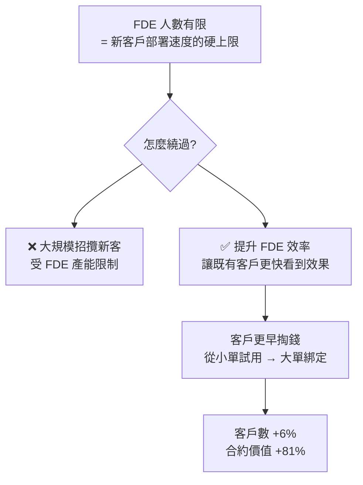
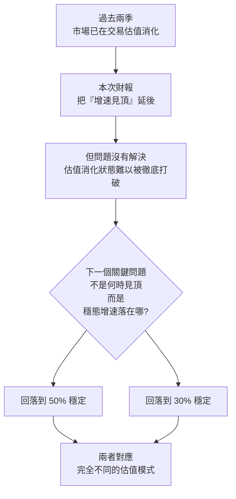

# PLTR 財報後大漲 30%:市場真正在交易的不是業績,是「增速見頂」風險的釋放

> ⚠️ **本文為個人學習筆記與資訊整理,非投資建議。** 內容包含影片主講人的主觀判斷,已明確標註。個股投資風險極高,請自行研究並為自己的決策負責。

> 整理自 YouTube 頻道 **美投君 / 美投講美股**〈PLTR財報大漲30%!唯一AI應用股為何逆境反轉?下一輪爆發來了?〉(2026-08,約 24.8 分鐘)。

---

## 一句話總結

**PLTR 過去幾季業績全部大幅超預期,股價卻一度腰斬;這次業績同樣好卻暴漲 30%——差別不在損益表,而在「長約蓄水池」三個指標同步跳升,暫時推翻了市場最深層的恐懼:增速見頂。**

---

## 一、先看反常之處:好業績不等於漲

影片開場問了三個很好的問題,這也是全片的分析主軸:

1. 如果漲是因為業績亮眼——但**過去幾季業績也全部大幅超預期**,為什麼只有這次換來大漲?
2. 如果是市場情緒轉向——但同一週 **Figma、Datadog 財報同樣亮眼,股價卻下跌**,為什麼?
3. PLTR 過去大半年**從高點下跌近 40%**,一份財報就把陰霾洗掉了嗎?

**結論:這不是一次普通的財報。要解釋股價,得看損益表以外的東西。**

---

## 二、損益表:好到已經「習以為常」

| 項目 | 本季 | 對照 |
|---|---|---|
| 營收 | **19.35 億美元** | 年增 **93%**,超市場預期的 18.1 億 |
| GAAP 營業利益 | **9.12 億美元** | — |
| GAAP 營業利益率 | **47%** | 上季 46%,續升 |
| 調整後營業利益率 | **62%** | — |
| 營運現金流 | **12.2 億美元** | — |
| 帳上現金及約當現金 | **92 億美元** | 較上季增加約 12 億 |

分業務:

| 業務 | 本季營收 | 年增 | 備註 |
|---|---|---|---|
| **美國商業** | **7.64 億** | **約 +150%** | 超預期(7.16 億),**最關鍵** |
| 美國政府 | 8.09 億 | +90% | 基本盤,非常堅挺 |
| 國際商業 / 國際政府 | — | 不溫不火 | **非現階段戰略重心** |

**為什麼放掉國際?** 因為公司擴張極度依賴**本地的前端部署工程師(FDE, Forward Deployed Engineer)**,產能有限,所以刻意把有限資源投給最有潛力的美國市場。

> **這裡就埋下了全片的核心矛盾:PLTR 的成長受制於「有多少個 FDE」,而 FDE 是人,不能無限擴張。**

問題來了:**過去幾季業績一點都不比這次差,為什麼股價一度接近腰斬?**

---

## 三、真正的關鍵:三個「長約蓄水池」指標

PLTR 跟客戶簽的是**多年期大合約**。這些合約只有一部分會反映在當季營收,大部分不會——而是反映在下面三個數字裡。

| 縮寫 | 全名 | 白話 |
|---|---|---|
| **新增 TCV** | Total Contract Value | 當季新簽的合約總價值 |
| **RDV** | Remaining Deal Value | 剩餘合約價值 |
| **RPO** | Remaining Performance Obligations | 剩餘履約義務 |

影片用了一個很好懂的比喻:**蓄水池**。

**RDV 與 RPO 的差別:**

- **RPO** = 未來**一定**會認列的收入。
- **RDV** = 理論上**有可能反悔**——因為合約裡有「隨時終止」條款(termination for convenience),**美國政府特別愛用**。

> **投資人只看營收,看到的是出水口;而股價其實在交易的是水池的水位與進水速度。**

### 上一季發生了什麼:三個指標同時亮紅燈

- **新增 TCV**:還在簽新單,但**增量開始放緩**,而且是多年來**第一次**放緩。
- **RDV**:水位還在漲,但**漲幅開始下降**。
- **RPO**:更誇張——增速在 2025 年第 4 季衝高後,**上一季大幅下滑**。

**這正是市場對 PLTR 最深層的恐懼:增速見頂。**

---

## 四、為什麼「增速見頂」比「成長趨緩」可怕得多

這是全片最重要的估值觀念,適用於**所有高成長股**,不只 PLTR:

> **對成長股而言,股價爆發力最強的階段,是「營收加速成長」的階段。一旦增速見頂,即便業績還在成長,股價的爆發力就沒了——甚至可能因為估值結構被迫改變而大跌。**

拆開來看,「還在成長」跟「成長在加速」是兩件完全不同的事:

| | 營收 | 營收**增速** | 股價典型表現 |
|---|---|---|---|
| 加速期 | ↑ | ↑ | 強勢上行,高估值也擋不住 |
| 減速期 | ↑(仍成長) | ↓ | **橫盤或下跌,波動極大** |
| 穩態期 | ↑ | → 持平 | 估值重新錨定,業績再推股價 |

誰都知道 PLTR 這種加速成長不可能永遠持續,**但什麼時候是頂?** 這才是市場真正在賭的東西。而上一季的蓄水池數據,看起來就像在說:**就是現在了。**

**過去兩季 PLTR 股價疲軟的核心原因,就是市場已經開始交易「增速見頂」的邏輯。**

---

## 五、這一季:把不可能變成可能

| 指標 | 本季表現 |
|---|---|
| **美國商業新增 TCV** | **21.3 億美元**,歷史新高;年增 **153%**,**季增 81%** |
| **美國商業 RDV** | **62.6 億美元**,單季淨增 13.4 億,新高 |
| **RPO** | **49 億美元**,年增 **103%** |
| **短期 RPO**(未來 12 個月可認列) | **21 億美元**;**季增速從 8% 拉升到 19%** |

**在高基期上再跳一次**——影片特別點出,去年二、三季正是公司表現最好的時候,也是基期最高的時候,在那之上還能再跳漲,難度可想而知。

**這三個數字同時創高,等於暫時推翻了「增速見頂」的論述。** 股價暴漲的原因不是業績,是**恐懼被延後了**。

---

## 六、它是怎麼在 FDE 有限的情況下做到的?

這一段是本片最有價值的商業分析。往下再挖兩層:

### 第一層|訂單規模分佈:成長來自「大單」,不是「多單」

| 訂單級距 | 上季 | 本季 | 變化 |
|---|---|---|---|
| > 100 萬美元 | 206 個 | 220 個 | **+7%** |
| > 500 萬美元 | 72 個 | 98 個 | **+36%** |
| > 1,000 萬美元 | 47 個 | 73 個 | **+55%** |

**級距越大、增幅越高。** 跳漲的來源不在小單變多,而在**大單大幅增加**。

### 第二層|客戶數幾乎沒動,合約金額卻爆增

- 美國商業客戶數:**615 → 653,僅 +6%**
- 同期美國商業 TCV:**+81%**

**成長不來自新客戶數量,而來自老客戶訂單價值的提升。**

**NDR(淨美元留存率)佐證:150% → 157%。** 意思是:**即使 PLTR 一個新客戶都不拿,光靠這批老客戶就能帶來 57% 的收入成長。**

### 推導出的成長戰略

> **FDE 卡住了客戶數量的成長,但公司透過「提升 FDE 效率」把成長潛力從另一個方向釋放出來。** 影片主講人坦言這是他先前分析時**沒有想到的**,刷新了他對這家公司的認知。

### 財報會議上的三個佐證案例

| 客戶類型 | 起始 | 本季結果 |
|---|---|---|
| 跨國科技公司 | 去年第 4 季從**一個營運部門**開始部署 | 鋪開到整間公司,簽下 **3 年期 3,700 萬美元** |
| 資產管理公司 | 今年第 1 季才開始合作 | 第 2 季簽下 **3 年期 3,500 萬美元** |
| 非營利醫療組織 | 2025 年底簽約 | 本季簽下 **3,700 萬美元** |

**共同模式:小規模試點 → 幾個月內擴大成千萬級多年合約。** 這就是「加速老客戶從小單走到大單」的具體長相。

---

## 七、另一個爭議:AI 會不會顛覆 PLTR?

這是過去半年股價疲軟的另一個原因。擔憂分兩層:

1. **PLTR 的業務會不會被大模型直接搶走?**
2. **PLTR 賴以起家的 FDE 模式,會不會被其他科技公司抄走並抄贏?**

⚠️ 以下是**管理層在財報會議上的說法**,影片主講人也提醒:管理層當然會往好了說,投資人要辯證地看。

### 對第一層的回應

管理層的核心論點:

> **市場創造出的智能,遠遠多於它轉化的價值。更強的模型解決不了「價值轉換」的問題。**

AIP 平台的重點正是在價值轉換,而現在唯一的限制因素是**部署速度**,不是模型能力。

換句話說:**業務會不會被搶走,不取決於模型多聰明,而在於怎麼把模型能力嵌進企業真實的工作流。**

**客戶側的佐證**:一家律師事務所主管表示,過去律師要花幾天分析、討論並起草的工作,現在幾分鐘完成,並補了一句——**「沒有 ontology(本體論),這是不可能實現的。」**

> 影片主講人的評論值得記下來:**法律服務本該是最容易被大模型滲透的行業,結果大模型沒做到,反而是 Palantir 做成了。** 這是否說明關鍵不在模型的智能,而在如何落地?

### 對第二層的回應:一場對決實驗

管理層分享了一場由**某大型科技公司客戶**發起的對決:

| | A 方 | B 方 |
|---|---|---|
| 陣容 | 某前沿 AI 實驗室 + 其部署團隊 | Palantir AIP + 其 FDE |
| 客戶 | 相同 | 相同 |
| 時間 | 相同 | 相同 |
| **使用的 AI 模型** | **相同** | **相同** |
| **唯一變數** | **平台與部署人員** | |

**結果**:前沿 AI 實驗室**沒有交出任何有價值的東西**;PLTR 則替客戶做好了 agent 集群,還主動建議了行銷策略與定價策略的調整,最終轉化成一份**年化 1,000 萬美元**的合約。

管理層的說法很硬:**「只有 Palantir 有真正的 FDE,其他那些公司都只是 sales engineer。」**

### 影片主講人自己的判斷

⚠️ 以下為主觀看法:

- AI 顛覆威脅**短期內無法證實也無法證偽**,這個問題還會被反覆拿出來討論。
- 但有一個**事實**投資人必須清楚:**PLTR 的訂單是十年期級別的長約,動輒 3~5 年、幾千萬到上億美元。**
- **如果企業真的擔心大模型有一天會輕易取代 PLTR 的模式,他們絕對不會在現在跟一個「隨時可能被取代的平台」簽長期合約**——哪怕只有一丁點擔心,這個決策恐怕也做不出來。
- 所以他認為 **AIP + FDE 這套模式的護城河,可能比市場想像中更深。**

---

## 八、⭐ 全片最有價值的框架:用 Netflix 看「估值消化」

⚠️ 以下為影片主講人的主觀分析與歷史類比,**歷史不必然重演**。

他先給了一個重要前提:**風險釋放 ≠ 風險消失。**

> 再好的公司,收入也不可能永遠無限制加速成長。**這次優異的財報,只不過是把這個擔憂延後到了明年。**

而 **PLTR 現在的估值,就是建立在「收入不斷加速」的基礎之上**。增速一旦見頂,這個前提就沒了,估值必須重新找錨——**這個找錨的過程就叫「估值消化」,是所有高成長股都必經的過程。**

那估值消化期間股價會怎麼走?他拿了 10 年前同樣是全市場最炙手可熱、同樣經歷爆炸性成長、而且**已經走完整段加速到穩態過程**的公司來對照:**Netflix**(當年 FANG 裡的那個 N)。

### Netflix 的三個階段

| 階段 | 期間 | 業績 | 估值(P/E) | 股價 |
|---|---|---|---|---|
| **一、加速成長** | 2013–2018 | 加速成長 | 一度高達 **400 倍** | **5 年漲 10 倍**;高估值不影響上漲 |
| **二、增速下滑** | 2019–2022 | **仍在成長,但不再加速** | **100 倍 → 60 倍**,持續消化 | 經歷兩次約 **40% 大幅回檔**,波動加劇、漲幅收窄;**3 年仍有 1 倍漲幅** |
| **三、業績下滑** | 2022 之後 | 明顯下滑,一度用戶負成長 | **60 倍 → 16 倍** | 最多**下跌 75%** |

(第三階段之後 Netflix 又找到新成長引擎、股價回升,影片不討論。)

### 從中歸納的兩條規律

> **規律一:股價跟著「收入增速的方向」走,而不是跟著「增幅的絕對高低」走。**
> 增速在加速時,股價幾乎都上行;增速一旦開始下滑,股價就漲不動了,通常橫盤或下跌,而且**這段期間波動極大**。

> **規律二:真正的轉捩點,不是增速降到多低,而是「降速什麼時候結束、達到穩態」。**
> 只要降速還在持續,股價就很難走出趨勢性行情。等到增速起穩、進入平穩期,市場終於看清這家公司的**穩態成長率**,估值才能重新錨定,業績才能重新推著股價往上走。

他補充:這兩條在大週期成立,**在小週期中也基本符合**;而且**股價往往先於業績做出反應**。

### 套回 PLTR

**「穩態增速到底是多少」才是真正決定估值的變數,而不是「什麼時候開始減速」。**

在這個「增速找底、估值找錨」的階段,他認為**股價的上限空間是受限的**,很難再開啟像前一階段那樣持續上行的模式。

**但他認為 PLTR 的穩態會比 Netflix 更好預測、更高、也更長**,理由:

1. **簽的都是多年長約 ⇒ 可預測性更強**
2. 市場對 AI 資料分析的需求非常旺盛
3. **企業的 AI adoption 還處在非常早期**
4. **當前市場上幾乎沒有像樣的競爭對手**

他個人對此非常樂觀,認為最終穩態很可能維持在 **50% 甚至更高**——畢竟**光是老客戶擴張,一年就能帶來 57% 的收入成長**。

**他的定位結論:PLTR 還處在當年 Netflix 的第一階段(高速成長期),只是短期需要先經歷一段估值消化,等穩態確認後才能再度起漲。**

### 他的操作立場(⚠️ 個人主觀,非建議)

- **依舊堅定持有**,因為相信 AI adoption 的成長空間,也認可 AIP + FDE 的護城河。
- **但現階段不會有太高期待**——估值消化階段股價天然波動更大、方向更難判斷,所以**短期保持謹慎樂觀**。
- **密切關注 TCV 與 NDR 的變化**,用來判定穩態是否出現。**一旦出現,將會是下一次大趨勢的開始。**
- 對於「PLTR 這麼貴了還有什麼估值空間」的說法,他認為那是因為只看 PE、PS 這類通用指標;若對業務夠了解,可以用**現金流折現法(DCF)**更細緻地評估。

---

## 應用案例

### 案例 1|把「蓄水池三指標」當成訂閱制 / 長約型公司的通用檢查表

只要一家公司的商業模式是**多年期合約**(企業軟體、SaaS、國防承包、電信設備),損益表的當季營收就是**落後指標**——它反映的是好幾季前簽下的單。

**該看的是:**

| 你要問的問題 | 對應指標 |
|---|---|
| 進水速度變快還變慢? | **新增 TCV 的年增與季增** |
| 水池水位還在漲嗎?漲幅呢? | **RDV / RPO 的絕對值與增速** |
| 未來一年鎖定多少? | **短期 RPO** |
| 成長來自新客還是老客? | **客戶數增幅 vs TCV 增幅、NDR** |

**PLTR 這一季就是活教材:營收 +93% 看起來跟上季差不多,但客戶數只 +6%、TCV +81%、NDR 150%→157%——三個數字放在一起,商業模式的真實驅動力才浮出水面。**

⚠️ 提醒 RDV 與 RPO 的差異:**RDV 含有可被單方終止的部分**(政府合約尤其常見)。把兩者混為一談會高估確定性。

### 案例 2|拿「增速的方向 vs 絕對值」重新檢視你手上的成長股

拿一張紙,對每一檔成長股填三格:

1. 最近 4~6 季的**營收年增率**列出來——是往上、往下,還是走平?
2. 現在的估值倍數,是建立在「持續加速」還是「穩態成長」的假設上?
3. 如果增速從現在的水準掉一半並穩住,你願意付幾倍?

**第 3 題答不出來,代表你其實不知道自己在買什麼。** Netflix 第二階段的教訓正是:公司**沒有變壞**(3 年還漲了 1 倍),但**估值從 100 倍壓到 60 倍**,期間兩次 40% 回檔——如果你的持倉大小撐不過 40% 回檔,那再好的公司也跟你無關。

### 案例 3|辨識「產能瓶頸型」成長公司的兩種解法

PLTR 的 FDE 就是典型的**人力產能瓶頸**——這在顧問業、系統整合、醫療服務、專業服務公司都存在。當這類公司說要成長時,只有兩條路:

| 路徑 | 特徵 | 觀察指標 |
|---|---|---|
| **加人** | 線性、慢、稀釋利潤率 | 員工數增速 vs 營收增速 |
| **提升單人產出** | 非線性、利潤率上升 | **客戶數增幅 vs 合約金額增幅的差距**、NDR |

PLTR 這季走的明顯是第二條:**客戶數 +6% 但合約金額 +81%,同時營業利益率還從 46% 升到 47%。** 這個組合(量沒增、值大增、利潤率還升)就是「單人產出提升」的財務指紋。

**反過來說,如果哪天看到客戶數增速追上合約金額增速、同時利潤率下滑,那就是回到「靠加人成長」了——估值邏輯要跟著改。**

### 案例 4|對「管理層說法」的處理方式

影片的處理方式值得學:**先完整轉述管理層的論點,再明確標註「這是管理層自己說的,不能全盤接受」,最後區分哪些是可驗證的事實。**

以本片為例:

| 內容 | 性質 | 該怎麼看 |
|---|---|---|
| 「更強的模型解決不了價值轉換問題」 | **管理層論述** | 有道理,但無法證實 |
| 對決實驗中前沿實驗室交白卷 | **管理層轉述的單一案例** | 樣本 n=1,且由利害關係人轉述 |
| 律師事務所客戶的證詞 | **客戶側說法** | 較有參考價值,仍是單一案例 |
| **簽了 3~5 年、數千萬美元的長約** | **可驗證的事實** | **最有力**——因為那是客戶用錢投的票 |

> 影片主講人的推論邏輯很值得抄:**與其聽管理層怎麼講護城河,不如看客戶願不願意簽長約。** 如果企業真的認為這東西隨時會被大模型取代,不可能簽三五年的大單。**行為比說法可信。**

### 案例 5|一個誠實的自我提醒

影片主講人自己承認:「FDE 效率提升能釋放這麼多成長」是他**先前分析時沒想到的**,這次財報刷新了他的認知。

這值得記下來,因為它揭示了**產能瓶頸型公司的分析盲點**——分析者很容易把「產能上限」當成「成長上限」,卻忽略了**產能可以透過效率提升而變相擴張**。

**下次你判斷某公司「已經到頂」時,先問自己:我算的是產能的上限,還是效率的上限?**

---

## 重點回顧(TL;DR)

1. **業績好不等於股價漲**。PLTR 過去幾季都超預期卻腰斬,這次同樣好卻漲 30%——差別在蓄水池指標,不在損益表。
2. **三個指標要一起看**:新增 TCV(進水)、RDV(水位,**可能被終止**)、RPO(水位,**確定會認列**)。
3. **上季三個全部亮紅燈**(TCV 多年來首次放緩、RDV 漲幅下降、RPO 大幅下滑)⇒ 市場開始交易「增速見頂」⇒ 這才是股價疲軟的真因。
4. **本季全部跳升**:美國商業新增 TCV 21.3 億(年增 153%、**季增 81%**)、RDV 62.6 億、短期 RPO 季增速 8%→19%。
5. **成長來自大單與老客,不是新客**:>1,000 萬美元訂單 +55%,客戶數僅 +6%,**NDR 150%→157%**。
6. **FDE 是瓶頸也是護城河**。公司繞過瓶頸的方式不是加人,是**提升 FDE 效率讓客戶更早從試用走到大單**。
7. **AI 顛覆爭議**:管理層主張「智能過剩、價值轉換稀缺」;對決實驗中同樣模型下前沿實驗室交白卷。⚠️ 樣本 n=1 且由利害關係人轉述——**更有力的證據是客戶願意簽 3~5 年長約**。
8. **⭐ 估值消化框架(Netflix 三階段)**:股價跟著**增速的方向**走,不是絕對值;真正的轉捩點是**降速何時結束**,不是降到多低。
9. **PLTR 的下一個關鍵問題不是「何時見頂」,而是「穩態增速落在 50% 還是 30%」**——兩者對應完全不同的估值模式。
10. ⚠️ **風險釋放 ≠ 風險消失。** 這份財報把擔憂延後到明年,沒有解決它。

---

## 來源

- [PLTR財報大漲30%!唯一AI應用股為何逆境反轉?下一輪爆發來了? — 美投君 / 美投講美股](https://www.youtube.com/watch?v=nLZ-C7bbZzs)(2026-08,約 24.8 分鐘)
- 本倉庫同頻道其他筆記:[[microsoft-fy26q1-three-doubts-resolved]]

> 該片無字幕,逐字稿以 CPU 版 faster-whisper(small / int8 / zh)轉錄取得,**非官方字幕**,可能有少量聽寫誤差。文中數字與專有名詞已逐一比對上下文校正(例如轉錄中的「FD1」為 **FDE**、「NDL」為 **NDR**、「互成盒 / 互稱核」為**護城河**、「固執 / 估職」為**估值**);其中股價回升幅度轉錄為「340%」,依上下文應為 **30~40%**,已依此改寫。若需精確數據請以公司財報原文為準。

> ⚠️ **再次提醒:本文為知識整理,非投資建議。** 文中「美投君團隊觀點」「我個人依舊會堅定持有」等皆為影片主講人的主觀立場,已明確標註,不代表本筆記立場,亦不構成任何買賣建議。
