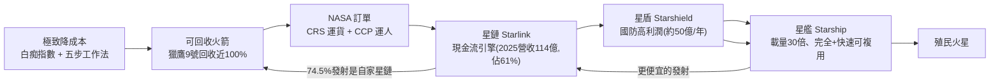

# SpaceX 崛起史:從被嘲笑的新創到航天巨頭,一套已跑起來的商業飛輪

> 來源:硅谷101〈SpaceX崛起史:一切,为了去火星〉(實地探訪 Starbase 與洛杉磯總部,訪 SpaceX 前高管、獵鷹9號首席工程師 Lewis Hong)。在 SpaceX 衝刺「人類史上最大 IPO」之際,本片回顧這家「Day 1 就想去火星」的公司如何在獵鷹1號連續失敗後命懸一線、靠 NASA 訂單活下來、用可回收火箭重寫成本、再靠星鏈與星盾撐起星艦。本筆記把它整理成**一條清楚的商業飛輪 + 工程方法論**,並標出對投資人有意義的重點。

> ⚠️ **非投資建議。** 本筆記為公司史與商業模式整理,含願景成分;SpaceX 估值/IPO 數字請以官方招股書為準。

---

## 一句話總結

SpaceX 的故事不是「燒錢追夢」,而是**一套已經跑起來的工程 + 商業系統**:用**極致降成本(白痴指數/五步工作法)+ 可回收火箭**把發射價格打到顛覆全行業 → 用 **NASA 訂單**活下來並打入核心供應鏈 → 用**星鏈(現金流引擎)+ 星盾(高利潤國防)**反哺最燒錢的**星艦**研發 → 星艦把「載量×可複用」再放大一個量級,通往火星。**IPO 只是這個飛輪的一個節點,不是終點。**

---

## 一、起源與生死關

- **起源是「行為藝術」**:2001 年 Musk 發現 NASA 連重返月球計畫都沒有,想買退役蘇聯導彈送小溫室上火星拍照(「火星綠洲」)激起公眾熱情。去俄羅斯被羞辱(對著皮鞋吐口水)。
- **關鍵頓悟**:回程在飛機上做 Excel——**火箭原材料(鋁/鈦/碳纖維/推進劑)成本只佔售價約 3%**;高價來自**傳統巨頭(波音、洛馬)的成本加成模式 + 龐大低效官僚**。2002 年用 PayPal 套現的錢成立 SpaceX。
- **獵鷹1號三次失敗**:① 熱帶鹽霧腐蝕燃料管螺母漏油;② 二級姿態控制問題提前熄火;③ 一二級分離慢一秒「追尾」——「**太空裡 99% 不夠,要 100%**」。Musk 即興演講「我絕不放棄」。
- **第四次成功(2008/9/28)**:**人類史上第一枚由私營公司發射的軌道級火箭**,太空不再由國家壟斷。
- **NASA 救命(2008 聖誕前夕)**:公司只剩一次發薪的錢,NASA 來電告知拿到 **CRS-1 合同(16 億美元)**,Musk 脫口「我愛你們」。

> **NASA 有偏袒 SpaceX 嗎?沒有。** COTS 招標 21 家選 2 家;另一中選者 Rocketplane Kistler 因金融危機融不到資被撤單。NASA 的邏輯:一個訂單至少給 2–3 家(含一家「400% 穩但低效」的保底 + 給新公司機會)。**CRS/COTS 事實上宣告了「商業航天」的誕生。**

---

## 二、降成本方法論(可遷移到任何製造業)

- **白痴指數(Idiot Index)**:零件總成本 ÷ 原材料成本。指數高 = 設計太複雜或製造太低效。「**做的東西白痴指數很高,那你就是個白痴**」——要求每人把負責的零件成本砍 80%,做不到可能被解雇。
- **真實改造案例**:噴管驅動器報價 12 萬 → 用洗車系統的混合閥改造成 5000 美元;NASA 門閂 1500 美元 → 用浴室隔間插銷改造成 30 美元;載重艙冷卻系統 300 萬 → 用 6000 美元家用空調改造。
- **五步工作法(Musk 像念咒一樣重複)**:① **質疑每項要求**(要知道提要求的人是誰、去挑戰他——這是最重要的一步)② **刪除**所有能刪的部分/流程(若加回來的不到刪除的 10%,代表刪得不夠)③ **簡化優化**(別優化一個本不該存在的東西)④ **加快周轉** ⑤ **自動化**(放最後)。
- **核心心法**:最優秀的工程師最容易犯的錯是「**為不存在的問題自我設限**」;Musk 接受「你證明給我看為什麼不行」,不接受「無根據地說這不可能」(後者在 SpaceX 是死命題)。
- **成效**:全新獵鷹9號成本約 **5000 萬美元,比同類低 30–50%**。

---

## 三、可回收火箭:顛覆成本結構

- 「每種交通工具(飛機/火車/汽車/馬)都能重複使用,唯獨火箭不行」——Grasshopper(2012)蚱蜢驗證 → 2014–15 無數「炸火箭」(Musk 自嘲「快速非計劃性解體」)→ **2015/12/21 首次陸上回收、2016/4 海上回收(無人船「Of Course I Still Love You」)、2018 Falcon Heavy 雙助推器同步降落**。
- **現況**:回收成功率近 **100%**;多枚完成 **20+ 次**回收(最高 **33 次**,刷新世界紀錄,業界原以為 10 次是極限);同箭兩次發射最短間隔 **<20 天**;Musk 預測壽命可達 100 次以上。
- **2015–16 是另一個至暗時刻**(獵鷹9號連環爆炸):此時 SpaceX 規模已大到「沒有東西能填補空缺,除非自己解決」、跑在 NASA 與全世界前面只能靠自己、對手趁機挖角——但團隊向心力 + Musk「把最後一分錢都投進來」的可信承諾撐過。

---

## 四、星鏈:現金流引擎與雙向飛輪

- **商業邏輯**:全球互聯網約 1 兆美元盤子,星鏈拿 3% 就是 300 億(比 NASA 年預算還多);全球逾 40 億人未接入互聯網、美國 2400 萬人無固網。
- **規劃 4.2 萬顆**;目前 **1 萬+ 在軌(佔全球活躍衛星約 65%)**、**千萬訂閱用戶**、155+ 國家;航空(夏威夷/卡達/紐西蘭航空)、郵輪(皇家加勒比等)導入。
- **2025 全年營收 114 億美元,佔 SpaceX 總營收 61%**。
- **雙向飛輪(投資關鍵)**:2025 年 165 次發射中 **123 次是發星鏈(74.5%)**——**近 3/4 發射任務是別人搶不走的內需**;海量發射攤薄火箭單位成本、讓各型火箭不斷試錯迭代,再降成本提性能。

---

## 五、載人(波音之戰)與國防(星盾)

- **CCP 商業載人**:NASA 又分兩家,SpaceX 只拿 26 億、**波音拿 42 億**(更大頭)。但**載人龍飛船 Crew Dragon**(3 塊觸控屏、全自動對接、像 Model S)已完成 10+ 次載人;**波音 Starliner 推進器故障 + 氦洩漏,2 名太空人滯留空間站 9 個多月,最後靠 SpaceX 龍飛船返回**——波音顏面掃地、載人計畫無限期擱置,**載人龍飛船成為美國事實上唯一載人飛船**。亮點:Inspiration4(全平民繞地)、Polaris Dawn(首次商業太空行走)。
- **星盾 Starshield(國防業務統稱)**:估約 **50 億美元/年**。三類衛星:① 改裝星鏈 V2/V3 的軍用通信(抗干擾/加密/雷射)② 只提供「衛星總線」讓政府像插樂高加自己的載荷(高分相機/竊聽)③ 自研導彈追蹤星座。訂單:國家偵察局間諜衛星 18 億、太空軍 480 顆通信、5 月底新增 64.5 億。**政府合同長期、排他、預付、利潤率高於民用**——是星艦研發與萬億估值的重要支柱。

> **設計爭議的處理方式(內部如何挑戰 Musk)**:載人龍飛船 Musk 堅持「只要觸控屏、一個按鈕都不行」;工程師用「前 2 頁講完重點、後面 50–60 頁數據支撐論點」的報告,一步步證明哪些能做、哪些做不到——最終是「Musk 的願景 + 必要的緊急實體按鈕」的優化版。**Musk 聽道理,但你要拿數據證明。**

---

## 六、星艦:通往太空的「火車」

- **第一原理**:獵鷹9號像 Semi 卡車,星艦是「**通往太空的火車**」——**完全 + 快速可複用(rapidly reusable,降落後一天甚至一小時再發射)**、載量是獵鷹9號的 **10–30 倍**。火星建自給城市前期至少需 **100 萬噸物資**,必須有夠大夠便宜的火箭。
- **猛禽 Raptor 發動機(星艦約一半開發工作)**:用**液氧甲烷**(① 火星可用 CO₂+水冰就地製造甲烷 ② 燃燒無積碳→可快速再發射 ③ 與液氧溫度接近→省隔熱層減重);**全流量補燃循環**(效率/推重比/壽命最大化,但材料學要求逼近物理極限);V1→V3 **兩年內**從 2 噸/180 噸推力 → 1.5 噸/270 噸推力,管線幾乎消失。
- **不鏽鋼艦體**(Musk 最後一刻推翻碳纖維):便宜(碳纖維極貴)、不嬌氣(碳纖維要無塵廠房,不鏽鋼搭帳篷就能造)、耐熱(800°C 仍保強度,省隔熱瓦)、耐冷(低溫下強度反增 50%+)。
- **進程**:星蟲 Starhopper(2019)→ 二級多次測試(腹式下落/拉直降落)→ 2024/10 **發射塔「筷子」半空夾住返回的一級火箭**震撼全球 → **2026/5 V3 登場**(猛禽3代、總推力近 9000 噸、單次近百噸載荷)。

---

## 七、Starbase 太空港口與外溢效益

- **Starbase(德州 Boca Chica)**:把**生產、測試、發射合一**的「太空港(Space port)」;已取得**自治市**資格(員工可參與市政),把荒涼邊境小鎮變成有壽司/拉麵/法餐的工程師社區。
- **要複製成「太空港的 Gigafactory」**:Musk 已宣布要建**多個太空港**(已在看路易斯安那),目標「一年發射 1000 次」——現有規模「可能連未來的 1/10 都不到」。但與本地居民、監管、環境(炸火箭、震動 30–40 公里外可感)仍需找平衡。
- **發射成本下降的外溢**:星鏈讓亞馬遜雨林村莊、遠洋貨輪船員首次穩定上網;**太空製藥**(Varda 在微重力造愛滋藥物利托那韋晶體)、**太空 GPS**(Xona,比政府 GPS 更精準便宜)、**太空光纖**(Redwire 無重力造出近零雜質光纖)。
- **時程(Lewis 觀點)**:人類登火星從「15 年內保證」調整為「**20 年內保守**」;大航海時代 × 大 AI 時代的交集,「**還在我們有生之年**」。

---

## 對投資人的重點

- **這是「飛輪」不是「故事」**:評估 SpaceX 要看飛輪每一環的真實數字——星鏈營收(2025: 114 億/佔 61%)、國防約 50 億/年、發射內需佔比 74.5%、回收成熟度(33 次/<20 天)。**高利潤的星鏈+星盾在反哺燒錢的星艦**,這是估值的底層結構。
- **護城河**:① 近 3/4 發射是自家星鏈內需(對手搶不走)② 海量發射攤薄成本+迭代飛輪 ③ 政府/國防長期排他預付合同 ④ 載人龍飛船成美國唯一(波音出局)。
- **IPO 是節點不是終點**:上市為的是下一個大資本週期(星艦、多座太空港、火星);願景(火星/跨行星)要與「可追蹤里程碑」(星艦 V3/V4 試飛、太空港擴張、星鏈/星盾營收)分開估。
- **可遷移的方法論**:白痴指數、五步工作法(質疑要求→刪除→簡化→加快→自動化)、「聽道理但要數據證明」的決策文化——對任何製造/工程組織都有參考價值。
- 與本庫互補:[[spacex-ipo-musk-jpmorgan]](Musk 在 JP Morgan 談 IPO 與太空 AI 算力/晶片瓶頸)是「未來願景」,本篇是「如何走到今天 + 商業模式」;另對照 gooaye 記憶層的「衛星算力 / 低軌衛星 / Neo Cloud」題材。

---

## 來源

- 硅谷101(主持 陳茜),〈SpaceX崛起史:一切,为了去火星｜实地探访星舰基地与总部〉,YouTube:<https://youtu.be/x2meJPOn9ws>(2026-06-11);受訪 Lewis Hong(SpaceX 前高管、獵鷹9號工程師)。
- 內容含官方招股書數據(星鏈 2025 營收 114 億/佔 61%、2025 發射 165 次/星鏈 123 次)、各機構(Quilty Space、Payload)與《華爾街日報》對國防營收的估計;具體數字與時程請以 SpaceX 官方/IPO 文件查證。
