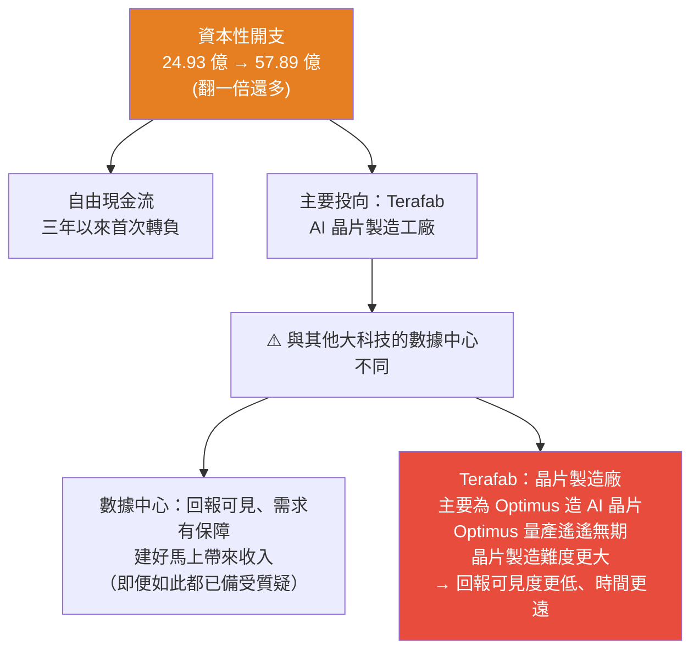
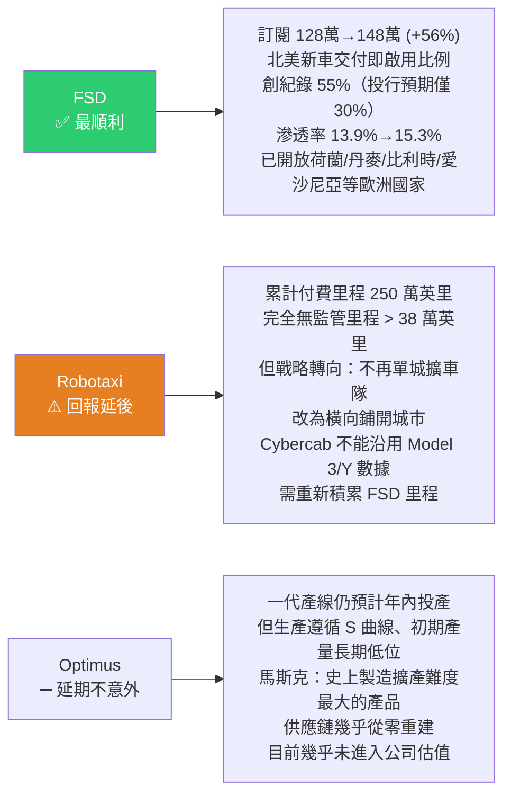

# 特斯拉暴跌 20% 拆解:資本開支才是恐慌根源,以及「大跌後持有半年 9 成賺」的歷史規律(美投君)

> ⚠️ **本筆記為觀念與財報框架整理,非投資建議。** 內容為美投君(美投讲美股)個人觀點摘要,提及個股僅為說明分析框架,不構成買賣建議;投資有風險,請自行判斷。
> 📝 該片無字幕,逐字稿以 CPU faster-whisper 轉錄取得、非官方字幕,可能有少量聽寫誤差(如 Terafab、Cybercab 等專有名詞)。

---

## 一、核心矛盾:營收三年最快,股價卻兩天暴跌 20%

開場的三個「為什麼」:
- 有人說業績不行 → **為什麼本季反而實現三年以來最快的收入增長?**
- 有人說科技故事不行 → **為什麼 FSD 卻實現空前的大爆發?**

答案不在故事,而在**財務數據的深層漏洞**。作者強調:機器人、Robotaxi 都很重要,**但沒有財務數據支撐,再好的故事也講不下去**。

### 財報數字

| 項目 | 本季 | 對照 | 評價 |
|---|---|---|---|
| 營收 | **282 億美元(+25.5%)** | 過去三年最快增速 | ✅ 出色 |
| 交付量 | **48 萬輛** | 上季 35.8 萬、去年同期 38.4 萬 | ✅ 非常出色 |
| **淨利** | **11.5 億美元(同比 −17%)** | 市場預期 18.6 億 | ❌ 大幅低於預期 |

**高銷量卻沒帶來足夠利潤**,原因有二:

### ① 毛利率下滑(但其實是「上季虛高」的錯覺)

汽車業務扣除積分後毛利率 **19.2% → 16.3%**(下滑近 3 個百分點)。照理交付量大幅超預期、毛利該升才對?

> **深挖後發現不是本季差,而是上季有水分:** 上季銷售含**報廢調整與關稅減免帶來的一次性收入**(本季沒有了),且趕上 **Model S/X 停售前搶購**(兩款高價車型拉高毛利,未來也不會再有)。
> **剔除一次性影響、再加上本季銷量提升攤薄成本 → 兩季毛利表現其實差不多**,沒有看起來那麼糟。
> ⚠️ **但反過來說**:這也意味著特斯拉的**毛利提升空間已經非常有限**,這可能就是未來的常態表現。

### ② 研發費用 +47%(四年最高)

管理層未多披露細節,只說花在 Semi 卡車、**Optimus**、**Cybercab** 等新產品研發與量產,以及**其他 AI 項目**(大概率是晶片製造廠 **Terafab**)。

> 研發提升其實不是大問題——投資人都知道現在投特斯拉就是為了這些未來科技項目。**真正不能理解的是另一項支出的大幅提升。**

---

## 二、真正的恐慌根源:資本性開支(capex)

> **這次財報季,所有大科技的財報都請記住一個關鍵詞:資本性開支。**

**更要命的是管理層的表態:**
- 特斯拉現在正處於**公司歷史上最大規模的投資階段**;
- 今年資本投入**還會超過此前預計的 250 億**(年初馬斯克已說要從 100 億增到 250 億);
- 未來還會有一筆**高達 300 億美元的債務融資**。

### 華爾街的預期大幅調整(這張圖是關鍵)

作者長期追蹤特斯拉數據,發現財報後**華爾街對自由現金流的預期出現巨大調整**:

| | 上季市場預期 | 本季財報後 |
|---|---|---|
| 負向現金流持續到 | 2026 年、**2027 年就能轉正** | **拉長一整年 → 預計到 2028 年甚至還無法恢復** |

> **作者認同這個下修:** 憑他對馬斯克的了解,**這次資本開支上調絕不會是結束,而是一系列上調的開始**;而馬斯克認定的事情要改變難度也很大。→ **未來很長一段時間,capex 都會是左右特斯拉股價的關鍵變量。**

**一句話總結財報:「沒有驚喜,全是驚嚇。」** 按馬斯克的說法是「我們要開始布局高風險、高回報的 AI 晶片了」——但分析下來,**高風險是實的,高回報卻是虛的**。

---

## 三、三大科技敘事:一順、兩延

### FSD —— 出乎意料的好,已到「量變到質變的轉折點」
- 訂閱用戶 128 萬 → **148 萬(+56%)**;
- **北美新車在交付時就啟用 FSD 的比例創紀錄達 55%**(遠高於主流投行預期的 30% 左右)→ **說明越來越多消費者是為了 FSD 才買特斯拉**;
- 滲透率 13.9% → **15.3%**,加速上升 → 不只新車用戶訂閱,**存量老用戶也在被轉化**;
  - (滲透率絕對值不用太在意:FSD 訂閱主要來自北美,其他地區不能訂或有限制,而特斯拉的口徑是**全部車主**的訂閱比例,天然偏低。)
- 已在歐洲開放荷蘭、丹麥、比利時、愛沙尼亞等多國,未來注定更多 → **增長與滲透仍有提升空間**。

### Robotaxi —— 數據在漲,但**戰略轉向讓變現延後**
- 累計付費行駛里程 **250 萬英里**,其中完全無監管里程超 **38 萬英里**,預計以每週兩位數百分比速度增長;
- **最大變化不在數據,而在戰略**:不再執著於單一城市擴張車隊,改為**橫向鋪開不同城市**。好處是積攢勢能、為 Cybercab 上路做鋪墊;**缺點是進一步延緩大規模變現的時間**(管理層說先用小車隊在單一城市把問題解決,再考慮擴車隊);
- **Cybercab**(無方向盤、無踏板的 Robotaxi 專用車型)已於二季度投產、7 月服務擴展至 Miami、坦帕、奧蘭多;**但財報會暴露問題:Cybercab 不能沿用 Model 3/Y 的數據,需要重新積累 FSD 里程數據** → 上線可能進一步延期。
- **結論:相比市場原先預期「明年年初即可商業化」,回報落地時間又一次大幅延後。**

### Optimus —— 延期不意外,影響也相對小
- 上季就已宣布延期,本季依舊沒有好消息;一代產線仍預計年內投產,但**生產遵循 S 曲線、初期產量將在相當長時間維持低位**;
- 馬斯克再次強調 **Optimus 是特斯拉有史以來製造擴產難度最大的產品,沒有之一**(機器人身上一切都是全新的、供應鏈幾乎從零重建、機器手部的精細度要求更高工藝);
- 作者判讀:**馬斯克反覆鋪墊困難,很可能是在暗示無論內部使用或外部交付都需要更長時間**;
- ⚠️ **從資本角度,這部分業務目前幾乎完全沒有進入公司估值**(華爾街清楚落地不確定性太多、時間太遠)→ 所以它的好壞**比 FSD 和 Robotaxi 重要性低得多**。

---

## 四、作者的判斷:短期仍被動,但長期邏輯未變

### 短期:兩股壓力還會加大

> **一邊是燒錢越燒越多,一邊是兌現越推越遠——股價跌 20%,一點也不冤。**

1. **資本開支風險逐步加大**:
   - **宏觀**:加息預期越來越高,而特斯拉明確表示未來要**再借 300 億美元債務**——在利率上行環境借錢成本顯然更高;疊加新增資產折舊,**利潤端和現金流端都會承受巨大壓力**;
   - **金融市場**:現階段市場對「投入加大」極其敏感(這不是特斯拉一家的事,是所有大科技的通病),而**特斯拉的投入回報比其他公司更晚、不確定性更強** → 會繼續增加股價波動。
2. **科技敘事短期難有質變**:
   - FSD 表現確實不錯,**但體量太小、缺乏業績爆發力**;靠地區擴張速度太慢、靠存量滲透實現質變難度太大;
   - 真正的重點是 **Robotaxi**(短期最可見、想像空間最大),但公司戰略上**並不急於全力商業化**,而是一步一腳印安全布局。

> 🔑 **「這個戰略換誰都該這麼做,但問題是馬斯克不一樣」:** 他的風格是**先把大話說出去**激勵員工與市場,然後在運營中不斷調整;而華爾街每次一拿到預期就**牢牢照著重估**、股價蹭蹭往上漲;之後管理層運營時發現達不到、再調整預期,股價也得跟著調整。**現在就是 Robotaxi 典型的「預期調整期」**——實際鋪城市過程中困難肯定比想像多,預期大概率還會進一步延後。

### 🔎 對馬斯克的獨到觀察(本篇最有意思的一段)

有人會說「馬斯克最厲害的就是抓執行、能讓不可能變可能」。作者看過馬斯克所有傳記後的感受是:

> **馬斯克的過人之處不在於執行力,而在於他極致的冒險能力。** 往往事情越有挑戰、風險越高、給他生死存亡的壓力越大,他就越能爆發出驚人的執行力去完成不可能的事。**但反過來,如果事情平穩推進,他會很快失去興趣**——當年 Solar City 被遺棄就是典型例子,他自己也親口承認「事情發展順利會讓他陷入迷茫、喪失動力」。或許這也是為什麼我們總看到他頻繁陷入爭端、參與推特收購、甚至參與政治——**這些都是他尋求 motivation 的方式**。

**這對當下的意義:** 特斯拉現在其實沒有太多挑戰了,最難攻克的技術問題已步入正軌,**接下來是漫長的監管批文與實際測試——這些正是馬斯克「拉鏈式動員」解決不了的問題**(你總不能拉著政府官員跟你一起睡辦公室批文件)。

> **所以現在對投資者而言,不是迷信馬斯克執行力的時候,而是期待他少整幺蛾子的時候。**

### 長期:買特斯拉,買的到底是什麼?

作者認為當下最關鍵的一件事,是想清楚你買的是什麼。對他而言是兩點:

1. **當前市場上唯一的「物理 AI」標的** —— 從 FSD 到 Robotaxi 再到 Optimus,**本質是同一套物理 AI 能力在不同場景下的落地**;作為唯一標的會**持續享受稀缺性溢價**。
2. **FSD 與 Robotaxi 的市場空間巨大且一定能兌現** —— 尤其 Robotaxi 是**萬億級的出行市場**,網約車滲透率還不到 1%;儘管進度推遲,但兩大產品的商業化**已經開始推進**,**已不再是兩年前賣故事的階段,而是隨時可能發生的結構性變化**。

> **只要這兩點不變,整個投資邏輯就不會改變。短期風險確實要應對,但過於在意短期風險而忽視長期機會,機會成本也非常高昂。**

---

## 五、歷史統計:特斯拉單日大跌後,持有多久勝率最高?

作者統計特斯拉**上市以來單日跌幅超過 10% 的全部大跌**,以及之後不同時間段的股價表現:

| 大跌後持有 | 上漲機率 | 中位數漲幅 | 解讀 |
|---|---|---|---|
| **1 週 / 1 個月** | 約 **7 成** | 一週後約 **+5%** | **恐慌情緒往往還要再發酵一陣** |
| **3 個月** | **8 成以上** | **+26%** | 勝率與收益明顯改善 |
| **半年** | **9 成** | **+64%** | 最明顯 |

> **也就是說:特斯拉歷史上股價大跌之後買入並持有半年,有九成機率能賺錢,而且賺不少。**

**作者結論:** 這次二季度財報後跌 20%,更像是一個**可以慢慢開始布局的時間點**。對特斯拉這種**靠敘事驅動、波動巨大**的標的,最好的投資時點就是**情緒最差、市場最悲觀的時候**——這時勝率與安全邊際都足夠高。「**真正的安全邊際,就藏在市場最恐懼的時刻**」;在悲觀時逆勢布局並耐心持有,**輸掉的最多只是時間,而大概率不會輸錢**。

> ⚠️ **但也誠實承認:科技敘事本身幾乎無法預測**——它取決於馬斯克的嘴,也取決於市場情緒。唯一能確定的是「在一個明確有極高價值的機會上,越是情緒低點、越悲觀,則越是好的買入機會」。

---

## 六、應用案例(這個框架怎麼用)

1. **看財報先分「一次性」與「常態」:** 本季毛利率看似崩了 3 個百分點,但拆開發現是**上季有一次性收入 + 停售搶購**墊高基期。**別把「基期異常」誤讀成「本季惡化」**——反過來也要問「那上季的好是不是也是假的」(作者上一季就已提醒過)。
2. **2026 年看大科技財報,盯「資本開支 + 自由現金流」而非只看 EPS:** 這是全體大科技的共同關鍵詞。特別要分辨 capex 投向的**回報可見度**——數據中心(需求有保障、建好就有收入)vs Terafab 這種為尚未量產產品造晶片的工廠(回報更遠更不確定)。
3. **追蹤「賣方預期的位移」而非只看當期數字:** 作者的做法是每季抓一次華爾街自由現金流預期曲線,結果發現轉正時點**被整整推後一年**——這種「預期位移」往往比單季 EPS 更能解釋股價反應。
4. **區分「已進入估值」與「尚未進入估值」的業務:** Optimus 目前幾乎未進入估值 → 它延期對股價衝擊小;FSD/Robotaxi 才是已被計價、預期一動股價就動的部分。**評估利空時先問:市場到底有沒有為這件事付過錢?**
5. **對「敘事驅動 + 高波動」標的,用歷史大跌後的勝率分布決定持有期:** 若統計顯示 1 週勝率僅 7 成、半年 9 成,那**在大跌後進場就該預設以季度為單位持有**,而不是期待一週反彈——這能避免「買在恐慌、賣在二次探底」。

---

## 七、重點回顧(TL;DR)

- **矛盾**:營收 282 億(+25.5%,三年最快)、交付 48 萬輛,但**淨利 11.5 億(−17%)遠低於預期**。
- **利潤被壓兩因**:①毛利率 19.2%→16.3%,但**主因是上季虛高**(一次性收入 + Model S/X 停售搶購),剔除後兩季差不多——**但也代表毛利提升空間已很有限** ②研發費 +47%(四年最高)。
- **真正的恐慌根源 = 資本開支**:24.93 億 → **57.89 億**(翻倍多),**自由現金流三年來首次轉負**;主投 **Terafab AI 晶片廠**(為 Optimus 造晶片,回報可見度低、時間遠);管理層稱「**歷史上最大規模投資階段**」、今年超 250 億、還要**借 300 億債務**。華爾街把 FCF 轉正預期**從 2027 推到 2028 甚至更後**。
- **三大敘事**:FSD **最順**(訂閱 +56%、新車啟用率創紀錄 55%、滲透率 15.3%、歐洲擴張)/ Robotaxi **回報延後**(戰略改橫向鋪城市、Cybercab 需重新累積數據)/ Optimus 延期但**幾乎未進入估值**、影響小。
- **短期**:燒錢越多、兌現越遠 → 跌 20% 不冤;宏觀(加息 + 借 300 億)與市場(對投入加大極敏感)雙重壓力還會加大。
- **對馬斯克的觀察**:過人之處**不是執行力而是極致冒險能力**;事情平穩他反而失去興趣(Solar City);而現在剩下的是監管批文與測試——**不是迷信他執行力的時候,而是期待他少整幺蛾子的時候**。
- **長期邏輯**:①唯一的**物理 AI** 標的(FSD/Robotaxi/Optimus 是同一套能力的不同場景)享稀缺溢價 ②Robotaxi 是**萬億級市場、滲透率不到 1%**,已從賣故事進入結構性變化。
- **歷史規律**:單日跌 >10% 後,**1 週勝率 ~7 成(+5%)、3 個月 8 成(+26%)、半年 9 成(+64%)** → 敘事驅動標的,最好的買點在情緒最差時,**輸的最多是時間**。

---

## 來源

- 影片:[财报深度分析:特斯拉暴跌的惊人规律?跌幅还没到头!但买点已经清晰!(美投讲美股 @MeiTouJun,2026-07-26)](https://youtu.be/-_U4YHElE2k)
  - ⚠️ 該片無字幕,逐字稿以 **CPU 版 faster-whisper(small)** 轉錄取得、**非官方字幕**,可能有少量聽寫誤差。
- 延伸對照(本庫):[特斯拉財報深挖:FSD 拐點/造芯片/四象限/SpaceX 合併風險(上一季)](./tesla-earnings-fsd-chip-spacex-four-quadrant.md)、[加息會引發美股大跌嗎?2000 泡沫三階段對照 AI](../strategy/us-stocks-rate-hike-three-stages-ai-vs-2000.md)、[AI 產業秘密轉向:C→B、算力成勝負手](./ai-industry-shift-c-to-b-compute-decides.md)
