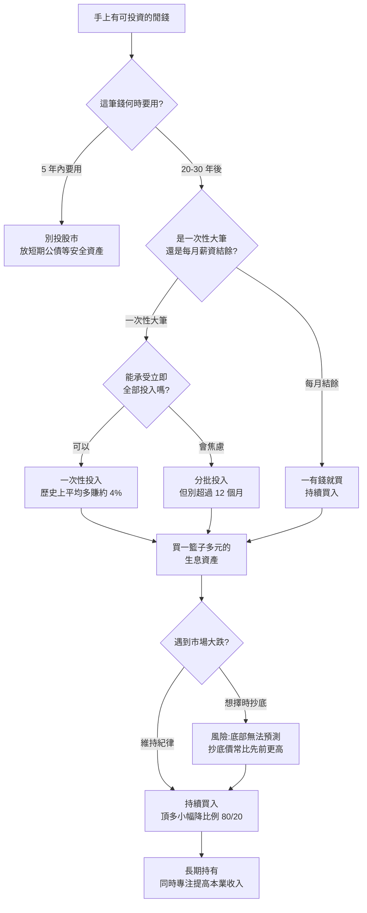

# 在瘋狂股市裡,你還該「持續買入」嗎?——Nick Maggiulli 訪談筆記

**主題分類:** 投資 / 資產配置
**影片:** [在當下瘋狂的股市裡,你應該持續買入嗎?對話『Just Keep Buying』作者 Nick Maggiulli](https://www.youtube.com/watch?v=4j1omjaRu0A)
**頻道:** 一口新聞 MoneyXYZ ｜ **片長:** 約 55 分鐘
**來賓:** Nick Maggiulli(《Just Keep Buying / 持續買進》作者、資料科學家,現年 36 歲)

> **資料來源:** 本筆記依據影片**完整逐字稿**整理,屬精確摘要(非二手還原)。內容為來賓個人觀點,非投資建議。

---

## 0. 一句話總結

> **「持續買入一籃子多元的生息資產(The continual purchase of a diverse set of income-producing assets)。」**

這是全書的核心咒語。即使作者本人因 AI 估值而首度轉趨保守(把退休帳戶從 100% 股票調成 80/20),他強調自己**從未停止買入**——保守只是「買少一點」,不是「賣光」。

---

## 1. 此刻該不該買?關鍵是「時間軸」

- **需要在 5 年內用到的錢:絕對不要買股。**
- **20~30 年後才用的退休金:該買。** 因為「市場會用很多方式給你驚喜」。
- 一切取決於你**多久後需要這筆錢**,而不是市場現在多高。

---

## 2. 他為什麼一年內從「看空」翻回「看多」

- **一年前轉空(生平第一次):** 因為 AI 估值看起來太瘋。他把股票部位**降了 20%**,退休帳戶從 **100% 股票 → 80/20**。如今他反問自己「當初幹嘛這樣做」。
- **看空的觸發點是「市銷率(P/S)」:** 他把 **Nvidia 的 P/S 疊上 1999 年微軟的 P/S,兩條線幾乎吻合**,讓他想起 2021 的既視感(SPAC 重現等)。
- **為何看 P/S 而非 P/E:** 盈餘(earnings)可用會計手法操弄;**營收(sales)很難造假,造假等於詐欺**,極少人做。所以他更信任營收這個指標。
- **翻多的原因——成長真的來了:** Anthropic 的年化經常性收入(ARR)**一年內從 30 億美元衝到 450 億美元**。這種荒謬的成長超出他想像,讓他認知到自己「看空看錯了」。翻多不是某一刻,而是「慢慢意識到自己錯了」。
- **對 AI 的總結:** **同時是過度投資、也是典範轉移**——兩者皆真,所以才令人困惑。「如果答案很明顯,我們就不會在這裡辯論了。」

---

## 3. 「持續買入」的信念從哪來?(回應「這只是模式識別」)

- 信念**不只**來自美國一個世紀的報酬。推薦延伸閱讀:**《Stocks for the Long Run》**、**《Triumph of the Optimists》**(涵蓋多國長期數據)。
- 跨多個已開發國家、長期來看,股市約能提供 **高於國庫券(無風險資產)約 4%(經通膨調整)** 的報酬。
- 美國長期約為**高於通膨 7%**,但他**預期未來只有 4%**,不期待 7% 重演。
- **信念的真正來源 = 分散 + 人類長期生產力趨勢**(自工業革命以來持續增產,他認為趨勢不會停)。
- 對「這是模式識別」的回應:**「那什麼不是模式識別?」**看財報看營收成長也是模式識別。

---

## 4. 行為偏誤與「小小地犯點戒」

- 他坦承**對房地產有偏見**:親歷 2008,南加州房價兩年內 $250k → $600k 後崩盤,自家親戚淪為「溺水屋」(房貸 > 房價)。
- 對治偏誤的方法叫 **「小小地犯點戒(sinning a little)」**(源自 Cliff Asness):要做戰術調整(如 100% → 80/20)就**只小幅調**,**絕不孤注一擲**。
- 做**微調**讓自己晚上睡得著,又不會對長期造成大錯。「100% 股票」或「100% 現金」這兩種極端**心態都是失敗**——要待在中間,漲了開心、崩了也活得下去。
  - 1929 年 100% 股票會被毀滅;1980 年 100% 現金接下來 20 年也會被毀滅。**唯一解是分散。**

---

## 5. 為什麼「等回檔再買(buy the dip)」是輸家思維

- **核心反駁:** 等到回檔真的來時,價格**往往還比你當初能買的更高**。
- **2017 年的例子:** 有人說要等大崩盤再買,一路等到 2020 年 3 月。**就算他完美抄在 2020/3/23 的絕對底部(較高點 -33%),買入價仍高於 2017 年初**他原本就能買的價位。
- 人們**從不回頭記錄/檢查**:你今天不買、等下次回檔,那個價格真的比今天低嗎?多數人沒寫下來、沒驗證過。
- **最致命的盲點——「跌了還會再跌」:** 大蕭條時,市場已跌約 50%,看似抄底良機;結果 **1931 到 1932 年夏天的底部,又再跌了 60%**。重壓抄底可能極快摧毀資本。

---

## 6. 現金、賣出與獲利了結

- **該持有現金的唯一理由 = 真實需求:** 緊急預備金、買房頭期款、婚禮等。他自己正為**買房**囤短期國庫券(T-bills),且因利率 6~7%,想多存一點、壓低貸款額。
- **「為了等回檔」而抱現金:數據不支持。** 統計上你多半會買在更高的價格。
- **獲利了結:先問「為什麼賣」。** 為了真實需求或為了分散 → 合理;**單純為了了結而了結 → 沒意義,且多半是應稅事件。「如果你不知道為何而做,就不該做。」**

---

## 7. 為什麼不要重押個股(三個論點)

巴菲特自己選股,卻建議一般人別選股;Nick 同意。若你享受選股,**控制在投資組合的 5~10%** 就好。

1. **績效論(performance):** 約 **70~80% 的專業經理人,五年內贏不過基準指數**(參見 SPIVA 報告)。
2. **存在論(existential):** **你分不清自己是「有實力」還是「運氣好」**——可能要好幾年甚至十年才看得出來(打籃球一分鐘就知道誰強,選股卻不行)。
3. **時間價值論(他認為最強):** 對多數人(尤其資金少的人),**一小時拿去精進職涯/副業賺的錢,遠多於研究個股**。
   - $1,000 賺 10% = $100(微不足道);$1,000,000 賺 10% = $100,000(等於一份好工作)。**選股研究只有在你已經很有錢時才划算。**

---

## 8. 「先變有錢,才靠股市變更有錢」——收入才是關鍵

- 名言:**「儲蓄是給窮人的,投資是給有錢人的。」**年輕時請**專注提高收入**。
- 提高收入**不容易**,但要用**長期職涯**的角度經營。他自己**寫作頭三年完全沒賺錢**,後來才有廣告、出書、演講收入。
- **與財富最相關的變數是「收入」,沒有爭議。** 他為台灣的「持續買進」課程看過台灣財務數據:**儲蓄率與收入正相關**(收入越高、存得越多、能投資的也越多)。
- 致富最常見的兩條路:**長期高收入職涯 + 儲蓄**,或**持有企業股權**(創業/新創股權後出售)。**純靠買股票致富很罕見**(運氣或稀有技能)。
- 給年輕投資人的殘酷真相:市場現在多高**對你影響不大**(反正你能虧的本金不多)。**專注職涯**。而且——**寧可在投資生涯「開頭」遇到糟糕的十年,而非「結尾」**:開頭錢少,之後複利反而讓你買在更便宜處、累積更多。他說「我寧願當今天的年輕投資人,也不要回到 2012 年開始」。

---

## 9. 債券、槓桿與賣選擇權

- **債券有其角色,但他只買短天期(存續期 < 5 年)。** 2021→2022 升息時,長天期債券被血洗(60/40 組合 2022 年史上最慘)。
- **ETF 的存續期陷阱:** 債券 ETF 會**每天/到期時重設存續期**,你**永遠在承擔該存續期的利率風險**,不像單一債券持有到期就歸零。歷史上**5 年期公債的「每單位風險報酬」最佳**,超過 5 年就不划算。
- **用槓桿/負債投資:關鍵在利率。** 一般而言**別做**——唯一能保證的是「你得付利息」,投資結果卻不保證。
- **賣 call(賣選擇權收權利金):** 像**「在壓路機前撿鎳幣」**、塔雷伯的**「火雞問題」**(每天被餵養、越來越肥、自信爆棚,直到感恩節被宰)。舉例 **XIV 基金**:低波動時看似穩賺,波動一爆就破產歸零。

---

## 10. 釐清「定期定額(DCA)」的兩種定義

混淆來自 DCA 有**兩種相反**的意思:

| 定義 | 內容 | Nick 的立場 |
|---|---|---|
| **A. 葛拉漢的原始定義** | 一有錢(發薪)就**持續買入**(401k 每兩週自動買) | **支持** |
| **B. 「分批攤平(averaging in)」** | 手上已有一大筆錢,**慢慢分批投入** | **反對** |

- **口訣:「買要快,賣要慢(Buy quickly, sell slowly)。」** 歷史上幾乎在所有資產類別都最賺。
- **若你是收入不穩的自由工作者/創業者(錢一筆筆進來):** 分批攤平**可以**,關鍵是**時間別拉太長**:
  - $120,000:一次投入 **vs** 每月 $10,000 分 12 個月 → 分批平均**少賺約 4%**。
  - 改成 6 個月分批 → 平均少賺**約 2%**(大約對半)。
  - **千萬別花 5 年慢慢投**,差距會變很大。
- **別「在小事上鑽牛角尖(majoring in the minor)」:** 為了 4% 而每晚睡不著不值得;選一個方法、執行,把精力放在健康、家人等更重要的事。

---

## 11. 關於 S&P 500 與被動投資

- **S&P 500 太集中科技股?** 部分是。可選**等權重 S&P**,或用**非科技國家的股票**來平衡。但 S&P 500 **仍是最分散的市場**——多數非美國市場其實**更集中**(常被一兩家巨頭主導)。
- **被動投資是泡沫嗎?自我餵養迴圈?** 美國確實人人買 S&P(401k/IRA),每兩週薪資自動買 → 形成持續買盤。但**只有經濟崩盤、大量失業**才會逆轉它。
- **被動投資沒有扭曲個股相對價格:** **Nvidia 是「主動買盤」推上去的,不是被動**(401k 裡你沒辦法單獨加碼 Nvidia)。價格發現機制仍運作良好。

---

## 12. 心理戰:在多頭裡如何不被社群媒體逼瘋

- 他**完全不受**「別人賺更多」的壓力影響——那是**偽裝過的火雞問題**。
- **這些人通常無法收手:** 加密貨幣玩家曾帳上 $10M,卻不肯賣去領 4%(每年 $40 萬)安穩過活,繼續玩到 -90%。他朋友 7 顆 Solana 猴子 NFT(約 $250~350 成本)一度逾 $100 萬,崩盤後賣得 $9 萬(300→9 萬仍很猛,但少賺一座山)。
- **社群媒體只看得到贏家**,沒人貼自己虧多少 → 造成偏誤。
- **唯一重要的成功 = 你能不能活到最後、用錢過上你想要的生活。** 別管別人,因為你只看到故事的中段,不知道結局,也分不清那是運氣還是實力。

---

## 13. 他自己的資產配置(歷程)

- **2012 起步:** 85% 股票 / 15% 美債。股票一向**美國:國際 ≈ 50/50**,國際再分**已開發/新興**各半。
- 中間一度因「受夠債券」拉到 **100% 股票**,後來又把債券加回。
- **目前:可投資資產約 80/20。** 黃金 / 比特幣 / 藝術品合計 **< 5%**(其中**比特幣固定 2%**,源自 2019 年的投資組合最佳化結果)。
- 因**買房**狂買短期公債,若把這筆計入 → 約 **65% 股票 / 35% 債券**;但他認為這筆有專門用途,不該算進風險資產組合。買到房後會**回到約 80/20**。
- 他強調:**這些變動反映人生階段(去年結婚、幾個月前生第一胎),與他對市場的看法無關。**「投資的意義是放棄現在的消費,換取未來的消費——若你永遠用不到,那只是大富翁紙鈔。」

> 註:比特幣固定 2%、黃金/藝術品等非生息資產合計 < 5%,屬主架構外的衛星配置,未納入上方示意圖。

---

## 14. 決策流程圖:我現在該怎麼做?

---

## 15. 關鍵啟示(Takeaways)

1. **持續買入一籃子多元生息資產**——這是貫穿一切的核心紀律。
2. **時間軸決定一切**:5 年內要用的錢別碰股市;退休金則該持續買。
3. **擇時是輸家遊戲**:等回檔常買得更貴,跌了還會再跌(大蕭條再跌 60%)。
4. **收入 > 報酬率**:年輕時專注職涯;與財富最相關的是收入,不是選股。
5. **別重押個股**:控制在 5~10%;80% 經理人輸大盤,且你分不清運氣與實力。
6. **買要快、賣要慢**;分批攤平可以,但別拖過一年。
7. **只為真實需求持有現金**;獲利了結要有明確理由。
8. **債券買短不買長**;遠離槓桿與賣 call(火雞問題)。
9. **唯一的成功是「活到最後、過上你要的生活」**——別被社群媒體的贏家偏誤綁架。
10. **連專家都會看錯方向並修正**——用紀律與分散取代預測。

---

## 附錄:延伸閱讀(影片中提及)

- 《Just Keep Buying / 持續買進》— Nick Maggiulli(本人著作)
- 《The Wealth Ladder》— Nick Maggiulli(片尾出現的新書)
- 《Stocks for the Long Run》— Jeremy Siegel
- 《Triumph of the Optimists》— Dimson, Marsh & Staunton
- 概念出處:Cliff Asness「sinning a little」、Nassim Taleb「火雞問題」

## 來源

- [影片:在當下瘋狂的股市裡,你應該持續買入嗎?(YouTube)](https://www.youtube.com/watch?v=4j1omjaRu0A)
- 影片完整逐字稿(由使用者提供)
- [《持續買進》讀後心得(閱讀前哨站)](https://readingoutpost.com/just-keep-buying/)
- [博客來:持續買進](https://www.books.com.tw/products/0010957881)
