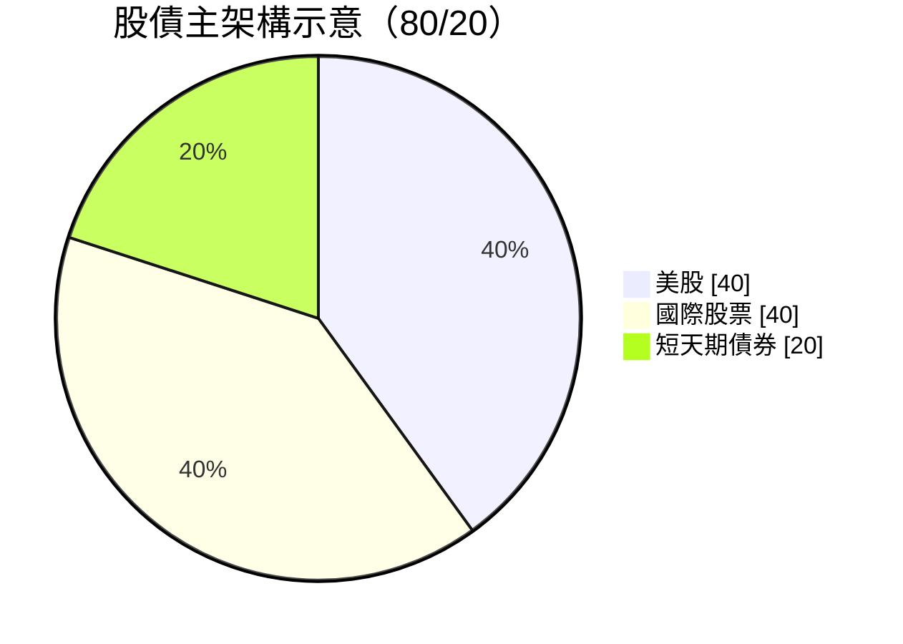
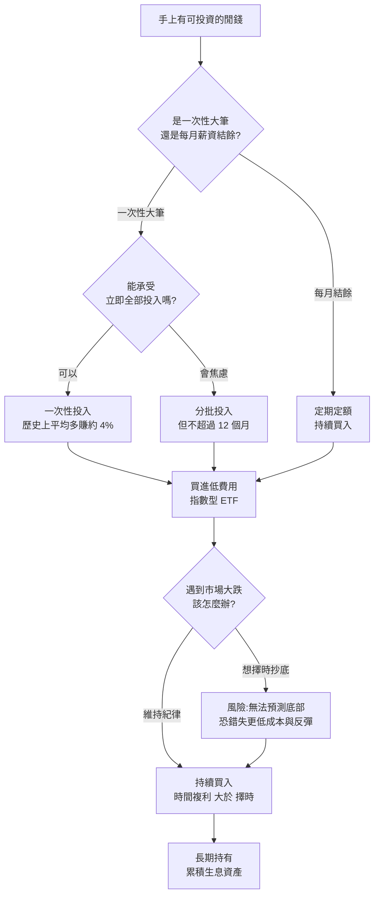

# 在瘋狂股市裡,你還該「持續買入」嗎?——Nick Maggiulli 訪談筆記

**主題分類:** 投資 / 資產配置
**影片:** [在當下瘋狂的股市裡,你應該持續買入嗎?對話『Just Keep Buying』作者 Nick Maggiulli](https://www.youtube.com/watch?v=4j1omjaRu0A)
**頻道:** 一口新聞 MoneyXYZ
**來賓:** Nick Maggiulli(《Just Keep Buying / 持續買進》作者、資料科學家)
**整理日期:** 2026-05-22

> **資料來源說明:** 本筆記無法直接取得影片逐字稿,內容係綜合「影片標題與主旨」、「動區動趨對此場訪談的專文報導」以及《持續買進》一書的既有論點還原而成,並非逐字稿摘要。具體數據以受訪者說法為準,投資前請自行查證。

---

## 1. 一句話總結

即使是「無腦持續買入」的提倡者,在 AI 估值狂飆下也首度轉趨保守,把退休帳戶從 **100% 全股** 調整為 **80/20 股債**;但他強調——**對絕大多數人而言,持續買入、時間複利,仍勝過試圖擇時。**

---

## 2. 為什麼作者自己「也怕了」?

- 這是 Nick 自出書以來 **第一次轉趨悲觀**,觸發點是 **AI 估值飆漲**。
- **看跌的理由:** Nvidia 的市銷率(P/S)與 1999 年的微軟「簡直一模一樣」,他形容「這看起來比網路泡沫(dot-com)還瘋狂」。
- **後來翻多的理由:** Anthropic 的年化經常性收入(ARR)「**一年內從 30 億美元衝到 450 億美元**」,成長超出他預期,讓他承認自己看跌的判斷可能錯了——他形容這是「慢慢意識到自己錯了的過程」。

> 重點不是「他看多或看空」,而是:**連專家都會看錯方向、並反覆修正**,這正是不該把身家壓在單一方向判斷上的理由。

---

## 3. 核心策略:一次性投入 vs 定期定額

| 比較項目 | 一次性投入(Lump Sum) | 分批 / 定期定額(DCA) |
|---|---|---|
| 歷史期望報酬 | 平均 **多賺約 4%** | 略低約 4% |
| 心理感受 | 投入後若下跌易焦慮 | 較有安全感、較好執行 |
| Nick 的建議 | 數學上較優 | 若能幫助你「真的執行下去」,損失 4% 可接受 |

**結論:** 分批投入可以,但 **不要超過 12 個月**;最重要的是「持續執行紀律」,而不是停在場外等待。

---

## 4. 為什麼不要「等崩盤再抄底」?

- **反例:** 2017 年就開始等崩盤的人,即使在 2020 年 3 月疫情股市重挫(約 -33%)時 **完美抄到底部**,買入價 **仍高於** 2017 年原本就買得到的價位。
- **致命盲點:** 沒人能預測「底部在哪」。歷史上 1931 年大蕭條後,市場還能 **再跌約 60%**——你以為的低點可能只是半山腰。
- **核心信條:** **「待在市場裡的時間(time in the market)」勝過「擇時進場(timing the market)」。**

---

## 5. 為什麼反對買個股?(三層理由)

1. **勝率低:** 約 **80% 的專業基金經理人**,五年內跑不贏基準指數。
2. **難辨真假本事:** 選股賺錢往往分不清是「實力」還是「運氣」。
3. **時間價值最關鍵:** 花一小時 **精進技能或經營副業收入**,長期報酬通常高於花同樣時間研究個股。

**替代方案:** 低費用、被動式的 **指數型基金 / ETF**。

---

## 6. 給年輕 / 早期職涯者的提醒

- 早期階段,**提高儲蓄與收入** 的影響力 > 追求高投資報酬率。
- **節流有極限,開源沒有上限**——收入成長空間遠大於省錢空間。

---

## 7. Nick 個人資產配置(訪談揭露)

- **股票 80%**:美股與國際股票約各半。
- **短天期債券 20%**。
- **比特幣固定 2%**(基於 2019 年的最佳化結果)。
- **黃金等非生息資產 ≤ 5%**。

> 註:比特幣 2%、黃金 ≤5% 為主架構外的衛星配置,未納入上方示意圖。

---

## 8. 決策流程圖:我現在該怎麼做?

---

## 9. 關鍵啟示(Takeaways)

1. **持續買入仍是散戶的最佳預設策略**,即使作者本人短期轉保守。
2. **擇時是輸家遊戲**:抄底的數學期望值,通常不如「立刻且持續投入」。
3. **分散優於集中**:用指數 ETF 取代個股,把省下的時間拿去增加本業/副業收入。
4. **配置可微調、紀律不可破**:80/20 也好、100/0 也好,真正決定結果的是「能否長期堅持」。
5. **連專家都會看錯方向**——這正是用「制度與紀律」取代「預測」的最佳理由。

---

## 來源

- [影片:在當下瘋狂的股市裡,你應該持續買入嗎?(YouTube)](https://www.youtube.com/watch?v=4j1omjaRu0A)
- [《持續買入》作者也怕了!Nick Maggiulli 坦言減倉 20%(動區動趨)](https://www.blocktempo.com/nick-maggiulli-just-keep-buying-ai-bubble-bearish-portfolio-dollar-cost/)
- [《持續買進》讀後心得(閱讀前哨站)](https://readingoutpost.com/just-keep-buying/)
- [博客來:持續買進](https://www.books.com.tw/products/0010957881)
