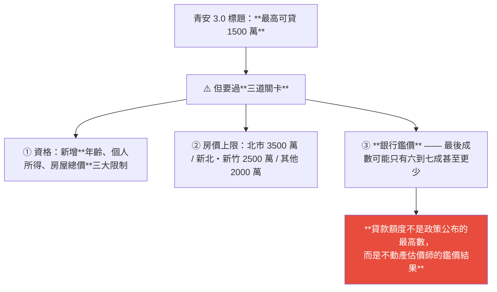
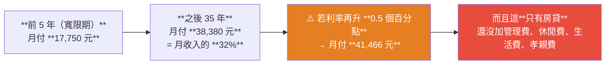
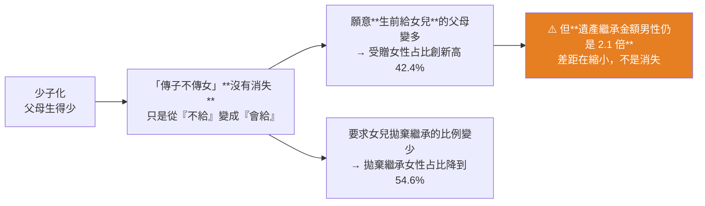

# 青安 3.0 上路:為什麼「最高 1500 萬」多半貸不滿?以及財政部繼承數據透露的性別轉變

> ⚠️ **本文為教育與知識整理用途,非投資或財務建議。政策條件、額度與稅制請以主管機關最新公告為準。**
>
> 整理自 **TVBS NEWS**〈十點不一樣〉2026-08-06 節目段落(約 23 分鐘)。本文聚焦兩個主題:**青安 3.0 房貸新制**與**財政部遺產/贈與統計的性別變化**;節目另有一段 2027 年度總預算,列在最後。

---

## 一句話總結



---

## 一、青安 3.0:條件其實變嚴了

**2026 年 8 月正式上路**,各部會強調這次希望「讓這些人真正有感」。

| 項目 | 內容 |
|---|---|
| **新增三大限制** | **年齡、個人所得、房屋總價** |
| 一般戶 | 最高仍為 **1,000 萬** |
| **新婚或育兒家庭** | 調高到 **1,200 萬 – 1,500 萬** |

### ⚠️ 房屋總價上限(這是很多人忽略的一關)

| 區域 | 上限 |
|---|---|
| **台北市** | 3,500 萬 |
| **新北市、新竹縣市** | 2,500 萬 |
| **其他縣市** | 2,000 萬 |

### ⭐ 真正的關卡:銀行不一定讓你「貸好貸滿」

> **銀行最後計算貸款金額,不是政策公布的最高數,而是要看不動產估價師的鑑價。**
>
> **就算資格上說你能貸到 1,500 萬,最後額度可能依舊只有六到七成,甚至更少。**

**業者提到銀行會針對性保守的情況**:

- **新建區域、推案量比較多的區域** —— 銀行會擔心是否有崩盤現象,因而**採取比較保守的成數**;
- 理由是萬一該區未來出現大量銷售潮或進入法拍潮,**貸款戶無力償還時,房子終究會進入法拍市場**。

> 節目提到過去的重劃區/新興區段都出現過這種現象。

**還有一個買家常忽略的落差**:雖然可以透過實價登錄看到周邊成交案例,**但「屋主賣的價格」跟「銀行認定的房屋價值」之間有落差** —— 這就是自備款必須多準備、不能全然依賴青安政策的原因。

---

## 二、⭐ 試算:數字攤開來看比較清楚

節目給的情境:**夫妻家庭月收入合計 12 萬,看中 2,000 萬的房子,貸 1,200 萬、40 年期、用上 5 年寬限期。**



**專家給的判準:**

> **房貸不要超過整個家庭月收入的 30% —— 30% 才是健康的水位。**
>
> **「未來的事情有很多,不是單只算你現在腳步跨得起,就決定要不要買。」**

### 節目採訪到的兩種民眾心聲

- 「背三四十年房貸,生活支出就要變得小心翼翼;想存一筆錢也沒辦法,也沒辦法好好照顧自己、偶爾出國吃大餐 —— 壓力太大了。」
- 「貸好貸滿到 1,500 萬**還要生小孩**,算一算其實有點不太划算,因為生活支出會更多。」

> 節目的收尾很直接:**想買房時真正要思考的是「扣除房貸,你能拿來生活的還剩下多少」。**

---

## 三、財政部繼承/贈與統計:傳子不傳女在鬆動,但沒消失

| 指標 | 數字 |
|---|---|
| **遺產拋棄繼承人數** | **9.1 萬人** |
| └ 女性占比 | **54.6%** —— 仍高於男性,**但創 2008 年統計以來新低** |
| **生前贈與受贈人數** | **27.7 萬人** |
| └ 女性占比 | **42.4%** —— **創歷史新高** |
| ⚠️ **遺產繼承金額** | **男性仍是女性的 2.1 倍** |

### 專家的解讀:關鍵是少子化



### ⭐ 實務上的「房子留兒子、現金留女兒」未必誰贏

節目訪到的王先生:**兩年內接連經歷父母過世,繼承房產卻意外觸及政府的打房政策**。

> **在現代不動產政策與稅制下,拿到房產未必就是贏家。**

### 「家產不落外姓」的隱形壓力仍在

節目提到仍有家族因重男輕女而**要求女性拋棄繼承**。律師與財務規劃師的三點提醒:

| 建議 | 內容 |
|---|---|
| **法律保障** | **法律賦予每個繼承人平等的權利**;即便長輩立下遺囑偏重某一方,**法律對各繼承人的保障依然存在**(特留分制度) |
| **配偶是主要繼承人** | 節目採訪的張先生一家由母親與兄妹三人**共同商議、公開處理**,打破傳統性別分配 |
| **提前布局** | 若想避免手足對簿公堂,**必須善用理財工具提前規劃**,而不是等事情發生 |

> 收尾:**財富傳承是每個家庭終將面對的課題;提早溝通、善用法律,才能讓家產成為對子女的祝福。**

---

## 四、附:2027 年度中央政府總預算(節目第二段)

| 項目 | 數字 |
|---|---|
| 歲入 | 約 **3.8 兆元** |
| 歲出 | 約 **3.6 兆元** |
| 特點 | **雙雙創歷史新高,且歲入大於歲出** |
| 還債 | 編列約 **2,000 億元債務還本、不舉債** —— 節目稱「**40 年僅見**」 |
| 所得稅收 | 整體**首度突破 2 兆**,成最大動能 |
| 證交稅 | 上半年 **3,336 億元**(已超過去年一整年),全年可望破 **6,000 億** |
| 國防 | 爭取突破 **1 兆元** |
| 老農津貼/國民年金調高 | 規模約 **1.2 兆元** |
| 科技預算 | **1,768 億元**(投入 AI 新時代建設與五大新興產業) |
| 公共建設 | **3,000 多億元**,創近 10 年新高 |

**專家提出的兩點提醒:**

1. **稅收高度依賴景氣**(證交稅來自台股活絡、所得稅來自企業盈餘與 AI 產業成長)—— **景氣反轉時怎麼辦?預算應保留彈性、把遊戲規則講清楚**,否則今年好明年差,受影響的是領補助與福利的群體。
2. **稅入大於稅出時「還稅於民」看似人人受惠,但並非如此** —— 就財政永續而言**應該先還債**(債務會一直延續);**現金補貼與一次性補貼成效有限,應做長期性、能帶動滾動效果的投資**。

⚠️ 節目提到:2027 年度預算將於 8 月底送立法院,**但 2026 年度總預算仍在審議中**,可能罕見出現「今年度預算逾期審議」的狀況。

---

## 五、應用案例

### 案例 1|先算「扣掉房貸還剩多少」,而不是「我最多能貸多少」

這是節目最核心的翻轉。多數人的順序是「查最高額度 → 找對應總價的房子」,正確順序應該倒過來:

```
① 家庭月收入 × 30% = 房貸上限（專家建議的健康水位）
② 用這個數字反推可負擔的貸款總額（記得用寬限期結束後的月付計算）
③ 再壓力測試：利率 +0.5%、+1% 會變成多少？
④ 加上管理費、車貸、生活費、孝親費、育兒成本後還剩多少？
⑤ 最後才決定看哪個價位的房子
```

⚠️ **關鍵陷阱是寬限期**:節目例子裡前 5 年月付 17,750,之後跳到 38,380 —— **翻了超過一倍**。用寬限期的數字評估負擔能力是危險的。

### 案例 2|把「銀行鑑價」列為買房前的必查項

**政策額度 ≠ 你拿得到的錢。** 實務上要提前確認:

- 這個區域是不是**新建/推案密集區**?(銀行可能對此保守)
- 屋主開價與**實價登錄成交價**的落差多大?
- **先找銀行做預估**,再決定自備款要準備多少。

**節目的結論很實際:自備款恐怕還是得多準備,不要全權依賴青安政策。**

### 案例 3|繼承議題:提前溝通的成本遠低於事後爭訟

節目採訪的第一位民眾提到:**家庭成員單純、繼承內容也單純(主要是不動產),仍花了將近兩年、大量力氣在跑流程。**

**可以提前做的事:**

| 動作 | 為什麼 |
|---|---|
| **清點長輩的動產與不動產** | 受訪者提到最大困難之一就是「不確定長輩到底有多少財產」 |
| **理解特留分** | 即使有遺囑,法律對各繼承人仍有保障 —— 知道這點才能有效溝通 |
| **不要預設「拿房子比較好」** | 繼承房產可能觸及打房政策與稅制,**未必是贏家** |
| **善用理財工具提前布局** | 財務規劃師的建議:與其事後對簿公堂,不如提前規劃 |

### 案例 4|數據解讀的示範:差距在縮小 ≠ 差距消失

這則新聞是很好的統計解讀練習:

- **拋棄繼承女性占比 54.6%(創新低)** + **受贈女性占比 42.4%(創新高)** → 容易讓人下結論「性別差距解決了」;
- **但同一份數據裡,遺產繼承金額男性仍是女性的 2.1 倍。**

> 專家的解讀也很精準:**「傳子不傳女其實還是沒有消失,只是從『不給』變成『會給』。」**

**看任何「創新高/創新低」的數據時,都應該問:那絕對水準是多少?**

### 案例 5|⚠️ 這篇資料的使用限制

| 限制 | 說明 |
|---|---|
| **新聞轉述,非一手法規** | 額度、資格與房價上限均為節目說法,**實際條件請以財政部/內政部與承貸銀行公告為準** |
| **逐字稿為 Whisper 轉錄** | 數字有聽寫誤差的可能,**引用前務必回查官方資料** |
| **試算是單一情境** | 12 萬月收入、2,000 萬房子、40 年期只是舉例,**換一組參數結論可能完全不同** |
| **繼承涉個案** | 特留分、稅制、房地合一稅適用情形因案而異,**重大決策應諮詢專業人士** |

---

## 重點回顧(TL;DR)

- **青安 3.0(2026-08 上路)新增三大限制:年齡、個人所得、房屋總價。** 一般戶最高 1,000 萬,**新婚/育兒調高到 1,200–1,500 萬**。
- **房價上限**:台北 3,500 萬 / 新北・新竹 2,500 萬 / 其他縣市 2,000 萬。
- **⭐ 最大關卡是銀行鑑價** —— 額度不是政策公布的最高數,而是**不動產估價師的鑑價**;**就算資格能貸 1,500 萬,實際可能只有六到七成甚至更少**。新建/推案密集區銀行更保守(擔心崩盤與法拍潮)。
- **⭐ 試算(月收 12 萬 / 2,000 萬房 / 貸 1,200 萬 / 40 年 / 5 年寬限)**:前 5 年月付 **17,750**,之後 35 年 **38,380**(月收 32%);**利率 +0.5% → 41,466**。而且這只有房貸。**專家建議房貸不超過家庭月收入 30%。**
- **繼承數據**:拋棄繼承 9.1 萬人,**女性占比 54.6% 創 2008 年來新低**;生前贈與受贈 27.7 萬人,**女性占比 42.4% 創歷史新高**;**⚠️ 但遺產繼承金額男性仍是女性的 2.1 倍**。
- **解讀:關鍵是少子化;「傳子不傳女沒有消失,只是從『不給』變成『會給』」。**
- **「房子留兒子、現金留女兒」未必誰贏** —— 現代不動產政策與稅制下,**繼承房產可能觸及打房政策**。
- **法律保障**:各繼承人權利平等,即使遺囑偏重仍有特留分;**配偶是主要繼承人**;想避免爭訟就要**提前用理財工具布局**。
- **附(2027 年度總預算)**:歲入 3.8 兆 / 歲出 3.6 兆雙創新高,**還債 2,000 億且不舉債(40 年僅見)**;所得稅首破 2 兆、上半年證交稅 3,336 億;國防爭取破 1 兆、科技 1,768 億、公共建設 3,000 多億。專家提醒:**稅收高度依賴景氣,應保留彈性;稅入大於稅出時應優先還債而非一次性補貼。**

---

## 來源

- TVBS NEWS,〈青安 3.0 最高可貸 1500 萬?財產繼承男女不同!拋棄繼承女多男|十點不一樣〉(2026-08-06,約 23 分鐘):<https://youtu.be/IRNWXRFri2A>
  - ⚠️ 該片無官方字幕也無自動字幕,**逐字稿以 CPU 版 faster-whisper(small/int8,`vad_filter=True`)轉錄取得,非官方字幕**,**數字與專有名詞可能有聽寫誤差**;本文已盡量交叉比對上下文,但**引用任何數字前請回查官方資料**。
  - 節目共三段,本文整理前兩個標題主題與總預算段落;第三段(跳蚤叮咬與過敏)與本庫主題無關,未收錄。
- ⚠️ **本文為教育用途整理,非投資或財務建議。** 青安貸款的資格、額度、房價上限與利率條件請以**財政部/內政部與承貸銀行的最新公告**為準;繼承與稅務涉個案適用,重大決策請諮詢地政士、律師或會計師等專業人士。
- 延伸(本庫):[Just Keep Buying(Nick Maggiulli)](../strategy/just-keep-buying-nick-maggiulli.md) · [4 隻安心買 ETF](../strategy/four-buy-anytime-etfs.md)
