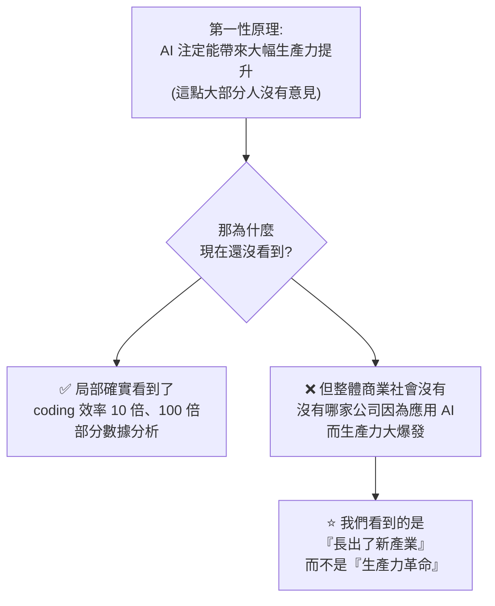
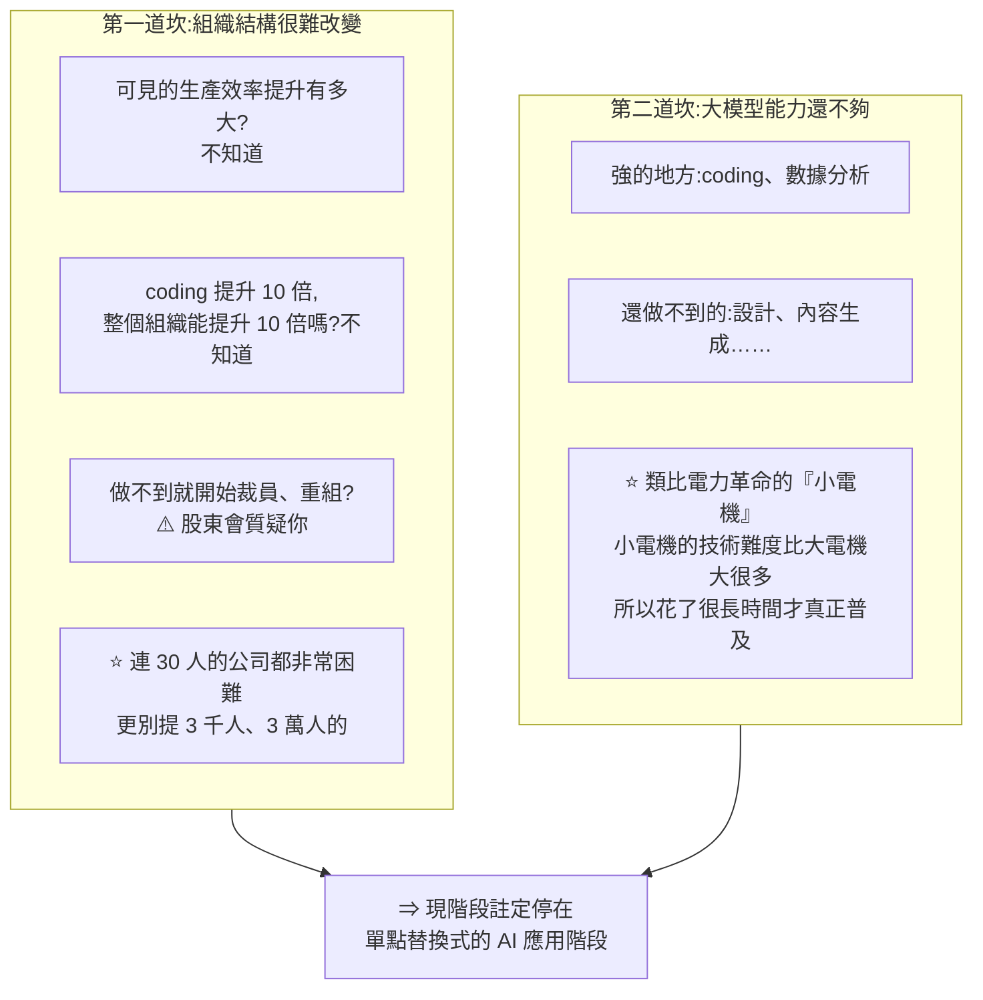
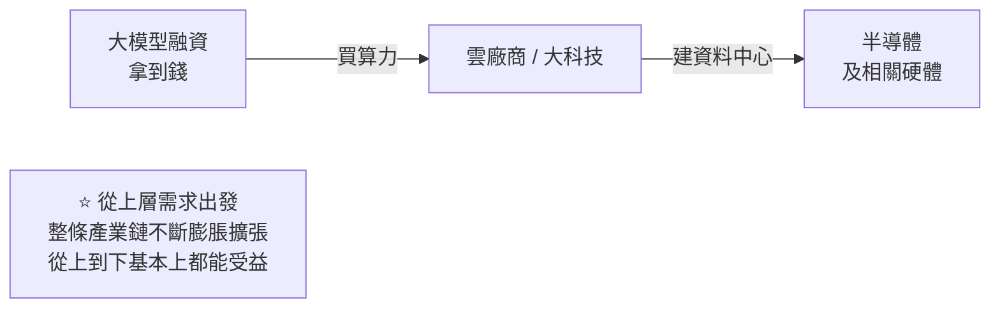
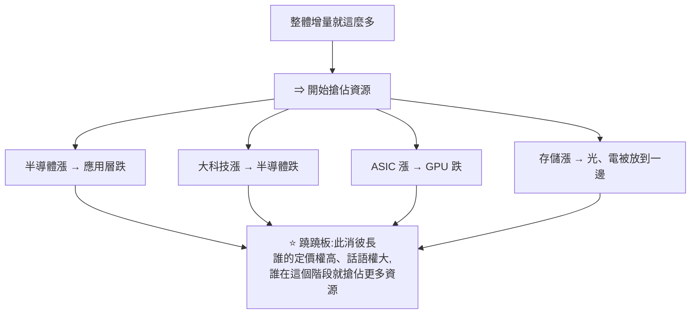
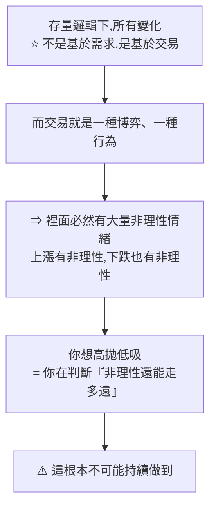
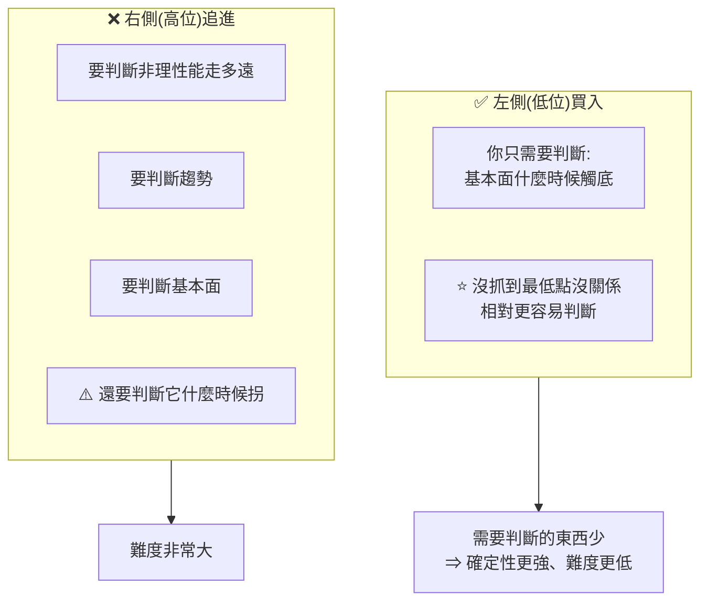
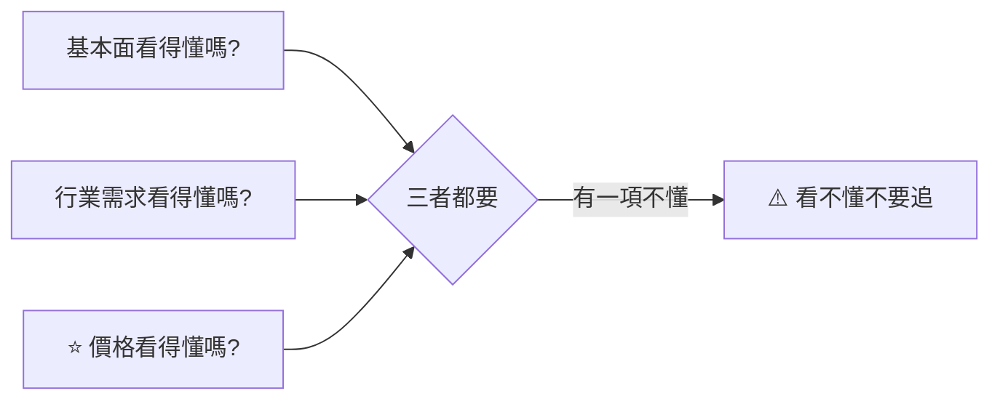
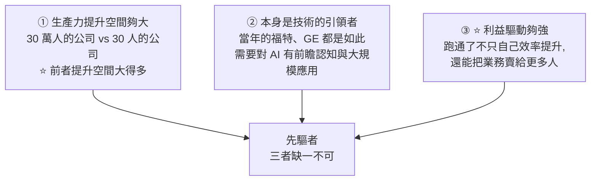

# 存量邏輯下的四條投資原則:把握價值而非趨勢,以及該盯的那個訊號

> ⚠️ **本文為個人學習筆記與資訊整理,非投資建議。** 內容為影片主講人的主觀方法論與判斷,已明確標註。投資風險請自行評估並為自己的決策負責。

> 整理自 YouTube 頻道 **美投君 / 美投講美股**〈早看早賺錢!掌握這套 AI 投資方法論,下半年安心抓機會,防風險!〉(2026-08,約 45.6 分鐘)。
> 影片自述這是 **美投Pro 內部直播的錄影**,主題原為「下半年投資布局」,但實際講的是**怎麼布局的方法論**。

> 📎 這支是兩篇既有筆記的**續集與收斂**:
> - [[ai-adoption-electricity-revolution-analogy]] —— 電力革命對照(他說「那期 20 分鐘沒聊透、沒聊爽」,本片從這裡切入)
> - [[us-stocks-h2-2026-outlook-stock-vs-flow-ai]] —— 存量 vs 增量邏輯的初次提出
> 其他相關:[[pltr-earnings-growth-ceiling-and-valuation-digestion]]、[[microsoft-fy26q1-three-doubts-resolved]]

---

## 一句話總結

**所有關於「大科技還能不能買、AI 軟體股是不是機會」的問題,都指向同一件事:現在是 AI 革命的哪個階段。** 而答案是——**還停在單點替換,組織架構還沒改變**,所以資本市場從「增量邏輯」掉進了「存量邏輯」,**而存量邏輯下唯一可靠的做法是把握價值,不是把握趨勢。**

---

## 一、所有問題其實是同一個問題

影片開場整理了聽眾最關心的問題:大科技跌了怎麼辦?還能不能投?AI 軟體股是機會嗎?AI adoption 會爆發嗎?AI 之外還有沒有機會?

> **殊途同歸 —— 所有這些問題都指向同一個結果:當前到底是 AI 革命發展的哪一個階段。**

而為什麼非搞懂 AI 不可,他的理由很直接:

> **AI 現在就是市場唯一的 Alpha。很簡單,你就看資金在哪兒,哪裡就是 Alpha。**

---

## 二、⭐ 核心結論:技術革新只是前提,組織架構創新才是關鍵

這是從電力革命歷史對照得出的結論:

> **這種所謂「單點替換式」的技術革命,是根本做不到大規模生產力提升的。**
> 如果真的想讓整個社會、整個商業實現生產力提升,**技術革新只是前提,而組織架構的創新才是關鍵**,才能真正引導最終的生產力爆發。

### 現狀的矛盾



> **長出了大模型這個行業,大模型帶動了資料中心的建設 —— 如果把資料中心也算一個行業,就是單獨長出這兩個行業而已。**
> 這非常類似過去 20 年長出的無數新興行業(社交媒體、短影音、電商)。**每個階段都會長出一個行業,就僅此而已 —— 它當然很有投資價值,但它帶動不了整個社會的生產力。**

---

## 三、兩道坎:為什麼還停在單點替換



**第一道坎的關鍵在決策難度**:從管理者角度,**可見的回報有問題、股東會質疑**。他舉自己公司為例 —— 不到 30 人的規模,想做一次組織改造都非常困難。

> ⚠️ 而且他補了一句很現實的觀察:**現在大科技稍微多投點錢就已經被說成這樣,如果他們敢做一個結果未知的組織架構轉變,受到的質疑只會更多。**

**第二道坎的類比很精準**:電力革命要等到**小電機**成熟,才能讓每台機器各自帶一個馬達 —— 而小電機的技術難度比大電機大得多。**現在的大模型也是同樣的處境:它在不斷進化、能解決更大的問題,但仍是一道門檻。**

---

## 四、⭐⭐ 對資本市場的意涵:從增量邏輯掉進存量邏輯

### 增量邏輯(2023–2025)



> 這是過去三年(23、24、25 年)整個市場的邏輯 —— **半導體、雲計算、AI 軟體層、Palantir 這類應用層,全都蓬勃發展。**

### 存量邏輯(去年底 / 今年初開始)



**根本原因**就是前面那個:**生產力沒有大規模爆發,所以增量走到一個階段就到頭了。**

⚠️ **但市場的預期不是這樣** —— 所有人都覺得 AI 是大機會,資金已經扎堆進來。**當大家發現商業增量就這麼點,就開始搶佔資源了。** 於是「大科技資本支出會不會放緩」「AI 需求會不會不再漲那麼高」這些擔憂全都冒出來。

> ⚠️ **重要區分**:他強調**這個行業還在增長,這是事實** —— 只是**在資本市場下,現在的交易邏輯已經是典型的存量邏輯了。**

### 他的觀點小變化

> **研究完這次歷史之後,我對 AI 的看法有一個小變化:所謂的存量邏輯,可能會比我們想像中持續得更久。**

---

## 五、⭐⭐⭐ 四條投資原則(全片核心)

⚠️ 以下為影片主講人的主觀方法論,**非投資建議**。

### 原則一:把握價值,而不是把握趨勢

**為什麼不能追趨勢?** 他的論證分三層:



> **這是一條看起來最直觀、最本能,但是最難走、並且大概率走不通的路。**

⚠️ **而且他點出一個反直覺的風險:猜準了更危險。**

> 這就像**火雞經濟學家的故事** —— 火雞裡有個經濟學家發現了規律:每天早上九點固定有人來餵食,**364 天天天如此,這就是亙古不變的歷史規律、就是第一性原理**。
> **然後第 365 天,感恩節到了,所有火雞都被拉出去宰了。**

> ⭐ **「一個不可判斷、沒有規律的東西,你強行判斷,而且還判準了」—— 這才是最危險的事。**

**那什麼是「價值」?** 他給了兩類:

| 類型 | 特徵 | 他舉的例子 |
|---|---|---|
| **不怕被搶佔資源** | 護城河深、定價權高、市場地位不可或缺 | **台積電**(他說是共識)、ASML、NVIDIA |
| **好東西便宜** | 優質公司處在週期底部或半山腰 | (未點名) |

> ⭐ **關鍵思路是「跳出規則」**:我們身處一個搶佔資源的邏輯裡 —— **那我就跟著你的規則玩嗎?不。我跳出來,找那些我不怕被搶資源的公司。**
>
> 他舉台積電:最近半導體大跌,台積電也跟著跌。**「跌就跌唄,你不用去管趨勢在哪。過去一個月趨勢不在半導體這邊,那我這個半導體我賣了?不用賣。你持有台積電,有什麼可擔心的呢?」**

⚠️ **他也承認知易行難**:

> **這說起來簡單,但做起來很難 —— 因為這個市場天天就告訴你:你別看價值,價值沒用,你得看趨勢。**
> **而那些天天在喊『你這個看不著趨勢』的人,最終一定虧得最慘。**

### 原則二:如果你是交易型的,做左側交易

他特別說明這是為了照顧不同風格的人 —— **交易型不是無可厚非,交易也是很重要的投資領域。**

> **在存量邏輯下,本質上講,所有的機會都是週期股。** 不管是半導體、應用層、雲計算、光、電、存儲 —— **因為它在存量裡面,它都有天花板。**



他舉的實例:**美光是他們在 2025 年初做半導體前瞻時最推薦的一家公司,因為那個時候是週期的谷底** —— 相對好判斷、相對好投資。而到了今年三四月或六七月,「你說它已經到這了、或到哪了我也不知道,**這個時候的投資就是非常難的:價格我看不懂,我光看懂趨勢沒有用。**」

> **想投週期股,就不要挑戰特別難的時候。**

### 原則三:穿越週期,看增量邏輯

> 我們知道現在是存量邏輯,**但從第一性原理來講,生產力是注定會提升的,天花板是注定會被掀開的。**
> **所以你的投資一定要看五步、想十步** —— 去找那些**在增量邏輯下一定會受益、能穿越各個週期環境都受益**的公司。

**他舉的例子是三大雲**:

| 市場的看法 | 他的看法 |
|---|---|
| 上面被大模型卡脖子、下面被半導體卡脖子,**在中間最難受** | ⭐ **大家沒看到的是:三大雲其實是現階段整個 AI 產業鏈上定價權(bargaining power)最高的玩家之一** |
| 在打「軍備競賽」 | **其實遠不是這樣,每一個人在投資上都做得非常審慎** |

> **「他們現在跌、現在表現不好,那我覺得太好了。真的,它越跌我越開心。」**
> 因為背後的根本是**護城河、行業地位、以及它在 AI 產業鏈上能獲得的需求增量** —— 至少在 5 到 10 年的維度,幾乎沒有被衝擊的可能。

### 原則四:做看得懂的交易

> 每天會出來很多新趨勢:今天是光、明天是電、後天是存儲、然後是 CPU。
> **你能看到,並不代表你能投資。能投資的東西,是你真正懂的東西。**

「看得懂」分三個層面,而**第三個最常被忽略**:



> **你去買那些你把握不好的機會,就算這段時間賺了 50%、翻倍了,長期想靠它留住這部分利潤是做不到的 —— 你怎麼賺的,就會怎麼虧回去。**
> 反之,買你看得懂的東西,**你自然拿得住,也自然知道什麼時候不合理、該應對風險。**

### ⚠️ 他自己加的但書

> **這些原則絕對不是照搬,肯定也有例外。**
> 例如「左側交易」**絕對不是一個原則,它是交易過程中思考的方向** —— 如果你能看得懂價值,它已經在半山腰了,你還是看得懂它的價值很高,**那無所謂,你在哪裡買都可以。**

---

## 六、誰會率先跑出 AI Adoption

### ⭐ 需要扭轉的 mindset:AI Adoption > AI Application

> **歷史告訴我們:電力革命不是先出現冰箱、彩電、洗衣機這些全新應用,而是先出現在工廠裡提升效率。**
> 那些汽車工廠、紡織工廠、屠宰場,**都是蒸汽機時代就已經存在的產業** —— 它們是根據既有產物、用新技術進行產業革新與組織架構重組,才有了生產力爆發。

**回到現在:**

| | 現況 |
|---|---|
| **AI Application(應用層)** | ⚠️ **現在就只有 Palantir 這一家公司**(硬要再說一個,可能是特斯拉,物理 AI 的唯一應用層) |
| **AI Adoption(既有產業導入)** | **其實大家都在做了** —— 我們在等的是真正像當年**福特跑出流水線**的那一刻 |

> **從既有產業去提升,是一個更可能發生的事情** —— 讓你去創造一個新產業,難度仍然很大;而既有產業能看到的生產力提升,是相對更可見的。

### 先驅者的三個特徵(從歷史經驗總結)



**第三點他講得最透,用 GE 當例子:**

> GE 自己工廠的效率提升了當然好,**但更重要的是它是造發電機、造電動機的公司** —— 如果它跑通了,它的東西就能賣得更好。
> **所以它有非常強的動力去冒風險、去投入那些短期看起來 ROI 不夠高的東西。**

**用這三點看現在**:他認為**所有大科技其實都滿足條件**(蘋果、微軟、特斯拉、NVIDIA…)。三大雲若自己跑通 AI adoption ⇒ 更多人用 AI ⇒ 消耗更多 token ⇒ 雲計算注定受益;NVIDIA 同理。

**如果硬要挑一個**,他選 **Meta** —— 理由是:

> 他們確實有點「不擇手段」,**但不擇手段放在這個環境下,反而可能讓他們更容易做出組織結構的創新。**

### ⚠️⚠️ 但他立刻澄清:重點不是押注哪家公司

> **我們了解這個點,最重要的還真不是說你去押注哪家公司,而是你現在真正應該關注什麼、應該盯哪些訊號。**

---

## 七、⭐ 該盯的訊號:組織架構的改變

> **不要再去找什麼 AI 應用層公司了,不要再去看存量邏輯下這些互相的博弈了。你現在真正應該看的是——組織架構的改變,是誰在真正積極地做出組織架構的改變。**
> **因為這就是下一個 ChatGPT 時刻,是帶來下一個整個市場生產力革命的大拐點 —— 甚至可能是泡沫開始的起點。**

**具體可以觀察的表象:**

| 訊號 | 說明 |
|---|---|
| **裁員** | ⚠️ 裁員不代表組織架構真的改了,**但至少是一個表象** |
| **組織重構** | 例:**Shopify 在做一個全員的 agent 叫 River** —— 以前是「一個部門一個 agent」,現在打通所有部門、搞一個 agent 讓各部門圍繞它來。**這就是一種組織重構的嘗試**(他強調:不是說它一定能成功) |
| **FDE** | 前端部署工程師 —— **把 AI 落地到各企業內部的最後一公里** |

> 這些都是組織架構上需要發生的變化,**日積月累、量變到質變的必經過程。誰做得好,誰就更有可能因應下一個階段增量邏輯的拐點。**

(FDE 這條可與 [[pltr-earnings-growth-ceiling-and-valuation-digestion]] 對照 —— 那篇詳述了 PLTR 如何靠**提升 FDE 效率**而非增加人數來突破成長瓶頸。)

---

## 八、他的總結

> **下半年的投資其實遠比我們想像的要簡單。**

| 層面 | 判斷 |
|---|---|
| 宏觀環境 | 基本上沒有太大風險 |
| 機會 | **到處都是機會,而且到處都是確定性的機會** |
| ⭐ 關鍵區分 | **存量邏輯只是「交易邏輯」** —— AI 的需求絕對不是問題,**問題是價格**(價值有時被高估、有時被低估,但需求沒問題) |

**找機會的方法就兩點:**

1. **不要掉進存量邏輯下的陷阱** —— 跟著市場邏輯來回變化
2. **找到那些能穿越週期、持續分享紅利的好公司**

**最後可以「提前埋伏」組織創新的先驅者** —— ⚠️ 但他把定位講得很清楚:

> **「我說提前埋伏的意思就是:這不是重點,這不是終點。」**
> 我知道未來一定會發生這件事,**但時間在哪兒不知道**(可能短、可能很長),**而且是誰也不清楚,誰都有可能**。現在看雖然理論上 Meta 更有機會,**但這對它現在的股價來說不重要**,未來也可能是別人。
> **上面那兩條才是投資邏輯,埋伏先驅者是埋伏邏輯。**

---

## 應用案例

### 案例 1|⭐ 用「怕不怕被搶佔資源」重新檢視持股

這是本片最可直接操作的框架。對每一檔持股問一句:

```
在一個「大家互相搶資源」的環境裡,這家公司會不會被搶?

不會被搶(定價權高、地位不可或缺)
   → 趨勢不在它身上時,你可以安心不動
會被搶(靠題材輪動才會漲)
   → ⚠️ 你其實是在做趨勢交易,而不是價值投資
      —— 那就要接受「你必須判斷非理性能走多遠」
```

⚠️ **這個檢查的價值在於「誠實分類」**:很多人以為自己在做價值投資,實際上持有的是輪動題材股。**分類清楚了,至少知道自己在玩哪一種遊戲、承擔哪一種風險。**

### 案例 2|火雞經濟學家:小心「猜對了」的成功經驗

這個故事值得推廣到投資以外的任何領域:

> **當一個系統的規律來自「別人的意圖」而不是「事物的本質」時,364 天的驗證不構成任何保證。**

實務上的自我檢查:

| 你的判斷依據 | 風險 |
|---|---|
| 「這個型態過去 N 次都這樣」 | ⚠️ 可能是火雞式歸納 |
| 「這條產業鏈的需求會持續」 | ✅ 基於事物本質 |
| 「這個族群輪動完就換下一個」 | ⚠️ 基於交易行為,而交易行為會變 |

⭐ **而影片最狠的一句是:猜準了比猜錯更危險** —— 因為它會讓你更相信一套不可靠的方法,下次押更大。

### 案例 3|把「看得懂」拆成三層來自我檢查

追一檔股票之前,逐項打勾:

```
□ 基本面看得懂嗎?(它靠什麼賺錢、護城河在哪)
□ 行業需求看得懂嗎?(這個需求會持續嗎、天花板在哪)
□ ⭐ 價格看得懂嗎?(它現在貴還是便宜、你憑什麼這樣認為)
```

⚠️ **第三項最常被跳過** —— 很多人對公司很熟,但**說不出「多少錢算貴」**。而影片指出:**沒有價格判斷,你就只能靠趨勢,而趨勢是最難的那條路。**

> 對照 [[pltr-earnings-growth-ceiling-and-valuation-digestion]] 的做法:那篇裡主講人對「PLTR 這麼貴了還有什麼空間」的回答是「用 DCF,而不是只看 PE/PS」—— **這就是在補第三層。**

### 案例 4|左側交易的判斷清單

如果你要在低位買週期股,需要判斷的只有一件事:**基本面觸底了嗎?** 具體化成可查的指標:

| 檢查項 | 怎麼看 |
|---|---|
| 供給端 | 是否已出現減產、關廠、資本支出大砍 |
| 價格端 | 產品報價是否已跌破成本線 |
| 企業端 | 是否已出現虧損、庫存去化是否接近尾聲 |
| 市場情緒 | 是否已經沒人討論這個族群 |

⭐ **重點是「不必抓最低點」** —— 影片說得很清楚:**在谷底區間任何一點買,都比在半山腰判斷「還能走多久」容易得多。**

### 案例 5|把「盯組織架構改變」變成可執行的追蹤

影片最有前瞻性的建議,但需要具體化才能執行。可以建一份追蹤清單:

| 訊號類型 | 具體要找什麼 |
|---|---|
| **裁員** | ⚠️ 要區分「成本控制式裁員」與「重組式裁員」—— 後者通常伴隨部門合併或職能重新定義 |
| **內部 agent 平台** | 像 Shopify River 這種**跨部門打通**的做法,而不是各部門各自做 agent |
| **FDE 類職位** | 企業是否開始大量招募「把 AI 落地到內部流程」的角色 |
| **財報電話會用語** | 管理層是否開始講「重新設計工作流」而不只是「導入 AI 工具」 |

> ⭐ **判準:「導入工具」是單點替換,「重新設計流程」才是組織創新。** 這正是影片全片的核心區分。

### 案例 6|⚠️ 這套方法論的邊界在哪

誠實列出它不適用或需要小心的地方:

| 限制 | 說明 |
|---|---|
| **「存量邏輯」是他的框架,不是客觀事實** | 它是一個對市場行為的詮釋,可能過度簡化 |
| **「不怕被搶資源」的判斷本身很主觀** | 台積電今天看是共識,但十年前的 Intel 也曾是共識 |
| **「看五步想十步」需要極長的持有期** | ⚠️ 如果你的資金有時間壓力,這條原則可能讓你在錯的時間被迫賣出 |
| **先驅者的判斷完全是推測** | 他自己也說「時間不知道、是誰不清楚,誰都有可能」 |

⭐ **他自己給的但書值得記住**:這些原則**不是照搬,肯定有例外** —— 左側交易「不是原則,是思考方向」,如果你真的看得懂價值,**在哪裡買都可以**。

---

## 重點回顧(TL;DR)

1. **所有問題殊途同歸**:大科技能不能買、軟體股是不是機會…… 全都指向「現在是 AI 革命的哪個階段」。而**AI 是市場唯一的 Alpha —— 看資金在哪,哪裡就是 Alpha**。
2. **⭐ 核心結論:單點替換式的技術革命做不到大規模生產力提升。技術革新只是前提,組織架構的創新才是關鍵。**
3. **現狀的矛盾**:局部效率確實提升(coding 10–100 倍),**但沒有哪家公司因為應用 AI 而生產力大爆發**。我們看到的是**「長出了新產業」(大模型、資料中心),而不是生產力革命** —— 這跟過去 20 年長出社交媒體、電商沒有本質差別。
4. **兩道坎**:①**組織結構很難改變**(回報不確定、股東會質疑;**連 30 人公司都難,何況 3 萬人**)②**大模型能力還不足以讓你圍繞它重組工作流**(類比電力革命的「小電機」—— 難度比大電機大得多,所以花了很久)。
5. **⭐⭐ 增量邏輯 → 存量邏輯**:2023–2025 是整條產業鏈膨脹(大模型 → 雲 → 半導體);現在是**蹺蹺板式的資源爭奪**(半導體漲則應用層跌、ASIC 漲則 GPU 跌)。⚠️ **行業還在增長是事實,只是「交易邏輯」已經變成存量。**
6. **他的觀點小變化:存量邏輯可能比想像中持續更久。**
7. **⭐ 原則一:把握價值,不要把握趨勢。** 因為存量邏輯下的變化**不是基於需求,是基於交易**,而交易是博弈、充滿非理性 —— **高拋低吸 = 判斷非理性能走多遠,做不到。**
8. **⚠️ 火雞經濟學家**:364 天九點餵食是「亙古規律」,第 365 天全被宰。**「猜準了」比猜錯更危險** —— 它讓你更相信一套不可靠的方法。
9. **什麼是價值**:①**不怕被搶佔資源**(護城河深、定價權高、地位不可或缺,例:台積電、ASML、NVIDIA)②好東西便宜。⭐ **關鍵思路是「跳出規則」** —— 不跟著搶資源的遊戲玩。
10. **⭐ 原則二:交易型的人做左側交易、買低不買高。** 存量邏輯下**所有機會都是週期股**(都有天花板)。低位只需判斷基本面觸底;高位要同時判斷非理性、趨勢、基本面。**不必抓最低點。**
11. **⭐ 原則三:穿越週期,看增量邏輯。** 生產力注定會提升、天花板注定會被掀開,所以**要看五步想十步**。他點名**三大雲是 AI 產業鏈上定價權最高的玩家之一**,「越跌我越開心」。
12. **⭐ 原則四:做看得懂的交易。** 分三層(基本面 / 行業需求 / **價格**),⚠️ **第三層最常被跳過**。**「你怎麼賺的,就會怎麼虧回去。」**
13. **⭐ 需要扭轉的 mindset:AI Adoption > AI Application。** 電力革命不是先出冰箱洗衣機,而是先在工廠提效。**現在應用層就只有 Palantir(硬加一個特斯拉),但 adoption 大家都在做** —— 等的是「福特跑出流水線」那一刻。
14. **先驅者三特徵**:①生產力提升空間夠大(30 萬人 > 30 人)②本身是技術引領者 ③**⭐ 利益驅動夠強** —— 跑通了不只自己受益,**還能把業務賣給更多人**(GE 造發電機是最典型)。
15. **硬挑一個他選 Meta**(「不擇手段」反而更容易做組織創新)。⚠️ **但他立刻澄清:重點不是押注哪家公司,而是盯訊號。**
16. **⭐ 該盯的訊號:組織架構的改變** —— 裁員(僅是表象)、**組織重構**(例:Shopify 打通各部門的全員 agent「River」)、**FDE**(AI 落地企業內部的最後一公里)。**這是下一個 ChatGPT 時刻,甚至可能是泡沫的起點。**
17. **總結**:宏觀沒大風險、**到處都是確定性的機會**;**存量邏輯只是交易邏輯,AI 需求不是問題,問題是價格**。方法就兩點:①不要掉進跟著邏輯來回變的陷阱 ②找能穿越週期持續分享紅利的好公司。
18. **⚠️ 埋伏先驅者是「埋伏邏輯」不是「投資邏輯」** —— 時間不知道、是誰不清楚,「這對它現在的股價來說不重要」。

---

## 來源

- [早看早賺錢!掌握這套 AI 投資方法論,下半年安心抓機會,防風險! — 美投君 / 美投講美股](https://www.youtube.com/watch?v=oZC00ImTJt8)(2026-08,約 45.6 分鐘,美投Pro 內部直播錄影)
- 本倉庫相關筆記:[[ai-adoption-electricity-revolution-analogy]]、[[us-stocks-h2-2026-outlook-stock-vs-flow-ai]]、[[pltr-earnings-growth-ceiling-and-valuation-digestion]]、[[microsoft-fy26q1-three-doubts-resolved]]

> 該片無字幕,逐字稿以 CPU 版 faster-whisper(small / int8 / zh)轉錄取得,**非官方字幕**,可能有少量聽寫誤差。文中專有名詞已依上下文校正(轉錄中的「存量/增量邏輯」相關字詞、「互成盒」為**護城河**、「平靖」為**瓶頸**、「果雞經濟學家」為**火雞經濟學家**、「Mata」為 **Meta**、「Burgin Power」為 **bargaining power**、「G1」為 **GE**)。

> ⚠️ **再次提醒:本文為知識整理,非投資建議。** 文中所有原則、個股點名(台積電、ASML、NVIDIA、三大雲、Meta、美光、Palantir 等)皆為影片主講人的主觀判斷與舉例,**不代表本筆記立場,亦不構成任何買賣建議**。影片本身亦含券商推廣內容,本文未予轉述。
