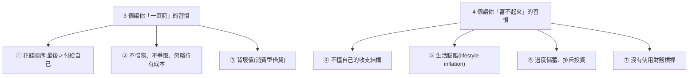

# 收入高卻存不住錢?7 個正在掏空你的隱形習慣

**主題分類:** 投資 / 理財心法與習慣
**來源:** YouTube〈收入高卻存不住錢?7個正在掏空你的隱形習慣〉(lililili_anna,2026-05-28,約 21 分;依繁中逐字稿整理)
**整理日期:** 2026-05-30

> ⚠️ 觀念分享、非投資建議;投資有風險,請自行評估。

---

## 0. 核心命題

富人與窮人的差距 **不只是收入,更是習慣**。真正拉開財務差距的,從來不是「某一次投資對錯」或「哪一年賺特別多」,而是 **每天反覆在做、看起來很日常很合理的小習慣**。

> 主軸公式:**財富 = 收入 − 支出**;財務自由就是找到收入與支出的 **平衡點(甜蜜點)**。

---

## 1. 三個讓你「一直窮」的習慣

### ① 花錢順序:窮人最後才付給自己
- 窮人:薪水進來先付房租/帳單/社交/**訂閱費(錢包黑洞)**,最後才(如果還有剩)存錢。**社群媒體 + 演算法** 放大消費焦慮(看你三五次心動的東西就下單),還有「先買後付」。
- **富人:先付錢給自己**——固定的存款與理財計畫、真正的自我提升支出,**最後** 才安排消費。(調查:美國千萬富翁習慣把 **約 31%** 收入固定存起來;經典「50 生活 / 30 娛樂 / 20 儲蓄」比例因人因階段而異。)
- **Anna 的做法:** 心動先丟 **購物車冷靜 1–2 週**,回來常常就不想買了(購物車常年滿但不是都要買);成家有小孩後先留 **約一年生活費定存**(不增長但零波動),剩下才規劃投資與消費。

### ② 不惜物、不爭取、忽略「持有成本」
- 財務差的人行為上反而 **更浪費**(海派、沒吃完丟掉);**不愛惜物品 → 更容易失去它**。「會賺錢很重要,**會花錢更重要**。」
- 富人會在 **合理範圍討價還價**(在意自己辛苦賺的錢很正常)。**案例:** Anna 租車是 VIP,帳單只給 10% 折扣,她 **問一嘴** 客服,結果可打 **20%**——一來一回省 10%。「**愛爭取的人先贏。**」
- 重視 **長期價值 vs 持有成本**:買一樣好東西好好保養(勝過十樣爛東西一直壞);衛生紙打折囤一屋子,**佔用昂貴的居住空間 = 持有成本太高**,也是浪費。

### ③ 背「壞債」
- **好債 vs 壞債:** 有錢人也一直借錢,但他們 **借錢買資產(好債)**;勸你花錢的人要你買的是包包、醫美、先買後付的小東西——**信用卡債、消費型借貸 = 壞債**(借貸/信用卡公司某種程度上 **希望你財務不好** 才賺得到你)。
- **Anna 的原則:能一次付清才買。** 買得起才買(用現金或為點數刷卡都行,重點是 **當下付得清**);買房也先算「**能不能一次買清**」,能才去貸房貸。月薪族則算「30 年每期帳單都 cover 得了」才消費。**壞債讓你踏入萬丈深淵,好債用得好讓你步步高昇。**

---

## 2. 四個讓你「富不起來」的習慣

### ④ 不了解自己的收支結構
- 不懂收入/支出結構就找不到平衡點。**記帳不一定適合每個人**(Anna 強迫症,記到分毫對帳,花的時間遠超價值)。
- **她的方法:抓大放小。** 把過去幾期帳單留下,抓出 **固定支出**(房租、學費等)的大概數,整筆固定為「生活費」不動,剩下的才靈活支配。「**你永遠賺不到認知以外的錢**」——很多暴發戶高樓起又塌,就是爆發期沒看清自己的收支結構,還在 High 錢就沒了。

### ⑤ 生活膨脹(lifestyle inflation)
- 收入增加 → 生活水平水漲船高,**賺越多花越多**。最該避免:**超過收入水平的興趣/社交/階級跨越消費**(股票賺了就去扶輪社、請高爾夫私教、買整套球具交會員費;名牌限定包 → 品鑒會 → 置辦行頭;為小孩「贏在起跑線」參加 **昂貴又沒持續性** 的活動)。
- **Anna 的做法:** 把育兒預算放在 **共同的體驗與回憶**(家族旅行住宿捨得花、自駕游自由度高),日常無關緊要的消費 **不追頂配**;一升級「商務艙會首當其衝被膨脹」,她反而對機艙摳門(一家人很多張票)。**把錢精準投在對孩子有長遠發展的事,而非過度消費。**

### ⑥ 過度儲蓄、排斥投資
- **省錢有天花板**,光靠省很難變很有錢。過度儲蓄兩種陷阱:① 不用消費 **槓桿出人力/工具** 幫你 → 困在生活雜事、沒空投資學習;② 排斥一切有波動的投資 → 進入 **理財資訊繭房** → 容易被「**保本又高收益**」的話術騙(詐騙,或被包裝的理財/銀行產品,合約一翻根本不是那回事)。
- **適度消費** 才能目睹金錢流動、理解什麼是金錢與財富。

### ⑦ 沒有使用財務槓桿
- 2026 年若以財務分配分類,只有兩種人:**用槓桿 vs 沒用槓桿**。沒用槓桿者本質是 **出租時間**(醫師/律師/會計師也一樣,一休息就沒收入)。
- **三種槓桿:**
  1. **勞力槓桿**:開公司讓一群人為你工作。
  2. **媒體影響力 / 數位資產**(新興、年輕人易介入):如經營 YouTube,拍一次、上傳後 **你睡覺時影片仍為你產生價值**。
  3. **最簡單:好好存錢買股票/指數**——擁有公司所有權、讓「世界上最優秀的人替你工作」,只花一點點錢就參與其成果。怕波動就買 **龍頭指數型基金**。
- **兩個投資心得:** ① **別道聽途說**(銀行業務、理財專員、朋友說「一定賺」就拉警報);② 財務知識不足前 **盡量買龍頭指數/龍頭股,別碰小眾高收益產品**(看似高收益、風險不可估量)。

> 與本 repo 關聯:第 ⑦ 點「存錢買龍頭指數、長期參與」與 [[just-keep-buying-nick-maggiulli]] 的自動化持續買進、[[target-prices-institutional-secrets]] 的「散戶用大盤 ETF 不掉隊」完全同源。

---

## 3. 一句話總結

> **真正拉開財務差距的不是某次投資的對錯,而是你每天反覆在做的習慣。** 高薪族的重整清單:先付給自己、惜物與爭取、只背好債、看懂收支結構、抑制生活膨脹、適度消費別過度儲蓄、用槓桿(尤其長期買龍頭指數)。

---

## 來源

- [YouTube:收入高卻存不住錢?7個正在掏空你的隱形習慣(lililili_anna)](https://youtu.be/-XLTrE5bjko)
