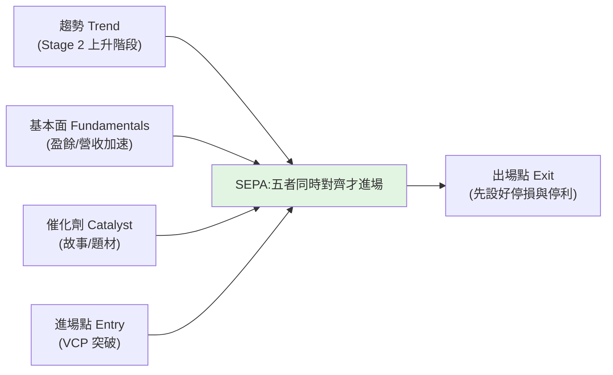

# 《像冠軍一樣思考和交易》(Mark Minervini):SEPA、VCP 與冠軍心態

> 《股票魔法師 II:像冠軍一樣思考和交易》(*Think & Trade Like a Champion*)是 **Mark Minervini** 的交易方法論經典
> (前作《股票魔法師 / Trade Like a Stock Market Wizard》)。Minervini 是 **1997 年美國投資冠軍賽冠軍(155% 報酬)**,
> 並宣稱連續 5 年達成驚人複利報酬。本書把「**怎麼選、怎麼進、怎麼控風險、怎麼想**」整理成一套完整系統。
>
> **⚠️ 來源限制說明:** 你提供的 Scribd 連結需登入、無法取得實際內文(273 頁 PDF)。本筆記是依**該書廣為人知的公開方法論**
> 整理的繁中**書摘**(非從付費文件複製),可能與原書細節有出入,請以原書為準。
> **⚠️ 非投資建議**,僅為觀念整理;交易有風險,請自行判斷。

---

## 核心:SEPA(Specific Entry Point Analysis,特定進場點分析)

Minervini 的選股系統把五個面向疊在一起,只買**同時對的**標的:**趨勢、基本面、催化劑、進場點、出場點**。
精神是「**只在風險最小、勝率最高的那個點進場**」,而不是「便宜就買」。

---

## 一、Stage Analysis(四階段):只在「第二階段」買

源自 Stan Weinstein 的階段分析——股價一生走四個階段,**只在第二階段(上升)買**:

| 階段 | 狀態 | 該做什麼 |
|---|---|---|
| **Stage 1 打底(neglect)** | 盤整、無人理會、均線走平 | 觀察、別急 |
| **Stage 2 上升(markup)** | 突破、均線上揚、量價齊揚 | **✅ 只在這裡買** |
| **Stage 3 做頭(topping)** | 高檔震盪、動能轉弱 | 減碼/出場 |
| **Stage 4 下跌(decline)** | 跌破均線、均線下彎 | **絕不買、絕不抄底** |

> 呼應本庫 [[short-term-trading-7-rules]] 的「只做上升趨勢、不要抄底」——**不接 Stage 4 的刀**。

---

## 二、Trend Template(趨勢樣板):8 條濾網確認「真的在 Stage 2」

Minervini 用一組量化條件確認標的處於健康的上升趨勢(大致版本):

1. 股價在 **150 日與 200 日均線之上**。
2. **150 日均線在 200 日均線之上**。
3. **200 日均線至少上揚 1 個月**(趨勢向上)。
4. **50 日均線在 150 與 200 日均線之上**。
5. 股價在 **50 日均線之上**。
6. 股價**至少高於 52 週低點 30%**。
7. 股價在 **52 週高點的 25% 以內**(離新高不遠)。
8. **相對強度(RS rating)≥ 70**(最好更高)——只買強勢股。

> 核心理念:**強者恆強**。只在「市場用真金白銀投票證明它強」的標的上操作,而非自己猜底部。

---

## 三、VCP(Volatility Contraction Pattern,波動收縮型態):進場的「腳印」

VCP 是 Minervini 最著名的進場型態,代表**籌碼被吸收、賣壓遞減**的足跡:

- 股價經過數次回檔,**每次回檔幅度一次比一次小**(例:25% → 15% → 8%),**成交量逐步萎縮**。
- 這代表「想賣的人越來越少、籌碼被穩定的手收走」,形成一個越來越緊的「彈簧」。
- 當價格在**最後一次緊縮後帶量突破**樞紐點(pivot),就是 SEPA 的進場點。
- 進場後**立刻設停損**(就在樞紐/低點下方),風險定義得很清楚。

> 這把抽象的「打底」變成可辨識、可定義風險的型態——進場點明確,停損點也明確。

---

## 四、風險管理:這才是冠軍與韭菜的差別

Minervini 反覆強調「**先想輸、再想贏**」,風控是整套系統的命脈:

- **停損要小且鐵律執行**:把單筆虧損壓得遠小於平均獲利(例如平均賠 < 平均賺的一半);**hope is not a strategy**。
- **回撤的數學很殘酷**:虧 50% 要賺 100% 才回本;所以**保住本金 > 追求暴利**。
- **勝率 × 盈虧比一起看**:不需要高勝率,只要「賺的時候賺很大、賠的時候賠很小」,期望值就是正的。
- **加碼往上、不往下攤平**:「攤平是輸家的行為」——只在部位**證明自己對**時才加碼。
- **漸進式建倉(progressive exposure / buy and verify)**:先小量試單,看對了再加;看錯了小虧出場。**先小、對了再大。**
- **絕不讓賺錢單變賠錢單**:獲利達一定程度就把停損拉到成本之上,鎖住利潤。
- **整體曝險隨市況調整**:盤勢不對就降水位、甚至空手——**現金也是一種部位**。

> 與本庫 [[short-term-trading-7-rules]] 的最大對比:那 7 條「只講進攻沒講停損」,而 Minervini 的系統**核心就是停損與部位控制**——這正是它經得起時間考驗的原因。

---

## 五、冠軍心態(Think Like a Champion)

- **把交易當事業經營**:有規則、有紀錄、有複盤,而非靠感覺與運氣。
- **小虧是成本,不是失敗**:願意承認看錯、快速小虧出場,才能活到下一次大賺。
- **賣出規則比買進規則更重要**:大多數人會買不會賣;先想好「錯了在哪出、對了在哪走」。
- **紀律 > 預測**:不被單一劇本綁架,照系統執行;情緒化進出是最大漏洞。
- **耐心等對的點**:寧可錯過,不可做錯;沒有符合 SEPA 的標的就不出手。

---

## 應用案例

- **想挑一檔波段強勢股:** 先用 **Trend Template 8 條**確認它在 Stage 2(在 150/200MA 上、離新高 25% 內、RS≥70),再等 **VCP** 緊縮後帶量突破樞紐點進場,進場同時把停損設在樞紐下方。
- **看到一檔大跌的「便宜好股」想抄底:** 用 Stage Analysis 檢查——若在 Stage 4(跌破下彎均線),**Minervini 的系統會直接排除**,不接刀。
- **部位怎麼建:** 別一次梭哈;先小量試單(buy and verify),看對了沿 VCP/趨勢加碼往上,看錯了小虧出場——把「最大單筆虧損」事先定死。
- **避免賺錢單變賠錢單:** 獲利到一定幅度就把停損移到成本價之上,鎖利;呼應「保住本金 > 追暴利」。

---

## 一句話總結

> Minervini 的系統可濃縮成:**只在 Stage 2、用 Trend Template 確認強勢、等 VCP 緊縮突破才進場、進場即設小停損、漸進式加碼、絕不攤平、絕不讓賺單變賠單。**
> 它和坊間「只教進攻」的交易內容最大的不同,是把**風險管理與心態紀律**放在系統核心——
> 「**像冠軍一樣思考**」指的不是更會預測,而是**更會控制虧損、更有紀律**。

---

## 來源

- 書籍:Mark Minervini《Think & Trade Like a Champion(股票魔法師 II:像冠軍一樣思考和交易)》。
- 連結(需登入,本筆記未能取得實際內文):[Scribd 文件](https://www.scribd.com/document/766738565/)。
- **本筆記為依該書公開方法論整理的書摘,非原文複製;細節以原書為準。** 延伸:本庫 [[short-term-trading-7-rules]]、[[double-top-bottom-momentum]]、[[just-keep-buying-nick-maggiulli]]。
