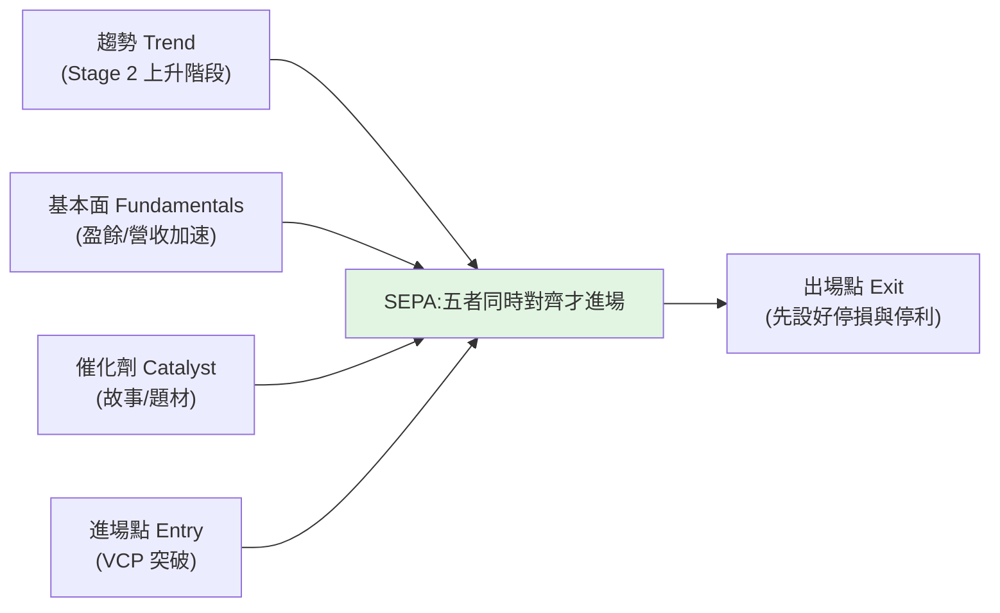

# 《像冠軍一樣思考和交易》(Mark Minervini):SEPA、VCP 與冠軍心態

> 《股票魔法師 II:像冠軍一樣思考和交易》(*Think & Trade Like a Champion*)是 **Mark Minervini** 的交易方法論經典
> (前作《股票魔法師 / Trade Like a Stock Market Wizard》)。Minervini 兩度奪冠美國投資冠軍賽——
> **1997 年(155%)** 與 **2021 年(334%)**,且以**經審計**的紀錄著稱。本書把「**怎麼選、怎麼進、怎麼控風險、怎麼想**」整理成一套完整系統。
>
> **⚠️ 來源說明(已更新):** 原 Scribd / 網盤版皆為**未授權轉載的受著作權書籍**,本筆記**未複製其內文**;
> 內容改以 **Minervini 官方資料與公開文章/書評** 等公開來源整理成繁中**書摘**(見文末來源),數字盡量對準,細節仍以原書為準。
> **⚠️ 非投資建議**,僅為觀念整理;交易有風險,請自行判斷。

---

## 核心:SEPA(Specific Entry Point Analysis,特定進場點分析)

Minervini 的選股系統把五個面向疊在一起,只買**同時對的**標的:**趨勢、基本面、催化劑、進場點、出場點**。
精神是「**只在風險最小、勝率最高的那個點進場**」,而不是「便宜就買」。

---

## 一、Stage Analysis(四階段):只在「第二階段」買

源自 Stan Weinstein 的階段分析——股價一生走四個階段,**只在第二階段(上升)買**:

| 階段 | 狀態 | 該做什麼 |
|---|---|---|
| **Stage 1 打底(neglect)** | 盤整、無人理會、均線走平 | 觀察、別急 |
| **Stage 2 上升(markup)** | 突破、均線上揚、量價齊揚 | **✅ 只在這裡買** |
| **Stage 3 做頭(topping)** | 高檔震盪、動能轉弱 | 減碼/出場 |
| **Stage 4 下跌(decline)** | 跌破均線、均線下彎 | **絕不買、絕不抄底** |

> 呼應本庫 [[short-term-trading-7-rules]] 的「只做上升趨勢、不要抄底」——**不接 Stage 4 的刀**。

---

## 二、Trend Template(趨勢樣板):8 條濾網確認「真的在 Stage 2」

Minervini 用一組量化條件確認標的處於健康的上升趨勢(大致版本):

1. 股價在 **150 日與 200 日均線之上**。
2. **150 日均線在 200 日均線之上**。
3. **200 日均線至少上揚 1 個月**(趨勢向上)。
4. **50 日均線在 150 與 200 日均線之上**。
5. 股價在 **50 日均線之上**。
6. 股價**至少高於 52 週低點 30%**。
7. 股價在 **52 週高點的 25% 以內**(離新高越近越好)。
8. **相對強度(RS rating)≥ 70**(門檻 70,**90+ 更佳**;RS 90 = 表現勝過 90% 的股票)。

> 補充:第 3 條的 200 日均線雖然「至少上揚 1 個月」是底線,Minervini 偏好**已上揚 4–5 個月以上**才算穩。
> 核心理念:**強者恆強**。只在「市場用真金白銀投票證明它強」的標的上操作,而非自己猜底部。

---

## 三、VCP(Volatility Contraction Pattern,波動收縮型態):進場的「腳印」

VCP 是 Minervini 最著名的進場型態,代表**籌碼被吸收、賣壓遞減**的足跡。一個乾淨的 VCP 有三個要件:

1. **前面有強勢的 Stage 2 上升趨勢**(VCP 是上升途中的「休息」,不是底部反轉)。
2. **2–6 次回檔(收縮),且一次比一次淺**(例:25% → 12% → 6%)——每次收縮稱為一個「**T**」,所以常記成「VCP 3T、4T」。
3. **量縮進入最後一次收縮**:下跌日的量不明顯大於上漲日的量,且越接近樞紐量越乾(理想是樞紐前 **1–2 天極低量**)。

- **樞紐點(pivot)= 最後一次收縮的最高價**;當價格**帶量突破樞紐點**,就是 SEPA 的進場點——這也是**風險/報酬比最佳**的一刻(離停損最近)。
- 進場後**立刻設停損**(就在樞紐/最後低點下方),風險定義得很清楚。

> 為什麼有效:下跌日量縮代表**想賣的人越來越少、籌碼被法人穩定的手收走**,形成越來越緊的「彈簧」;
> 一旦需求(帶量突破)出現,阻力小、最容易順勢噴出。這把抽象的「打底」變成**可辨識、可定義風險**的型態。

---

## 四、風險管理:這才是冠軍與韭菜的差別

Minervini 反覆強調「**先想輸、再想贏**」,風控是整套系統的命脈:

- **停損要小且鐵律執行**:他公開講的區間是——行情好、型態緊時 **3–4%**;行情普通 **5–6%**;**最大「沙線(line in the sand)」8%** 絕不破。一般落在進場下方 **7–8%** 出場。**hope is not a strategy**。
- **平均獲利 : 平均虧損 ≥ 2:1,常做到 3:1**:做法是「**砍在 7–8%、讓賺單跑到 20–25% 以上**」——這個比例正是審計冠軍報酬的引擎。
- **回撤的數學很殘酷**:虧 50% 要賺 100% 才回本;所以**保住本金 > 追求暴利**。
- **勝率 × 盈虧比一起看**:不需要高勝率,只要「賺的時候賺很大、賠的時候賠很小」,期望值就是正的。
- **加碼往上、不往下攤平**:「攤平是輸家的行為」——只在部位**證明自己對**時才加碼。
- **漸進式建倉(progressive exposure / buy and verify)**:不一次到位,而是**隨「市場配合度 + 部位是否證明自己對」逐步加碼**:
  - **試單(pilot,約 1/4 倉)** → **半倉(1/2)** → **3/4 倉** → **滿倉**。
  - 例:若你滿倉風險是 12%,試單就只冒 ~3%、半倉 ~6%、3/4 ~9%、滿倉 12%——只有在市場高度配合時才滿倉。
  - 看對了沿趨勢往上加(金字塔加碼),看錯了在試單階段就小虧出場。**先小、對了再大。**
- **絕不讓賺錢單變賠錢單**:獲利達一定程度就把停損拉到成本之上,鎖住利潤。
- **整體曝險隨市況調整**:盤勢不對就降水位、甚至空手——**現金也是一種部位**。

> 與本庫 [[short-term-trading-7-rules]] 的最大對比:那 7 條「只講進攻沒講停損」,而 Minervini 的系統**核心就是停損與部位控制**——這正是它經得起時間考驗的原因。

---

## 五、冠軍心態(Think Like a Champion)

- **把交易當事業經營**:有規則、有紀錄、有複盤,而非靠感覺與運氣。
- **小虧是成本,不是失敗**:願意承認看錯、快速小虧出場,才能活到下一次大賺。
- **賣出規則比買進規則更重要**:大多數人會買不會賣;先想好「錯了在哪出、對了在哪走」。
- **紀律 > 預測**:不被單一劇本綁架,照系統執行;情緒化進出是最大漏洞。
- **耐心等對的點**:寧可錯過,不可做錯;沒有符合 SEPA 的標的就不出手。

---

## 六、賣出規則(他常說「賣比買更難」)

賣出分兩種,要分清楚:

- **保護性停損(防守)**:進場後立刻設;觸及 7–8% 沙線就無條件出,**不問理由、不凹單**。
- **獲利了結(進攻)**:
  - **絕不讓賺單變賠單**:獲利累積到一定程度,就把停損拉到**成本價(breakeven)之上**,鎖住利潤。
  - **沿勢追蹤停利**:強勢續抱,直到趨勢轉弱(如跌破關鍵均線、量價背離、Stage 3 做頭跡象)。
  - **強勢中賣一部分(sell into strength)**:在急噴、過度延伸時分批了結一部分,降低回吐風險。
- **時間/行為停損**:買進後遲遲不動、或不照預期反應,即使沒到價格停損也可考慮先出,把資金換到更會動的標的。

## 三本書的分工(系列差異)

| 書 | 英文 | 重點 |
|---|---|---|
| **股票魔法師 I** | *Trade Like a Stock Market Wizard* | 建立 **SEPA 系統的地基**:選股五要素、Trend Template、VCP、基本面 |
| **股票魔法師 II(本書)** | *Think & Trade Like a Champion* | **規則、風控與心態**:停損紀律、漸進建倉、賣出規則、冠軍心理與實戰守則 |
| **股票魔法師 III** | *Mindset Secrets for Winning* | 純 **心理與心態**:如何像冠軍一樣思考、信念、習慣與自我管理 |

> 一句話:**I 教你「看什麼」、II 教你「怎麼做與怎麼控風險」、III 教你「怎麼想」**。三本是同一套系統的不同層面。

## 應用案例

- **想挑一檔波段強勢股:** 先用 **Trend Template 8 條**確認它在 Stage 2(在 150/200MA 上、離新高 25% 內、RS≥70),再等 **VCP** 緊縮後帶量突破樞紐點進場,進場同時把停損設在樞紐下方。
- **看到一檔大跌的「便宜好股」想抄底:** 用 Stage Analysis 檢查——若在 Stage 4(跌破下彎均線),**Minervini 的系統會直接排除**,不接刀。
- **部位怎麼建:** 別一次梭哈;先小量試單(buy and verify),看對了沿 VCP/趨勢加碼往上,看錯了小虧出場——把「最大單筆虧損」事先定死。
- **避免賺錢單變賠錢單:** 獲利到一定幅度就把停損移到成本價之上,鎖利;呼應「保住本金 > 追暴利」。

---

## 一句話總結

> Minervini 的系統可濃縮成:**只在 Stage 2、用 Trend Template 確認強勢、等 VCP 緊縮突破才進場、進場即設小停損、漸進式加碼、絕不攤平、絕不讓賺單變賠單。**
> 它和坊間「只教進攻」的交易內容最大的不同,是把**風險管理與心態紀律**放在系統核心——
> 「**像冠軍一樣思考**」指的不是更會預測,而是**更會控制虧損、更有紀律**。

---

## 來源

- 書籍:Mark Minervini《Think & Trade Like a Champion(股票魔法師 II)》及其姊妹作。**本筆記為依公開方法論整理的書摘,非原文複製;細節以原書為準。**
- 公開資料(數字與規則對照):
  - [VCP 完整指南(finermarketpoints)](https://www.finermarketpoints.com/post/what-is-a-vcp-pattern-mark-minervini-s-volatility-contraction-pattern-explained)、[VCP(TraderLion)](https://traderlion.com/technical-analysis/volatility-contraction-pattern/)
  - [Trend Template 8 條(ChartMill)](https://www.chartmill.com/documentation/stock-screener/technical-analysis-trading-strategies/496-Mark-Minervini-Trend-Template-A-Step-by-Step-Guide-for-Beginners)、[SEPA 框架(finermarketpoints)](https://www.finermarketpoints.com/post/mark-minervini-s-sepa-methodology-complete-framework-explained)
  - [漸進建倉 Progressive Exposure(TraderLion)](https://traderlion.com/lesson/lesson-7-progressive-exposure-the-minervini-method/)、[風控與 2021 年 334% 奪冠(TraderLion)](https://traderlion.com/investing-champions/mark-minervinis-risk-management/)
- 延伸:本庫 [[short-term-trading-7-rules]]、[[double-top-bottom-momentum]]、[[just-keep-buying-nick-maggiulli]]。
