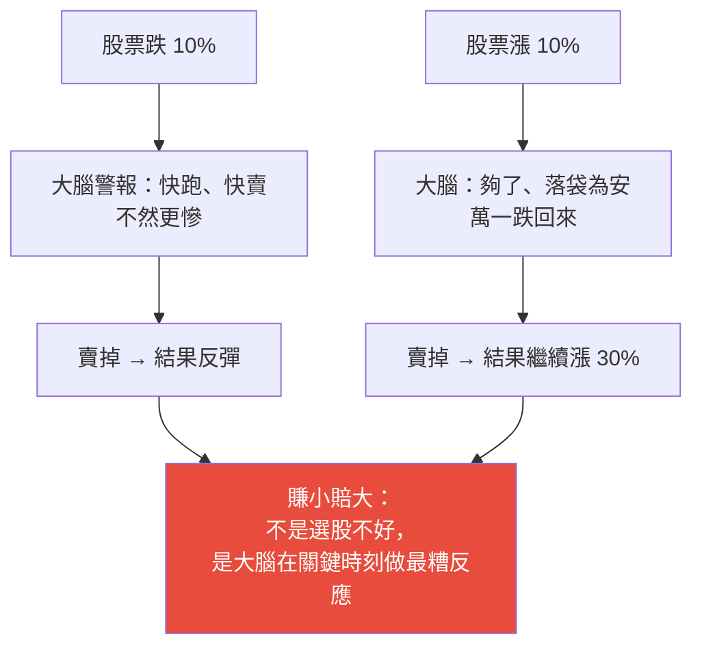
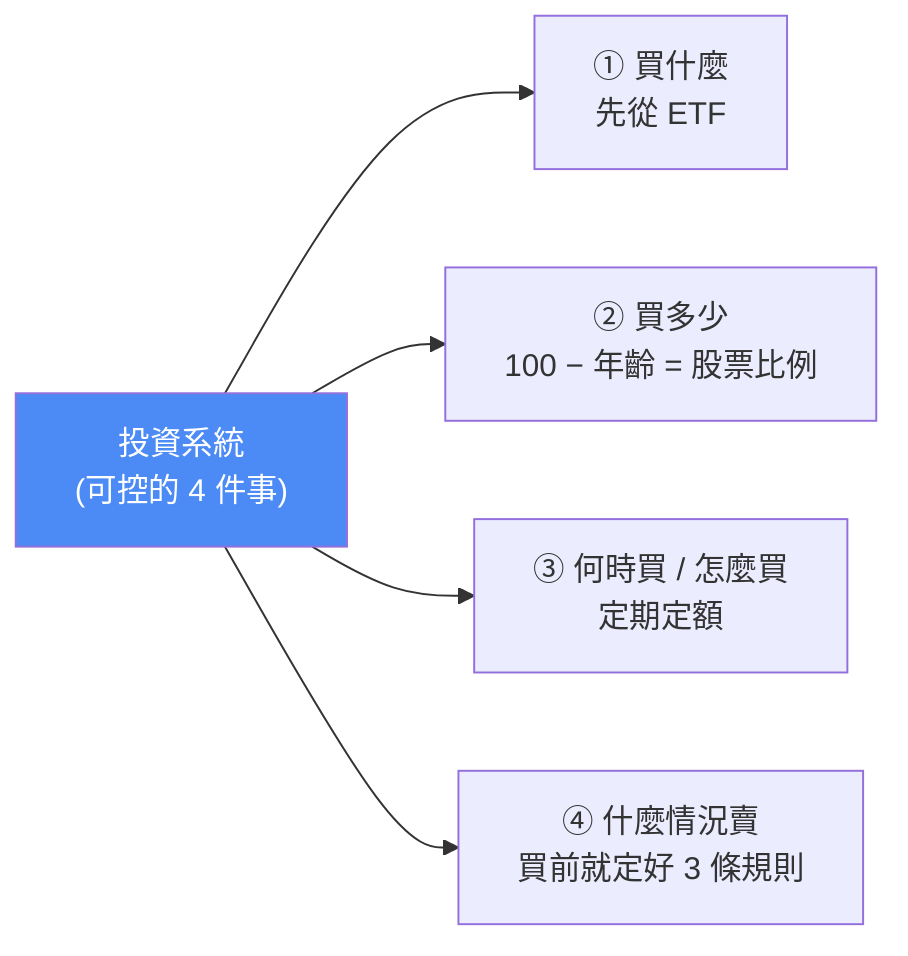

# 為什麼你買什麼跌什麼?台股散戶虧錢的底層邏輯:不是運氣,是「沒有系統」

> ⚠️ **本筆記為投資觀念整理,非投資建議。** 內容摘自「極簡經濟學」YouTube 影片的觀點,提及個股/ETF 代號僅為說明,不構成買賣建議;投資有風險,請自行評估。
> 📝 該片無字幕,逐字稿以 CPU faster-whisper 轉錄取得、非官方字幕,可能有少量聽寫誤差。

---

## 一、核心命題:虧錢不是運氣,是「進場前就注定要輸」的決策習慣

兩個你一定中過的劇本:
1. 朋友說某檔很強,你猶豫兩週才買 → 隔天開始跌、殺出停損 → 賣掉後它一路噴。
2. 看一檔跌很久「應該到底了」→ 買進 → 繼續跌到懷疑人生 → 安慰自己「長期持有」藏起來假裝沒看到。

大多數人的第一反應是「我運氣太差」。但影片主張:**你買什麼跌什麼,從來不是運氣,是系統的問題、認知的問題。**

一個殘酷數字:台股每年逾 **1000 萬個交易帳戶**,能長期獲利的散戶大約只有 **兩成**;**八成最終虧錢或賺不贏定存**。而八成的人在買進當下,每一個都覺得自己是那兩成——不然誰會買。

---

## 二、三個「你以為的解法其實是陷阱」

### 陷阱 1:以為虧錢是「研究不夠努力」

於是每天看財報、追新聞、盯法人動向、研究技術指標——結果還是虧。因為**研究方向從一開始就錯了**:

> 當財報出爐、利多發布、媒體開始大篇幅報導某檔「多強」時,這些資訊**早在幾個月甚至幾年前,就被法人、主力、外資消化並建好倉位了**。你看到的新聞,是他們準備**出貨**的信號;你研究的財報,是他們用來**吸引你進場**的誘餌。

**這不是陰謀論,是市場的結構性問題**——大資金和小資金玩的根本不是同一場遊戲。

> 🔎 **雞排比喻:** 你站在攤位前看到老闆把剛炸好、金黃酥脆的雞排放進展示櫃,立刻掏錢。但在你看到之前,老闆已在廚房炸了很久、早知道好不好吃、早決定賣多少錢。**你是最後一個知道它存在的人,卻付最高的價、還買到它快涼的時候。** 股市裡,你就是那個站在攤位前的顧客。

### 陷阱 2:以為「你的大腦」能勝任投資

**你的大腦天生不適合投資**,這是科學不是罵人。人腦是幾十萬年演化的產物,習慣在壓力下做快速、本能的反應(看到老虎立刻跑)。但投資恰恰**反人性**:要在最恐懼時買進、最興奮時賣出、忽略短期噪音、忍受帳面虧損還不動作。

關鍵機制是**損失規避(loss aversion)**:行為經濟學指出,人對損失的痛苦約是**同等獲利快樂的兩倍**(虧 1 萬的痛 ≈ 賺 2 萬的爽)。這在日常有用(讓你不亂冒險),在市場卻讓你**賺小賠大**:

你換不了大腦,但你可以**建立一個系統,讓大腦沒機會做出糟糕決定**。→ **沒有系統的投資,叫賭博。**

### 陷阱 3:以為「學會技術分析」就有系統

技術分析本身沒問題,問題是**大部分散戶學技術分析是拿來「確認自己的想法」,而不是客觀評估市場**。你已經想買了,才去看 K 線、找支撐、找各種理由說服自己「現在是好買點」——這在心理學叫**確認偏誤(confirmation bias)**:你不是在分析,是在找藉口。一旦對某檔股票有了感情,大腦就會**只看到支持買進的訊號、忽略所有警告**。

---

## 三、先搞清楚「你是誰」:風險承受能力

大部分人買第一張股票前,從沒認真想過:你有多少資金?能承受多大波動?投資時間多長?有沒有穩定收入?影片見過太多人用**緊急備用金**、**借錢**、**押退休金**去買「一定會漲」的股票。

**風險承受能力**其實就一個問題:

> **你的股票跌了 30%,你睡得著嗎?** 睡不著,就代表你放太多資金在股票上——因為睡不著你就會做情緒性決定:最低點賣掉 → 反彈後後悔 → 更高點買回 → 又跌又賣,把資金一點一點磨光。

台股史上大盤高點到低點跌逾 30% 發生過好幾次(2000 科技泡沫、2008 金融海嘯、2020 新冠),每次都有一大批散戶在最低點附近認賠,然後看著市場幾年後創新高。**這不是運氣差,是資金配置從一開始就不允許他們撐過最黑暗的時期。**

✅ **今天就能做的第一件事:** 問自己「投入股市的錢,是未來 3–5 年完全不需動用的錢嗎?」不是的話,先把那部分挪到定存或貨幣型基金。只有生活不依賴這筆錢,你才能在下跌時保持冷靜。

---

## 四、第二個致命錯:追高與 FOMO

明知不能追高卻忍不住,是因為 **FOMO(fear of missing out,害怕錯過)**:看到一檔漲 20%,大腦不是說「漲很多了有風險」,而是「我怎麼沒早點買?再漲 20% 我不就虧大了」。這種恐懼比理性更快、更強、更難抗拒,而且**往往在最危險的時刻最強烈**(最高點附近正是媒體報導最多、朋友討論最熱、情緒最亢奮的時候)。

> 🔎 **捷運比喻:** 你衝過去硬把快關的車門擠開、擠進去——結果下一站就是終點站,全部人要下車,你連位子都沒有還被擠得東倒西歪。追高就是這種感覺:你在最後一刻衝進去,而那恰好是大家準備下車的時候。

**市場溫度指標(擦鞋童理論):** 當不懂股票的朋友、計程車司機、便當店老闆、你的阿姨都開始問你「這檔能買嗎」、推薦你股票時,通常就是市場最樂、也最危險的時候。2021 台股衝上 18000 全民瘋股 → 2022 從高點跌近 30%,高點衝進去的人很多至今還在等解套。

---

## 五、真正的解法:建立「不需要猜對時機」的系統

先承認一件很多人不願承認的事:**沒有人能準確預測市場短期走勢——不是你不行,是所有人都不行。** 電視上信誓旦旦說「下週大盤到幾點」的分析師,說對是運氣、說錯不會提。著名研究讓專業基金經理人和一隻**猴子**(用擲飛鏢選股)比,幾年下來績效差不多、有些年份猴子還贏。

既然短期無法預測,就把力氣放在**你能控制的四件事**上——這四件事就是一個完整投資系統:

### ① 買什麼:先從 ETF

上班族散戶建議先從最簡單的開始——**ETF(指數股票型基金)**:0050(台灣 50)、0056、00878、00929 等。好處是**一籃子股票、分散風險**:買一張 0050 等於同時持有台積電、聯發科、鴻海等台灣最大 50 家公司,單一公司出事不會讓你血本無歸。

> 🔎 **夜市比喻:** 別只買一攤,每攤買一點——某攤雞排難吃,你還有臭豆腐、珍奶、大腸包小腸,整體體驗不會全毀。

「ETF 漲太慢、我要買個股賺大錢」?先問:**你過去買個股贏過大盤嗎?** 學術研究顯示長期看**超過九成的主動型基金跑輸大盤指數**——專業經理人有團隊、有最好的資訊系統和交易工具都九成跑輸,你一個人用手機看新聞,憑什麼贏?(能選到好股跑贏大盤的人確實有,但需要極深入研究、極嚴格紀律、極豐富經驗;起步階段先從 ETF 最務實。)

### ② 買多少:100 − 年齡

不是「有多少錢就買多少」。一個參考起點公式:**用 100 減去你的年齡 = 可放在股票上的資金比例**。30 歲 → 70% 股票、30% 穩定資產(債券/定存/現金);50 歲 → 50/50。**年紀越大股票比例越低**,因為離退休越近、越沒時間等市場從低點爬回來。公式只是起點,重點是**要有一個明確比例,而不是有多少買多少**。

### ③ 何時買 / 怎麼買:定期定額

**不管市場漲跌,每月固定同一天、投入固定金額買同一檔股票或 ETF**(例如每月薪水下來固定拿 5000 買 0050)。好處是**解決了「我不知道何時是好買點」**:跌時買到的單位多、成本低,漲時買到的少但先前的已賺錢,長期平均成本自然落在合理位置。它把**情緒從投資決策裡排除掉**——你不用盯盤、不用猜高猜低,只需每月按時匯款然後去過生活。

> 🔎 **真實數據:** 從 2003 年起每月定期定額投入 1 萬買台灣 50,買到 2023 年,總共投入 240 萬,帳戶大約會有近 **800 萬到 1000 萬**(視精確時點與再投入方式)——中間還經歷了 2008(台股 9000 多點→3000 多點)與 2020 崩盤,正因為在低點買到更多單位,反而讓長期報酬更好。這是**時間 + 紀律**的力量,不是天才、內線或運氣。

### ④ 什麼情況賣:買進之前就決定好

「什麼時候賣」比買更重要也更難。大部分散戶賣股是基於情緒(跌怕了賣、漲一點怕跌回來賣、聽到利空賣、朋友說換一檔賣),這種沒邏輯的賣法是虧錢核心。正確做法是**買進前就想清楚三件事**:

1. **我買這檔的理由是什麼?**
2. **如果這個理由消失了,我就賣**(不是因為股價跌,而是當初買進的邏輯不成立了——例如買它是因產品有競爭力,後來對手出了更好的產品)。
3. **設一個停損點**,跌破就賣,不管理由還在不在。

> 🔎 **停損=踩煞車:** 開車看到前面有坑,兩個選擇——(A)踩煞車繞過去,損失一點時間;(B)繼續開想「說不定沒那麼深」,結果輪胎爆了、花更多時間和錢修車。停損損失一點時間和錢,但保住了繼續上路的能力。**常見停損原則:單一股票虧損超過 7%–10% 就考慮出場**(數字非絕對,但給你明確行動依據,而非讓情緒決定一切)。停損之難在於它意味著**承認錯誤**,但它是保護資金最重要的機制。

---

## 六、為什麼台股散戶「特別」容易虧?——結構劣勢與你唯一的優勢

除了心理因素,還有結構性原因:**主力和法人優勢太多**——有研究團隊、更快的資訊管道、更大的資金可影響股價;主力甚至能用大量買賣單**製造假突破**引誘散戶進場、然後出貨(中小型股尤明顯,成交量小,幾個大戶就能拉抬)。**這個遊戲散戶幾乎沒法贏 → 最好的策略是不要去玩**:別追突然爆量飆漲的中小型股、別信名牌、別跟主力搶短線。

**你唯一、也是最大的優勢是「時間」:** 你不需要向任何人交代績效。法人基金每季要向投資人報告,短期表現差就被贖回、經理人就失業,所以有很強壓力追求短期績效、很難真正長期持有。而**你的錢是你自己的,可以持有一檔好 ETF/股票 10 年、20 年**,中間怎麼波動都不用賣。

⚠️ **但別把「長期持有」變成自我欺騙:** 很多人用「長期持有」來合理化死抱一檔爛股、不肯認賠。**真正的長期持有 = 持有一個「有長期成長邏輯」的資產**,在它下跌時你有信心續抱甚至加碼,因為你知道它的長期價值沒變——這需要你買進前就想清楚持有理由。

---

## 七、五步行動計畫(讓你「做到」而非只是「知道」)

| 步驟 | 動作 |
|---|---|
| **1. 清點財務** | 列出所有資產;先確保有 **3–6 個月緊急備用金**(放貨幣型基金/定存)。沒有備用金就投資 = 沒帶水去爬山 |
| **2. 決定股票比例** | 依年齡/風險承受度/財務目標定比例,**一旦決定就嚴格執行**;別因市場熱就超額加碼、別因大跌就全賣 |
| **3. 選核心持股** | 起步或過去選股不理想 → 先從 **0050** 等 ETF 開始;想要股息可考慮高股息 ETF,但**看的是總報酬(股息+資本利得),高股息≠高報酬** |
| **4. 設定定期定額** | 決定每月金額、設定**自動扣款**,讓它像繳房租一樣不需每次決定;3000、5000 都能開始,重點是開始並持續 |
| **5. 建立「不作為」紀律** | 最難也最重要:除非投資邏輯根本改變或觸及停損點,否則**不動作**——別因大跌賣、別因朋友說有更好的就換倉、別因帳面虧損睡不著就出場 |

> 巴菲特:「在別人恐懼時貪婪,在別人貪婪時恐懼。」你一定聽過,但下次大跌時大部分人還是賣掉了——因為**知道需要的是資訊,做到需要的是系統和紀律**,兩者完全不同。

### 已經套牢怎麼辦?

重新評估每一檔套牢股,問一個問題:**「如果我今天手上沒有這檔,我還會買它嗎?」** 不會 → 就該考慮賣掉,即使虧損。因為(a)持有你不想持有的股票有**機會成本**,資金被綁住就沒法投入更好的地方;(b)「等解套再說」是謊言——一檔跌 50% 要漲 **100%** 才回本,基本面沒改善可能永遠漲不回來。若評估後認為基本面仍好、只是短期被低估,可續抱甚至低點加碼——但這決定要基於**邏輯**,不是基於「我不想承認虧損」的心理。

### 今天就做的一個小行動

打開券商帳戶或拿張紙,把你**現在持有的每一檔、正在考慮買的每一檔**寫下來,在旁邊**寫下你買它的理由**。如果寫不出來,或理由是「朋友說的/新聞說的/感覺會漲」——那就是你需要改變的地方。**投資從來不是靠感覺,是靠邏輯、紀律、系統。**

---

## 八、重點回顧(TL;DR)

- 買什麼跌什麼**不是運氣,是決策系統還沒建立**;台股約八成散戶虧錢。
- 三陷阱:①以為研究不夠(其實資訊早被法人消化,你是最後知道的人)②以為大腦能勝任(損失規避讓你賺小賠大)③以為技術分析=系統(多淪為確認偏誤找藉口)。
- 先搞清楚風險承受力(**跌 30% 睡得著嗎**)、用 3–5 年不需動用的錢;別追高、警惕全民瘋股(擦鞋童指標)。
- 專注**可控四件事**:買什麼(ETF/分散)、買多少(100−年齡)、何時買(定期定額排除情緒)、何時賣(買前定好理由/理由消失/7–10% 停損)。
- 散戶唯一優勢是**時間**(不需交代績效);但「長期持有」不能拿來合理化死抱爛股。
- 五步計畫把「知道」變「做到」;核心是紀律與**不作為**。

---

## 來源

- 影片:[為什麼你買什麼跌什麼?臺股散戶虧錢的底層邏輯,從來都不是運氣差(極簡經濟學,2026-07-12)](https://youtu.be/xI3MCSTlCtA)
  - ⚠️ 該片無字幕,逐字稿以 **CPU 版 faster-whisper(small)** 轉錄取得、**非官方字幕**,可能有少量聽寫誤差。
- 延伸對照(本庫):[《持續買進》(Nick Maggiulli)](./just-keep-buying-nick-maggiulli.md)、[《會想的人,先有錢》](./thinkers-get-rich-jonathan-clements.md)、[交易的贏家數學:期望值/系統設計/風險](./trading-math-expectancy-variance-risk.md)、[別再相信目標價:法人在看什麼](./target-prices-institutional-secrets.md)
