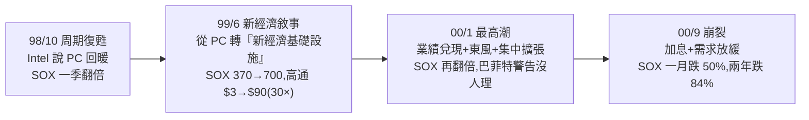

# 這次半導體狂歡是 2000 泡沫重演嗎?五個相同、四個不同、兩個要盯的信號

> 整理自 YouTube「美投讲美股(美投君)」〈00 年互联网泡沫,半导体都发生了什么?悲剧重演?历史已给出答案!〉(2026-05-18,約 27 分鐘)。費城半導體指數(SOX)一個月漲 70%、美光/閃迪/英特爾翻倍,泡沫擔憂四起(高盛喊見頂、Michael Burry 說「這就是 2000 dotcom 重演」)。作者專門翻了 1998–2001 半導體「由盛轉衰」的完整歷史,和今天做全面對比。
>
> **⚠️ 非投資建議**;歷史對照與判斷含大量主觀推測。內文已濾掉付費訓練營推廣。

---

## 一句話總結

**單看股價,現在很像 2000;但綜合估值、基本面、宏觀、客戶結構,這次遠比當年坚定、風險更低——比較像 1999 那輪(週期復甦做實 + 科技敘事初步驗證,提前起跑合理),而非 2000 的全面泡沫。** 半導體真正的拐點不在它自己,而在**應用層的變現**;要盯的是兩個需求端信號:**AI Token 消耗增速** 與 **大模型 ARR 是否不及預期**。

---

## 2000 泡沫四階段(每個都有今天的影子)

- **98 復甦**:98 是晶片週期底部(銷售 -8.4%),Intel(當年地位≈今天 NVDA)10 月說 PC 要回暖 → SOX 一季翻倍。這是 PC 供需改善的復甦(≈今天 2025 年 4 月後那輪半導體復甦)。
- **99 新經濟敘事**:華爾街不滿足於 PC,改談無線通信/寬帶/電商/互聯網接入=「**新經濟基礎設施**」(=今天的 WiFi/移動網路)。這是「未來性感故事」,才有想像空間、才有泡沫基礎(≈今天 **AI agent 帶動的推理端天量需求**→光/電/存儲/CPU)。SOX 再翻倍;高通 $3→$90(~30 倍)。
- **00 最高潮**:SIA 上調全球銷售預期到 37%,AMAT/台積電/美光收入翻倍,龍頭 Intel 也宣布轉無線通信,Fed 確認要加息 → 資金追逐「業績確定性」全扎進半導體。**巴菲特 99 年底警告不可持續,市場笑他「不懂科技、吃不到葡萄」**(今天巴菲特又表達相同擔憂、囤史上最高現金,市場依舊不理)。
- **00 崩裂**:3 月是 dotcom 頂點,但半導體因業績超好(台積電「8 個月 100% 開足馬力」、Intel 破 5000 億)撐到 9 月;3/21、5/16 兩次加息埋下抛壓。9/21「晶片史上最黑暗一天」Intel 營收預警暴跌 20%,存儲 DRAM 現貨跳水崩盤 → SOX 一月跌 50%、**兩年跌 84%,之後十多年在 500 點徘徊,直到 2018(20 年後)才收復**。

---

## 今昔對比:五個相同、四個不同

**五個相同**:① 都是革命性技術創新(互聯網 vs AI);② 泡沫開啟都來自未來科技敘事(新經濟基礎設施 vs AI 推理需求暴漲);③ 都是「業績兌現 + 行業東風 + 集中投資擴張」三重利好;④ 宏觀都有不確定性逼資金找確定增長(當年加息 vs 這次戰爭/通脹);⑤ 股價狂熱走勢相同。

**四個不同(這次風險更低的關鍵)**:

| # | 當年(2000) | 現在(2026) |
|---|---|---|
| ① 狂熱重心 | 在**應用層互聯網企業**(很多沒業務、只靠流量包裝就漲),半導體只分到「一點湯」 | AI 應用層企業**幾乎沒上市**,半導體是**資金無處可去全扎堆** → 市場整體相對理性、非全面泡沫化 |
| ② 估值 | SOX 高點 **55 倍**前瞻(高通 170 倍) | SOX 僅 **~25 倍**(行業平均 20) → 有更強業績支撐 |
| ③ 加息風險 | 泡沫破裂關鍵拐點=加息,經濟過熱、估值高 | 宏觀與估值都**不支持加息**,風險暫時較低 |
| ④ **客戶結構(最重要)** | 蘋果/戴爾 PC + 大量新經濟互聯網企業(數量多、各自為戰、很多是本不該存在的泡沫公司,需求不穩) | **AI 資料中心**,客戶集中在少數幾家**財務強太多**的大科技 + 大模型,投資「不見兔子不撒鷹」相對克制 → 需求歸零的崩塌很難出現 |

---

## 結論與要盯的信號

- **這輪更像 1999(合理的提前起跑),不是 2000 的泡沫**:週期復甦已做實、科技敘事初步驗證。當年演變成泡沫,問題**不在基礎層狂熱、而在應用層盲目擴張**;現在應用層還沒上市,沒這風險。
- **半導體股價規律**:漲一輪 → 盤整消化估值 → 下一輪。作者預計 **2026 下半年是 AI 應用層涌現節點**(大量應用層公司上市/跑通變現),資金會輪動,半導體可能盤整等下一輪突破。**短期不會崩盤,但短期增長潛力已不足;機會會從基礎層逐漸轉向應用層。**
- **半導體真正的拐點看應用層變現**,要盯**兩個需求端信號**:① **AI Token 消耗增速**若開始放緩 = 重要風險;② **大模型 ARR 不及預期**(如市場預期某大模型 ARR 年底 440 億→1000 億、明年 2000 億;**若只到 1500 億——不是不增長、是增長不及預期——也是巨大威脅**,因市場胃口越來越大)。目前兩個風險都還有距離,AI 推理需求才剛起步。

---

## 應用案例 / 怎麼用這套歷史對照

- **判斷「是不是泡沫」別只看股價**:用這四把尺——**狂熱重心在應用層還是基礎層、估值倍數、加息風險、客戶結構穩不穩**。股價狂熱相同不代表結局相同;客戶從「一堆會倒的泡沫公司」變成「幾家財務強的大科技」是本質差異。
- **最該記住的教訓:情緒扭轉時,基本面救不了股價**。2000 年 3–8 月很多晶片公司收入還翻倍增長,但股價就是不漲甚至跌。**「需求強、業績好」不等於可以永遠買入**;閃迪基本面很好也一樣。對風險永保敬畏。
- **長期 vs 短期分開處理**:作者的做法——**不追高熱門晶片股,但手中龍頭坚定持有、不減不賣**。AI 像互聯網是長期大趨勢,不會幾個月透支完;且應用層爆發也利好基礎層。危機時**應用層先受衝擊、基礎層最後才受影響**(很難「別的板塊賺錢而晶片不賺」,也很難「別的板塊安全而單獨晶片崩」)。
- **資金無處可去時要小心「唯一確定性領域」被透支**:當某個板塊成為資金唯一的確定性出口,短期會透支預期——不是泡沫,但要預期它之後的盤整。

> 延伸對照:本庫 [[us-stocks-h2-2026-outlook-stock-vs-flow-ai]](存量 vs 增量邏輯,同作者)、[[ai-application-layer-4-trends-earnings]](應用層機會)、[[hbm-high-bandwidth-memory-principle]](HBM 漲價的技術面)、[[us-stocks-rate-hike-risk-2026]](升息風險)。

---

## 來源

- 美投讲美股(美投君),〈00 年互联网泡沫,半导体都发生了什么?〉,YouTube:<https://www.youtube.com/watch?v=91yRxsdc0gA>(2026-05-18,約 27 分鐘)
- **該片無字幕,逐字稿以 CPU 版 faster-whisper(`vad_filter=True`,small,zh)轉錄,非官方字幕**;歷史數字(SOX 各階段翻倍、高通 $3→$90、Intel $74.88 破 5000 億、SOX 55×/25× 估值、跌 84%、DRAM 崩盤日期)依語音+歷史常識還原,可能有聽寫誤差,實際以原片為準。**非投資建議**。
