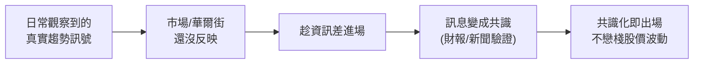

# 社交套利(Social Arbitrage):Chris Camillo 從日常生活挖出暴利機會的方法

> 整理自 YouTube「Brayden Chen」〈從 2 萬到 7000 萬美金,他不看 K 線圖、不看財報,靠「這個」方法從日常生活中找到暴利投資機會〉(約 39 分鐘)。主角 **Chris Camillo**:2007 年用 2 萬美元本金,靠他自稱「**社交套利(social arbitrage)**」的方法,三年滾到 200 萬、再一路到 7000 萬美元以上,並登上 Covestor 平台全球真實帳戶報酬第一。
>
> **⚠️ 非投資建議**,僅為觀念與故事整理。影片本身與本筆記都明確點出:**這套方法 99% 的人複製不了、且有強烈倖存者偏差**(見文末)。重點不是抄他的交易,是抄他「從生活觀察資訊差」的視角與紀律。

---

## 一句話總結

**社交套利 = 在「華爾街看不懂、也不願意去」的地方(青少年在追什麼、家庭主婦在抱怨什麼、論壇/搜尋/社群的聲量變化),比市場早一步發現會反映到營收的真實趨勢,趁市場還沒消化時進場、消化成共識時出場。** 他交易的是「**資訊差**」,不是股價;「你不需要比華爾街聰明,你只需要跟他們不一樣」。

---

## 起源:13 歲就在做的「資訊差」生意

- Chris Camillo 1974 年生於紐約長島,12 歲時最好的朋友因白血病幾個月內過世,讓他立志長大要做幫助重病兒童的慈善基金會——這是他想賺大錢的初心。
- 13 歲搬到德州後,每個週末天還沒亮就搭公車去**車庫拍賣(garage sale)**。關鍵觀察:① 值錢的東西第一個小時就被搶光;② 主辦人多是**家庭主婦**,對手錶、模型、釣具、工具箱這類「男性產品」的真實二手價值沒概念,在她們眼裡是雜物。於是他 1 美元買進、10 美元賣出,一個月賺 100–200 美元。**這就是他整套投資邏輯的雛形:資訊差。**
- 大學後在達拉斯一家線上問卷公司做業務開發約 10 年,2006 年年薪已逾 20 萬美元、結婚買房,但他清楚「靠這份薪水永遠建不了慈善基金會」。於是 2007 年從 8.7 萬存款裡拿 2 萬去測試他的方法。

---

## 早期經典案例(把方法講清楚)

| 案例 | 他觀察到的「生活訊號」 | 操作 |
|---|---|---|
| **Apple / iPhone(2007)** | 泳池派對上 25 個人玩完初代 iPhone 的反應都是「哇這太厲害了」;但華爾街只盯著「只跟 AT&T 獨家、訊號爛」 | 一般人 5 分鐘就上癮 → 做多 Apple,早期最成功交易之一 |
| **Amazon / AWS(2010 前後)** | 每晚泡工程師技術論壇,**統計大家提到「AWS 雲端」的頻率**,幾個月內爆炸成長,而這趨勢還沒進任何一份華爾街研報 | 重壓 Amazon;AWS 後來成最賺錢部門,股價起飛 |
| **Beacon Roofing(屋頂)** | 美國中西部每年冰雹季,屋頂被砸的家庭**第一反應是上 Google 搜「怎麼修屋頂」**——這是即時數據,比實際營收提前 5–6 個月 | 在搜尋暴增、財報還沒出時重壓全美最大屋頂商,財報一出營收遠超預期、股價暴漲 |
| **e.l.f. Beauty(2019)** | 股價僅 7–8 美元、被當沒品牌力的平價美妝;但網路討論量 2019 初突然暴增,追源頭發現是美妝大網紅 **Jeffree Star** 一支「半臉用 7 美元 e.l.f.、半臉用 50–60 美元專櫃、效果一樣」的影片破千萬觀看。他還親自跑藥妝店驗證真實銷量 | 做多 e.l.f.,後續大漲 |

> 2010 年帳戶破 200 萬、太太懷孕,他辭職放一年假,在星巴克把三年交易寫成書 **《Laughing at Wall Street》**(2011)。

---

## 最瘋狂一筆 & 之後的失焦

- **COVID(2020 初)**:他用 **Google 翻譯**讀大量中國醫生與科學家的報告,判斷疫情遠比市場認知嚴重。先做空、再在市場崩跌後重壓 **14–15 檔「居家受惠股」**(惠普、Peloton 等——在家工作、在家健身、買冰箱囤貨…),這一年做出約 **370%** 的報酬,是他人生最大一筆。
- **危險的後續**:大賺後他**開始失焦**——跑去玩 NFT、甚至在曼哈頓開線下店。他自己承認問題不是花錢,而是**分心**;所幸沒被 NFT 套牢太深。
- **2025 年 8 月**:他押注**拉斯維加斯 Sphere** 推出的新秀(綠野仙蹤)相關標的——多數投資人覺得「只是一場秀、娛樂業不確定性高」,他卻看到不一樣的高信念訊號。

---

## 慘痛教訓:讓他賠掉 1/3 淨資產的那筆

> (此段影片穿插英文訪談原音,中文逐字稿在此處辨識品質較差;以下為依前後文還原的要點。)

他在一筆 **QSR(餐飲品牌,Restaurant Brands / Tim Hortons 體系)的選擇權**重倉上栽跟頭,**賠掉約三分之一淨資產**——原因是他**偷懶**,沒有對 Tim Hortons 做足功課就重壓。從那之後他定下鐵律:**期權交易通常不超過流動資產的 5%–10%**,以防這類不可控的黑天鵝再發生。

---

## Chris 的 8 條投資原則

1. **把錢分開,你才敢賺大錢。** 多數人失敗不是不聰明,而是用「不能輸的錢」(退休金、生活費、學費全混一起)在投資,於是永遠不敢下重注。他設一個 **Big Money Account(大錢帳戶)** 專做高風險高回報,錢來自「把今天省下的每一塊都當未來的 100 美元」(少買星巴克、用折扣券)——這些本來就要花掉的錢,**全賠也沒關係**,才扛得住高風險。
2. **不要離開你的優勢區。** 他投過 150+ 家新創,大多失敗;教訓是 100% 精力只放在你有絕對優勢的領域,別為了分散就去玩你毫無優勢的遊戲。
3. **交易的是資訊,不是股價。** 進場唯一理由是發現市場還沒消化的新資訊;出場唯一理由是該資訊已被消化成共識。中間所有股價波動他都不在乎(所以他不太用一般散戶的止損邏輯)。
4. **你可以犯錯,但不能偷懶。** QSR 那筆就是偷懶。鐵律:**你壓多大的注,就要做多深的功課**;重倉交易裡沒有「理所當然」。
5. **黑天鵝不是意外,是必然——要有「準備好的頭腦(prepared mind)」。** 例:加州未來 30 年大概率有大地震,既然一定會發生,何不事先研究好「那天我立刻做多/做空哪些股票」?當所有人恐慌時,只有你腦中已有答案,能第一時間果斷出手。一輩子抓到一兩次黑天鵝就能擠進全球 1% 投資人。
6. **注意力比資金更珍貴。** 他**完全不看**華爾街日報、CNBC、技術線圖、經濟預測——因為跟他的方法論無關,看了只會稀釋判斷。
7. **散戶其實比華爾街更有優勢。** 「你不需要比華爾街聰明,只需要跟他們不一樣。」分析師多是中年男性,看不懂女兒在玩什麼、青少年在追什麼、主婦在抱怨什麼。所以他去 **TikTok 留言區、Reddit、Google 搜尋趨勢、青少年的 Discord、主婦的 Facebook 社團**——那才是社交套利的戰場。
8. **(與交易無關但影響最大)朋友不是競爭對手,是互相提拔的關係。** 真誠給出去的價值不會白費,會在你想不到的時間、以想不到的形式回到你身上。

---

## 誠實的提醒:倖存者偏差(影片作者自己強調)

- 作者明說:**「Chris 的成功 99% 的人複製不了」**,且這是典型**倖存者偏差**——你會看到他,只因他活下來、賺到了;用同樣方法但運氣差/時機錯的人早被市場消滅,你連名字都不會聽到。
- 那為何還值得看?他從 Jack Schwager 的 **《不為人知的金融怪傑(Unknown Market Wizards)》** 系列發現:幾十位頂尖交易員反覆提到的關鍵字**不是運氣或天賦,而是心態、紀律、耐心**。
- 書中對每位交易員都問「你這輩子最糟的一筆交易是什麼?」很多人答的**不是賠最多的那筆,而是決策最糟的那筆**——因為交易結果 = 能力 + 運氣;若因「剛好賺到」就以為自己對,會用同一套錯邏輯做下一筆,直到市場一次性全拿回去。頂尖交易員贏在**有一套流程、衡量決策本身合不合理**,而非每筆都賭對。
- 作者的類比:看 Kobe 自傳不是為了打 NBA,是學他凌晨四點訓練的紀律、面對重傷的心態。看 Chris 也一樣——**可帶走的是「從日常生活挖機會的觀察力」和「敢承認自己錯」**,不是高槓桿 all-in 某支股票。

---

## 應用案例 / 可帶走的東西

- **把「生活觀察」當另類數據源**:你比華爾街早看到的東西(小孩突然都在用某 App、某品牌在 TikTok 爆紅、某產品缺貨/排隊、Google 某搜尋詞暴增),都可能是「會反映到營收、但研報還沒寫」的領先訊號——關鍵是**驗證真實銷量**(像他親自跑藥妝店),別只看網路聲量。
- **資金分桶**:把「絕對不能輸的錢」和「賠光也沒關係的進攻資金」徹底分開,才有膽在高信念時下重注、也不會被一次失手毀掉人生。
- **倉位紀律**:再高信念的單一/期權部位也設上限(他用 5–10% 流動資產),為黑天鵝留命。
- **重決策品質、輕單筆結果**:用「這個決策本身合不合理」評估自己,而不是「這筆賺了沒」——對照本庫 [[minervini-think-trade-like-champion]](冠軍心態/控風險)、[[gooaye-stock-picking-philosophy]](選對題材)、[[just-keep-buying-nick-maggiulli]](不靠預測靠紀律)。

---

## 來源

- Brayden Chen,〈從 2 萬到 7000 萬美金,他不看 K 線圖,不看財報,靠「這個」方法從日常生活中找到暴利投資機會〉,YouTube:<https://www.youtube.com/watch?v=ZWsZwX6nsV0>(2026-05-28)
- 提及書籍:Chris Camillo《Laughing at Wall Street》;Jack Schwager《Unknown Market Wizards(不為人知的金融怪傑)》。
- **該片無字幕,逐字稿以 CPU 版 faster-whisper(`vad_filter=True`,small 模型)轉錄取得,非官方字幕**;影片為中文旁白穿插 Chris Camillo 英文訪談原音,**英文訪談插播段的中文轉錄品質較差**(部分內容依前後文還原),數字與細節請以原片/原書查證。內文已濾掉影片中的 moomoo 贊助廣告段。
