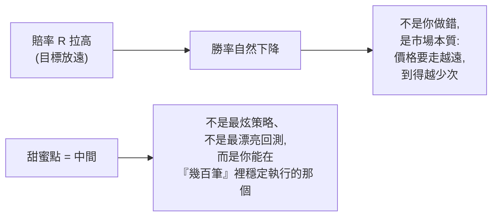
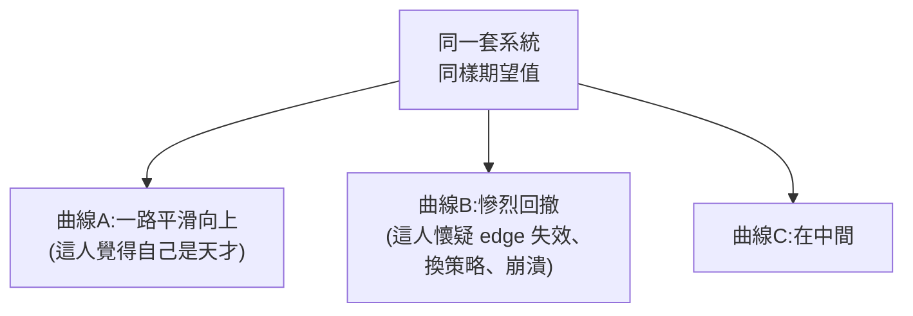

# 交易的「贏家數學」:期望值、系統設計、變異數、風險,與一個改變交易的問題

> 整理自 YouTube「Mulham Trading」〈The Math of Winning in Trading〉(約 14 分鐘,英文)。主旨:**交易輸贏不是靠完美進場點,而是靠數學**。影片拆出四個每個交易者都必懂的數學概念(**期望值 Expectancy、系統設計 System Design、變異數 Variance、風險 Risk**),最後丟出一個能改變你交易的問題。
>
> **⚠️ 非投資建議**(影片本身也聲明僅供教育用途)。這篇講的是**風險管理與機率思維的框架**,不是任何具體買賣訊號;交易高風險,回測漂亮 ≠ 實盤會賺。

---

## 一句話總結

**單筆交易約等於擲硬幣(50/50),你賺不賺錢由「系統的數學」決定,而非任何一筆的輸贏。** 多數人把注意力全砸在策略、指標、心理上,卻幾乎不看那個唯一能告訴你「這套系統到底會不會賺」的數字——**期望值**。問題不是不夠努力,是**努力的方向錯了**。

> 影片開場五句話重設你的視角:① 多數人追完美進場,但真正的 edge 來自機率與數學;② 單筆輸贏基本上是擲硬幣;③ 長期成敗由系統數學決定;④ 一筆交易什麼都不能說明;⑤ 你的注意力該放在「系統的數學」上。

---

## 概念一|期望值(Expectancy):唯一真正重要的數字

期望值 = **每筆交易平均能期望賺到多少**,公式:

```
期望值 = 勝率 × 平均獲利 − 敗率 × 平均虧損
```

它不管你上一筆贏多漂亮、最近五次 setup 多乾淨、下單當下多有信心。重點是把**整套策略濃縮成一個數字**:不是「我覺得這招有用」,而是「這套系統在大量樣本下每筆賺 X」。**期望值為正 = 你有一套會賺錢的系統。**

**三個反直覺的例子**(說明「勝率高低本身不重要」):

| 系統 | 勝率 | 賠率(R) | 每筆期望值 | 直覺 vs 真相 |
|---|---|---|---|---|
| 高賠率低勝率 | **15%** | 8R | **+$350** | 輸掉近 9 成交易,卻照樣賺錢 |
| 中庸 | 55% | 3R | **+$1,200** | 最舒服的甜蜜點區 |
| 高勝率低賠率 | **70%** | 1R | **+$400** | 贏很多次,但每次賺很小 |

> **關鍵洞察**:70% 勝率和 15% 勝率的期望值竟然差不多。所以 edge **不在勝率本身、也不在 R 倍數本身,而在兩者的組合**。

**兩個多數人忽略的陷阱:**
1. **每筆交易都有隱藏成本**:點差(spread)、手續費(commission)、滑價(slippage)。**紙上期望值 ≠ 真實期望值**——一套策略可能紙上獲利、實盤卻虧錢,因為你沒把這些算進去。
2. **小樣本騙人,所以人太早放棄**:前 10–20 筆幾乎看不出系統好壞(全是雜訊);要到**約 100 筆**真相才浮現。很多人在「edge 還沒來得及顯現」之前就退場了——這條直接連到「變異數」。

---

## 概念二|系統設計(System Design):接受沒有完美策略

每套系統都有 trade-off:**賠率越高,勝率通常越低;勝率越高,賠率通常越小。** 很多人卡住,就是因為一直想找「兩者兼得」的系統——它不存在。



**甜蜜點(sweet spot)在中間**,不要極端:別追「1R@70%」那種,也別硬上「目標放超遠」。可行的區間像 **40% 勝率 @ 4R**、**50% 勝率 @ 3–4R**。真正的進步是同時推高勝率與賠率(往右上走),但要務實。

**損益兩平公式(breakeven):你不需要贏那麼多次。**

| 目標賠率 | 需要的最低勝率才不虧 |
|---|---|
| 1R | 需要 > 50% |
| 4R | **只需要 > 20%** |

> 想清楚這件事:**在 4R 系統裡,你可以 80% 的時間都做錯,還是不虧錢。**

---

## 概念三|變異數(Variance):為什麼交易者在情緒上崩潰

拿**同一套系統、同樣規則、同樣期望值**,跑出來的權益曲線可以天差地遠:一條平滑往上、一條經歷慘烈回撤、一條在中間。



這是交易最難接受的真相之一:**你可以每件事都做對,還是會輸**——對的進場、對的停損、對的目標、照計畫執行,照樣連虧 7 筆;也可以**違反每條規則卻連贏 5 筆**(這更危險)。**短期結果證明不了任何事,只有大樣本說真話。**

**賭徒謬誤(Gambler's Fallacy)**:連虧 4 筆後,你會以為「下一筆中的機率變高了」,於是**加碼、加大風險、更激進**——然後又是一筆虧損。真相:**每筆交易彼此獨立**。就算前面連輸 5 筆,下一筆**還是 50/50**,不會因為連輸而變成 82% 或 91%。

---

## 概念四|風險(Risk):活得夠久,edge 才有機會兌現

> 前面所有數學,**只要你活不夠久就全部沒意義**。風險是「紀律變得可見」的地方。

**(A) 部位大小(Position Sizing):固定「每筆冒的錢」,不是固定手數。**
每筆交易停損距離不同,但**每筆冒的金額(或帳戶 %)要一樣**:停損越寬 → 部位越小;停損越窄 → 部位越大,動態調整。建議**每筆風險 0.25%–2%(這是上限)**,讓一個壞週、壞月不會一次毀掉一切。

實作:用**部位大小計算機**——輸入帳戶幣別、餘額、風險 %、商品、停損點數(pips),按計算就得到該下多少手。例:$1,000 帳戶、風險 0.5%、EUR/USD、停損 25 pips → 冒 $5 → 下 0.02 手。TradingView 也有 `lot size calculator` 指標可直接算。

**(B) 破產風險(Risk of Ruin):隨風險 % 暴增。**

| 每筆風險 | 出現 50% 回撤的機率 |
|---|---|
| 0.5% | 低 |
| 1% | 約 18% |
| 2% | 約 65% |
| 5% | 爆炸性飆高 |

> 這不是觀點、不是心理,是**基本數學**。看懂它就看懂「生存」——而生存是交易一切的地基。「連虧不是問題,你的部位大小才是問題。」風險控制得當,連虧只是「痛」、還能活著復原;風險過大,連虧就是「歸零」。

**(C) 虧損與獲利不對稱(復原數學對你不利):**

| 虧損 | 要回本需要的報酬 |
|---|---|
| 10% | 11% |
| 30% | 43% |
| **50%** | **100%** |

> 一旦你虧掉帳戶的一半,**市場等於要求你翻倍才能回到原點**。這就是「保住本金」為什麼這麼重要。

---

## 那一個問題:What changes now?

四個概念都懂了之後,真正的問題是:**「有哪一件你心知肚明做錯、但只要修正就能徹底改變你交易的事?」** 你大概已經知道答案,坐下來想一定找得到。常見候選:

- 只憑幾筆交易就判斷一套系統(忘了大樣本)。
- 冒太大風險只為了「感覺到什麼」——你在追情緒,不是在交易市場。
- 把「好結果」誤當成「好執行」(運氣好 ≠ 決策對)。
- 一遇到變異數(回撤)就拋棄自己的 edge。
- 在一場機率遊戲裡追求「確定性」。

**不管你的答案是什麼,該做的事都一樣**(影片的收尾五原則):
1. **想機率,不想結果**(think in probabilities, not outcomes)。
2. **用大樣本評斷你的 edge**,別用三五筆。
3. **冒夠小的險以熬過變異數**(risk small enough to survive the variance)。
4. **一致性勝過完美**(consistency beats perfection)。
5. **你的工作是執行,不是預測**(execution, not prediction)。

---

## 應用案例 / 怎麼用這套框架

- **先算期望值再談策略**:把你過去 ≥100 筆交易的勝率、平均賺、平均賠代進公式;為正才值得繼續優化,為負再多努力都是把錢倒進破洞。記得**扣掉點差/手續費/滑價**再算一次。
- **設計系統時挑「能執行幾百次」的甜蜜點**,而非回測最漂亮的那個——40%@4R、50%@3–4R 這類比「1R@70% 要一直盯著小利」更撐得久。
- **用 breakeven 表替自己鬆綁**:做 4R 系統時,連錯 8 成也不虧,心理壓力小很多,反而更能照計畫執行。
- **連虧時的自保 SOP**:① 提醒自己每筆獨立、下一筆還是 50/50(別加碼);② 用部位計算機把每筆風險壓在 0.25–2%;③ 記住「50% 虧損要 100% 才回本」,寧可慢慢來也別重壓翻本。
- **把「那一個問題」寫下來**,每月檢視一次——多數人的最大漏洞不是策略,是上面五個心理陷阱之一。

> 延伸:這套「過程重於單筆結果、大樣本才算數、控風險求生存」的思路,與本庫 [[social-arbitrage-chris-camillo]](頂尖交易員談決策品質 vs 運氣)、[[minervini-think-trade-like-champion]](停損 3–8%、控風險為核心)、[[selling-earnings-volatility]](Kelly 部位大小與尾端風險)、[[rl-trading-bot-forex]](回測漂亮、樣本外打回原形)高度互通。

---

## 來源

- Mulham Trading,〈The Math of Winning in Trading〉,YouTube:<https://www.youtube.com/watch?v=BAfRVpKIxZ4>(2026-05-31)
- 內容整理自該片**英文自動字幕**(逐字稿經去重整理,非官方人工字幕,可能有少量辨識誤差;數字例子為影片中舉例,實際數值依你自己的系統而定)。**非投資建議**;影片亦附免責聲明,僅供教育用途。
