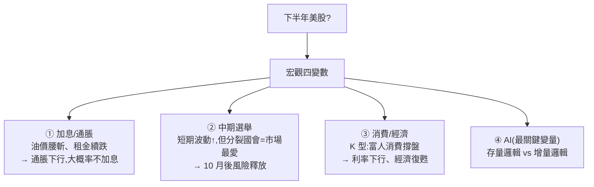

# 下半年美股前瞻:宏觀四變數 + AI 的「存量邏輯 vs 增量邏輯」

> 整理自 YouTube「美投讲美股(美投君)」〈涨的要跌?跌的要涨?下半年 2 大风险,1 大致富机会,你必须了解!〉(2026-07-05,約 26 分鐘)。這是 2026 下半年美股前瞻:先排除噪音、拆解四個宏觀變數(加息/通脹、中期選舉、消費、AI),再用一個很好用的框架——**AI 市場的「存量邏輯 vs 增量邏輯」**——解釋為何上半年只有狹窄領域大漲、以及下半年可能的轉變。
>
> **⚠️ 非投資建議**,僅為觀點與框架整理;個股與宏觀判斷含大量作者主觀推測,操作請自行評估。內文已濾掉付費產品(美投 Pro)推廣段落。

---

## 一句話總結

**下半年美股「風險與機遇並存」:風險集中在極短期(政策/中期選舉),但拉長到年底多是利好;AI 讓整體企業盈利大幅提升。** 最值得帶走的是那個框架:**目前 AI 市場困在「存量邏輯(零和搶資源)」,一旦轉回「增量邏輯(正和一起賺)」,市場寬度就會改善、機會變多。**

---

## 1. 宏觀四變數

### ① 加息/通脹——市場的加息擔憂被高估
新任 Fed 主席沃爾什(Warsh)硬派、CME 定價今年加 1–2 次息,被視為當前最大風險。但作者用數據論證**通脹下行趨勢明確**:
- **油價**:從戰爭峰值 $110 腰斬到 $68;霍爾木茲海峽的油輪流量只有正常的 20–40%(更多供給在路上)、美國石油出口從每日 300 萬桶飆到 800 萬桶,委內瑞拉/伊朗/阿聯酋還會再增供 → 油價還有下行空間,且明年基數效應天然拉低通脹,油價**可能反成輸入性通縮來源**。
- **核心服務通脹**:工資增速 3.8%(合理、無反彈);租金看 Zillow(領先 CPI 租金 12–18 個月)仍在下滑。**晶片/存儲漲價對核心 CPI 影響僅約 0.1%**(高盛估)。
- 結論:**通脹即便不加息也會續跌,今年大概率不加息**;加息擔憂造成的波動反而是買點。

### ② 中期選舉——短期風險被低估、長期反而積極
11 月中期選舉。歷史上中期選舉年 6–9 月**波動更高、報酬更低**(兩黨選前密集推政策/發言拉票)。但 Polymarket 顯示**民主黨 84% 拿眾議院、共和黨 57% 領先參議院 → 分裂國會**,而**分裂制衡正是市場最愛**(最怕政策重錘)。所以短期政策風險要謹慎,但 10 月後風險釋放、市場常大幅回升。

### ③ 消費/經濟——K 型經濟,富人消費撐盤
BofA 數據:美國消費持續強勁(**剔除油價後同樣增長,已達三年最高**)。核心是 **K 型經濟**——高收入者工資增速遠高於中低收入,加上股市財富效應,富人消費動能極強。油價大漲是一次「壓力測試」,證明消費韌性是真的。通脹可控 + 就業穩 → **利率遲早下行 → 經濟復甦**,尤其利多非必需消費品。

---

## 2. 核心框架:AI 的「存量邏輯 vs 增量邏輯」

> **這是全片最有價值的思考工具。**

| | **增量邏輯(正和)** | **存量邏輯(零和)** |
|---|---|---|
| 運作 | 越多人用 AI → AI Native 公司賺錢 → 向雲廠買更多 token → 雲廠投更多到半導體/資料中心,**整條鏈一起漲** | 下游需求雖增,但增量幾乎被 OpenAI 等大模型自己攏住;雲廠收入增量有限卻要吞半導體漲價(兩頭被堵);半導體全靠大科技資本開支 |
| 投資難度 | 低(你好我好,錯過一個還有別的) | **高(好機會同一時間只有一個、且一直在變;錯過好的、剩下都是被搶資源的輸家)** |
| 表現 | 市場寬度好 | **狹窄上漲 + 一邊狂熱一邊焦慮** |

- 過去大半年美股就是**存量邏輯**:大家搶資源(GPU→ASIC→電→光→CPU→存儲),誰搶到誰漲、其他成受害者。**HBM 存儲半年漲 4–5 倍、SMH 半年近翻倍**就是這麼來的。
- 作者堅信 **AI 終會回到增量邏輯**(AI 是生產力革命,光是效率提升就帶來巨大價值,未來還有大量新產品)。**Agentic AI 已在應用層落地(如 coding),下游閘門一開,應用層 AI Native 公司與雲廠都能看到明確回報,整條鏈回歸增量。下半年很可能是轉變拐點。**
- 宏觀上 **AI 對整體美股一定是增量**:FactSet 預估 26 Q3/Q4 企業盈利增速 >20%(遠高於歷史平均 12%),來自 AI 應用促進——**即便不押 AI 個股,AI 技術也給整體美股盈利帶來成長**。

---

## 3. AI 最大風險:大科技資本開支放緩

- 目前仍是存量邏輯,最受益的是技術層**半導體**;但半導體的增量幾乎全靠幾家大科技的資本開支。**一旦資本開支放緩,「價格通脹」邏輯就翻成「價格通縮」,之前漲最兇的反而受傷最大。**
- 弔詭的是:資本開支放緩對半導體不好,但**對大科技本身可能是利好**(緩解「回報率不足」的股價壓力)——這是存量邏輯下資源重新分配。
- 大科技會不會放緩資本開支?作者團隊內部激辯**無定論**(不放緩:AI 需求極高、回報遲早來;放緩:收入進不來、成本一直增)。**理性選擇:不單押一邊**,兩側都配置能穿越週期的好公司,或**直接買 QQQ**(自篩選系統自然幫你押最好的)。

---

## 應用案例 / 怎麼用這套思路

- **用「存量 vs 增量」判斷 AI 行情性質**:當你看到「一邊狂熱、一邊焦慮、只有狹窄領域大漲、資金在 GPU/ASIC/光/電/存儲間輪搶」——那是**存量(零和)邏輯**,好機會少且一直變、追高風險高;當「應用層普遍變現、整條鏈一起漲」出現,才是**增量邏輯**回歸、機會變多。
- **選 AI 標的的四把尺**:互補合最深、技術壁壘最強、可替代性最弱、管理層最優——找能**穿越週期**的公司,而非追當下最會動的。
- **不確定資本開支走向時的配置**:別單押半導體或大科技,兩側配置穿越週期好公司,或用 **QQQ** 讓自篩選機制幫你押。存量→增量轉變前,常有優質公司被「搶資源邏輯」錯殺、估值合理又有 AI 上漲空間,是布局點。
- **宏觀擇時的心法**:別因短期不看好就空手等第四季(永遠抓不準時間點);更好的做法是**短期做好抗風險準備、別被淘汰出局,再擇機入手優質公司**。作者維持標普 500 年底 **8200 點**目標(估值 5 年中位、今年還在降 + 20%+ 盈利增長)。

> 延伸對照:本庫 [[us-stocks-rate-hike-risk-2026]](同作者的升息風險研判)、[[ai-software-stocks-usage-based]](AI 軟體選股)、[[seagull-options-hedge]](牛市中對沖)、[[ai-compute-token-economics]](算力/token 經濟,與存量邏輯的資源爭奪呼應)。

---

## 來源

- 美投讲美股(美投君),〈涨的要跌?跌的要涨?下半年 2 大风险,1 大致富机会〉,YouTube:<https://www.youtube.com/watch?v=px5M4ry8IO4>(2026-07-05,約 26 分鐘)
- **該片無字幕,逐字稿以 CPU 版 faster-whisper(`vad_filter=True`,small 模型,zh)轉錄取得,非官方字幕**;人名/數字(沃爾什、油價 110→68、出口 300→800 萬桶、HBM 漲 4–5 倍、FactSet 盈利 >20%、標普 8200)依語音還原,可能有聽寫誤差,實際以原片為準。**非投資建議**;內文已略去美投 Pro 推廣。
