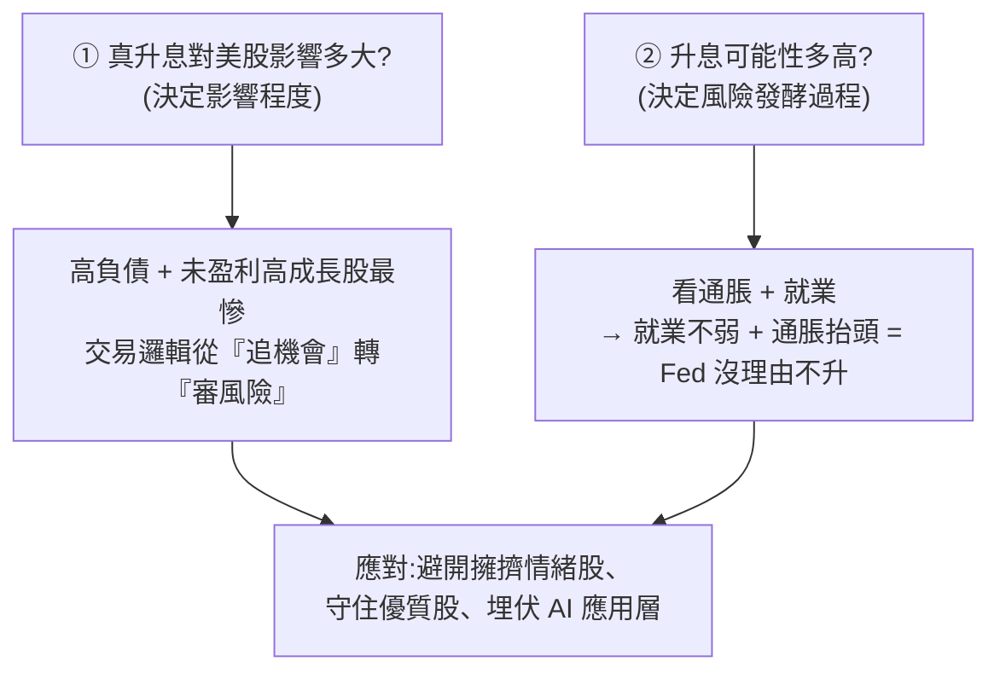

# 美股升息風險研判:哪三類股票該避、哪一類反而是機會(美投君)

> 來源:美投君 / 美投讲美股〈美股涨到头了?这3类股票不要碰!还有1类反而出大机会?〉。2026 年 6 月初,**升息(rate hike)風險**時隔四年再度被擺上台面——當週五納指大跌近 5%(關稅日以來最大單日跌幅)、半導體板塊 ETF 單日跌逾 10%。本筆記整理他的兩層分析框架(真升息影響多大 × 升息可能性多高)、受衝擊與抗跌的股票分類,以及他個人的三點應對。

> ⚠️ **非投資建議。** 本筆記為影片觀點整理,僅供觀念參考,不構成任何買賣建議;市場有風險,決策請自行查證並自負盈虧。

---

## 一句話總結

升息風險是真的、而且在增加,但**最可能的劇本不是「明天真升息」,而是新任美聯儲主席「放鷹(hawkish)展示決心、行為上按兵不動」**——光是鷹派言論 + 維持升息可能性,就足以讓**過度擁擠、情緒最熱的 AI 基礎層半導體**情緒轉向、出現深跌(歷史上這類股 30–50% 回檔很正常);但對**估值合理、盈利穩定**的龍頭衝擊有限。他視這波為**短期可控的回調(非衰退/大熊市)**,反而是**埋伏 AI 應用層**的好時機,維持標普年底 8200 點目標。

---

## 兩層分析框架

---

## ① 真升息,什麼股票最受傷?

歷史上(1950 起對照美聯儲利率與標普 500)**幾乎每次升息後不久經濟就衰退,之前美股幾無例外經歷熊市**;反例只有 1995 格林斯潘軟著陸、2017 鮑威爾首次升息,但這兩次美股也都有 10–15% 短跌。**升息是不小的風險。**

| 衝擊大 | 為什麼 | 例子 |
|---|---|---|
| **高負債公司** | 利率↑ → 借貸成本直接↑ | 重金押 AI 的 **Oracle(甲骨文)** |
| **未盈利的高成長企業** | 估值靠未來盈利折現,利率↑ → 折現率↑ → 壓縮估值 | **Neo Cloud**(如 CoreWeave 一類,普遍高槓桿高增長) |
| **情緒最熱、最受資金追捧的** | 利率環境由鬆轉緊,市場從「追逐一切機會」轉「審視一切風險」,資金撤向更安全領域,之前越受追捧越易受衝擊 | **AI 基礎層半導體**(Marvell、AMD、ARM 估值擴張極快)、**量子計算、航天、網路安全** |

| 相對抗跌 | 為什麼 |
|---|---|
| **穩定盈利、不靠借貸增長** | 大科技多數符合 |
| **必需消費 / 醫療** | **Costco**、**強生(J&J)** 等 |

> **比盈利衝擊更早顯現的,是「交易邏輯的系統性改變」**:寬鬆環境下流動性增、股市持續有上漲動能;一旦轉向緊縮,市場心態整個翻轉——這才是情緒高、擁擠度高的股票最大的隱患。

---

## ② 升息可能性多高?看通脹 + 就業

> 別信政治/資本陰謀論,回歸本質:**美聯儲利率決議最關鍵就兩點——通脹與就業。**

**就業(引爆當週下跌的直接原因):** 5 月非農 **+17.2 萬**(大超預期 8 萬),失業率 4.3%;前兩月上修(3 月→21.4 萬、4 月→17.9 萬),三月合計 **+56.5 萬**。火熱數據推高升息預期——2 年期美債收益率跳漲 10bp 到 4.16%,**CME 顯示年底前升息概率已超 50%**(11% 概率升兩次),明年 3 月底超 80%。
- **但細分數據沒那麼強**:政府就業占近 30%、休閒酒店業 +7 萬(世界盃帶動的一次性需求);薪資僅漲 **3.4%**(6 年最低、且不如通脹)→ **沒有工資-物價螺旋**。
- **重點不是就業多熱,而是「就業不需擔憂」→ 控制通脹變成主要矛盾**:市場本想用疲軟就業勸 Fed 別只盯通脹,結果就業不差 + 通脹高 → Fed 沒理由不升 → 升息概率大增。

**通脹:** 4 月已到 **3.8%** 高位,3 月起明顯抬頭,主因**油價**(3 月伊朗戰爭推高,漲約 60% 維持 3 個月)。
- Fed 看**核心 CPI**(去除能源食品)。摩根士丹利研究:**油價每漲 10%,3 個月後名義 CPI +0.35%、核心 CPI 僅 +0.03%**。
- 按此估算:當前油價 → 名義 CPI 約 +2%(2.4%→4.4%,接近預期 4.3%),但**核心 CPI 僅 +0.18%,幾乎可忽略**。
- 關稅影響約 +0.7%(已發生 0.63%,後續有限,且關稅已被裁定違法)。
- **結論**:通脹抬頭客觀存在,但高油價實際影響沒想像高、無黏性,工資與服務通脹可控。華爾街預測名義通脹高位徘徊約半年,核心 CPI 穩定在 2.5–3%。**唯一變數:戰爭再升級使高油價維持更久**(連 Fed 也控制不了)。

**美聯儲會怎麼做?** 就業有韌性(不好不壞)+ 通脹抬頭(油價可控但有不可控風險);新任主席 6/17 迎首次 FOMC。判斷:**未來一段時間 Fed 持續放鷹於情於理都是大勢**——於理通脹有風險要應對;於情在川普不斷施壓降息的背景下,通脹高還放鴿會被質疑中立性(被當「川普小弟」),新主席更應展示「抗通脹鬥士」形象。**所以放鷹風險越來越高。**

---

## 為什麼這次特別危險:擁擠 + 情緒接近 2000 泡沫頂

- 升息對「漲多、情緒高」的股票影響最嚴重,歷史上 30–50% 跌幅很正常。
- 當前市場情緒不是一般高漲、擁擠度極高,**整體美股上漲就是一小撮股票的極端上漲帶動**;標普「動量股 vs 低波動股」相對表現差距已接近 **2000 互聯網泡沫頂峰**。
- 市場需要一個 **trigger** 讓自己冷靜,**現在這個 trigger 可能已經到來**;接下來 5 月通脹數據、6 月 FOMC 是關鍵風險節點。**本次下跌或許只是開始。**

---

## 應用案例:他個人的三點應對

1. **重審倉位、降低擁擠情緒股**:受市場情緒影響高、之前資金集中的方向(AI 基礎層半導體、Neo Cloud;量子計算、航天、網路安全估值擴張快;高負債如 Oracle)——**若持有,用期權對沖或減倉降風險;若不持有,不會因短期下跌加倉**。在他看來,這類企業**當前的「持有風險」高於「踏空風險」**。
2. **優質、集中度不高的公司:不做太多操作**(大科技、估值合理的軟件股、盈利穩定龍頭)——這些估值合理、盈利穩定,即便面臨升息風險也相對低;**與其花時間擇時對沖,不如拉長視野扛過波動**。基礎判斷:**美國經濟基本面其實不需真走到升息那一步**——升息風險存在且增加、主席必須應對通脹,但**最合理做法是「鷹派言論展示決心、行為上按兵不動、持續觀察」**;光鷹派言論就足以讓情緒轉向,最終行為更可能是不升或緩升 → 實際業績負面影響有限。**這也是他不打算全面對沖的原因。**
3. **與其追高擁擠的 AI 基礎層,不如提前埋伏 AI 應用層**:短期升息威脅不影響 AI 技術發展與應用層投資邏輯;**短期市場風險反而是入局應用層的好機會**(估值合理、不擁擠、有盈利支撐)。具體標的見其先前幾期影片。

> **補丁(重要):** 本期analyze的是**短期風險**,不代表看空美股。**中長期他仍非常樂觀**(核心是 AI 應用層機會爆發);今天的風險是相對短期、可控,不認為會演變成衰退或大熊市,衝擊量是一次短期回調,但對部分公司影響大需重視。**維持標普年底 8200 點目標,只是過程更波折**——而波折未必是壞事(消化非理性情緒、讓 AI 行情走更遠、給投資者時間補局)。「現在唯一要做的,就是控制住風險,別被短期波動趕下牌桌;留在市場上,今年往後會有更大機會。」

---

## 對讀者的可操作啟示

- **辨識「擁擠交易」**:當一個板塊「估值快速擴張 + 資金高度集中 + 情緒亢奮」三者齊備(本例的 AI 半導體/Neo Cloud),它對利率/政策的敏感度會遠高於平常——這時「持有風險 vs 踏空風險」的天平要重新衡量。
- **分清「言論」與「行為」**:央行「放鷹」常是預期管理工具,言論足以撼動情緒,但不必然等於真行動;判斷風險時把「市場情緒衝擊」和「實際業績衝擊」分開估。
- **短期風險 ≠ 看空長期**:用「短期可控回調」與「中長期結構機會」兩個時間軸分別決策——控風險在前,別被洗下車。
- 對照本庫 [[ai-software-stocks-usage-based]](AI 軟體股選股邏輯,正是「應用層」視角)、[[target-prices-institutional-secrets]](法人看的是預期差)、[[gooaye-stock-picking-philosophy]](先選題材再比估值)。

---

## 來源

- 美投君 / 美投讲美股(@MeiTouJun),〈美股涨到头了?这3类股票不要碰!还有1类反而出大机会?〉,YouTube:<https://www.youtube.com/watch?v=xEkNd6xG1qo>(2026-06-08)
- 影片引用:1950 起美聯儲利率 vs 標普 500、5 月非農就業報告、CME FedWatch、2 年期美債收益率、摩根士丹利油價傳導與關稅通脹研究、標普動量股 vs 低波動股相對表現。
- **該片無字幕,逐字稿以 CPU 版 faster-whisper 轉錄取得,非官方字幕**;原片「加息」即「升息」,專有名詞(非農、FOMC、鷹派、核心 CPI、Neo Cloud、Costco、Oracle、摩根士丹利)已校正,數字與新任主席姓名等細節可能有聽寫誤差,請以官方數據查證。
