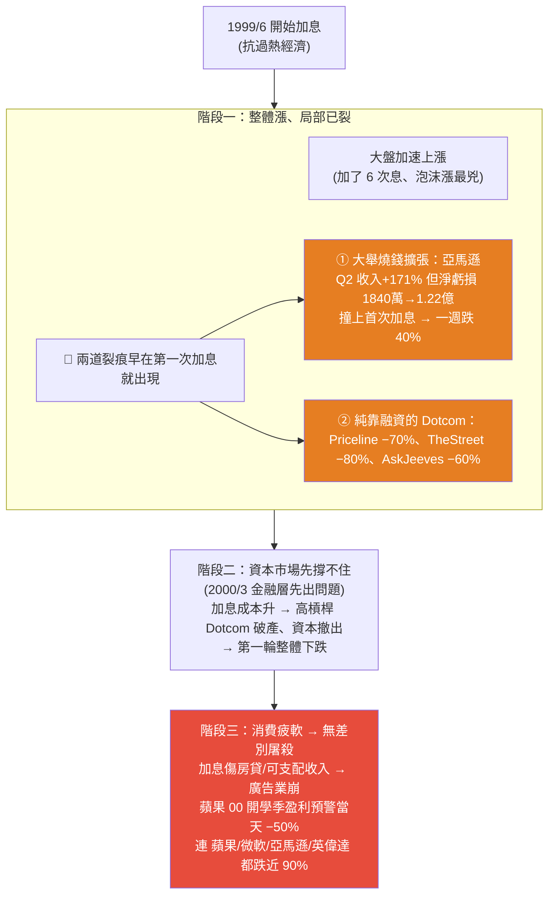
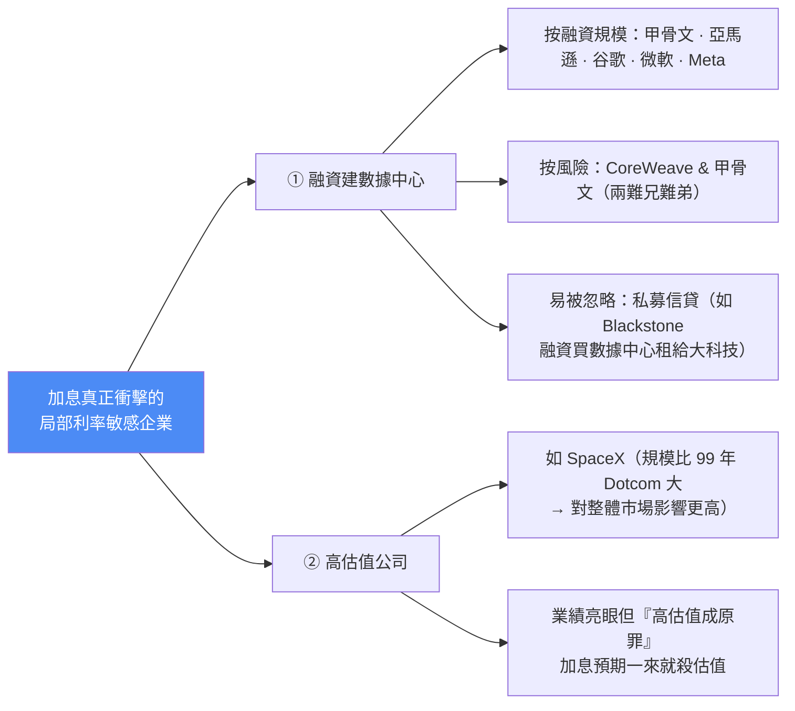

# 加息會引發美股大跌嗎?用 2000 泡沫「三階段」對照 AI 這輪革命(美投君)

> ⚠️ **本筆記為觀念與歷史對照整理,非投資建議。** 內容摘自美投君(美投讲美股)個人觀點,提及個股僅為說明框架,不構成買賣建議;投資有風險,請自行判斷。
> 📝 該片無字幕,逐字稿以 CPU faster-whisper 轉錄取得、非官方字幕,可能有少量聽寫誤差(如新任 Fed 主席 Warsh、CoreWeave 等專有名詞)。

---

## 一、核心命題:下半年最大風險是「加息」

過去三年美股處在典型的**降息通道**(百廢待興、從高通脹恢復、AI 又帶來強勁動能)。但隨著**新任美聯儲主席 Warsh(沃爾什)上台**,降息通道很可能被打破,**多次加息已被擺上檯面**。

> **歷史上幾乎每一次美聯儲加息,都引發過美股大跌**;而這一次還可能更危險——因為 **AI 這個史詩級技術革命也會因此命懸一線**(30 年前的互聯網革命,就是因加息而泡沫破裂)。歷史悲劇是否會重演?

但美投君強調:「加息=股市跌、降息=股市漲」**並沒有這麼簡單**,對技術革命中的美股更是如此。必須先從歷史看懂加息的「具體」影響。

---

## 二、教材一:1999–2000 互聯網泡沫的「加息三階段」

**為什麼階段一大盤沒反應?** 因為對大部分公司,那幾次加息對「實際業績」影響不大;加上互聯網需求旺盛、優質企業韌性更高,**基礎層公司(半導體、思科這類設備商)業務仍亮眼**,互聯網之外的行業更幾乎毫無影響。所以市場沒把加息放在眼裡。

**關鍵洞察:真正的威脅不在階段一、二(資本轉向,資質差的爛公司先跌,資本恢復就能回來),而在階段三——當消費徹底轉向,就演變成無差別屠殺**,連日後的王者都跌近九成,連傳統企業都花好幾年才恢復。

---

## 三、教材二:2021 疫情受益股(離我們更近的版本)

- 2020 疫情 + 零利率泡出一批**疫情受益股**:Zoom(視訊)、Peloton(居家設備)、Netflix / Roku(流媒體),動輒翻數倍。
- **加息又一次改變一切**,但與 99 年不同:2021 年美聯儲**提前更久放風**,21 年中市場就 priced in 22 年多次加息 → 整體大盤幾乎沒受影響、一路漲到 21 年底,**真正熊市要等 22/3 俄烏戰爭才開啟**。
- **但股市內部分化早已降臨**:21 年中加息預期一發酵,最火的疫情受益股就先崩——到 21 年底 Zoom 跌 7 成、Peloton 跌 8 成,專收這些股的**木頭姐 ARKK 跌 60%**。
- **與 99 年初期相似:加息初期大盤繼續漲,局部已分化。**加息「絕對是最大的 Trigger 與 Driver」,但不能說跌全是加息的錯。

---

## 四、AI 這輪會重演嗎?看「融資槓桿鏈」

99 年階段一的利率敏感企業、階段二的資本撤出,核心都在**融資槓桿的成本**。所以先看 AI 當前的融資槓桿:

**⚠️ 警訊(似曾相識):**
- AI 靠巨大資本開支撐起;早期靠大科技自由現金流,**現在大科技也撐不住、紛紛融資做數據中心**。大科技表內外債務融資近兩年大增,**今年才過一半、融資額已達 1700 億(去年全年才 1000 億)**。高盛等幾乎所有投行的融資業務都異常標升——背後就是數據中心融資。
- **大科技的 credit spread(信用利差)過去兩週突然走闊** = 市場開始擔心大科技的債務問題。
  - 📌 *科普:credit spread = 你的借貸利率 − 國債(無風險)利率,反映債券市場對你違約風險要的補償;走闊代表市場覺得你更有風險。*
- 走最遠的:**甲骨文(Oracle,一個月跌 30%)、CoreWeave(Neo Cloud)**;另一融資黑洞是 **OpenAI / Anthropic**(OpenAI 預計 2030 才盈利,一旦加息融資能力受影響)。
- **以前「大科技對加息不敏感」(利潤高、槓桿低、現金充沛)的結論,現在可能要鬆動了。**

**但為什麼美投君仍認為「影響有限」——AI ≠ 2000 互聯網:**

| 對照點 | 1999 互聯網 | 2026 AI |
|---|---|---|
| 融資槓桿規模 | **幾乎全部**互聯網企業玩命融資、玩命燒錢,槓桿風險高 | 明顯小很多:投錢的只有少數最大企業且有錢,融資的也是有能力賺錢的大模型公司 |
| 加息 → 資本立刻撤? | 加了 **6 次**資本才謹慎(趨勢太誘人、怕落下) | 溫和加息資金難徹底轉向,沒人願落下「幾十年一遇的生產力爆發」 |
| 終端消費在哪 | **C 端**(廣告/電商/電子產品,對經濟極敏感)→ 消費一疲軟就崩 | **B 端**——AI 幫企業**提升生產力 / 省錢**,消費難疲軟 |

> 🔑 **最有力的反證:2015–2018 加息 10 次(0 → 2.5%)+ 雲計算爆發。** 企業上雲(同樣是 B 端、幫企業省錢提效)不僅沒受加息影響,AWS(亞馬遜)、Azure(微軟)股價反而突飛猛進。**AI 與企業上雲性質類似 → 加息難影響 AI 發展;加息越多,反而可能增加企業降本增效的緊迫性、促進 AI 採納。**

---

## 五、結論:誰會受影響?(2–3 次加息預期下)

真正受影響的只會是**局部**,集中在兩類「利率敏感企業」:

**但美投君判斷衝擊「可控」:**
- 除 CoreWeave 等少數,這些公司風險普遍較低,**個股下跌相對可控,不會像 99 年亞馬遜那樣動輒腰斬**。
- **衝擊大概率只停留在「交易層」,企業「實際決策層」很難改變**——大科技數據中心資本支出、資本市場活躍度、AI 中端採納力度,都很難因兩三次加息而變 → **AI 技術革命不受影響,大盤難有系統性衝擊。**

> ⚠️ **重要補丁:講風險 ≠ 看空。** 上述標的確實有風險,但不代表看空——有些可能已充分 priced in 加息風險,**若未來加息預期下降,反而是利好**;若加息風險真上升,你也知道哪種股受影響更大。**分析風險的目的是看懂市場,不是賭方向。**

---

## 六、加息到底會不會加更多?

- **加息唯一目的是抗通脹**;而現在通脹**即便不加息也已在穩定下滑通道**(數據已驗證)。美聯儲真加息,目的只是「加速下跌過程」,不是壓過熱經濟 → **不需擔心「持續多次加息停不下來」的風險**,大概率不會加那麼多次,靠**預期管理**就能加速通脹下滑、把對資本市場的影響降到最低。
- **唯一不確定性 = 新主席 Warsh**:剛上台、路子未明(是跟著經濟數據一步步來,還是出來立威、「夾個五六四七也在所不辭」)。但這只是**短期影響**,最終美聯儲還是要跟經濟規律走;短期多保留一份謹慎未嘗不可。

---

## 七、應用案例

1. **別把「加息初期大盤還在漲」誤讀成「加息沒影響」:** 99 年與 21 年都是大盤續漲、局部先裂。若你只看指數,會錯過「利率敏感股已先崩」的訊號——盯的應該是**高槓桿/純融資/高估值**那批,而非大盤點位。
2. **用「終端消費在 C 端還是 B 端」判斷技術革命的抗跌性:** 互聯網靠 C 端廣告(經濟敏感)→ 消費一冷就崩;AI/雲計算靠 B 端省錢提效 → 加息反而催化採納。這是判斷「這次泡沫會不會像 2000」的關鍵分水嶺。
3. **把 credit spread 當作 AI 泡沫的「體溫計」:** 與其猜頂,不如盯大科技/Neo Cloud 的信用利差有沒有持續走闊——那是「資本市場開始擔心債務(階段二訊號)」的客觀指標。
4. **對號入座你的持股屬於哪一類風險:** 若持有甲骨文、CoreWeave、私募信貸或 SpaceX 這類「融資建數據中心 / 高估值」標的,要意識到它們是加息時的第一批受衝擊者;但也要記得「風險 ≠ 一定跌」,已 priced in 的加息預期下降時反而利好。

---

## 八、重點回顧(TL;DR)

- 下半年最大風險 = **加息**(新 Fed 主席 Warsh 可能打破降息通道);但「加息=跌」太簡化。
- **2000 三階段**:①整體漲、局部先裂(亞馬遜燒錢一週−40%、Dotcom −70~80%)②資本撤出、整體承壓 ③**消費疲軟 → 無差別屠殺**(真正的熊市主因)。
- **2021 版**:加息預期 priced in、大盤漲到年底,但疫情受益股 21 中先崩(Zoom−70%、ARKK−60%),熊市等 22/3 俄烏。
- **AI ≠ 2000**:融資槓桿小很多、資本怕落下不會立刻撤、**終端消費在 B 端**(省錢提效,難疲軟);2015–18 加息 10 次 + 雲計算照樣大爆發是最佳反證。
- **結論**:2–3 次加息下,受衝擊的是局部——**融資建數據中心(甲骨文/CoreWeave/私募信貸)+ 高估值(SpaceX)**;但可控、只停在交易層,**AI 革命與大盤難有系統性衝擊**。
- 加息不會停不下來(通脹本就下滑、只是加速);唯一變數是 Warsh 的路子,屬短期。
- **講風險 ≠ 看空**;目的是看懂市場、不是賭方向。

---

## 來源

- 影片:[加息是否会引发美股大跌?AI投资会不会转向?下半年最大风险,你该如何应对?(美投讲美股 @MeiTouJun,2026-07-19)](https://youtu.be/SPyXyB7lgWU)
  - ⚠️ 該片無字幕,逐字稿以 **CPU 版 faster-whisper(small)** 轉錄取得、**非官方字幕**,可能有少量聽寫誤差。
- 延伸對照(本庫):[美股升息風險研判:3 類股票該避、1 類反而是機會](./us-stocks-rate-hike-risk-2026.md)、[這次半導體狂歡是 2000 泡沫重演嗎?](./semiconductor-2000-bubble-vs-2026-ai.md)、[AI 產業秘密轉向:C→B、算力成勝負手](../equity-research/ai-industry-shift-c-to-b-compute-decides.md)、[AI 像 100 年前電力革命:商機在 AI 採納](../equity-research/ai-adoption-electricity-revolution-analogy.md)
