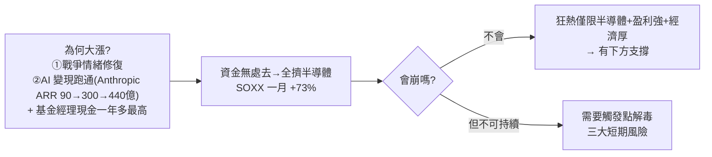

# 美股狂熱會終結嗎?三大短期風險與「市場需要一個觸發點來解毒」

> 整理自 YouTube「美投讲美股(美投君)」〈三大风险齐聚!美股狂热即将终结?〉(2026-05-10,約 23 分鐘,月度宏觀報告)。美股從 4 月戰爭低點漲近 30%、英特爾/美光/閃迪翻倍。作者的核心判斷:**不會崩盤,但這種局部狂熱不可持續、需要一個「觸發點」來消化非理性**——並點出三個值得持續盯的短期風險。
>
> **⚠️ 非投資建議**。內文已濾掉券商開戶與付費產品推廣。

---

## 一句話總結

**這波狂熱只局限在「半導體」這個狹窄板塊(前十漲幅 9 家是半導體),不是 2000 那種全方位泡沫;加上企業盈利極強 + 經濟底子厚,提供堅實下方支撐 → 不會崩盤。** 但價格已在局部脫鉤(非理性),**市場遲早需要一個「觸發點」來解毒**——三大短期風險(通脹、Fed 換帥、川普/中期選舉)就是最值得盯的三個候選觸發點。

---

## 為什麼不會崩盤(和 2000 的關鍵差異)

- **狂熱局限單一板塊**:2000 泡沫頂峰漲幅前十橫跨半導體/軟體/通訊/生物科技/IT 外包/商業地產(全方位泡沫化);**現在前十有 9 家是半導體**(唯一另類是被收購推上去的華納)→ 只是半導體這個狹窄領域,不是全市場泡沫。
- **半導體下限高**:即便情緒扭轉下跌,需求真實、多有業績支撐,股價回撤不威脅企業生存;2000 年很多公司靠炒作存在、股價回頭就倒閉才引發系統性危機。
- **企業盈利極強**:本次財報 **84% 超預期、超出幅度 18.2%**(遠高於十年均 75%/7.1%),近五年最強;標普盈利 26 年 +23%、27 年 +15%(遠高於歷史 10%)。
- **經濟底子厚**:非農新增 11.5 萬(超預期 5.5 萬)、失業率 4.3%;消費短期因油價下滑但薪資加速(尤其高收入);ISM 製造/服務穩定在 50 以上擴張。

> (半導體 vs 2000 的完整對照見本庫 [[semiconductor-2000-bubble-vs-2026-ai]];存量/增量邏輯見 [[us-stocks-h2-2026-outlook-stock-vs-flow-ai]]。)

---

## 核心框架:市場需要一個「觸發點」來解毒

美股每隔一段時間就跑出火熱概念(18 區塊鏈、20 疫情股、21 元宇宙、去年 OpenAI 狂潮),每次都說「這次不一樣」、但**每次都一樣**——價格會脫鉤,這就是非理性。但美股不是一戳就破的紙老虎,而是複雜的自我修復系統:**偶爾發燒,但多數會自行解毒;每次非理性上漲都有一個階段性解毒過程,往往從外部風險出發。**

> **關鍵小故事**:去年 5–9 月市場在 OpenAI 透支下漲超 50%,後來情緒急轉、很多股票至今沒回高點。**這波的拐點是什麼?其實是中美一次談判破裂**——回頭看,那次談判對美股幾乎沒有決定性影響,**市場只是需要一個理由讓自己冷靜下來**。所以「出發點是什麼」不重要,重要的是**市場需要這麼一個出發點**;之後情緒徹底變化——以前的利多會被解讀為利空、以前沒人關注的利空會被大肆渲染。

---

## 三大短期風險(三個候選觸發點)

| 風險 | 內容 | 關鍵時點 |
|---|---|---|
| **① 通脹** | 摩根士丹利預測通脹即將迎拐點,未來三個月 CPI/PCE 攀升、三個月後達年內最高;因油價仍在 $100 高位(霍爾木茲彻底開放需時)、有傳導效應(新車/機票/服飾)。威脅 Fed 寬鬆(CME 加息機率已高於降息)+ 威脅經濟(麥當勞/惠而浦業績下滑) | 下週二 CPI |
| **② Fed 換帥** | 5/15 新主席沃爾什上台,華爾街還在爭論鴿派/鷹派,Fed 內部分歧大(上次罕見 4 張反對票) | **6/17 FOMC**(首次沟通 + 新點陣圖 + 經濟預測)是大考 |
| **③ 川普/中期選舉** | 中期選舉年 5–10 月表現相對較差(兩黨較量、政策變化增加);加上貿易戰/地緣/去監管矛盾 | 川普下一輪動作快來了 |

**兩個要認清的關鍵**:
1. **「貪風險」不是說馬上要跌**,而是局部已價格脫鉤、需要觸發點消化非理性。這三大風險不一定真導致下跌,**但一旦發生,要做好「情緒徹底扭轉」的準備**。
2. **這三大風險本身不會系統性衝擊市場,單純是短期風險**:通脹即便抬頭也短期(油價只是短期擾動)、換帥政策不會因一人彻底轉向(寬鬆大勢未變)、中期選舉 11 月塵埃落定後股價多半 pick up。

---

## 長期機會與作者布局

- **長期真正的機會是「資金從基礎層向應用層輪動」**:Anthropic 變現驗證後,AI 產業集體從 C 端轉 B 端、加速產業化落地,大量應用層企業將浮現(還沒被市場充分意識到)。企業端 Agentic AI 仍極早期(70–90% 企業在試,但深度部署 <1/4、通常僅一兩個工作流)。
- **與其賭基礎層「擊鼓傳花的最後一棒」,不如提前埋伏應用層**:Anthropic 年底 ARR 上看 1000 億、OpenAI 700–800 億(合計 1800 億 ≈ Meta 全年收入 2000 億)→ 模型應用層變現空間巨大。**大模型最直接,但美股唯一能投的是被低估的 Google**(AI 變現較晚);較 safe 的是**雲計算產業鏈**(和大模型 token 分成)、以及**軟體股**(最可能被 AI 顛覆、也最可能率先跑出 AI 應用,估值便宜上限高;本次財報 Team +30%、DataDog +40%)。
- **作者自己不因短期脫鉤賣基礎層**(持有 NVIDIA/台積電/英特爾),長期持有、用選擇權或減倉應對風險、不擇時買賣——「長期投資重要的是陪優質公司長跑,而非頻繁轉換賽道」。

---

## 應用案例 / 怎麼用這套思路

- **別把「漲多」直接等於「要崩」**:先判斷狂熱是**全方位還是單一板塊**、有無**盈利與經濟支撐**、跌了會不會**威脅企業生存**——這三點決定是「健康過熱」還是「系統性泡沫」。
- **理解「市場需要一個觸發點來解毒」**:非理性能走多遠沒人能預測,**別提前壓時間點離場**;要做的是清楚列出「值得盯的候選觸發點」(這裡是通脹/換帥/川普),一旦情緒扭轉能及時應對,而非賭它哪天發生。
- **觸發點本身重不重要?不重要**——市場只是需要一個理由冷靜(去年是中美談判破裂,事後看無決定性影響)。所以別花力氣糾結「哪個才是導火線」,而是準備好「情緒一旦扭轉」的應對。
- **短期防禦 + 長期埋伏並行**:短期警惕過熱,長期提前布局「基礎層→應用層輪動」的受益者(Google/雲計算/軟體股);優質龍頭長期持有、用減倉或選擇權(而非清倉擇時)應對回撤。

> 延伸對照:[[us-stocks-h2-2026-outlook-stock-vs-flow-ai]]、[[semiconductor-2000-bubble-vs-2026-ai]]、[[ai-application-layer-4-trends-earnings]]、[[us-stocks-rate-hike-risk-2026]](皆同作者,可互相補足宏觀拼圖)。

---

## 來源

- 美投讲美股(美投君),〈三大风险齐聚!美股狂热即将终结?〉,YouTube:<https://www.youtube.com/watch?v=gM5wm2x7fi8>(2026-05-10,約 23 分鐘)
- **該片無字幕,逐字稿以 CPU 版 faster-whisper(`vad_filter=True`,small,zh)轉錄,非官方字幕**;數字(SOXX +73%、財報 84% 超預期 18.2%、非農 11.5 萬、Anthropic ARR 90→300→440 億/年底 1000 億、OpenAI 700–800 億、Team +30%/DataDog +40%)依語音還原,可能有聽寫誤差,實際以原片為準。**非投資建議**。
