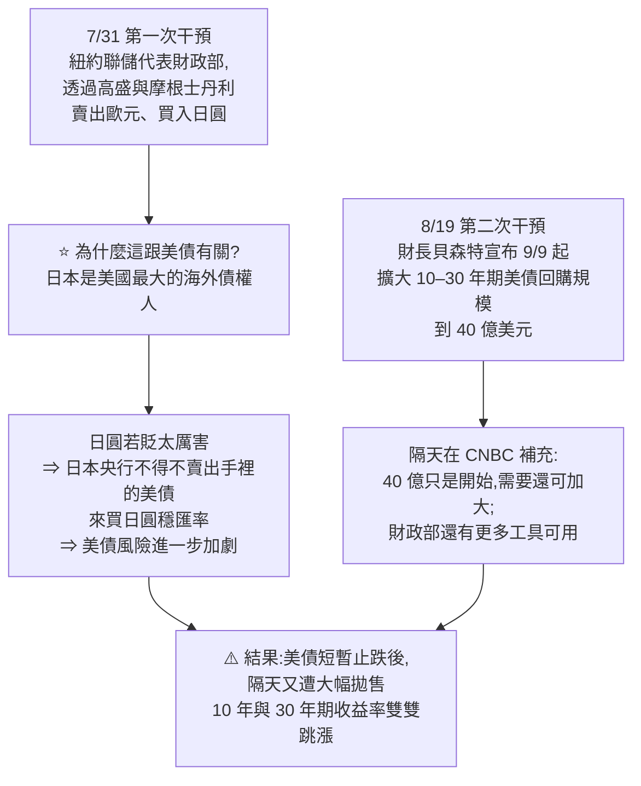
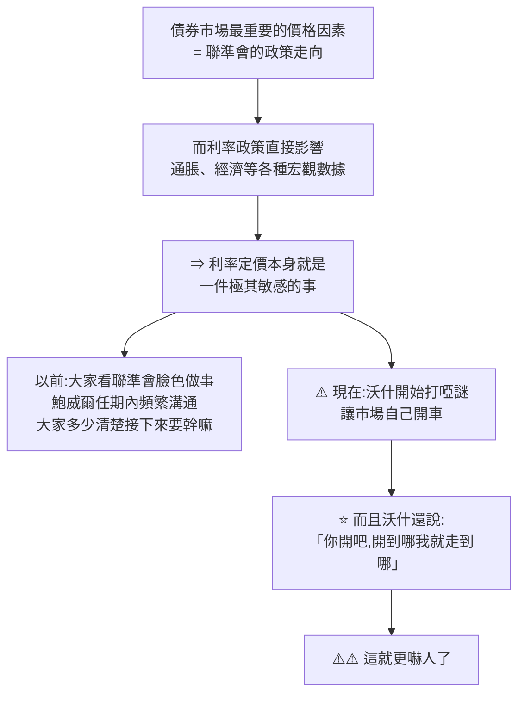
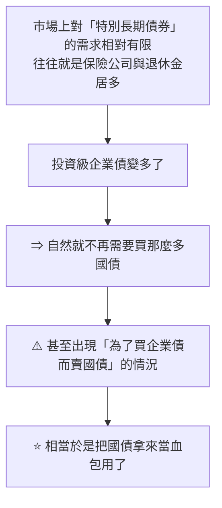
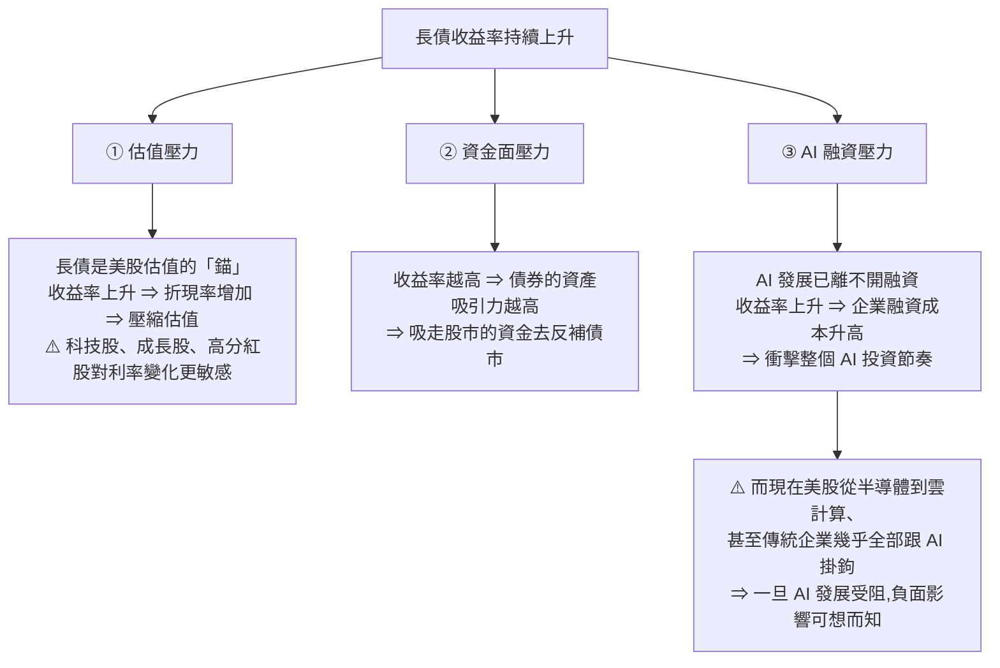
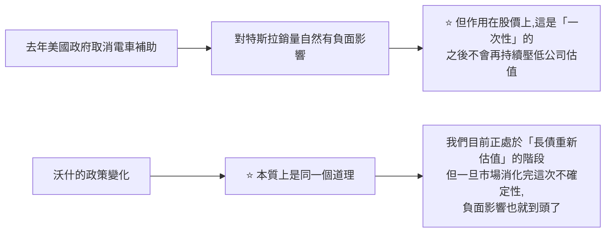

# 美債史詩級拋售:真正的變量不是 40 兆債務,是新任聯準會主席的「溝通方式」

> 整理自 YouTube 頻道 **美投讲美股(美投君)**〈美债遭史诗级抛售!危机将至?对后市有何影响?〉(2026-08-23,約 19 分鐘)。
> ⚠️ **該片無字幕,逐字稿以 CPU 版 faster-whisper 轉錄取得、非官方字幕**,可能有少量聽寫誤差(人名與數字尤其容易出錯,已依上下文還原)。

> ⚠️⚠️ **本文為影片論點之整理,非投資建議。** 市場觀點會隨時間失效,投資決策請自行判斷並承擔風險。

> 相關筆記:[[us-stocks-rate-hike-risk-2026]]、[[us-stocks-rate-hike-three-stages-ai-vs-2000]]、[[us-stocks-three-risks-detox-trigger]]、[[ai-investing-four-principles-stock-logic]]、[[semiconductor-2000-bubble-vs-2026-ai]]

---

## 一句話總結

**30 年期美債收益率一度突破 5.3%、創 20 年新高,政府一個月內兩度干預都沒能扭轉。** 但美投君認為真正的變量只有一個 —— **新任聯準會主席沃什「刻意不跟市場溝通」的改革**。

⭐ 而他的結論很反直覺:**這是一個「很可能帶來回調、但不需要應對」的風險。**

---

## 一、事件:兩次干預都失效

**30 年期美債收益率從 6 月初的低點 4.85%,一路漲到 5.3%** —— 創 20 年來最高水平。

> ⭐ **上一次美債遭遇如此重創,要追溯到 2000 年網路泡沫到 911 那個時代。**



⭐ **第一次干預的邏輯鏈值得記住** —— 表面上是「穩日圓匯率」,實際上是**防止日本央行為了救匯率而拋售美債**。這條「日圓匯率 → 日本央行行為 → 美債供給」的傳導路徑,平常很少被提起。

---

## 二、⚠️ 他先否定了最流行的那個解釋

> **「我看到又有很多不明所以的人開始講美債危機了,他們總喜歡拿『美債規模突破 40 兆、利息都要還不起了』說事。」**

⭐⭐ **他的反駁很乾淨,而且是個可以推廣的思考方法:**

| 論點 | 為什麼不能解釋這次拋售 |
|---|---|
| 美債規模大 | ✅ **確實是個問題** |
| ⚠️ 但用它解釋本輪拋售 | ❌ **美債規模擴張是「長期趨勢」,速度也是恆定的** —— 這是市場都清楚的事情,**而且最近並未發生任何變化** |

> ⭐ **關鍵判準:一個「沒有變化」的因素,不能用來解釋「剛剛發生的變化」。**
>
> 他也提醒:**關於美債的長期風險,不要盲目聽信市場上那些嚇人的言論。** 今天要分析的重點是**短期**美債風險。

---

## 三、三個真正的原因

### ⭐⭐ ① 新任聯準會主席沃什(Warsh)的風格轉變

**觀察起點**:沃什上任後的**兩次公開發言,剛好都成為收益率上升的拐點**。他認為這不是巧合 —— **沃什的上台很可能給美國長債帶來一次結構性的變化。**

**沃什的政策主張與前任截然不同:**

| 面向 | 內容 |
|---|---|
| **核心主張** | ⭐ **少跟市場溝通,不告訴市場自己的政策主張** |
| ⭐ **他的原話** | **"Watch the ball, not the umpire."**(不要總盯著裁判,要盯著球) |
| **具體改革** | **大幅縮減 FOMC 聲明**、**減少官員對外講話**、**發布會上不討論經濟前景**,甚至正在考慮**減少未來聯準會會議的次數** |
| **他的理由** | **利率定價應該由市場來做才更準確,而不是聯準會。** 市場應該盯著通脹、就業等經濟數據自己去定價,**而聯準會的利率政策反而應該跟著市場的定價走** —— 現在的市場行為有點本末倒置 |

⭐ **美投君明確表態:「這裡不去評判沃什觀點的正確與否,但就客觀而言,這種政策主張確實增加了利率的不確定性。」**

**為什麼這件事影響這麼大:**



⭐⭐ **他最有力的一段論證:**

> **你不讓市場看聯準會,市場就真的不看了嗎?不會的。**
> **它還是會尋找各種替代資訊來猜測聯準會後續的政策走向,並以此定價債券收益率。**
> **而市場「猜」政策,不確定性肯定要比聯準會自己表達政策高得多。**
> **再加上沃什還要跟著市場走 —— 這就更可能放大錯誤的金融定價,從而進一步提高美債的不確定性。**

**⭐ 已經反映在數據上**:自沃什上台以來,**美國的利率波動快速增長,明顯高於其他四大工業國**。

> **風險增加 ⇒ 價格下降 ⇒ 市場只能要求更高的收益率來補償這個風險** ⇒ 長債收益率不斷上升。

### ② AI 融資對國債的擠壓

**AI 數據中心建設大興 —— 而數據中心很花錢,連最不差錢的大科技最近也都開始紛紛借錢投入,動輒幾百億上千億的融資。**

⭐ **這就大幅增加了市場上「長期債券」的供給:**

| 指標 | 數字 |
|---|---|
| **10 年期投資級企業債總供給** | **從一年前的 1.6 兆 → 現在的 2.3 兆** |
| ⭐ **對照** | **上一次看到這麼高的增長,還是在疫情期間 —— 而那時候可是零利率時代** |

⭐⭐ **擠壓的機制講得很清楚:**



### ③ 通脹的不確定性(⚠️ 但不是你以為的那種)

⚠️ **這一點的反直覺之處**:如果你有關注最近的經濟數據,會發現**最新的通脹數字其實有所緩解,就業和消費也出現一定疲軟** —— 這些本應**有助於**控制收益率上升。

**那為什麼最終沒有?**

> ⭐ **因為地緣政治風險仍在高位。短期通脹雖有所下滑,但長債市場看重的是「更長期」的表現。**

- 地緣政治風險在最近一個月內**不斷反覆** —— 伊朗戰爭「好了又壞、壞了又好」
- **油價也仍然處在高位**

**⭐ 數據佐證(這個指標很好用)**:今年 3 月戰爭開打以來,**債券期權市場上「買 put(買保險)」的需求就明顯增加,到現在依然沒有絲毫恢復** ⇒ 市場對地緣政治風險**仍心有餘悸**。

---

## 四、對股市的三股壓力



⭐ **第三點是這個框架裡最值得注意的一環** —— 它把「利率」與「AI 行情」直接連了起來:**美股現在幾乎全部跟 AI 掛鉤,而 AI 需要持續融資,所以利率不只透過折現率影響估值,還會透過融資成本影響 AI 本身的發展節奏。**

---

## 五、⭐⭐ 後市判斷:三個原因的權重完全不同

**他明確指出「這三點雖然共同作用,但影響是有所不同的」:**

| 原因 | 往後看的方向 | 權重 |
|---|---|---|
| **③ 通脹 / 地緣政治** | ⭐ **不確定性更可能「逐漸下降」** —— 戰爭威脅的緩解、油價的恢復都是大勢所趨,**壓力大概率會逐漸釋放** | 遞減 |
| **② AI 發債擠壓** | 短期恐怕很難緩解、甚至可能進一步增加,⭐ **但影響相對有限,因為體量相比國債還是太小**。⭐⭐ **在剛爆發的早期會帶來明顯的資金面影響(也就是現在),但一旦趨勢拉長,它就會「從一個變量變成一個恆量」,對債市的影響也會逐漸降低** | 遞減 |
| ⭐⭐ **① 沃什的政策主張** | **「真正重要的變量,在我看來就只有一個。」** | **唯一** |

> ⭐ **「從一個變量變成一個恆量」這個說法很好用** —— 它正是第二節否定「40 兆債務」論的同一個判準:**已經被充分預期、速度恆定的東西,不再是價格的驅動力。**

---

## 六、⚠️ Jackson Hole:市場的期待 vs 他的反向看法

**他說翻閱了大量投行研報,發現現在市場所有的焦點都放在下週的 Jackson Hole 央行研討會上** —— 屆時全球各國央行主席都會出席,沃什也會發表講話。

**⭐ 華爾街的普遍預期:**
> 在如此緊張的收益率威脅之下,**沃什會在政策表態上做出一些妥協**,配合川普政府讓利率往下走一走。
> **而且做法並不困難** —— 沃什只要動動嘴皮子,**給一個相對清晰的政策路徑,並強調抗通脹的決心**,所有問題就都解決了,債市和股市的壓力也都能緩解。

**⚠️⚠️ 但他個人並不樂觀,理由很有說服力:**

> **沃什一上台就表達了強硬的改革理念,而「減少與市場溝通、讓市場自己主導利率走向」正是他的改革措施之一。**
> **既然要改革,那他就應該很清楚改革的陣痛。**
> ⭐⭐ **如果利率一上漲他馬上就妥協,那改革的意義何在?反而會因為迎合市場,而降低他作為新任聯準會主席的公信力。**

⭐ **這個論證的漂亮之處在於:它從「沃什的動機結構」推論行為,而不是從「市場希望他怎麼做」推論。**

**⇒ 他的風險提示**:沃什繼續強硬表態、不給清晰指引,**仍然是一個較大的市場風險**。一旦市場期待落空,短期內很可能進一步加大債市壓力、推動收益率繼續上行,同時給股市帶來回調風險。

---

## 七、⭐⭐⭐ 投資結論:「很可能帶來回調,但不需要應對的風險」

這是全片最核心的判斷。他給了兩個理由。

### 理由一:威脅存在,但可控

⭐⭐ **最關鍵的一句話:**
> **無論是美國政府還是聯準會,長債收益率的上升其實都和他們自身的利益相違背。他們都有足夠的「意願」去控制,同時也完全有「能力」這麼做。**

**財政部還有什麼工具沒用(貝森特說「這話一點不假」):**

| 工具 | 說明 |
|---|---|
| **增加國債回購規模** | 已在做 |
| ⭐ **調整債務結構** | **提高短債發債規模、降低長債發債規模 ⇒ 壓低長債收益率** |
| ⭐ **調整空間** | **目前短債只佔財政部整體債務供給的約 20%,還有不小的調整空間** |

**聯準會的工具就更充足:**
- ⭐ **甚至都不需要做什麼實質性動作 —— 單純動動嘴皮子就足以安撫市場**
- 工具上還有 **QE** 可用
- ⭐ **如果說現在的收益率上升還只是「改革的陣痛」、聯準會不會應對,那未來要是真的發展到危險的地步,聯準會的操作空間也是巨大的**

> ⭐ **他的收斂結論**:就現在的情況而言,**財政部和聯準會其實都不需要真的做什麼 —— 只要明確釋放出干預信號,就足以穩住國債的拋售了。** 再加上他們本身就有意願也有能力干預,所以他不認為這次會走向失控。

### 理由二:⭐⭐ 這是「一次性的重新定價」,不是持續惡化的風險

**他先承認風險的真實性:**
> 如果沃什以後都不給出明確的利率前瞻指引,那確實會**永久性地增加利率定價的不確定性** —— 這會導致債券投資者**尋求更高的期限溢價**,從而整體抬高美債的收益率。

**⭐ 但接著給出關鍵的區分:**
> **這種壓力有一個特點:它在被市場「充分定價」之後,影響就會逐漸減弱。**

⭐⭐ **他用的類比很好懂:**



⭐⭐ **所以他的操作結論是反過來的:**
> **如果 Jackson Hole 會議上沃什真的沒有給出什麼明確的前瞻、股市因此而下跌,我認為這反而會是一個非常好的買入機會。**

---

## 八、⭐ 最後跳出來的那段話(全片最有價值)

他在結尾把整個議題拉高了一層:

> **眼下債市最核心的問題,就在於新任聯準會主席與市場的「溝通方式」。**
> ⭐⭐ **但溝通方式的改變,真的會影響到你投資的企業的長期價值嗎?答案大概率是否定的。**

> **我們投資股票就不可避免地會遇到宏觀上的各種變化、各種衝擊。**
> ⚠️ **如果每一次衝擊都心神不寧、都要各種應對,那投資恐怕做不長久。**
> ⭐ **我們唯一要做的,只是去了解這些變化的具體影響,不在風險來臨時亂操作 —— 那這就足夠了。**

**⭐⭐ 而最後這句是整支影片的題眼:**
> **「其實投資時間久了你就會發現,隨著你對於股票和市場的了解,真正影響決策的變量不是變多了,而是會變少。真正重要的變量就那麼幾個,你的投資也會越來越安心。」**

---

## 應用案例

### 案例 1|⭐⭐ 用「變量 vs 恆量」過濾宏觀噪音

這是全片最可複用的思考工具,而且它在文中出現了**三次**:

| 出現處 | 應用 |
|---|---|
| **否定 40 兆債務論** | 規模擴張是**長期趨勢、速度恆定** ⇒ 不能解釋剛發生的變化 |
| **判斷 AI 發債的權重** | 早期是變量、⭐ **趨勢拉長後「從變量變成恆量」** ⇒ 影響遞減 |
| **判斷沃什改革的影響** | ⭐ **被充分定價後就從變量變成恆量** ⇒ 一次性重定價而非持續惡化 |

⭐ **拿來檢查任何宏觀敘事的三個問題:**

```
① 這個因素「最近有變化」嗎?
   —— 沒有變化的東西,不能解釋剛發生的價格變動

② 它是「一次性重定價」還是「持續惡化」?
   —— 一次性的,消化完就到頭了

③ 市場「已經充分定價」了嗎?
   —— 定價完之後,它就從變量變成恆量
```

⚠️ **反過來說,最危險的宏觀敘事是那種「聽起來很嚇人、但其實三年前就是這樣」的東西** —— 它有情緒張力,卻沒有解釋力。

### 案例 2|⭐ 從「動機結構」推論,而不是從「市場希望」推論

他判斷沃什不會在 Jackson Hole 妥協的推論方式值得抄:

```
❌ 常見推法:市場壓力這麼大 ⇒ 他應該會妥協
✅ 他的推法:妥協會讓他自己的改革失去意義、損害公信力
            ⇒ 從他的動機看,他更可能繼續強硬
```

⭐ **這個差別在於:前者假設決策者以「緩解市場壓力」為目標函數,後者去問「這個人自己在追求什麼」。**

⚠️ **但也要誠實看待這種推論的限度** —— 它是對他人動機的推測,可能錯。所以他的處理方式是**「不預測結果,而是先想好兩種結果各自怎麼辦」**:期待落空 ⇒ 回調 ⇒ **反而是買入機會**。

### 案例 3|區分「會帶來波動」與「需要應對」

⭐ **這是全片對操作最直接的一課。** 可以把任何一則宏觀壞消息丟進這個篩子:

| 問題 | 這次美債的答案 |
|---|---|
| **會不會帶來回調?** | ✅ 會 |
| **會不會失控?** | ❌ 不會 —— **政府與聯準會「有意願也有能力」控制,而且利益方向一致** |
| ⭐ **會不會影響我持有的企業的「長期價值」?** | ❌ **不會 —— 聯準會的溝通方式改變,不改變一家公司賺不賺錢** |
| ⇒ **該不該應對?** | ⭐ **不需要應對,只需要理解** |

⚠️ **注意這裡的關鍵不是「樂觀」,而是「分層」** —— 他完整承認了風險(收益率會繼續上行、股市會回調),只是判斷這個風險**不作用在他真正在乎的那一層**(企業長期價值)上。

### 案例 4|⭐ 幾個可以自己追蹤的觀察指標

影片提到的幾個指標,都是公開可查、可以自己盯的:

| 指標 | 看什麼 |
|---|---|
| **30 年期美債收益率** | 本輪的主角(5.3% 是 20 年高點) |
| ⭐ **美國利率波動 vs 其他工業國** | **這是「沃什效應」最直接的證據** —— 波動的相對高低比絕對水平更有訊息量 |
| ⭐ **債券期權市場的 put 需求** | **地緣政治恐慌的溫度計** —— 3 月開戰後升高且至今未恢復 |
| **投資級企業債供給量** | AI 融資擠壓國債的程度(1.6 兆 → 2.3 兆) |
| ⭐ **短債佔財政部債務供給的比例** | **財政部「還剩多少牌」** —— 目前約 20%,越低代表調整空間越大 |

### 案例 5|對照本倉庫既有的美投君筆記

⭐ 這篇跟前幾篇串起來,能看出他的宏觀框架是連貫的:

| 筆記 | 關聯 |
|---|---|
| [[us-stocks-rate-hike-risk-2026]] | ⭐ **同一條利率主線的前一章** —— 那篇談升息風險,這篇談的是「即使不升息,長端收益率也可能自己上去」 |
| [[us-stocks-rate-hike-three-stages-ai-vs-2000]] | 利率三階段的框架 |
| [[us-stocks-three-risks-detox-trigger]] | 風險清單與觸發點的思考方式 |
| [[ai-investing-four-principles-stock-logic]] | ⭐ **「存量邏輯」與本篇的「AI 融資成本」直接相關** |
| [[semiconductor-2000-bubble-vs-2026-ai]] | 本篇開頭提到「上一次美債如此重創是 2000 年泡沫到 911」,可對照 |

---

## 重點回顧(TL;DR)

1. **事件**:30 年期美債收益率從 6 月低點 **4.85% 漲到 5.3%**,創 **20 年新高**。⭐ **上一次美債遭遇如此重創,要追溯到 2000 年網路泡沫到 911 那個時代。**
2. **政府一個月內兩度干預,都沒扭轉頹勢**:①**7/31** 紐約聯儲代表財政部透過高盛與摩根士丹利**賣歐元買日圓**;②**8/19** 財長貝森特宣布 9/9 起**擴大 10–30 年期美債回購到 40 億美元**,並稱「只是開始」「還有更多工具」。⚠️ **結果短暫止跌後隔天又遭大幅拋售。**
3. ⭐ **第一次干預的邏輯鏈值得記**:表面穩日圓,實際是**防止日本央行(美國最大海外債權人)為了救匯率而拋售美債**。
4. ⚠️⚠️ **他直接否定最流行的解釋**:「美債突破 40 兆、利息還不起」——**規模大確實是問題,但規模擴張是長期趨勢、速度恆定、最近沒有任何變化**,用它強行解釋這輪拋售很牽強。⭐ **關鍵判準:沒有變化的因素,不能解釋剛發生的變化。**
5. **原因①(最重要):新任聯準會主席沃什的風格轉變。** 他上任後**兩次公開發言剛好都是收益率上升的拐點**,不是巧合。
6. ⭐ **沃什的主張**:**少跟市場溝通、不告訴市場自己的政策主張**。原話 **"Watch the ball, not the umpire"**。改革包括**大幅縮減 FOMC 聲明、減少官員講話、發布會不談經濟前景**,甚至考慮**減少會議次數**。理由是**利率定價該由市場做才準確,聯準會反而應該跟著市場走**。
7. ⭐⭐ **美投君的核心論證**(他聲明不評判對錯、只講客觀影響):**你不讓市場看聯準會,市場不會就真的不看 —— 它會找替代資訊去「猜」。而市場猜政策的不確定性,遠高於聯準會自己表達政策。再加上沃什還要跟著市場走,更可能放大錯誤的金融定價。**
8. ⭐ **已反映在數據上**:沃什上台後**美國利率波動快速增長,明顯高於其他四大工業國** ⇒ 風險增加 ⇒ 市場要求更高收益率補償。
9. **原因②:AI 融資擠壓國債。** **10 年期投資級企業債供給一年內從 1.6 兆 → 2.3 兆**,⭐ **上一次這麼高的增長還是疫情期間、而那是零利率時代**。機制:長期債券需求本就有限(保險與退休金為主),企業債多了就不需要買那麼多國債,⭐ **甚至為了買企業債而賣國債 —— 相當於把國債當血包用。**
10. **原因③:通脹的不確定性。** ⚠️ **反直覺之處** —— 最新通脹其實**有所緩解**、就業與消費也疲軟,本應壓低收益率。**沒有的原因是地緣政治風險仍在高位**(伊朗戰爭反覆、油價高位),而**長債市場看的是更長期的表現**。⭐ **佐證指標:3 月開戰以來債券期權市場的 put 需求明顯增加,至今毫無恢復。**
11. **對股市的三股壓力**:①**估值**(長債是估值的錨,折現率上升壓縮估值,⚠️ 科技股/成長股/高分紅股更敏感)②**資金面**(債券吸引力上升,吸走股市資金)③⭐ **AI 融資成本**(美股幾乎全部跟 AI 掛鉤,融資成本上升會衝擊 AI 投資節奏)。
12. ⭐⭐ **三個原因的權重完全不同**:通脹**遞減**(戰爭緩解與油價恢復是大勢所趨);AI 發債**影響有限且遞減**(體量相比國債太小,⭐ **趨勢拉長後會「從變量變成恆量」**);⭐ **真正重要的變量只有沃什一個。**
13. **市場焦點全在 Jackson Hole**,華爾街普遍預期沃什會妥協 —— **只要給個清晰的政策路徑並強調抗通脹決心,問題就解決了。**
14. ⚠️⚠️ **但他不樂觀,理由是動機結構**:**沃什一上台就表明強硬改革理念,「減少溝通」正是改革措施之一。既然要改革就該清楚陣痛。⭐ 如果利率一漲他就妥協,改革的意義何在?反而會因迎合市場而損害新任主席的公信力。**
15. ⭐⭐⭐ **投資結論:這是「很可能帶來回調、但不需要應對」的風險。**
16. **理由一:可控。** ⭐ **收益率上升與政府和聯準會「自身的利益相違背」,他們有意願也有能力控制。** 財政部除回購外還可**調整債務結構(提高短債、降低長債發行)壓低長債收益率**,⭐ **而短債目前只佔整體債務供給約 20%,還有不小空間**;聯準會**甚至不需要實質動作,動動嘴皮子就足以安撫**,還有 QE 可用。⭐ **只要明確釋放干預信號,就足以穩住拋售。**
17. ⭐⭐ **理由二:這是「一次性重新定價」,不是持續惡化。** 不給前瞻指引確實會**永久性增加利率定價的不確定性、抬高期限溢價**,**但這種壓力在被市場充分定價後就會逐漸減弱**。⭐ **類比:去年取消電車補助對特斯拉的影響是一次性的,之後不會再持續壓低估值。**
18. ⭐ **所以他的操作結論是反的**:如果 Jackson Hole 沃什真的沒給明確前瞻、股市因此下跌,**反而會是一個非常好的買入機會**。
19. ⭐⭐ **全片題眼(結尾跳出來的那段)**:**「眼下最核心的問題是聯準會主席與市場的溝通方式。但溝通方式的改變,真的會影響到你投資的企業的長期價值嗎?答案大概率是否定的。」** ⚠️ **「如果每一次衝擊都心神不寧、都要各種應對,那投資恐怕做不長久。我們唯一要做的,只是去了解這些變化的具體影響,不在風險來臨時亂操作。」**
20. ⭐⭐ **最後一句最值得記**:**「投資時間久了你就會發現,隨著你對股票和市場的了解,真正影響決策的變量不是變多了,而是會變少。真正重要的變量就那麼幾個,你的投資也會越來越安心。」**

---

## 來源

- [美债遭史诗级抛售!危机将至?对后市有何影响? — 美投讲美股(美投君)](https://www.youtube.com/watch?v=_oDISo3B3xw)(2026-08-23,約 19 分鐘)
  - ⚠️ **該片無字幕,逐字稿以 CPU 版 faster-whisper(small / int8 / zh)轉錄取得、非官方字幕**,可能有少量聽寫誤差。文中專有名詞已依上下文還原(轉錄中的「卧石 / 卧實 / 卧時」為 **沃什(Warsh)**、「美倔 / 美倸 / 美倘 / 常債」為 **美債 / 長債**、「收盅率 / 收盟率 / 受盔率」為 **收益率**、「炮手 / 押售 / 抛手」為 **拋售**、「美職儲 / 美聯資」為 **聯準會**)
- 本倉庫相關筆記:[[us-stocks-rate-hike-risk-2026]]、[[us-stocks-rate-hike-three-stages-ai-vs-2000]]、[[us-stocks-three-risks-detox-trigger]]、[[ai-investing-four-principles-stock-logic]]、[[semiconductor-2000-bubble-vs-2026-ai]]

> ⚠️⚠️ **再次聲明:本文為影片論點之整理,非投資建議。** 文中所有數字(收益率水平、債券供給量、短債佔比等)均為影片轉述,**未經獨立查證**;市場觀點具時效性,可能已失效。投資決策請自行判斷並承擔風險。
