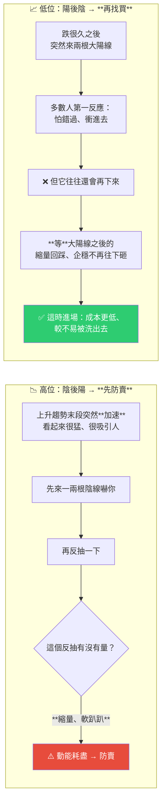

# 「高位陰後陽,先防賣;低位陽後陰,再找買」——一句 K 線口訣的邏輯與限制

> ⚠️ **本文為教育與知識整理用途,非投資建議。** 整理自 YouTube 頻道 **John Lu Talk Stock Investment(JohnLu 談股)** 的 Shorts〈真正高手的買賣點,簡單到離譜〉(2026-08-07,約 2 分鐘,官方字幕)。**影片本身也附有免責聲明:僅供投資知識分享、不構成投資建議。**
>
> 一句話:**這不是機械式買賣訊號,而是一條「別追高、別恐慌、等訊號確認再動」的節奏提醒。**

---

## 一句話總結



---

## 一、口訣拆解

### 高位陰後陽 → 先防賣

**背後的邏輯鏈:**

1. 股票在上升趨勢裡,**後段常會突然加速** —— 看起來最猛、最吸引人的時候。
2. 影片的關鍵提醒:**「往往開始加速就是尾聲了。」**
3. 這時候**很少直接一根大陰線砸下來**(除非是下市或爆大雷這類極端情況),**多數會先來一兩根陰線嚇你,然後再反抽**。
4. ⭐ **判斷關鍵在反抽的量能**:如果反抽是**縮量的、軟趴趴、沒有力氣** → **動能耗盡**。
5. 此時再貪吃一口 —— 影片的說法是「主力一定會邀請你站在高崗上」。

### 低位陽後陰 → 再找買

1. 股票跌了很久,突然來**兩根大陽線**。
2. 多數散戶第一反應是**衝進去、怕錯過**。
3. **但現實往往是它還會再下來** —— 影片的理由:**主力不可能讓所有人都在最低點上車。**
4. ⭐ **正確做法是不追、而是等**:等大陽線之後出現**縮量回踩、企穩、股價不再往下砸**。
5. 此時進場:**成本更低、安全性更高、也不容易被洗出去。**

---

## 二、⭐ 這條口訣真正在講什麼

影片自己收在這句:

> **「如果趨勢抓不住,節奏再快也沒有用。」**

而作者強調的核心不是「照這個訊號機械式買賣」,而是三件事:

| 提醒 | 對應行為 |
|---|---|
| **不要追高** | 加速段是尾聲,不是起點 |
| **不要恐慌** | 一兩根陰線不等於結束,要看反抽的量 |
| **等訊號確認再行動** | 大陽線之後等回踩企穩,而不是當下就衝 |

**兩邊共用同一個機制:量能確認。** 高位看反抽有沒有量(沒量=動能耗盡),低位看回踩有沒有縮(縮量企穩=賣壓退場)。

---

## 三、⚠️ 使用前必須知道的限制

**這是一條經驗性的形態口訣,不是經過統計驗證的策略。** 採用前應該想清楚:

| 限制 | 說明 |
|---|---|
| **沒有量化定義** | 「縮量」縮多少?「軟趴趴」怎麼判定?「跌了很久」是多久?**這些都沒有明確門檻,不同人看同一張圖會有不同結論** |
| **沒有回測數據** | 影片未提供任何勝率、賠率、樣本數或回測區間 |
| **事後看圖 vs 當下決策** | K 線形態在事後看非常清楚,**但在右側邊緣(當下這根還沒收)判斷難度完全不同** |
| **「主力」是一種敘事** | 「主力不可能讓所有人在最低點上車」是說法而非可驗證的機制;同樣的價格行為可以有多種解釋 |
| **無停損規則** | 口訣只講進出時機,**沒有講判斷錯了怎麼辦** —— 而那通常才是決定長期損益的部分 |
| **推廣性質** | 影片資訊欄含課程與付費服務連結,閱讀時應把這點納入考量 |

> 📌 本庫 [[target-prices-institutional-secrets]] 與 [[gooaye-stock-picking-philosophy]] 都提過類似的判準:**任何沒有明確進出場定義與停損規則的說法,都只是觀點而不是策略。**

---

## 四、應用案例:怎麼把它變成可用的東西

### 案例 1|把口訣翻譯成「可驗收的條件」

原始口訣無法直接執行,因為每個詞都模糊。要真的用,必須先把它寫成有數字的規則,例如(**這只是示範怎麼具體化,不是推薦參數**):

```
高位防賣訊號 =
  ① 股價位於過去 N 日高位（例如 20 日新高後 M 日內）
  ② 出現 ≥1 根收黑
  ③ 隨後反抽日的成交量 < 前 5 日均量的 X%
  ④ 且反抽未收復前一根黑 K 的高點

低位找買訊號 =
  ① 股價已自高點回落 ≥ Y%，且橫盤 ≥ N 日
  ② 出現 2 根實體 ≥ Z% 的紅 K
  ③ 隨後回踩量能逐日遞減
  ④ 回踩低點 ≥ 大陽線起漲點
```

**寫成這樣之後才能做兩件事:回測、以及事後檢討「這次到底有沒有符合條件」。** 沒有這一步,任何形態口訣都會變成「賺了說我抓到、賠了說訊號不標準」。

📌 這跟本庫 [[google-agentic-engineering-day4-5]] 講的「**驗收標準要越客觀越好**」是同一個道理 —— **「感覺量縮」是壞標準,「量 < 5 日均量 60%」才是好標準。**

### 案例 2|抓出它真正有價值的那一半:量能確認

即使不用這條口訣,**「反抽有沒有量」與「回踩有沒有縮量」** 這個觀察角度本身是通用的:

- **上漲需要量,下跌不需要** —— 所以縮量反抽比縮量下跌更值得警惕。
- **回踩縮量** = 賣壓在退場;**回踩放量** = 有人在出貨。

**這比記口訣本身更有遷移性。**

### 案例 3|補上口訣沒講的那一半:停損

口訣只回答「什麼時候進、什麼時候防」,**沒回答「錯了怎麼辦」**。實務上至少要先定義:

- 低位買進後,**跌破什麼價位算判斷錯誤**(例如跌破那兩根大陽線的起漲點)?
- 高位防賣後若它繼續噴,**要不要追回來?條件是什麼?**

**沒有這兩條,勝率再高的訊號都可能被單次大虧吃光。**

### 案例 4|警惕「簡單到離譜」這個框架

影片的說服結構是:「高手一輩子只吃透這一句話」「不到 2 分鐘解決散戶十幾年想不明白的問題」。

**這類敘事本身就值得打折。** 合理的解讀是:**這條口訣是一個有用的觀察角度,但它不可能取代趨勢判斷、部位管理與風險控制** —— 而影片自己最後那句「趨勢抓不住,節奏再快也沒有用」其實就承認了這點。

📌 對照本庫 [[retail-investor-losing-system-not-luck]] 的主張:**散戶虧損是系統性問題,不是缺一個訊號。**

---

## 重點回顧(TL;DR)

- **口訣**:**高位陰後陽,先防賣;低位陽後陰,再找買。**
- **高位邏輯**:上升趨勢後段常突然加速,**「開始加速往往就是尾聲」**;通常不會直接大陰線砸下,而是先陰線嚇人 → 反抽。**若反抽縮量無力 = 動能耗盡 → 防賣。**
- **低位邏輯**:跌久後突然兩根大陽線,多數人怕錯過就衝,**但它往往還會再下來**(主力不會讓所有人在最低點上車)。**要等大陽線後的縮量回踩企穩、不再往下砸再進 → 成本更低、不易被洗出。**
- **兩邊共用同一個機制:量能確認。**
- **作者自己的定位**:不是機械買賣,而是「**不追高、不恐慌、等訊號確認再行動**」;收尾是「趨勢抓不住,節奏再快也沒用」。
- **⚠️ 限制**:**沒有量化定義、沒有回測數據、事後看圖與當下判斷難度不同、「主力」是敘事、完全沒有停損規則**,且影片帶課程推廣。
- **要用就先把它寫成有數字的條件**,否則會變成「賺了說抓到、賠了說訊號不標準」。

---

## 來源

- John Lu Talk Stock Investment / JohnLu 談股(YouTube Shorts),〈真正高手的買賣點,簡單到離譜〉(2026-08-07,約 2 分鐘):<https://youtube.com/shorts/skODUJpeaAI>
  - 本文依該片**官方字幕**整理並轉寫為繁體中文(非 Whisper 轉錄)。
  - ⚠️ 影片附有免責聲明:內容僅供投資知識分享、不構成投資建議;證券市場具有風險,投資前請獨立判斷。**影片資訊欄含課程與付費服務連結。**
- ⚠️ **本文為教育用途整理,非投資建議。** 文中「限制」與「應用案例」兩節為本文補充的批判性分析,非影片原文。投資決策前請自行研究並評估風險。
- 延伸(本庫):[別再相信目標價](../strategy/target-prices-institutional-secrets.md) · [散戶輸在系統不是運氣](../strategy/retail-investor-losing-system-not-luck.md) · [股癌選股心法](../strategy/gooaye-stock-picking-philosophy.md)
