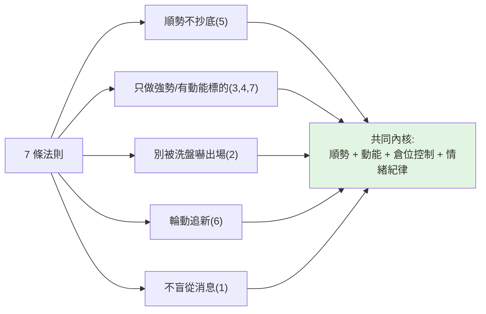

# 短線交易七條核心法則(熊貓有財)

> 一支約 3 分鐘的短影片,作者自稱**虧損 300 多萬後**總結出 7 條短線操作法則,主打「做到 1 條少走彎路、
> 做到 2 條領先 90% 投資人」。內容以**價格行為/技術面短線**為主(K 線型態、趨勢、漲停、主力洗盤)。
>
> **⚠️ 取得方式:** 此片**未提供任何字幕**,本筆記的逐字內容是用 **CPU 版 faster-whisper** 對音訊轉錄取得
> (zh、small 模型),非官方字幕,可能有少量聽寫誤差。
>
> **⚠️ 風險聲明:** 本筆記為觀念整理,**非投資建議**。下列為**該創作者的個人主張**,部分說法(如「勝率提高八成」「帳戶翻倍」)
> 屬無法驗證的行銷話術,**不代表本筆記認同**。短線交易風險極高,請自行判斷、自負盈虧。

---

## 影片背景

- **轉貼頻道:** 零股研究所(YouTube Shorts) · **原始作者自報:** 「熊貓有財」 · 約 3 分鐘 · 上傳 2026-05-29。
- **開場主張:** 把炒股當一生事業、想靠它養家,就把這 7 條「緊記於心、落實到每一筆操作」,做到「認知與行動合一」。

---

## 七條法則(依逐字稿整理)

### 1. 對消息反向思考(逆向思維)
對盤面消息、論壇傳言、媒體報導、專家觀點**不必全盤接受,有時甚至要反向思考**。
作者主張養成逆向思維習慣能「提高勝率」。
> 🔸 **合理內核 / 保留:** 「不被消息牽著走」是對的;但「逆向就能提高勝率八成」是誇大,反向也可能反向錯。

### 2. 連續小K線預示反向大K線 + 別被大陰線洗掉
- 連續**小陽線**後常出現**大陽線**;連續**小陰線**後容易出現**大陰線**。
- **連續大漲後**要警惕賣出訊號;**連續大跌後**反而可能是入場時機。
- **不要因一根大陰線就恐慌拋售**——啟動前主力常用大陰線**洗盤**,等多數散戶割肉離場後,行情往往反轉。
> 🔸 這是典型的「主力洗盤」價格行為敘事;對「別被單根長黑嚇出場」有參考價值,但「連續小陽必有大陽」並非鐵律。

### 3. 強勢股 K 線型態:「紅肥綠瘦」
上漲時**陽線多、實體大**;回調時**陰線少、實體小**——這就是強勢股的典型結構。
> 🔸 實用的辨識口訣:強勢股「漲多跌少、漲狠跌弱」。

### 4. 做短線不要恐高
想快速獲利卻不敢碰強勢股,本身就矛盾。低位股「感覺安全」但常**長期橫盤、消耗時間成本**。
真正做短線的人是在**強勢股的高位找機會**——**控制好倉位、順勢操作**,以小搏大。
> 🔸 重點其實落在「控制倉位 + 順勢」,而非鼓勵無腦追高;沒有倉位控制的「不恐高」非常危險。

### 5. 只做上升趨勢,不要抄底
只參與**處於上升趨勢**的股票。上升趨勢中的回調多是洗盤,**就算做錯一次虧損也有限**;
下跌趨勢裡**每次反彈都可能是多頭陷阱**,「錯九次都不意外」。
> 🔸 這條與多數趨勢交易教材一致:**順勢、不接下跌的刀**,是 7 條裡最站得住腳的原則之一。

### 6. 短線追「新」:新題材、新龍頭、新熱點
新熱點一出現就**果斷放棄老題材**。作者比喻:長線投資像選伴侶(看重長久陪伴),短線操作像談戀愛(要的就是新鮮感)。
> 🔸 描述的是「資金輪動、題材汰換」的短線生態;但「果斷棄舊追新」也意味著高換手、高情緒風險。

### 7. 只關注近期出現過漲停的股票
近期有**漲停**的才值得留意;長期**沒漲停、沒放量、沒突破**的,乾脆不碰。
> 🔸 本質是「只做有資金、有動能的標的」;但以「漲停」為唯一濾網非常激進,且高度依賴台股/A股的漲停制度語境。

---

## 怎麼看待這 7 條(critical view)

把行銷外殼剝掉,這 7 條其實圍繞著幾個**還算通用的短線原則**:

- **可取的部分:** 順勢不接刀、只做強勢/有量能的標的、別被單根長黑嚇走、不盲從消息——這些是短線交易的常見共識。
- **要警惕的部分:** 「虧 300 萬後悟道」「做到 2 條贏 90%」「勝率提高八成」「帳戶翻倍」是典型的**短影片漲粉/導流話術**
  (片中多次要求點讚、收藏、加 LINE/社團)。**7 條全是進攻、幾乎沒談停損與最大虧損控制**——
  而真正決定短線生死的,恰恰是它**沒明講**的風控(停損、單筆風險上限)。
- **缺口:** 沒有任何一條講「錯了怎麼出場、單筆最多虧多少」。把這 7 條當「選股/進場濾網」可以,但**必須自己補上停損與倉位上限**才完整。

---

## 應用案例

- **你看到一檔近期漲停、紅肥綠瘦的強勢股回檔:** 依第 2、3、5 條,這多半是上升趨勢中的洗盤,
  不該因一根長黑恐慌殺出;但**前提**是你已先設好停損價(片中沒說的那一塊),回檔跌破關鍵價就認錯。
- **你想抄底一檔跌跌不休的「低位安全股」:** 第 4、5 條會勸退你——下跌趨勢的反彈多是陷阱,
  低位橫盤還會吃掉你的時間成本;這呼應本庫 [[double-top-bottom-momentum]] 講的「看的是動能,不是位置便宜」。
- **消息面一片看多、人人喊買:** 第 1 條提醒別全盤接受、保留反向思考的空間——但「反向」不是為反而反,而是搭配價格與量能驗證。

---

## 一句話總結

> 這 7 條的可用內核是:**順勢、只做有動能的強勢股、別被洗盤嚇走、不盲從消息**;
> 但它通篇只講「怎麼進攻」、完全沒講「怎麼停損」,而後者才是短線真正的生死線。
> 把它當**選股/進場的濾網**可以,當**完整交易系統**則危險——務必自己補上停損與倉位控制。
> (延伸:把規則化、紀律化的精神用在投資上,見 [[just-keep-buying-nick-maggiulli]]。)

---

## 來源

- YouTube Short:[如果你想靠股票養家,這 7 條核心法則請死記一輩子!(零股研究所轉貼)](https://www.youtube.com/shorts/HjPwVpSHQXA) — 原始作者自報「熊貓有財」。
- **該片無字幕**,逐字稿以 CPU 版 faster-whisper(zh, small 模型)轉錄取得,非官方字幕。
