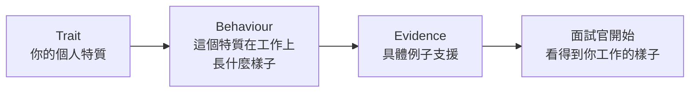

# 「同事會怎麼形容你?」—— 用 Trait → Behaviour → Evidence 把形容詞換成畫面

**主題分類:** 職涯 / 面試準備 —— 個人特質題(personality / cultural fit question)
**來源:** Instagram 圖文貼文(cher.careercrafters,「面試技巧」系列,共 7 頁)
**整理日期:** 2026-09-07

> 📎 相關筆記:[[leetcode-0-to-200-grinding-experience]](技術面的另一半)、
> [[ten-toxic-manager-traits]](反過來看:你也在評估對方)

---

## 0. 一句話總結

> **面試官問「同事會怎麼形容你」,想聽的不是你有幾個正面形容詞,
> 而是:跟你一起工作,到底是一種怎樣的體驗?**

⭐ 而整場面試在短短 45–60 分鐘裡,其實只在回答一個問題:

> **「我能不能想像這個人,在我的 team 裡工作?」**

所以:**不要只是告訴面試官你很好,要讓他開始看見「跟你工作會是什麼樣子」。**

---

## 1. 問題出在哪:你的答案跟下十位應徵者一樣

多數人的第一反應是:

```text
Hardworking / Responsible / A team player / Easy to work with
```

> ⚠️ **這些全部都沒有錯 —— 問題是下十位應徵者很可能也會說一模一樣的東西。**

⭐ 你需要的不是「更正面的形容詞」,是**一個屬於你的形容詞,以及一種屬於你的回答方式**。

---

## 2. ⭐⭐⭐ 核心公式:Trait → Behaviour → Evidence



| 層 | 它回答什麼 | 少了它會怎樣 |
|---|---|---|
| **Trait** | 你是什麼樣的人 | —— |
| **Behaviour** | ⭐ **這個特質在工作上「怎麼出現」** | ⚠️ 只剩形容詞,跟別人一樣 |
| **Evidence** | 有什麼事實支撐 | ⚠️ 聽起來像自我宣稱,面試官沒有信心 |

---

## 3. 兩組改寫對照(這是全文最有價值的部分)

### 案例一|想表達「冷靜可靠」

**❌ 只有 Trait:**

> My team would describe me as **calm and reliable** because I won't get panic when things go wrong.

**✅ Trait → Behaviour → Evidence:**

> My team would describe me as **the calm decision-maker who stays calm when things get messy**.
> When a project becomes unclear or we hit an unexpected issue, **I tend to be the one who brings people
> together, structures the problem and works out what we need to do next**.
> **For example, in XYZ, I…**

> ⭐ **同樣是說自己冷靜可靠,但後面那個答案,面試官已經開始看得到你工作時的樣子。**

**拆解一下差在哪:**

| 元素 | 前者 | 後者 |
|---|---|---|
| **Trait** | calm and reliable(通用) | **the calm decision-maker**(有角色感) |
| **Behaviour** | ⚠️ 只有「不會 panic」——**這是「沒做什麼」** | ⭐ **把人聚在一起 → 把問題結構化 → 定出下一步**(**這是「做了什麼」**) |
| **Evidence** | ❌ 無 | ✅ `For example, in XYZ…` |

> ⭐⭐ **注意最關鍵的一個轉換:「不會慌」是被動的、消極的描述;
> 「把人聚起來、把問題結構化、定出下一步」是主動的、可觀察的動作。**
> 面試官能想像後者發生在他的團隊裡,想像不了前者。

### 案例二|想表達「很好合作」

**❌ 只有 Trait:**

> **I'm a team player** and I work well with different people.

**✅ Trait → Behaviour → Evidence:**

> My colleagues would say **I'm very easy to collaborate with, but also willing to challenge when needed**.
> **I'm usually the person trying to understand different perspectives first, then helping the team
> find a way forward.** **For example…**

> ⭐ 這就不只是「I work well with people」,而是開始讓人**看到你怎麼跟人合作**。

⭐⭐ **這個例子藏了一個更高明的手法:`but also willing to challenge when needed`。**
它在「好合作」這個過於安全的特質上,**加了一個帶稜角的但書** ——
**而稜角才是辨識度的來源。** 純粹的「很好相處」聽起來像沒有意見。

---

## 4. 三個準備方向

### ① ⭐ 不要選最漂亮的形容詞,選**最有辨識度**的

原文給的候選詞:

```text
Strategic · Calm under pressure · Resourceful · Curious · Straightforward but supportive
```

> **哪一個最像你?**

⚠️ 注意這些詞的共同點:**它們都不是「無條件的好」** ——
`Straightforward`(直接)可能得罪人、`Curious` 可能離題、`Strategic` 可能顯得算計。
⭐ **正是這種「有代價的特質」才有辨識度**,而 `hardworking` 沒有任何代價,所以誰都能說。

### ② 一定要有 Behaviour 與例子

> **不要只告訴我你是什麼人,告訴我:這個特質在工作上會怎樣出現?**
> 你有哪些具體例子支援這個說法,**給面試官信心**。

### ③ ⭐⭐ 最好偷偷連回你應徵的職位

**先思考那個職位究竟需要什麼。**

| 若你面試 | 這些特質更有幫助 | 相對之下 |
|---|---|---|
| **Project Manager** | ⭐ **Calm + Structure + Stakeholder alignment** | Creative + Energetic 效果較弱 |

> **同樣是真話,選那個更容易幫面試官建立「你適合這個崗位」印象的版本。**

⚠️ 這裡的分寸很重要:**是「從你真實的特質裡挑最相關的那個」,不是「編一個職位想要的人格」** ——
因為第三層的 Evidence 會把你揭穿。

---

## 5. ⭐⭐ 應用案例:三十分鐘做出你自己的版本

### 步驟一|列出三個候選 Trait(15 分鐘)

**別從形容詞表開始挑,從事件開始回推:**

> 回想過去一年,**同事在什麼情況下會來找你?** 那個「情況」就指向你的特質。

| 同事來找你的情境 | 反推出的 Trait |
|---|---|
| 事情亂掉、沒人知道下一步 | **Calm decision-maker / Structured under pressure** |
| 卡住了、需要有人想別的辦法 | **Resourceful** |
| 兩邊吵起來、需要有人翻譯 | **Bridge-builder / Straightforward but supportive** |
| 要做一件沒人做過的事 | **Curious / First-mover** |

⭐ **這個方向比「挑形容詞再找例子」可靠得多** —— 因為證據天然就在。

### 步驟二|每個 Trait 補上 Behaviour(10 分鐘)

**把它寫成一串動詞,而不是狀態:**

```text
❌ 狀態:我不會慌 / 我很好相處 / 我很負責
✅ 動作:我會先把相關的人拉進同一個會議 → 把問題拆成幾個已知與未知
        → 定出接下來 48 小時要驗證什麼
```

> ⭐ **檢查法:如果你的 Behaviour 可以套在任何一個特質上,那它太空了。**

### 步驟三|每個 Behaviour 綁一個真實案例(5 分鐘)

不需要很大的事,但要有:**當時的情況 → 你做了什麼 → 結果**。

⚠️ **準備兩個版本:30 秒版與 2 分鐘版。** 面試官通常先聽 30 秒版,有興趣才會追問。

### ⭐ 一個常被忽略的細節:針對職位重排順序

同一組三個 Trait,面不同的職位時**換順序**:

| 職位 | 先講哪一個 |
|---|---|
| Project Manager | **Structured under pressure** |
| 新創的早期成員 | **Resourceful** |
| 跨部門協調角色 | **Straightforward but supportive** |

**不用改內容,改順序就好。**

---

## 6. ⚠️ 這篇沒有處理、但你會遇到的三件事

原文很短,以下是實務上會撞到、但它沒講的:

1. **⚠️ 如果面試官追問「那你的缺點呢?」**
   —— 你在 §4① 選的那個「有代價的特質」,它的代價就是最誠實的答案。
   `Straightforward` 的代價可能是「有時候講太快、沒先鋪陳」,**而你可以接著說你怎麼管理它**。
2. **⚠️ 這題有時候會變形。** 「你的前主管會怎麼形容你?」「如果我打給你的 reference 他會說什麼?」
   —— **同一套公式適用,但主詞換人,例子也要換成那個人真的看得到的事。**
3. **⚠️ 文化差異。** 這套講法在英語系面試很標準;
   **在部分較保守的環境,過度包裝的自我描述反而可能被視為浮誇** —— 把 Evidence 講得更重、形容詞講得更輕,通常較安全。

---

## 7. 核實狀態

⚠️ **這是一則社群平台的職涯建議圖文,不是研究結果。**

| 內容 | 性質 |
|---|---|
| Trait → Behaviour → Evidence 的框架 | **作者的個人經驗與教學方法** |
| 兩組英文範例句 | **原文提供的示範,非真實面試逐字稿** |
| 「面試在回答『我能不能想像這個人在我的 team 裡工作』」 | ⭐ **與 behavioral interview 的通行原則方向一致**,但為作者的表述 |
| §5、§6 | ⭐ **本文的延伸,不是原文內容** |

> ⚠️ 作者為職涯教練(帳號經營職涯輔導),**內容帶有服務推廣性質**(文中提到「我在了解夥伴們的閃光點後,
> 也會給他們一系列適合他們的獨特形容詞」)。本文只整理方法,不涉及其付費服務。

---

## 來源

- Instagram 圖文貼文 — **cher.careercrafters**,「面試技巧」系列(7 頁),使用者於 2026-09-07 提供全文
- 本倉庫相關筆記:[[leetcode-0-to-200-grinding-experience]]、[[ten-toxic-manager-traits]]、[[ai-skills-no-raise-nash-bargaining]]

> ⚠️ 本文為對一則公開社群貼文的整理與延伸。**§5、§6 為本文補充,非原文內容。**
> 面試建議因產業、地區與職級而異,請自行判斷適用性。
