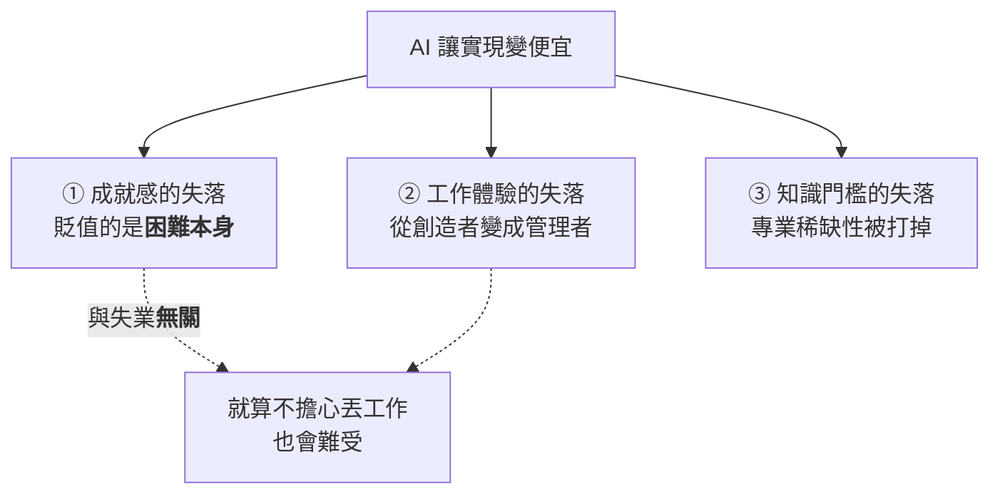
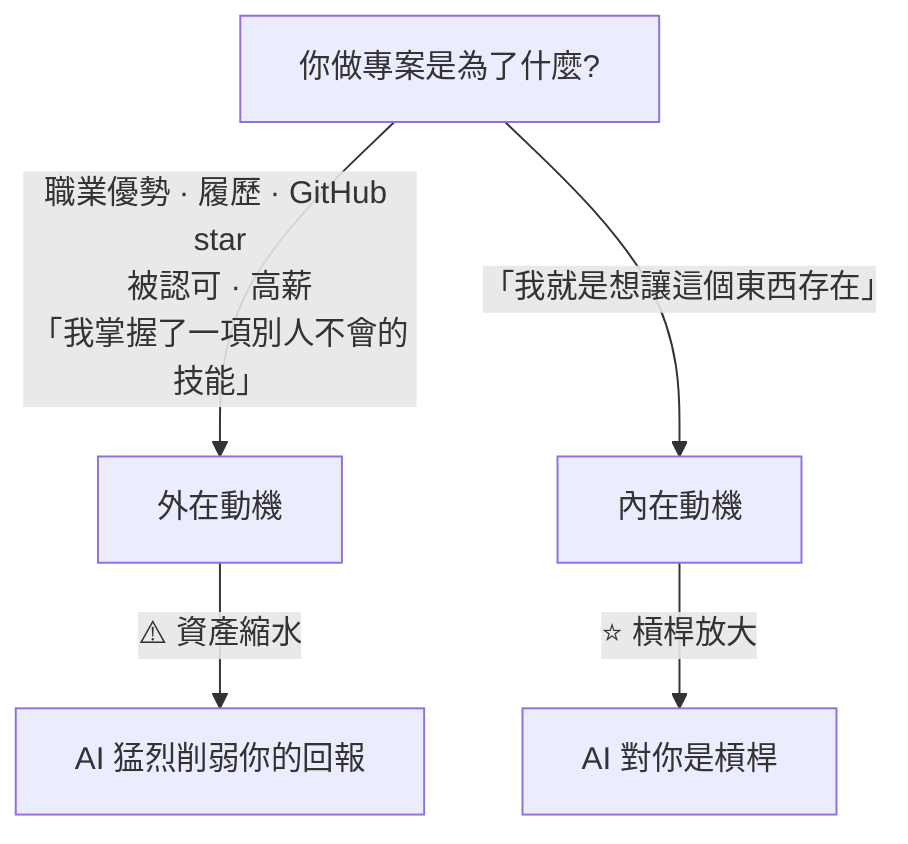
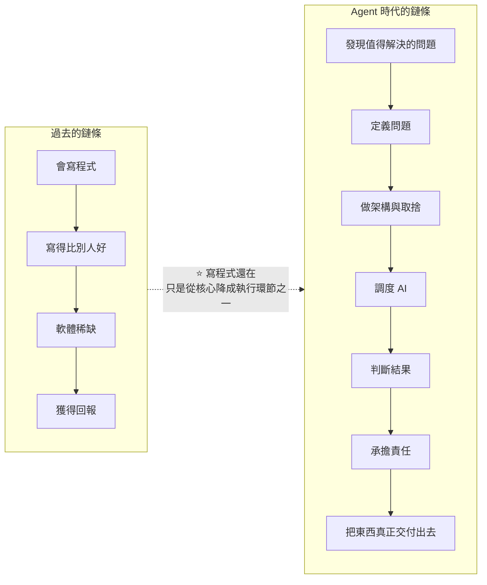

# 「一切都沒有意義了」:一則 HN 熱帖與 175 則回覆裡的程式設計師價值重排

**主題分類:** 職涯 / 心態 —— AI 時代的動機、身份與價值鏈遷移
**來源影片:** YouTube〈300赞的HN热帖:程序员说一切都没意义了 AI时代何去何从〉(Why QQ / 為什麼叫 QQ,2026-09-07,約 9.9 分鐘,**官方 zh-Hans 字幕**)
**一手素材:** Hacker News 討論串〈Ask HN: Does anyone else feel like nothing matters anymore?〉(2026-08-18,**297 讚 / 175 則回覆**)

**整理日期:** 2026-09-08

> 📎 相關筆記:[[ai-skills-no-raise-nash-bargaining]](學了 AI 卻沒加薪的結構性解釋)、
> [[dhh-16-threads-bottleneck-migration]](**執行變便宜、判斷在漲價** —— 同一件事的工程版)、
> [[anthropic-html-work-pages]](§6.4 的 junior 斷層,是本文價值鏈遷移的另一面)、
> [[lisa-su-mit-commencement]]

---

## 0. 一句話總結

> **失落的程式設計師失去的,從來不只是 coding,還有一個用了十幾年的信念:
> 「這事很難,我會,所以我有價值。」**
>
> ⭐⭐⭐ **AI 逼你把它改寫成另一句話:「實現越來越便宜,那我到底想創造什麼?」**

⚠️ 這篇不是「AI 焦慮文」——**討論串本身是兩派激烈交鋒的**,而最有解釋力的發現是:
**兩派的分歧根本不在 AI,而在他們原本從程式設計裡「獲取的東西」不一樣。**

---

## 1. 原帖:四個問題

發帖的程式設計師連問四個,**每一個都戳在日常上**:

```text
新軟體發布 —— 誰在乎?
學 CS 概念 —— 有什麼用?
刷面試題 —— 那個崗位明年還存在嗎?
做 side project —— 不過是往 AI 垃圾山上再加一塊
```

他甚至說:**現在連超市裝袋子的小哥,都能做出你做的東西。**

⭐ 他給的比喻後來被評論區反覆引用:

> **像遊戲裡開了作弊碼 —— 什麼都能做到之後,一切都沒意思了。**
> 原話是:**「我們的意義和快樂,被奪走了。」**

📌 **核實:討論串為 2026-08-18 的 Ask HN,標題〈Does anyone else feel like nothing matters anymore?〉,
297 讚、175 則回覆 —— 與影片數字完全一致。**

---

## 2. ⭐⭐ 三種失落(它們是不同的東西,別混談)



### ① ⭐⭐⭐ 貶值的不是程式碼,是「困難」

> 過去程式設計師的成就感來自一個結構:**這東西很難,而我會。**
> 學一門語言、啃下編譯原理、搞定分散式、調通一個詭異的 bug ——
> **這些事讓人滿足,因為它們要投入時間、經驗和智力。**

⚠️ 現在 Agent 幾小時能幹完過去幾週的活,於是出現一個很強的心理變化:

> **「既然誰都能做到,那我做到了又算什麼?」**
>
> ⭐ **你過去十幾年建立的定價體系,根基是稀缺。稀缺消失了,定價自然崩。**

**評論區最準的比喻(用戶 bah9):**

> **「編程對我來說是下西洋棋,AI 是棋類引擎。我當然在乎贏(交付產品)——
> 但開著引擎贏棋,我得不到任何快樂。」**
>
> ⚠️ 他還補了一句很扎心的觀察:**「九成的程式設計師其實討厭下棋,他們只喜歡贏。」**
> **以前你能贏,因為別人贏不了;現在裝袋小哥也能贏了 —— 你的價值是什麼?**

> ⭐ 這條評論下面吵得最兇,因為它逼每個人回答一個問題:
> **你愛的是「編程這件事」,還是「贏這件事」?**

⭐ 另一位用戶(Valakas)把作弊碼比喻推得更遠:拿《Factorio》舉例 ——
**這類遊戲讓人上癮是因為資源有限,你要優化、要規劃;
一旦輸入作弊碼一路平推到結局,你會很快對整個遊戲失去興趣。**
他再往上推一層:**人類幾十萬年都在為食物和生存掙扎,現在每天對著螢幕坐八小時,其他一切都被安排好了 ——
「現在的感覺,像遊戲直接進入了終局。」**

### ② 工作體驗變了(與失業無關)

有一派人**根本不擔心丟工作**,他們難受的是流程變了:

| 以前 | 現在 |
|---|---|
| 理解問題 → 思考 → 寫程式 → 除錯 → 完成 | **描述需求 → Agent 寫 → 你 review → 改 prompt → 再驗證** |
| **創造者** | ⚠️ **管理者** |

> ⚠️ 有評論說:**就算架構是自己定的,大量實現不是自己寫的,你就很難真正內化整個系統。**
> ⭐ 而對真正喜歡寫程式的人來說,**review 這件事本身就不好玩 —— 不管 review 的對象是人還是 AI。**

**Vibe coding 的短期反饋確實好**,但很多人反映時間一長會冒出一個感覺:**「這不是我的專案。」**

⭐ 於是出現一個有趣現象:**有人開始專門保留幾個 "trad code only" 的個人專案,不用 LLM、純手寫。**

> 有個用戶說,他凌晨三點半還在寫一個命令列工具,把地圖資料轉成向量磚 ——
> **沒人逼他,也沒有產出壓力,他就是想寫。**
>
> ⭐ **就像有人堅持底片攝影、堅持機械錶、堅持手沖咖啡 ——
> 它們提供的價值在別處:在手感裡、在過程裡、在「我親手做的」這四個字裡。**

### ③ 知識門檻被打掉

過去資料庫、編譯器、網路、分散式系統,每一樣都要啃好幾年。
**知識稀缺 ⇒ 專家稀缺 ⇒ 專業能力值錢。** LLM 把獲取知識的成本打掉了幾個數量級。

⭐ 有個角度很少人提到:

> **AI 擠掉了所有其他的技術討論** —— 語言、協定、演算法、架構,
> 以前大家聊這些,現在不聊了,**因為不確定它們還重不重要**。
> 你寫的東西發出去,轉身就被吸進訓練資料,**和你的名字徹底脫鉤** —— 這大概就是一種徹底的商品化。

### ⭐⭐ 但這裡有個關鍵區分:給你所有資料 ≠ 讓你理解它

用戶 **firefoxd** 講了自己的實驗:他讓 LLM 給他設計了一整套電池產業的課程,準備入行。
**資料非常完整,課程體系也漂亮。真正開始學之後他發現 ——**

> ⚠️⚠️ **「最沮喪的是,我根本不知道自己不知道什麼。」**

> ⭐⭐⭐ **AI 把「知識的獲取」變成了免費,但「理解」沒有同步免費。**
> **判斷力、心智模型、經驗、上下文、知道哪裡可能出錯 —— 這些 AI 給不了你,只能你自己長出來。**
>
> 他最後一句話很短:**Understanding things still matters.**

---

## 3. ⭐⭐ 另一派:現在才真正好玩

**這個帖子並不是一邊倒的喪。** 反方的邏輯完全相反:

> 有人直接反問:**「你真的想回到沒有 LLM 的時候嗎?」**
> 還有個快五十歲的開發者說他對未來很興奮 —— **便宜的開發板、RISC-V、FPGA,能玩的東西反而變多了。**

**他們的論據:**

> 以前大量時間耗在**樣板程式碼、CRUD、配環境、膠水程式碼、查 API、機械除錯**上。
> 現在這些全可以扔給 Agent ——
> ⭐ **人終於可以去想那個真正的問題:我到底想做什麼?**

### ⭐⭐ 一位 40 歲前端開發者的評論(全帖最有畫面的正面案例)

> **過去他的個人專案大多停在 30%,現在他真的在 “finish stuff” ——
> 想法第一次能變成完整的、打磨過的產品。**
>
> ⚠️ **但他補了一句很實在的話:如果沒有之前累積的前端與 UX 經驗,他做出來的東西會像 “AI slop”。**

> ⭐⭐⭐ **區分 slop 和作品的,恰恰是你過去攢下的那些經驗。**

📌 也有人潑冷水:**AI 做的傳單大家直接無視、AI 寫的文字三行就能聞出來、AI 套的介面沒人想用;
類似的浪潮他見過幾波,後來都退了。**

---

## 4. ⭐⭐⭐ 最有解釋力的框架:外在動機 vs 內在動機

**兩派的分歧根本不在 AI,而在「他們原本從程式設計裡獲取的東西不一樣」。**



> ⭐⭐ **「同一項技術,兩種命運。」**
>
> 一部分人獲取的是**稀缺性帶來的回報**,另一部分人獲取的是**創造本身的快樂**。

⭐ 提出這個框架的用戶還補了一刀:

> **真正的方案極其講究 —— 要處理大量 edge case、要管效能和記憶體、要讓使用者少走彎路。
> 能做好這些的人,從來就不多。**

甚至有人說:**就算他寫的新程式語言最後是零使用者,他還是會寫,因為這是他設計出來的。**

---

## 5. ⭐⭐ 價值鏈的遷移(把整帖讀完的結論)



> ⭐⭐⭐ **價值往上走了 —— 走到「判斷」和「負責」上。**

⚠️ 而鏈遷移是有代價的:帖子裡有位 **17 年經驗的開發者說 LinkedIn 上獵頭的訊息已經徹底乾涸,
他轉行去讀醫學院了。** **鏈遷移的時候,有人上車,有人下車。**

📎 這與 [[dhh-16-threads-bottleneck-migration]] 的結論一模一樣 ——
**「Execution 廉價了,judgment 在漲價。」** 一個是社群的自述,一個是工程實踐的觀察。

---

## 6. ⭐⭐ 討論到最後,已經不在聊 AI 了

> 有人直接說:**這是一種 ego death。**
> 你過去的身份是「我是一個厲害的程式設計師」,**AI 突然告訴你:這個能力沒你以為的那麼稀缺。**

那位用戶問了一個很好的問題:

> ⭐⭐⭐ **「沒有觀眾的時候,你是個什麼樣的人?」**
>
> 他說:**就像任何一次死亡,它會重排你的價值觀。**
> 但他也安慰大家:**自我這東西會慢慢重組,回來的時候會成熟一點。**

⭐ 有評論引了存在主義的答案:**意義不會自動分配給你,你得自己建。**
另一條回覆:**軟體工程變了,那就去找到新的 mastery。**

---

## 7. ⭐⭐⭐ 影片作者最有收穫的一條:現實沒有作弊碼

**這是對「開作弊碼」那個核心比喻的反駁,也是全篇最實用的一段。**

用戶 **chr15m** 說:**這個比喻很好,但現實沒有作弊碼。**

他引了一篇 2017 年的經典文章:**〈Reality has a surprising amount of detail〉(現實的細節多得驚人)**。

> 作者用**修樓梯**舉例:樓梯看起來簡單 —— 兩根木板加幾個支架。
> **你真動手才發現:角度、支架、固定、誤差,每一步都是細節。**

⭐ 而這位用戶還說了句大實話:

> **「我每次停下不做東西的時候,就會覺得一切沒意義;
> 一旦動手做,邊界在哪裡、前沿推到了哪裡,看得清清楚楚。」**

⚠️ **而那些細節一個都沒消失:**

```text
需求 · 使用者 · 事故 · 安全 · 效能 · 成本 · 法律 · 還有無數 edge case
```

---

## 8. ⭐⭐ 應用案例:三個可以立刻做的自我檢查

這篇的實用價值不在「怎麼用 AI」,在**怎麼重新定位自己**。

### ① 先分清你的失落是哪一種

| 你的感受 | 它其實是 | 對應的解法方向 |
|---|---|---|
| 「做出來也沒成就感」 | **困難貶值**(§2①) | 重新問:你愛的是編程還是贏? |
| 「這不是我的專案」 | **體驗改變**(§2②) | ⭐ 保留一兩個純手寫的專案(見下) |
| 「我的專業不值錢了」 | **門檻消失**(§2③) | 往「理解」與「判斷」移(§2 末段) |
| 「我會被裁員」 | **價值鏈遷移**(§5) | 往上游走:定義問題、取捨、負責 |

> ⭐ **混在一起談會得到錯的結論。** 例如「保留純手寫專案」對第二種有效,**對第四種完全沒用。**

### ② ⭐ 保留一個「不用 AI」的專案

> 這不是懷舊,是**保住內在動機的實際手段**。
> 就像底片攝影與手沖咖啡 —— **價值在手感、在過程、在「我親手做的」。**

⚠️ **但要誠實地分開**:這是你的**興趣資產**,不是你的**職業資產**。
別指望它同時解決 §5 的問題。

### ③ ⭐⭐ 動手,是對「意義感喪失」最直接的處置

> **「我每次停下不做東西的時候,就會覺得一切沒意義;一旦動手做,邊界在哪裡看得清清楚楚。」**

⭐ 這句可以當成一個**可操作的判準**:
**當你開始覺得「一切都沒意義」,先檢查一件事 —— 你最近一次真的動手做完一個東西是什麼時候?**

**而檢查「你是不是真的懂」的方法,用 firefoxd 那個實驗當鏡子:**

> **你能不能說出「你不知道自己不知道什麼」?**
> 如果一個領域你只從 AI 那裡拿到過完整資料、卻從沒撞過牆,**那你大概還沒開始理解它。**

---

## 9. 核實狀態

### ✅ 已核實

| 說法 | 核實結果 |
|---|---|
| HN 討論串〈Ask HN: Does anyone else feel like nothing matters anymore?〉 | **屬實** |
| **297 讚 / 175 則回覆** | **屬實**,與影片數字完全一致 |
| 發文日期 2026-08-18 | **屬實** |
| 原帖的作弊碼比喻與四個問題 | **屬實** |
| 棋類引擎的比喻(「開著引擎贏棋,我得不到任何快樂」) | **屬實**,為串中被引用最多的評論之一 |
| 「現實沒有作弊碼 / reality has a surprising amount of detail」的反駁 | **屬實** |
| 內在動機 vs 外在動機的框架 | **屬實**,為串中一則評論的論點 |

### ⚠️ 需要注意的性質

- ⚠️⚠️ **這是一則網路論壇討論串,不是研究。** 所有觀點都是**個別開發者的自述**,
  沒有樣本代表性,**也沒有任何量化證據**。
- ⚠️ 個別用戶的具體說法(40 歲前端開發者的專案完成率、17 年經驗者轉讀醫學院、
  凌晨三點半寫向量磚工具、firefoxd 的電池產業課程實驗)—— **均為自述,無法查證。**
- ⚠️ **§8 的三個自我檢查為本文延伸**,不是影片或原帖內容。
- ⭐ 影片作者自述**把 175 則評論完整讀過一遍**;本文未逐條複核,**是對其整理的再整理**。

> ⭐ 但這類材料的價值本來就不在統計代表性,而在**它把一種普遍但難以言說的感受講清楚了** ——
> 引用時請當成「一群人怎麼想」,不要當成「事實是什麼」。

---

## 來源

- [300赞的HN热帖:程序员说一切都没意义了 AI时代何去何从 — Why QQ](https://www.youtube.com/watch?v=d3EvaR3FKnY)(2026-09-07,約 9.9 分鐘,官方 zh-Hans 字幕)
- ⭐⭐ [Ask HN: Does anyone else feel like nothing matters anymore? — Hacker News](https://news.ycombinator.com/item?id=49340013)(2026-08-18,297 讚 / 175 則回覆;**本文的一手來源**)
- 串中被引用的延伸閱讀:
  - [Reality has a surprising amount of detail — John Salvatier(2017)](http://johnsalvatier.org/blog/2017/reality-has-a-surprising-amount-of-detail)
- 本倉庫相關筆記:[[ai-skills-no-raise-nash-bargaining]]、[[dhh-16-threads-bottleneck-migration]]、[[anthropic-html-work-pages]]

> ⚠️ 本文為對一支公開影片與其一手討論串的整理。**§9 已說明材料性質 —— 這是社群自述,不是研究。**
> **§8 為本文延伸。** 職涯決策因人而異,請自行判斷適用性。
