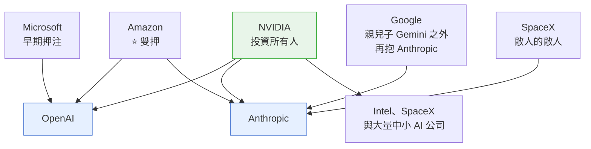
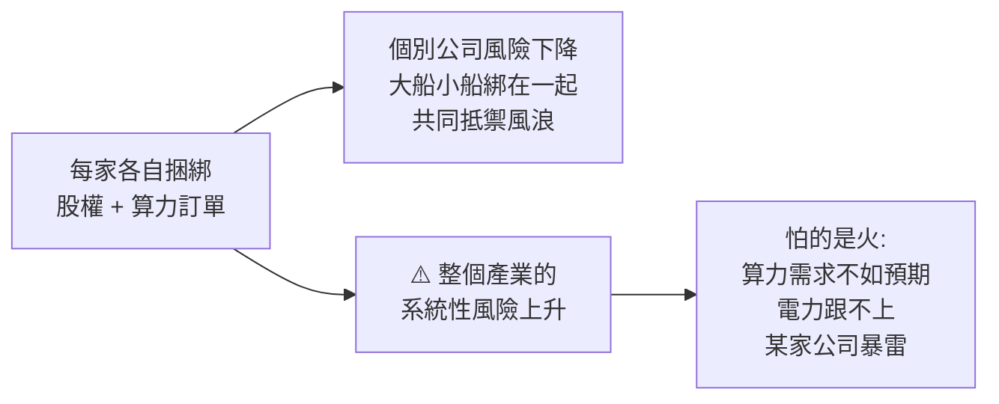

# AI 資本圈的派系與捆綁:同級競爭、不同級綁在一起,以及「融了 1,100 億卻立刻欠出 1 兆」

**主題分類:** 投資 / 個股與產業研究 —— AI 產業的資本結構
**來源影片:** YouTube〈AI 巨頭們之間的資本混戰,到底是個什麼情況?〉(小Lin说,2026-07-01,約 19.5 分鐘,**官方中文字幕**)
**整理日期:** 2026-09-02

> ⚠️ **非投資建議。** 本文整理自一支公開影片並對關鍵數字做查證,不構成任何買賣建議。
> 影片本身聲明「不評價模型、不對比晶片,只看資本操作」,本文沿用此範圍。

> 📎 **強烈建議與 [[nvda-fy27q2-guidance-and-circular-financing]] 對照看** ——
> 那篇從英偉達單一公司的角度講「循環融資如何改寫估值結構」,
> **本篇則把整張網攤開**,說明為什麼那不是英偉達一家的問題。
> 其他相關:[[spacex-ipo-musk-jpmorgan]]、[[ai-industry-shift-c-to-b-compute-decides]]

---

## 0. 一句話總結

> **同級之間競爭,不同級之間捆綁。**
> 而捆綁的結果是:**每一家自己的風險都降低了,整個產業的系統性風險卻升高了。**

---

## 1. 先把牌桌分四層

| 層級 | 主要玩家 |
|---|---|
| **應用層** | 各家都在做 |
| **大模型層** | OpenAI、Anthropic、Google Gemini(市佔斷層領先的三家) |
| **資料中心 / 雲端** | AWS、Azure、Google Cloud;另有 Oracle、SpaceX(Colossus 一期二期) |
| **晶片層** | **NVIDIA(AI 加速器市佔約 八九成)**;AMD、Intel;Google TPU;Amazon Trainium;**Broadcom = ASIC 霸主**(Google TPU 與 Meta 的晶片都與它合作生產) |

⭐ 影片的選取標準值得記:**只看站在最前沿、資本市場活躍、估值千億美元以上**的公司 ——
CoreWeave、Figure AI 這種規模「上不了今天的牌桌」。

**兩家最特殊的公司是 OpenAI 與 Anthropic** —— 因為只有它們是**獨立的純大模型公司**,
其餘都是大廠。所以資本運作幾乎都圍繞這兩家展開。
(Gemini 雖強,但背靠 Google 不缺錢也不缺算力,Google 也不願意讓人進來。)

---

## 2. 每一家的算盤

### Microsoft:早期押注,報酬率最漂亮

前後投入約 **130 億美元**、持股約 **27%**。以 OpenAI 約 **8,500 億美元**估值計,
持股價值約 **2,290 億** —— **約 17 倍報酬**。

> ⭐ 對比出笑點的是軟銀:**投超過 600 億(約微軟的四五倍)卻只拿到約 13%**(不到微軟一半)。
> 而孫正義為了湊這筆錢,**把手上 58 億美元的輝達股票全數清倉** ——
> 他後來在投資人會議上自嘲是「哭著把輝達賣掉的」。

### Amazon:從獨押到雙押

2023、2024 各投 Anthropic **40 億**,是最早那批投資人。
但今年兩家都大規模融資時,**Amazon 兩邊都是核心外部投資人** ——
對 OpenAI 承諾最多 **500 億**、對 Anthropic 追加最多 **250 億**。

> ⭐ 影片點出一個有意思的共通點:**微軟與亞馬遜都沒有自己出圈的大模型** ——
> 因為兩家都早早入股了大模型公司,**主打扶持而非自研**。

### Google:從交朋友到不再曖昧

早期投 Anthropic 都是幾億等級 —— **那種規模根本不是為了投資,是為了交朋友**。
重心仍在自家 Gemini。

但 Anthropic 追得太快(尤其 Claude Code 出圈),Google 全押 Gemini 的風險太高,於是:

1. 先合作:提供最多 **100 萬顆客製 TPU**、新增超過 **1 GW** 算力
2. 再下重注:**2026-04-24 宣布投資最多 400 億美元,並在未來五年提供 5 GW 算力**

### NVIDIA:上車晚了,但投資所有人

- 與 OpenAI 簽 **300 億美元**戰略合作意向書 —— ⭐ **前提是你得用我多少多少的 GPU**
- 原本最高可到 **1,000 億**,但 OpenAI 估值太高;黃仁勋自己在部落格承認**上車晚了**
- 對 Anthropic 說最多戰略投資 **100 億**,但尚未敲定
- 另在美國政府牽線下投 **Intel 50 億**、投 **SpaceX 20 億**
- 加上 CoreWeave、Figure AI、Wayve、Mistral、Cohere 等,**今年承諾投資合計約 400 億美元**

> ⭐⭐ **它的目標不是在這桌上分一塊大蛋糕,而是把整個蛋糕做大** ——
> 從「賣鏟人」變成整條產業鏈的大股東,**投資同時鎖定未來訂單**。

### 馬斯克:70 天的轉彎

2026-02-26 在 X 上痛罵 Anthropic「反人類、邪惡」;**70 天後的 05-06,SpaceX 宣布與 Anthropic 合作,
供應 22 萬顆 GPU**。他事後打圓場說跟團隊聊過、「沒有人觸發我的邪惡探測器」。

> 影片的註解很到位:**在如此巨大的利益面前,打臉就打臉吧;況且敵人的敵人就是朋友。**
> (馬斯克與 OpenAI 關係惡劣是公開的事,所以他若要站邊,一定是 Anthropic。)

**結果是:Anthropic 成了三大雲廠商唯一的共同選擇,還加上 SpaceX。**

---

## 3. Stargate:千億美元的專案,說起就起、說沒就沒

2025 年川普上任即牽頭,把 OpenAI、軟銀、Oracle 的老大湊在白宮宣布 ——
德州、總規模 **5,000 億美元**、**10 GW** 的超大型資料中心集群,初始股權:

| 出資方 | 金額 |
|---|---|
| 軟銀 | 190 億 |
| OpenAI | 190 億 |
| Oracle | 70 億 |
| 阿聯酋 MGX | 70 億 |

**馬斯克當晚就開嗆說他們根本沒那個錢** —— 而後續發展某種程度上被他說中:
除了初始承諾之外幾乎沒融到像樣的大投資。

據影片轉述的媒體報導,三方在東京的談判桌上吵得不可開交(誰有設計權、誰說了算、誰的報酬率要保證),
**OpenAI 內部已實質性放棄這個大型聯合專案,轉為與 Oracle、AWS 走傳統雙邊合約 —— 自己只當租客。**

> ⚠️ 這一段屬影片轉述的媒體爆料與其個人推測(他自己也說「這都我猜的」),**本文未取得獨立佐證**。
> 可佐證的是:**Oracle 股價曾因 Stargate 一路狂漲、創辦人一度成為世界首富,又因負面消息回落。**

⭐ 影片的感嘆值得記:**這就是 AI 時代的速度 —— 千億美元的專案,說起就起,說沒就沒。**

---

## 4. ⭐⭐ 把股權當貨幣:AMD 的兩筆「以股換單」

這是全片最具體、也最可查證的一段。

**OpenAI × AMD:** AMD 在未來幾年提供合計 **6 GW** 算力;同時**為 OpenAI 發行最多 1.6 億股認股權證,
行權價每股 0.01 美元** —— 若全數行使約當 **AMD 10% 股權**。

> **等於 AMD 犧牲自己約一成股權,去換 OpenAI 的一張大訂單。**
> 影片的評語:成本很高,**但你要坐到最中心的牌桌,就不得不出點血**。

**Meta × AMD(今年 2 月):** 幾乎是複刻版 —— **同樣 6 GW 換約 10% 股權**。

---

## 5. ⭐⭐⭐ 三條主線,與「融了 1,100 億卻立刻欠出 1 兆」

把上面全部收攏,影片給出三條主線:

1. **NVIDIA 投資所有人** —— 扶持整個行業,同時鎖定未來訂單。
2. **所有人投資 OpenAI 與 Anthropic** —— 換取這兩家的算力訂單(圖上所有箭頭都指向它們)。
3. **大家都在腳踩兩條、三條、四條船** —— 亂七八糟一捆綁,就成了同一條船上的人。

### 這些「投資」跟一般意義的投資完全不一樣

> ⭐⭐⭐ **表面上 OpenAI 與 Anthropic 眾星捧月、融了很多錢,看起來很舒服 —— 其實不是。**

注意所有公告的措辭都是「**承諾最多**」多少億 ——
**意思是「你未來得用我的算力、達到什麼指標,我才繼續給你投錢」。**

影片的粗估是:**OpenAI 已經承諾出去超過 1 兆美元的訂單。**

> **所以不能把它單純看成一家融資了 1,100 億美元的公司 ——
> 它是融了 1,100 億的同時、又立刻欠出去 1 兆美元的公司。它已經把自己跟別人死死綁在一起。**

⚠️ 上述兩個數字為影片的粗略估算,**本文未獨立查證**。

### 捆綁的代價:個體風險下降,系統性風險上升

> ⭐ 影片用了赤壁連環船的比喻:**綁在一起最怕的就是火** ——
> 可能是算力需求達不到預期、電力跟不上,或某一家暴雷。
> **反過來,如果需求持續爆發,那就皆大歡喜 ——「至少這幫人是皆大歡喜」。**

⭐⭐ **這正好接上 [[nvda-fy27q2-guidance-and-circular-financing]] §6 的結論**:
那篇說循環融資是「英偉達給自己的業務加了一個槓桿,放大成功也放大失敗」;
**本篇說明整個產業都在做同一件事 —— 所以那個槓桿是全行業性的,不是單一公司的財務選擇。**

---

## 6. 與公開資料的核實

### ✅ 已查證相符

| 影片說法 | 核實結果 |
|---|---|
| OpenAI × AMD:6 GW + **最多 1.6 億股、行權價 $0.01**、約當 10% 股權 | **完全相符**。AMD 於 2025-10-05 發行該認股權證,官方新聞稿與 SEC 8-K 均載明 |
| Meta × AMD 是「幾乎複刻版」(6 GW 換約 10%) | **相符** —— 同為 6 GW、同為最多 1.6 億股 |
| Google 投 Anthropic 最多 **400 億美元**、五年 **5 GW** | **相符**,2026-04-24 宣布 |
| 先前的 TPU 合作:最多 **100 萬顆 TPU**、超過 1 GW | **相符**,且該批容量於 2026 年上線 |
| Stargate:5,000 億美元 / 10 GW,初始股權軟銀 190 億、OpenAI 190 億、Oracle 70 億、MGX 70 億 | 與公開報導一致 |

### ⭐ 影片未提、但值得補上的細節

1. **AMD 那批權證不是無條件的。** 分批解鎖(vesting)同時綁**部署量**與**AMD 股價** ——
   第一批隨首個 1 GW 部署解鎖,後續隨規模擴到 6 GW 並達成技術與商業里程碑;
   **股價門檻一路設到每股 600 美元**,權證於 **2030-10-05** 到期。
   ⚠️ 也就是說「白送 10% 股權」是**上限情境**,不是既成事實 —— 影片講得比實際條款寬鬆。
   (影片有說「具體條款肯定不是就這麼直接送」,方向正確但沒展開。)
2. **Google 那 400 億是分段的。** 初始 **100 億**,其餘最多 300 億**取決於里程碑**;
   初始那筆是在 Anthropic 估值 **3,800 億美元**時投入。
3. **Anthropic 的 5 GW 主要自 2027 年起上線**,不是立即可用。

### ⚠️ 未能獨立查證(以影片轉述看待)

- Anthropic 五月融資估值 **9,650 億**、ARR 15 個月成長 30 倍(4 月 300 億 → 5 月 470 億)
- OpenAI 估值 **8,500 億**、微軟持股 **27%** / 約 130 億成本、軟銀逾 600 億換約 13%
- OpenAI 已承諾出去**逾 1 兆美元**訂單、本輪融資 **1,100 億**
- SpaceX 供應 Anthropic **22 萬顆 GPU**
- Stargate 內部談判破局與 OpenAI「實質放棄」的說法

> ⚠️ 這些數字變動極快(影片本身也說「半年前這張圖完全不長這樣」),引用前請自行以最新公告核對。

---

## 7. 應用案例

### 案例 A|看到「承諾投資最多 N 億」時該問什麼

這類公告幾乎都是**條件式**的。三個問題:

1. **分幾段?觸發條件是什麼?**(Google 那 400 億:初始 100 億,其餘看里程碑)
2. **綁了什麼義務?**(NVIDIA 那 300 億:前提是你要用我的 GPU)
3. **對方同時欠出去多少?** —— 這才是判斷「融資很風光」是否成立的關鍵。

### 案例 B|用「同級競爭、不同級捆綁」快速定位一則新聞

看到兩家看似敵對的公司忽然合作,先分辨**它們是不是同一層**:

- **同層**(Gemini vs Anthropic、AWS vs Azure)→ 競爭關係,合作多半是條件交換
- **不同層**(雲廠 × 模型廠、晶片廠 × 模型廠)→ 捆綁關係,目的是鎖定供給或訂單

馬斯克罵完 Anthropic 又供 22 萬顆 GPU,用這個框架看就不矛盾 ——
**SpaceX 在算力層、Anthropic 在模型層,不同層,本來就該捆。**

### 案例 C|評估「股權換訂單」對賣方的真實代價

AMD 那類交易的正確讀法不是「送掉 10%」,而是:

> **在什麼部署量、什麼股價、什麼時限之下,才會真的送出多少。**

⚠️ 媒體標題常直接寫「送出 10% 股權」,**那是上限情境**。看這種新聞務必去翻 8-K 的 vesting 條款。

---

## 來源

- [AI 巨頭們之間的資本混戰,到底是個什麼情況? — 小Lin说](https://www.youtube.com/watch?v=OcKl98ZQbMQ)(2026-07-01,約 19.5 分鐘,官方中文字幕)
- 核實用官方與權威資料:
  - [AMD and OpenAI announce strategic partnership to deploy 6 gigawatts of AMD GPUs — OpenAI](https://openai.com/index/openai-amd-strategic-partnership/)
  - [AMD and OpenAI Announce Strategic Partnership — AMD Investor Relations](https://ir.amd.com/news-events/press-releases/detail/1260/amd-and-openai-announce-strategic-partnership-to-deploy-6-gigawatts-of-amd-gpus)
  - [AMD Form 8-K, 2025-10-06(認股權證條款)](https://ir.amd.com/financial-information/sec-filings/content/0001193125-25-230895/d28189d8k.htm)
  - [OpenAI signs AMD deal for 6GW with a massive equity kicker — Tom's Hardware](https://www.tomshardware.com/pc-components/gpus/openai-signs-6gw-amd-gpu-deal)
  - [AMD and Meta strike $100 billion AI deal that includes 10% stock deal — Tom's Hardware](https://www.tomshardware.com/tech-industry/artificial-intelligence/amd-meta-100-billion-deal)
  - [Google to invest up to $40B in Anthropic in cash and compute — TechCrunch](https://techcrunch.com/2026/04/24/google-to-invest-up-to-40b-in-anthropic-as-search-giant-spreads-its-ai-bets)
  - [Google to invest up to $40 billion in Anthropic — CNBC](https://www.cnbc.com/2026/04/24/google-to-invest-up-to-40-billion-in-anthropic-as-search-giant-spreads-its-ai-bets.html)

> ⚠️ **再次聲明:非投資建議。** §6 已標示各項數字的核實狀態;
> 未查證者一律以「影片轉述」看待。AI 產業的資本關係變動極快,引用前請以最新公告為準。
