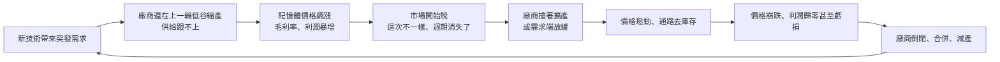

# 存儲還能漲嗎?用 1995、2018 兩輪暴漲對照 AI 這一輪的記憶體週期

> ⚠️⚠️ **非投資建議。本文為知識整理,不構成任何買賣建議。文中所有數字請自行向官方來源查證。**
>
> 整理自 YouTube 頻道 **美投君 / 美投讲美股**〈[存储还能涨吗?历史上三轮暴涨,竟与今天如此相似?](https://www.youtube.com/watch?v=viQjQ3mgeOc)〉(2026-09-27,約 25.2 分鐘)。
> **該片無字幕也無自動字幕,逐字稿以 CPU faster-whisper 轉錄取得、非官方字幕**,可能有少量聽寫誤差(專有名詞對照見文末)。
>
> ⚠️⚠️ **立場揭露:片頭片尾推廣「美投 Pro」付費訂閱**;作者表示美光的個股分析與「一套可參考的存儲交易指標」放在付費內容。⭐ **本文只整理該片公開講述的歷史與框架,不轉述任何付費素材。**
>
> ⭐⭐ **本文已比對美光 SEC 財報(FY1995 10-K、FY2018 Q4、FY2023 Q4 新聞稿)與當年報導逐項核實** —— ⚠️ **抓到兩處需修正**(FY2023 虧損金額、2018 股價頂點的時間),詳見 §六。
>
> **整理日期:** 2026-09-28

---

## TL;DR

1. ⭐ **記憶體(DRAM / NAND)是週期性極強的行業**:上行時股價幾年翻好幾倍,下行時一年跌掉八成。
2. ⭐⭐ **1993–95 年那輪比現在更瘋**:Windows 3.1 + PC 價格戰引爆需求、住友化學工廠爆炸卡住供給,美光兩年多漲約 26 倍;**頂點那天什麼事都沒發生**,之後是 20 多家廠商一起擴產,DRAM 價崩盤。
3. ⭐⭐ **2016–18 年那輪已是三巨頭格局、扩產也很克制**,但還是崩了——**這次問題出在需求端**(雲端資本支出放緩、加息、貿易戰、通路去庫存)。
4. ⭐⭐⭐ **作者的判斷:需求端像 1995(劃時代技術、結構性需求),供給端像 2018(三巨頭、有紀律)**——是史上最好的組合,**但他仍認為週期躲不掉**,理由是三個不變的本質:**大宗商品屬性、需求不會無限成長、只要不是獨家壟斷競爭格局就不穩**。
5. ⭐ **作者結論:上行週期還沒結束,但下行注定到來**;**長期拿著不動的投資人不適合存儲股**,積極交易者才有交易價值。

---

## 1. 週期的基本機制

> ⭐ 作者的提醒:**股價通常比基本面先見頂**。三次週期裡,股價都在「財報仍然創紀錄」的時候開始下跌。

---

## 2. 第一輪:1993–95 年,PC 時代

### 2.1 起點:極寒的冬天

- 1990 年前後,主要記憶體廠多在日本,但日本剛經歷泡沫破裂;美國只剩**美光和德州儀器**還在做記憶體。
- 美光 1990–92 年淨利率只有約 2%,三年合計僅賺約 1,600 萬美元(⚠️ 本文未獨立核實)。

### 2.2 兩個需求引爆點 + 一次供給衝擊

| 事件 | 影響 |
|---|---|
| **1992 年 Windows 3.1** | 圖形介面普及,一台像樣的 PC 從 1–2 MB 記憶體需要到 **4–8 MB** |
| **1992 年 PC 價格戰** | Compaq 率先降價到 800 美元以下,IBM、蘋果、Dell 跟進,PC 需求飆升 |
| ⚠️ **1993 年 7 月住友化學工廠爆炸** | ✅ 1993-07-04 日本新居濱的環氧樹脂廠爆炸;該廠供應全球 **50–60%** 的晶片封裝用環氧甲酚樹脂,**半導體價格數日內翻倍** |

> 供給端:日本廠在收縮、美國只剩兩家,能擴產的只有剛起步的韓國廠;**建廠到出貨至少要一兩年**,需求來得太突然,根本來不及。

### 2.3 股價與業績

| 指標 | 影片說法 | 核實 |
|---|---|---|
| 美光毛利率 | 25% → 47% | ⚠️ 未獨立核實 |
| 美光股價 1993 初 → 1994 底 | 不到 4 美元 → 22 美元(近 6 倍) | ⚠️ 未核實(股價受分割調整影響) |
| 1995 年再漲 | 22 → 近 100 美元(9 個月約 4 倍),**累計約 26 倍** | ⚠️ 未核實;還原分割後的峰值報導為 47.81 美元 |
| **FY1995 營收** | 在已大漲兩年的基礎上再增 80% | ✅ **FY1995 營收 29.53 億美元**(FY1994 約 16.3 億,約 +81%) |
| **FY1995 淨利** | 8.44 億美元 | ✅ **8.44 億美元**(每股 3.90 美元,美光 FY1995 10-K) |

⭐ **Windows 95** 讓需求再翻一倍,整個費城半導體指數半年漲了約 100%。

### 2.4 「這次不一樣」的說法,1995 年就出現過

> 影片引《紐約時報》當年報導:業內很多人認為**存儲已經徹底擺脫了暴漲暴跌的週期**;研究機構 Dataquest(Whisper 聽成「DataCast」)也說晶片已嵌入太多應用,「一個領域放緩,另一個領域會迅速補上」。
> ⭐ 作者:「**這些話,你是不是聽著很耳熟呢?**」

### 2.5 頂點:什麼都沒發生

- 美光在 **1995 年 9 月**見頂,4 週跌 25%,之後一路跌約 80%(✅ 報導:一年內跌到 8.31 美元低點,與峰值 47.81 美元相比約 -83%)。
- ⭐⭐ **「那 95 年 9 月究竟發生了什麼?答案是:什麼都沒有發生。」**——是資本市場先察覺到擔憂開始拋售,之後基本面才真的出問題。
- **問題是擴產**:當時 **20 多家公司**同時擴產,1995–96 年全球新增約 **50 條產線**,很多廠商的資本支出甚至超過當年營收。
- 美光在 1995 年 12 月底才首度承認 DRAM 價格面臨下行壓力。

| 指標 | 影片說法 | 核實 |
|---|---|---|
| DRAM 價格 | 一年跌 80% | 📌 **口徑不一**:一說美光 FY1996 期間晶片價格跌 75%;另一說 1996 年跌 51%、1997 年再跌 65%。**影片的 80% 偏高或取不同區間** |
| 美光單季利潤 | 3.3 億 → 1,900 萬(三季跌 94%) | ⚠️ 未獨立核實 |

> ⭐⭐ **最諷刺的一點:需求其實沒有鬆動。** 影片引專業機構評估,1995 年後 5 年記憶體需求量仍維持年均約 80% 成長,比前 5 年的 63% 還快。**「就是存儲企業自己的無序擴張,壓垮了他們自己。」**(⚠️ 該評估數字本文未核實)

---

## 3. 第二輪:2016–18 年,三巨頭時代

### 3.1 格局已經和今天很像

2008 年金融危機後大量記憶體廠倒閉,活下來的不斷合併,**到 2013 年只剩三巨頭:三星、SK 海力士、美光**。

### 3.2 需求與供給

| 面向 | 內容 |
|---|---|
| **需求** | **雲端運算 + 智慧手機**同時爆發;三星還說未來有 VR、自動駕駛繼續撐 |
| **供給(客觀)** | 三家把部分 DRAM 產能挪去做手機用的 3D NAND;製程越來越難微縮,**每一代新增的產能越來越少** |
| ⭐ **供給(主觀)** | 三家都很克制:2016–17 年都宣布放慢擴產;✅ **美光 2018 年 5 月宣布 100 億美元回購**,把錢還給股東而不是建廠 |

### 3.3 結果

| 指標 | 影片說法 | 核實 |
|---|---|---|
| DRAM 價格 2016–18 | 漲近 3 倍 | ⚠️ 未獨立核實 |
| 美光毛利率 | 17% → 61% | ✅ FY2018 Q4 毛利率約 61% |
| 美光股價 | 大漲 5 倍之多 | 📌 從 2016 年低點到 2018 年高點約 64 美元,實際漲幅更高 |
| 三星超越英特爾 | 2017 年 7 月成為全球最大半導體公司 | ✅ 與當時報導一致 |
| **2018-09-20 財報** | 營收 84.4 億美元、毛利率 61%、全年淨利 141 億 | ✅ **FY2018 Q4 營收 84.4 億美元**(創紀錄,年增 38%);FY2018 全年 GAAP 淨利約 141 億美元 |

### 3.4 ⚠️ 還是崩了——這次是需求端

- 影片:財報隔天股價下跌,「**沒人想到這竟然成為這輪週期的頂點**」,三個月後跌 54%。
- ⚠️ **需修正:美光股價的頂點其實在 2018 年 5 月(約 64 美元),不是 9 月。** 9 月財報時股價已經從高點回落;到 2018 年底跌到約 28 美元,**從 5 月高點算約 -57%**。比較精確的說法是:**9 月那份是業績的頂點,股價早在約四個月前就見頂**——這其實更強化了影片「股價比基本面先見頂」的論點。

**需求端為什麼轉弱:**
1. **雲端大廠資本支出放緩**:2017–18 是雲端第一次軍備競賽,2018 下半年聯準會加息、中美貿易戰,三大雲的採購放緩。
2. **通路去庫存**:價格上漲時中間商提前囤貨,需求一鬆動就恐慌性釋放,價格加速下跌。
3. 影片說 2018–19 年 DRAM 價格跌約 70%(⚠️ 未獨立核實),美光股價再次腰斬。

> 📌 影片接著說「20 年疫情帶動消費電子需求 → 然後在 20 年隨著加息需求鬆動」——⚠️ **加息那段應是 2022 年**(聯準會 2022 年 3 月開始升息),為口誤或轉錄誤差。

### 3.5 最近一次:2022–23 年

| 指標 | 影片說法 | 核實 |
|---|---|---|
| 美光毛利率 | 跌到 -9% | ✅ **FY2023 全年毛利率 -9.1%** |
| 美光全年虧損 | 56 億美元 | ⚠️ **需修正:FY2023 GAAP 淨虧損 58.3 億美元**(營收從 FY2022 的 307.6 億掉到 155.4 億) |
| 三星的做法 | 美光、海力士減產減資本支出時,**三星不減反而搶市占** | 📌 與當時報導方向一致(三星 2022 年底仍表示不刻意減產,2023 年 4 月才宣布減產) |

> ⭐ 作者:「需求該來都來了,三巨頭的擴產也做到克制了,之前的錯誤也都長了教訓,**然而結果卻依然相同**。」

---

## 4. ⭐⭐⭐ 作者的判斷:這一輪會不一樣嗎?

### 4.1 需求像 1995,供給像 2018

| 面向 | 這一輪最像 | 理由 |
|---|---|---|
| **需求端** | **1995 年** | AI 和 PC + Windows 一樣是**劃時代、結構性**的需求爆發,會持續很長時間 |
| **供給端** | **2018、2021 年** | 三巨頭寡占,擴產都有很強的紀律性 |

> ⭐ 「當下的存儲,有著歷史上**最好的需求環境**,也有著歷史上**最好的供給紀律**。」——但作者認為**週期還是很難擺脫**。

### 4.2 ⭐⭐⭐ 三個不變的本質

| # | 本質 | 作者的論證 |
|---|---|---|
| **①** | **大宗商品屬性** | 三星的記憶體和美光的插進伺服器沒有差別,就像美國的油和沙烏地的油。**HBM 也一樣——對 NVIDIA 來說三家都能用**。⇒ 廠商最終是 **price taker(價格接受者)**,沒有定價權。「你不會看到沙烏地說我的石油有咖哩味,所以能多賣錢。」 |
| **②** | **需求不會無限成長** | 上行時市場把多年後的預期提前反映進股價;再強的需求也會有二階導數放緩的時候,**表面上是加息、貿易戰這些偶然因素,深層看是必然** |
| **③** | **競爭格局從沒真正改變** | 只要不是一家獨大,標準品的供給就不可能穩定。NAND 有 SanDisk、Kioxia(Whisper 聽成「善敵凱霞」);DRAM 有中國廠商越來越多——**就像 1993 年沒人在意韓國那幾個新玩家,結果正是他們把水攪得最渾**。根本原因是**人性**:面對高利潤的誘惑和對手的威脅,很難不改變 |

📌 **本文核實第③點的時事例子:** 影片說「上週才看到三星宣布一些新廠房會提前半年到一年開工」——✅ 韓國媒體與 TrendForce 報導**三星平澤 P5 等擴產計畫提前約 6 個月**(2026 年 5 月起陸續報導,7 月開工),與影片方向一致;時間點不一定是「上週」。

### 4.3 這一輪確實不同的地方(會緩和,但不會消滅週期)

| 因素 | 作用 |
|---|---|
| **寡頭格局** | 2018、2023 兩次下行的幅度,**明顯比 1996 年小** |
| **HBM 長期協議** | 三巨頭在 HBM 上簽了大量長期合約,不再完全跟著市場定價波動 |
| **需求潛力** | AI 走過訓練、推理兩個階段,存儲上了兩個台階;作者認為接下來還有**私有雲與邊緣運算** |

### 4.4 結論

> ⭐⭐ 「**我認為存儲的上行週期還沒有結束,但持續的下行也注定要發生。**」
> - **長期買入持有的投資人:存儲很顯然不適合你。**「你拿著微軟,它要是真跌了,你還能安心拿得住;但存儲不行。」
> - **積極交易者:存儲或許還有不小的交易價值。**

📎 這與本庫 [[semiconductor-2000-bubble-vs-2026-ai]](半導體 2000 年泡沫對照)互為參照:那篇看整個半導體板塊的估值,這篇看記憶體特有的供需週期。

---

## 5. 應用案例

### 案例一:用「三問」檢查自己持有的週期股

持有美光、SK 海力士或任何記憶體 ETF 時,每季問三個問題:

| 問題 | 看什麼 | 警訊 |
|---|---|---|
| **供給有沒有鬆動?** | 三巨頭的資本支出指引、新廠開工時程 | ⚠️ 有人提前開工(例如三星 P5 提前約半年) |
| **需求的二階導數?** | 雲端大廠資本支出的**成長率**是否開始放緩 | ⚠️ 成長率連續兩季下滑,即使金額仍創新高 |
| **通路庫存?** | 模組廠、通路商庫存天數 | ⚠️ 價格上漲期間庫存反而上升(代表有人在囤貨) |

### 案例二:辨認「這次不一樣」的論述

當看到以下說法時,回頭對照 1995 與 2018:

| 當下的說法 | 歷史上的同款 |
|---|---|
| 「AI 需求是結構性的,週期消失了」 | 1995:「晶片嵌入太多應用,週期性已不復存在」 |
| 「HBM 是客製化產品,不再是大宗商品」 | 2017:「雲端 + 手機是永不消退的需求」 |
| 「三巨頭很有紀律,不會亂擴產」 | 2022:三星在下行期不減產,搶市占 |

⭐ 不是說這次一定會重演,而是**這些論述出現時,代表市場情緒已經在高檔**。

### 案例三:依投資風格決定部位

| 投資人類型 | 作者建議的思路 |
|---|---|
| 買入持有、不想盯盤 | 以寬基 ETF 或護城河深的公司為主,**記憶體股不適合當核心持股** |
| 積極交易者 | 可參與,但要預先設好出場條件(例如資本支出指引轉向、價格報價連續走弱) |
| 已經持有、獲利豐厚 | 評估分批獲利了結;記得**股價常在業績創紀錄時先見頂**(2018 年 5 月 vs 9 月) |

---

## 6. 數字核實總表

### ✅ 已核實

| 項目 | 數字 | 來源 |
|---|---|---|
| 美光 FY1995 營收 / 淨利 | 29.53 億 / 8.44 億美元 | 美光 FY1995 10-K |
| 住友化學新居濱爆炸 | 1993-07-04;占全球封裝用環氧樹脂 50–60% | 當年 UPI 等報導 |
| 美光 FY2018 Q4 營收 | 84.4 億美元(創紀錄,年增 38%) | 美光 2018-09-20 財報新聞稿 |
| 美光 100 億美元回購 | 2018 年 5 月投資人日 | 美光 SEC 8-K |
| 美光 FY2023 毛利率 | -9.1% | 美光 FY2023 Q4 財報新聞稿 |
| 三星擴產提前 | 平澤 P5 提前約 6 個月 | KED Global、TrendForce 等 |

### ⚠️ 需修正

| 影片說法 | 修正 |
|---|---|
| 美光 FY2023「虧損 56 億美元」 | **GAAP 淨虧損 58.3 億美元** |
| 2018-09-20 財報「成為這輪週期的頂點」 | **股價頂點在 2018 年 5 月(約 64 美元)**;9 月是業績頂點 |
| 「20 年隨著加息需求鬆動」 | 加息應為 **2022 年** |
| 1996 年 DRAM「一年跌 80%」 | 各來源口徑為 51%–75%,影片數字偏高 |

### ❓ 未能獨立核實

美光 1990–92 淨利合計約 1,600 萬、1993–95 毛利率與股價倍數、FY1996 單季利潤 3.3 億 → 1,900 萬、1995–96 新增 50 條產線、1995 年後 5 年需求年增 80%、2016–18 DRAM 價漲 3 倍、2018–19 DRAM 價跌 70%。

> ⚠️⚠️ **再次提醒:非投資建議。** 記憶體股波動極大,任何決策請以公司財報、法說會與自己的風險承受度為準。

---

## 來源

- YouTube:[存储还能涨吗?历史上三轮暴涨,竟与今天如此相似?](https://www.youtube.com/watch?v=viQjQ3mgeOc)(美投君 / 美投讲美股,2026-09-27)——**該片無字幕,逐字稿以 CPU faster-whisper 轉錄、非官方字幕**
- 美光 FY1995 10-K:[SEC EDGAR](https://www.sec.gov/Archives/edgar/data/0000723125/000072312595000016/0000723125-95-000016.txt)
- 美光 FY2018 Q4 財報新聞稿:[SEC EDGAR](https://www.sec.gov/Archives/edgar/data/0000723125/000072312518000085/a2018q4exhibit991-pressrel.htm)
- 美光 FY2023 Q4 財報新聞稿:[SEC EDGAR](https://www.sec.gov/Archives/edgar/data/723125/000072312523000051/a2023q4ex991-pressrelease.htm)
- 住友化學爆炸:[UPI Archives(1993-07-22)](https://www.upi.com/Archives/1993/07/22/Computer-memory-chip-prices-stabilize-after-factory-fire-sends-them-soaring/7204743313600/)、[UPI Archives(1993-11-30)](https://www.upi.com/Archives/1993/11/30/Computer-chip-group-resin-shortage-averted/3437754635600/)
- 美光 1995–96 年歷史:[FundingUniverse — History of Micron Technology](https://www.fundinguniverse.com/company-histories/micron-technology-inc-history/)、[UncoverAlpha — Every Memory Cycle Ends the Same](https://www.uncoveralpha.com/p/every-memory-cycle-ends-the-same)
- 2018 股價走勢:[Trefis — Micron Stock Surged 9x But History Suggests Caution](https://www.trefis.com/stock/mu/articles/599100/micron-stock-surged-9x-but-history-suggests-caution/2026-05-12)
- FY2023 虧損:[The Motley Fool — The Last Memory Boom Ended With Micron Losing $5.8 Billion](https://www.fool.com/investing/2026/08/17/the-last-memory-boom-ended-with-micron-losing-58-b/)
- 三星擴產提前:[KED Global](https://www.kedglobal.com/korean-chipmakers/newsView/ked202605070006)、[TrendForce](https://www.trendforce.com/news/2026/08/20/news-samsung-to-break-ground-on-krw-6t-onyang-hbm-fab-in-sept-p5-eyes-triple-fab-shift-as-expansion-accelerates/)

**Whisper 專有名詞還原對照:** 存傲/存傻/存債/存傅/村储/村主 → 存儲;美肤/美肯 → 美股;美观/美國(指公司時)/眉光 → 美光;海梨士/海历市/海利市 → 海力士;德州一气 → 德州儀器;柱油化学 → 住友化學;价个站/价隔站 → 價格戰;非诚勿扮刀题 → 費城半導體;DataCast → Dataquest;善敌凯霞 → SanDisk、Kioxia;风陷 → 風險;美头Pro/Metopro → 美投 Pro。
