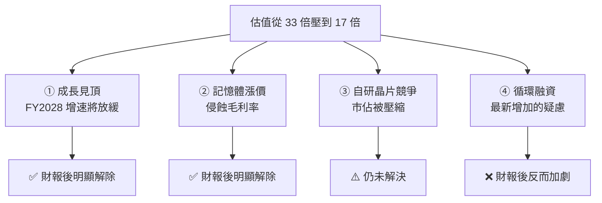

# 英偉達 FY27Q2:三十年來第一次提前給全年指引,以及「循環融資」如何改寫它的估值結構

**主題分類:** 投資 / 個股與產業研究 —— NVIDIA 財報解讀
**來源影片:** YouTube〈AI 產業巨變!英偉達將迎來二次爆發?〉(美投讲美股 / 美投君,2026-08-30,約 24.9 分鐘)
**整理日期:** 2026-08-31

> ⚠️ **非投資建議。** 本文是對一支公開影片的整理與查證,不構成任何買賣建議。
> 影片作者於片中多次推廣自家付費研究產品,其結論帶有立場,請自行判斷。
>
> ⚠️ 該片無官方字幕也無自動字幕,逐字稿以 CPU 版 faster-whisper 轉錄取得,**非官方字幕**
> (人名與數字易錯,還原對照見文末)。**財報數字已逐項比對 NVIDIA 官方 8-K 核實,結果見 §6。**

> 相關筆記:[[ai-industry-shift-c-to-b-compute-decides]]、[[glass-substrate-supply-chain]]

---

## 0. 一句話總結

> **這份財報真正的重點不在本季數字(數字只能算普通),而在管理層一反常態做的兩件事:
> 提前給出 FY2028 全年指引,以及主動把「循環融資」的風險攤在檯面上。**

前者解除了「成長見頂」的擔憂,後者則把風險**放大**了 —— 影片作者的判斷是:
**擔憂淨額是下降的,但英偉達的估值結構已經被永久改寫。**

---

## 1. 財報前:股價橫盤一年,問題不在業績而在估值

過去一年股價幾乎原地踏步,而同期半導體整體大漲。但**業績並沒有問題** —— 營收不僅高速成長還在加速。

真正的原因是**估值壓縮**:前瞻本益比從 **33 倍**一路縮到 **17 倍**。

> **業績是公司自己驅動的,估值是市場給的。** 估值被壓到這個程度,反映的完全是市場的擔憂。

市場當時擔心四件事:



---

## 2. 本季數字:其實只能算「合格」

| 項目 | 影片轉述 | 對比預期 |
|---|---|---|
| 總營收 | 960 億美元 | 超預期約 5% |
| 調整後 EPS | 2.22 美元 | 超預期約 5% |
| 毛利率 | 75% | 符合預期 |
| 資料中心 | 890 億美元 | 超預期 4% |
| ├ 大科技 | 487 億美元 | **大超預期** |
| └ 其他(小雲、主權 AI) | 403 億美元 | **低於預期 4%** |

⭐ **收入結構出現分散化:** 大科技佔比由上季 **57% 降到 55%**,非大科技由 **43% 升到 45%**。

**下季指引反而平淡:** 營收 1,080 億(略高於賣方 1,050 億,**但低於買方 1,185 億**);
毛利率 74%(低於市場預期的 74.5%),原因是新產品初期產能爬坡的成本壓力。

> 所以單看本季與下季,這份財報**只能算非常一般** —— 重點不在這裡。

---

## 3. ⭐⭐ 三十年來第一次:年中就給下一個會計年度的全年指引

CFO 在電話會開場就說,**FY2028 在最保守(供給受限)的情況下也將成長約 70%;
若不看供給瓶頸、只看需求端,增幅可以達到 100%。**

對照當時的市場預期只有 **45%**,即使最樂觀的賣方也只到 55%。

> ⭐ 影片點出這件事的稀有性:**年中給出下一年度全年指引,在整個美股都非常罕見,
> 而在英偉達三十年的上市歷史中是頭一回。**

### 為什麼突然這樣做?答案出人意料

電話會上有人直接問了。黃仁勳的回答是:**不是為了股東,也不是為了市場,而是為了供應商。**

隨著 AI 投入持續擴大,愈來愈多人開始擔心「AI 投資還能不能持續」,**其中就包括英偉達自己的供應商** ——
他們因此遲遲不敢擴產,反過來影響了英偉達的出貨量。

> 所以這份指引的真正用途是:**讓供應鏈夥伴看到需求有多強,放心去擴產。**
> 黃仁勳還舉了美光為例 —— 在記憶體還沒那麼緊張時他就用過這招推動對方擴產,
> 回頭看**非常奏效**,否則現在供給會更緊張。

⭐ **這一段是本片最有價值的觀察:一份財報指引可以是對資本市場說話,也可以是對供應鏈說話。**

---

## 4. 毛利率指引下修,為什麼作者當成利多

管理層罕見地給出完整的毛利率路徑:

```
本季 75%  →  下季 74%  →  第四季 71–72%  →  FY2027 穩定在 72–73%
```

看起來是壞消息,但影片的論點分兩層:

**第一層:下降的「性質」不同。**
半導體公司毛利下滑,通常意味著需求疲軟 —— 這才是市場最怕的。
但這次下降的主因是**上游記憶體漲價,與需求無關**,所以需求疑慮可以排除。

**第二層(更重要):為什麼它「敢」給一年後的毛利率?**

答案藏在財報的 **supply commitment**(已承諾給供應商的採購金額):

> **從上季的 1,190 億美元,一口氣增加到本季的 2,790 億美元**,增長主要與記憶體有關。

⭐ 也就是說,**英偉達提前鎖定了大量記憶體訂單,用預先鎖量換取穩定的供給價格** ——
這才是它能給出明確長期毛利指引的底氣。

> **對投資人的意義不只是毛利數字本身,而是「毛利風險顯著下降」** ——
> 最關鍵的一條生命線有了長期保障,不必再天天提心吊膽記憶體漲價、競爭或產能爬坡。
> 之前因為提心吊膽而被壓縮的估值,就有機會開始釋放。

⚠️ **注意:2,790 億這個數字屬影片轉述,本文未獨立向財報原文查證。**

---

## 5. 兩個仍未解決的問題

### ① 自研晶片競爭 —— 長期風險,無法根除

作者的結論很直接:**自研晶片無論現在或終局都無法徹底取代通用晶片**,
它只能在特定領域做優化、降低部分成本。英偉達的優勢在**軟硬結合**與**更快的產品迭代**。

短期在快速擴張的市場裡大家都有成長空間,競爭構不成太大威脅;
⚠️ **但長期確實可能侵蝕份額,這是真實存在、無法徹底解決的風險,會持續對估值造成壓力。**

**關鍵變數是 Rubin 的表現。** 管理層給的數字:

- 下季 Rubin 收入可達資料中心總收入的 **20%(約 200 億美元)** ——
  遠高於 Blackwell 首次計入收入時的約 100 億
- 相較上一代 Grace Blackwell Ultra:**每瓦吞吐量提高 30 倍、Token 成本降低 35 倍**

⚠️ 以上 Rubin 數字均為影片轉述,本文未獨立查證。

### ② ⭐⭐ 循環融資 —— 財報後不但沒解決,還加劇了

**什麼是循環融資:** 英偉達替自己的客戶提供擔保、幫他們融資,再拿這筆錢來買自家晶片。
對象包括 OpenAI;它還聯合軟銀與美國五大投行,為 AI 新創提供數千億美元融資支持。
**因此有人戲稱它為「AI 央行」。**

管理層在電話會上正面回應,理由有三:

1. 現在限制 AI 新創發展的**不是技術、不是人才、也不是需求,而是算力** ——
   幫他們融資買算力是加速產業發展最有效的手段,產業發展了自然回饋英偉達。
2. 這些新創若成功,會**更深地長在英偉達生態裡**,難以轉換;
   英偉達也不希望它們因資金或算力受限而被迫轉向自研晶片或 AMD。
3. 風險沒有市場想像的高 —— 最壞情況就是**把晶片收回來再賣給別人**,
   算力需求足夠,總找得到買家;最極端還能收回自用於內部研發。

> ⚠️⚠️ **但接下來出人意料:管理層不但沒有因質疑而收手,反而坦率承認「不僅要搞,而且要大搞特搞」,
> 並透露明年將有相當比例的收入來自它在財務上支持的這些 AI 實驗室。**
> 這等於**主動把風險攤牌 —— 風險不降反升。**

---

## 6. ⭐⭐ 循環融資如何改寫估值結構(全片最核心的一段)

先看財務風險:依大摩估計,英偉達到 FY2028 年底、含所有循環融資的總曝險約 **2,000 億美元**,
但淨現金預計有 **3,500 億** —— **就算全部出問題也扛得住。**

> ⭐ **但作者強調:財務風險不是核心問題。核心是循環融資徹底改變了業務的風險結構。**

| 方向 | 效果 |
|---|---|
| 好的一面 | 加速 AI 產業發展(OpenAI 是典型受益者),**擴大自身收入規模**,鞏固長期產業地位 |
| 壞的一面 | 一旦 AI 產業出問題、新創資金鏈斷裂,**衝擊會比單純需求下滑更嚴重,風險被放大** |

> ⭐⭐⭐ **本質上,循環融資就是英偉達給自己的業務加了一個槓桿 ——
> 它能放大 AI 的成功,同時也放大 AI 的失敗。**

⚠️ **對估值的具體影響:** 現在很難判斷收入裡有多少是真實需求、多少是被融資支持**虛假放大**的需求。
**收入品質客觀上比以前下降了。**

作者因此給出結構性下調:

```
2025 年(尚無循環融資問題)      約 25 倍
現在(有循環融資)              打 10–20% 折價  →  約 20–22 倍
當前估值                        17 倍
```

> 也就是說,**即使把循環融資的折價算進去,距離當前 17 倍仍有空間。**

⚠️ **這是他個人的估值判斷,非共識、也非投資建議。** 他自己也承認英偉達此舉「有賭的成分」,
只是他個人對 AI 產業的判斷支持這個戰略方向。

---

## 7. 與 NVIDIA 官方 8-K 的核實

已比對 NVIDIA FY2027 Q2(季度結束於 2026-07-26)官方財報。

### ✅ 影片數字準確

| 項目 | 影片說法 | 官方 8-K | 判定 |
|---|---|---|---|
| 總營收 | 960 億 | **962 億美元**(年增 106%、季增 18%) | ✅ |
| 資料中心 | 890 億 | **890 億美元**(年增 117%) | ✅ |
| 毛利率 | 75% | **GAAP 與非 GAAP 皆 75.0%** | ✅ |
| 調整後 EPS | 2.22 美元 | **非 GAAP 攤薄 EPS 2.22 美元** | ✅ |
| 下季營收指引 | 1,080 億 | **1,080 億美元(±2%)** | ✅ |
| 下季毛利率指引 | 74% | **74.0%(±50 個基點)** | ✅ |
| FY2028 約 +70% | CFO 於電話會提出 | **屬實** —— CFO Colette Kress 於分析師會議表示,且明言這是**供給受限下**的估計,若不受限可望「翻倍」 | ✅ |
| 市場原本預期 45% | — | **與多家外電報導一致** | ✅ |

> 影片對這份財報的數字轉述**準確度很高**,包含最關鍵的 FY2028 指引與其「供給受限」的但書。

### ⚠️ 影片未提、但很重要的官方但書

1. ⭐⭐ **下季指引明確聲明「不假設任何來自中國的資料中心運算收入」。**
   官方原文載明 not assuming any Data Center compute revenue from China。
   **這是解讀 1,080 億這個數字時的關鍵前提** —— 中國業務等於被完全排除在指引之外
   (可視為潛在上檔空間,也代表該市場的不確定性尚未計入)。影片全片未提及此事。

2. **EPS 有兩個口徑。** 影片只給了調整後(非 GAAP)的 2.22 美元;
   **官方 GAAP 攤薄 EPS 為 2.46 美元**。兩者不可混用比較。

3. **會計年度標示容易混淆。** 影片交替使用「27 年」與「2028 財年」——
   NVIDIA 的 FY2028 約始於 2027 年初,**所以「明年成長 70%」指的是 FY2028**。
   本季則是 **FY2027 Q2**。看這類分析時務必確認是財年還是日曆年。

4. **未獨立查證的數字:** supply commitment 由 1,190 億增至 2,790 億、Rubin 下季佔資料中心 20%
   與 30×/35× 的效能宣稱、雲端業界積壓訂單逾 2 兆、五大雲明年資本支出 1.3 兆、
   大摩的 2,000 億曝險與 3,500 億淨現金 —— **以上均為影片轉述,本文未逐一比對原始文件。**

---

## 8. 應用案例

### 案例 A|把「估值壓縮」與「業績變差」分開看

這支影片最可遷移的分析動作,是**先確認股價疲弱到底來自哪一邊**:

```
股價 = 業績 × 估值倍數
```

本例中業績持續加速,倍數卻從 33 倍掉到 17 倍 ⇒ **問題全在「市場的擔憂」而非公司本身**。
接下來要做的就不是重估業績,而是**逐條列出市場在擔心什麼、再逐條檢查財報有沒有回答它**。

### 案例 B|讀財報時分辨「毛利下滑」的兩種性質

看到毛利率指引下修,先問一句:**是需求端還是成本端?**

- **需求端**(賣不動、降價求售)→ 通常是真警訊,尤其在強週期產業。
- **成本端**(上游漲價)→ 性質完全不同,且可能透過**鎖量長約**被固定下來。

本例的關鍵證據就是 supply commitment 的暴增 —— **這是「他為什麼敢給一年後的毛利率」的答案**。
下次看到公司罕見地給出很遠期的指引,可以反過來去財報裡找**它憑什麼敢給**。

### 案例 C|判斷「廠商替客戶融資」這類安排

當一家公司開始資助客戶來買自己的產品,問三個問題:

1. **財務上扛不扛得住?**(曝險 vs 淨現金 —— 本例是 2,000 億 vs 3,500 億)
2. **收入品質變了嗎?**(多少是真實需求、多少是被融資放大的?)
3. **風險結構變了嗎?** ⭐ 這題最重要 —— 它等於**加了槓桿:放大成功,也放大失敗**。

⚠️ 第 1 題常被拿來安撫市場,但真正該影響估值倍數的是第 2、3 題。

---

## 來源

- [AI 產業巨變!英偉達將迎來二次爆發? — 美投讲美股](https://www.youtube.com/watch?v=yDGpqBKJBpc)(2026-08-30,約 24.9 分鐘)
- 核實用官方與權威資料:
  - [NVIDIA FY2027 Q2 財報 8-K(SEC EDGAR)](https://www.sec.gov/Archives/edgar/data/0001045810/000104581026000073/q2fy27pr.htm) —— 營收、資料中心、毛利率、EPS、下季指引與「不含中國資料中心運算收入」之聲明
  - [NVIDIA Investor Relations — Financial Reports](https://investor.nvidia.com/financial-info/financial-reports/default.aspx)
  - [Nvidia projects 70% revenue growth in 2028 — Axios](https://www.axios.com/2026/08/26/nvidia-earnings-jensen-huang-ai)
  - [Nvidia tops earnings estimates, guides to $108 billion in revenue next quarter — CoinDesk](https://www.coindesk.com/markets/2026/08/26/nvidia-tops-earnings-estimates-guides-to-usd108-billion-in-revenue-next-quarter)

### 逐字稿取得方式與專有名詞還原對照

**該片無官方字幕也無自動字幕,逐字稿以 CPU 版 faster-whisper(small、int8、`vad_filter=True`)轉錄取得,
非官方字幕**,人名、產品名與數字誤聽較多。已還原對照:

| Whisper 輸出 | 正確 |
|---|---|
| 英偉達 / 英伪达 / 英伞 / 英估達 / 英伯達 / 應為達 | **英偉達(NVIDIA)** |
| 黃人心 / 黃人勳 | **黃仁勳(Jensen Huang)** |
| Rubyne / RubiN / Rubin | **Rubin**(次世代平台) |
| Grease Blackwell Ultra | **Grace Blackwell Ultra** |
| ACIE / ASIE | **其他類別**(小雲與主權 AI;非 ASIC) |
| 自言芯片 / 資源芯片 / 自眼新片 | **自研晶片** |
| 循環融資 / 學會融資 | **循環融資** |
| 存儲 / 村儲 / 存傲 / 存出 | **記憶體(存儲)** |
| 值引 / 指隱 / 質因 / 支引 | **指引(guidance)** |
| 估職 / 固執 / 伾值 / 伷值 / 圖執 | **估值** |
| 蓬勃中端 | **彭博終端(Bloomberg Terminal)** |
| 大摩 | **摩根士丹利(Morgan Stanley)** |
| 美投軍 / 美頭軍 / 美特軍 | **美投君**(頻道主自稱) |
| 好業地位 | **霸業地位 / 領先地位** |
| 安全編輯 | **安全邊際** |

> ⚠️ **再次聲明:非投資建議。** 文中除 §7 已核實者外,其餘數字均為**影片轉述、未獨立查證**;
> 估值倍數區間為影片作者的個人判斷。投資決策請自行研究並承擔風險。
