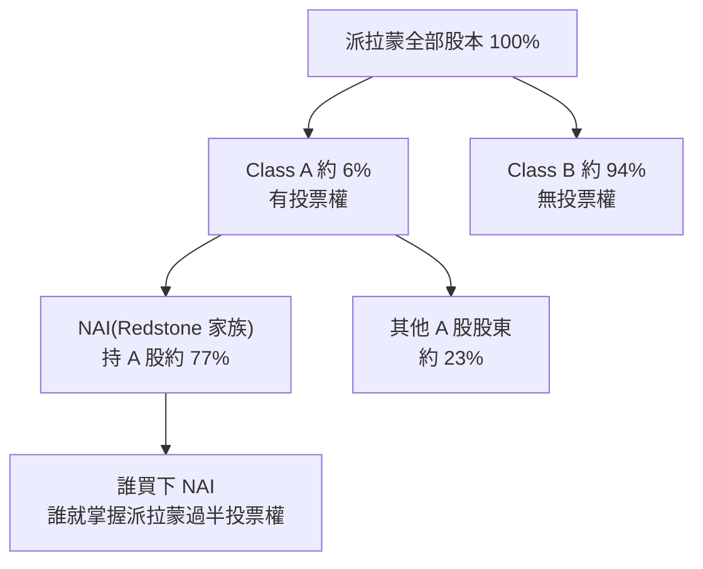
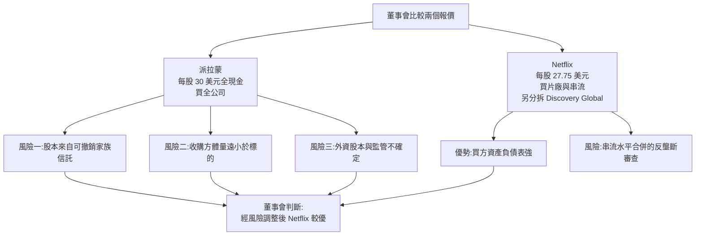
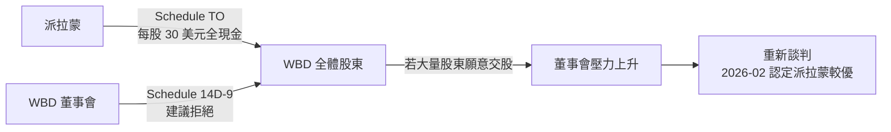
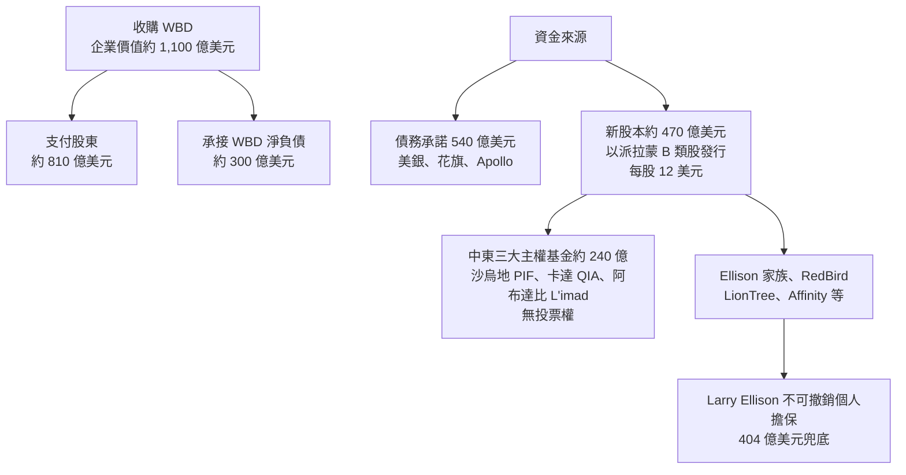

# 派拉蒙全現金收購華納兄弟:艾里森父子的「AB 股 + 上市殼」資本操作

> **主題分類**:投資 → 個股與產業研究(equity-research)/ 併購、公司治理、敵意收購
> **來源**:小Lin说〈史上最大现金收购案 富二代如何正确拼爹〉(YouTube,2026-10-09 上傳,約 14 分鐘),**依官方中文字幕整理**;關鍵數字另以 SEC 文件、公司新聞稿與主流媒體交叉核實(見文末「核實總表」與「來源」)
> **整理日期**:2026-10-10
> 📌 **立場**:本片字幕未見業配段落;影片為知識型評論,作者對川普與政府角色帶有明顯的敘事詮釋,並自承對話橋段「我有點過度演繹」。
> ⚠️ **非投資建議**:本文僅為公司金融與併購機制的學習整理,不構成任何買賣建議。

---

## 一、一句話總結

David Ellison(甲骨文創辦人 Larry Ellison 之子)分兩步走:**2025 年 8 月**先用約 84 億美元,透過買下 Redstone 家族控股公司 National Amusements(NAI)拿下派拉蒙(Paramount)100% 投票權與約 70% 股權;接著以「保留上市地位的派拉蒙」為融資平台,經過與 Netflix、Comcast 的競價、敵意公開收購、父親 404 億美元不可撤銷個人擔保等攻防,**2026 年 2 月 27 日**簽下以每股 31 美元全現金收購華納兄弟探索(WBD)的合約(股權價值約 810 億、企業價值約 1,100 億美元),並於 **2026 年 10 月 6 日**完成交割,合併後公司更名 Skydance、在紐約證交所以 SKYD 交易,WBD 自 Nasdaq 下市。

```mermaid
flowchart LR
    A["2024-07<br/>Skydance 與派拉蒙<br/>簽合併協議"] --> B["2025-08-07<br/>Skydance 完成<br/>派拉蒙合併"]
    B --> C["2025-09 至 10<br/>私下報價 19、22、23.5 美元<br/>均遭 WBD 拒絕"]
    C --> D["2025-11 至 12<br/>WBD 啟動出售程序<br/>Netflix、Comcast、派拉蒙競價"]
    D --> E["2025-12-05<br/>WBD 與 Netflix 簽約<br/>每股 27.75 美元"]
    E --> F["2025-12-08<br/>派拉蒙發動敵意收購<br/>每股 30 美元全現金"]
    F --> G["2025-12-22<br/>Larry Ellison<br/>404 億美元不可撤銷個人擔保"]
    G --> H["2026-02-26<br/>WBD 董事會認定<br/>派拉蒙方案較優"]
    H --> I["2026-02-27<br/>簽約每股 31 美元<br/>Netflix 退出"]
    I --> J["2026-10-06<br/>交割完成<br/>WBD 下市、改名 Skydance"]
```

---

## 二、第一步:用 AB 股結構「便宜地」拿下派拉蒙

### 2.1 派拉蒙的雙層股權

- 派拉蒙(前身 Paramount Global)有兩類普通股:**Class A 有投票權**(一股一票),**Class B 無投票權**,兩者經濟權益相同(都分紅)。
- 2024 年前後約 4,070 萬股 A 股、約 6.08 億股 B 股 → **A 股只占總股數約 6%**,卻握有 100% 投票權。
- Redstone 家族的 NAI 持有約 **77.4% 的 A 股**,但只占全部股本約 9.7%。

換句話說:**掌握不到一成的經濟權益,就能控制整家公司。** 影片說「掌握 6% 的一半多,也就是 3%,就能控制派拉蒙」,邏輯正確(A 股過半即過半票數)。

### 2.2 Skydance 怎麼「搞定姐姐」

| 項目 | 內容 |
|---|---|
| 第一步 | Skydance 投資人團(Ellison 家族 + RedBird Capital)以約 **24 億美元**(企業價值,其中股權約 17.5 億)買下 NAI |
| 第二步 | Skydance 與派拉蒙合併;向公眾股東支付約 45 億美元現金/股票(A 股每股 23 美元、B 股每股 15 美元可選現金),並注資約 15 億美元進派拉蒙資產負債表 |
| 訴訟保護 | 給予 NAI 股東、董監事訴訟補償(indemnification),最終上限 2 億美元 |
| 合計 | 媒體普遍報導約 80–84 億美元;約 60 億來自 Ellison 家族、約 20 餘億來自 RedBird 等盟友 |
| 結果 | 2025-08-07 完成;投資人團持有新派拉蒙 **100% A 股、約 70% 總股本** |

影片把 NAI 的價碼描述為「比市場價高 75%」——這個比例未能在原始文件中找到;但「Redstone 拿到的溢價遠高於 B 股小股東」確實是爭議焦點,Gabelli 旗下基金在 2025 年 8 月向德拉瓦衡平法院提起集體訴訟,指控受託義務違反。

### 2.3 為什麼不買到 100%、讓派拉蒙下市?

影片的核心論點:**刻意保留派拉蒙的上市公司身分(「殼」)**,讓它成為下一輪併購的融資平台:

1. **舉債**:以上市公司名義向銀行(美銀、花旗)與 Apollo 取得 540 億美元債務承諾,揭露透明、評等與債市通路都更成熟。
2. **發股**:以派拉蒙**增發 B 類股(無投票權)**的方式引入中東主權基金等外部股本——拿錢但不給票。
3. **控制權不稀釋**:Ellison 家族與 RedBird 仍持有 100% 有投票權股份。

> 這是作者的詮釋。實際上當初 70% 的持股比例也受合約設計影響(B 股股東可選現金或換股,現金總額有上限 43 億美元),不全然是「刻意留殼」的單一決定;但「上市平台 + 無表決權股本」確實是後來融資結構的關鍵。

---

## 三、第二步:華納兄弟爭奪戰

### 3.1 報價演進

| 日期 | 出價方 | 每股 | 對價組成 | 標的 |
|---|---|---|---|---|
| 2025-09-14 | 派拉蒙(私下) | 19 美元 | 約 60% 現金 | 全公司 |
| 2025-09-30 | 派拉蒙 | 22 美元 | 約 67% 現金 | 全公司 |
| 2025-10 中 | 派拉蒙 | 23.50 美元 | 約 80% 現金 | 全公司 |
| 2025-11-20 | 派拉蒙(第一輪) | 約 25.50 美元 | — | 全公司 |
| 2025-12-01 | 派拉蒙(第二輪) | 約 26.50 美元 | 全現金 | 全公司 |
| 2025-12-05 | **Netflix 簽約** | 27.75 美元 | 23.25 現金 + 約 4.50 股票(2026-01 改全現金) | 僅片廠 + HBO/HBO Max |
| 2025-12-08 | 派拉蒙敵意收購 | 30 美元 | 全現金 | 全公司 |
| 2026-02-27 | **派拉蒙簽約** | 31 美元 | 全現金(另有延遲交割的 ticking fee) | 全公司 |

影片把過程濃縮為「23.5 → 27.75(Netflix)→ 30」,略過了派拉蒙 25.50、26.50 兩輪標案。

### 3.2 為什麼董事會選了「價低、買少」的 Netflix?

WBD 董事會在 2025-12-17 的建議書與後續聲明中,核心理由是**交易確定性(certainty)**:

- **融資來源**:派拉蒙的股本承諾來自 Ellison「家族信託」,董事會指出「可撤銷信託不能取代有擔保的承諾」——若家族改變心意,信託資產理論上可撤走。
- **規模落差**:派拉蒙要用全現金買下整家公司(企業價值上千億),而它本身市值遠小於標的。
- **外資成分**:中東主權基金參與,可能引發外資審查疑慮(派拉蒙主張結構可避開 CFIUS)。
- **對照組**:Netflix 本身現金流與信用強,且只買片廠與串流,另將有線電視網(含 CNN)分拆為 Discovery Global 歸還股東。

### 3.3 敵意公開收購(hostile tender offer)怎麼運作

「敵意」指的是**對董事會敵意**,不是對股東:

1. 收購方繞過董事會,依美國證券法向 SEC 提交 Schedule TO,**直接向全體股東公開要約**:「在某截止日前把股票交給我,我付每股 30 美元現金」。
2. 要約通常附帶條件:最低接受比例、監管核准、標的不得與第三方完成交易等。
3. 目標公司董事會必須在 10 個營業日內以 Schedule 14D-9 表態(本案 WBD 建議股東拒絕)。
4. 收購方可同時徵求委託書(本案派拉蒙亦向 SEC 提交 DFAN14A 等徵求文件),威脅在股東會改選董事。
5. 實際效果常是**施壓董事會回到談判桌**,而不是真的靠要約完成收購——本案正是如此。

### 3.4 破局兩招:補擔保、打對手

**第一招:把「家族」換成「本人」——404 億美元不可撤銷個人擔保**

2025-12-22 修正要約:
- Larry Ellison 以**個人名義**、**不可撤銷**地擔保 404 億美元的股本融資,以及對派拉蒙的任何損害賠償請求。
- 承諾交易期間不撤銷家族信託、不「不利移轉」信託資產。
- 反向分手費提高到 58 億美元(與 Netflix 對齊);要約截止日延至 2026-01-21。

當時甲骨文股價已從 2025 年 9 月高點(盤中約 345.72 美元)回落約四成,影片指出這個擔保對老 Ellison 而言是相當沉重的承諾。2026 年 1 月底跌幅更擴大到逾五成(Bloomberg)。

**第二招:政治與監管面(以下為各方說法,不做真假判斷)**

| 說法 | 出處 | 回應/反面觀點 |
|---|---|---|
| Larry Ellison 在 Netflix 交易宣布後私下致電川普表達疑慮 | **《華爾街日報》報導**(經 The New Republic 等轉述) | 影片中的對話內容為作者戲劇化重現,作者自承「這不是原話,我有點過度演繹」 |
| David Ellison 向政府官員保證入主後會大改 CNN | WSJ 報導 | 派拉蒙表示除了「以真相為本的新聞」目標外,未對任何政府機關就 CNN 做出承諾 |
| 川普 2025-12-07 稱 Netflix 合併後的市占「可能是個問題」,並說自己「會參與決定」 | 川普公開發言 | 2026-02 川普改稱「兩邊都打給我,但我決定不該介入」;Netflix 執行長 Sarandos 表示不想「過度解讀」 |
| 白宮高層對 Netflix 方案持「嚴厲批評」 | CNBC 引述政府高層 | — |
| 司法部 2026-01 對 Netflix 方案發出第二次資料要求(second request) | WBD 揭露 | **司法部也在 2025-12-23 對派拉蒙發出 second request**;派拉蒙 2026-02-09 完成回覆,HSR 等待期於 2026-02-19 屆滿 |
| 司法部高層繞過基層律師核准 | Variety、Semafor 報導 | 司法部長 Todd Blanche 承認「參與了決定」 |

**懷疑「政府拉偏架」敘事的觀點**:
- Netflix + HBO Max 是串流市場的水平合併,反壟斷疑慮本來就較大;Netflix 案剛宣布時,民主黨參議員 Elizabeth Warren 也稱其為「反壟斷噩夢」。
- 派拉蒙同樣接受了 second request,並非單方面放行。
- 歐盟(附條件)、英國(附承諾)、澳洲、墨西哥等約 68 個司法管轄區獨立審查並核准。

**懷疑「審查很順利」敘事的觀點**:
- 加州等 12 州檢察長 2026-07-13 提告阻止合併,法院 7-20 發出暫時限制令;美國編劇工會(WGA)亦提告。
- 最終以 5 年期同意令(consent decree)和解(2026-09-21 宣布、09-30 核准),反對團體批評條件「無法執行」。
- 參議員 Cory Booker 等國會議員要求說明與政府的溝通往來。

### 3.5 終局

- 2026-02-17:WBD 拒絕 30 美元方案,但給派拉蒙 7 天提出「最佳且最終」報價;派拉蒙口頭表示至少 31 美元。
- 2026-02-26:WBD 董事會認定派拉蒙方案為「更優提案」;Netflix 宣布不跟進。
- 2026-02-27:簽約。每股 31 美元全現金,股權價值約 810 億美元(10-Q 載 809 億),企業價值約 1,100 億美元;派拉蒙代付 Netflix 28 億美元分手費;若 2026-09-30 前未交割,每季每股加付 0.25 美元 ticking fee;監管封殺時的反向分手費 70 億美元。
- 2026-04-23:WBD 股東會通過。
- 2026-08-14:派拉蒙宣布已取得 68 國監管許可,僅剩州政府訴訟。
- 2026-10-06:交割完成,WBD 股東每股實收 31.01666668 美元(含按日計的 ticking fee),WBD 自 Nasdaq 下市;合併公司更名 Skydance,於 NYSE 以 SKYD 交易。

---

## 四、錢從哪裡來:融資結構

重點:
- **股本雖大,但投票權不外流**:外部投資人拿的是無表決權 B 股,放棄董事席次等治理權;Ellison 家族與 RedBird 保持 100% 投票權。派拉蒙曾表示合併後外資持股可達約 49.5%,但無投票權。
- **為什麼要上市殼**:同樣的錢若投進一家私人公司,外資審查、銀行授信與退出機制都更複雜;上市公司讓外部股本有流動性與揭露保障。
- 影片稱「老爹出 100 多億」,原始文件未拆分各方金額,屬未能核實。

---

## 五、應用案例

### 案例 1:看懂雙層股權,先問「誰握有票」

情境:你持有某公司 B 股,新聞說「大股東以 75% 溢價把持股賣給新買家」。
- **步驟一**:查 10-K 封面與「Description of Securities」,看各類股的投票權與股數。派拉蒙例:A 股約 4,070 萬股、B 股約 6.08 億股 → A 股僅約 6%。
- **步驟二**:算控制門檻 = A 股過半 ≈ 全部股本約 3%。這代表「控制權溢價」可以集中支付給極少數人。
- **步驟三**:比較 A、B 股的對價。派拉蒙案 A 股每股 23 美元(溢價約 28%)、B 股 15 美元(溢價約 48%),但 NAI 層級的交易條件另計——小股東應關注是否有集體訴訟(本案有 Gabelli 訴訟)。
- **教訓**:持有無投票權股,等於把公司命運交給握票的人;估值上通常要給「治理折價」。

### 案例 2:判斷一份收購報價的「融資確定性」

情境:兩份報價,A 每股 30 美元全現金,B 每股 27.75 美元。用以下檢查表打分:

| 檢查項 | 派拉蒙(2025-12-08 版) | 派拉蒙(2025-12-22 版) | Netflix |
|---|---|---|---|
| 債務是否已有銀行「承諾函」 | 有(540 億) | 有 | 有 |
| 股本由誰兜底 | 可撤銷家族信託 | **個人不可撤銷擔保 404 億** | 自身資產負債表 |
| 反向分手費 | 較低 | 58 億 | 58 億 |
| 外資/監管不確定性 | 中東主權基金 | 同左 | 串流水平合併審查 |

把「報價 × 成交機率」做粗估:若董事會認為 A 成交機率 75%、B 為 90%,則 30 × 0.75 = 22.5,27.75 × 0.9 ≈ 25.0,B 較優。12-22 的擔保把 A 的成交機率往上推,天平就翻轉了——這就是為什麼「錢拿得出來」比「價格高」更重要。(數字為教學假設)

### 案例 3:併購套利(merger arbitrage)價差怎麼讀

情境(**假設數字**):簽約後 WBD 股價 28.00 美元,收購價 31 美元,預計 7 個月後交割,若交易破局股價可能跌回 20 美元。
- 價差 = 31 − 28 = 3 美元(約 10.7%,年化約 18%)。
- 隱含成交機率 p:28 = p × 31 + (1 − p) × 20 → p ≈ 72.7%。
- 若你認為成交機率高於市場隱含的 72.7%(例如已有 68 國核准、只剩州政府訴訟),價差就「便宜」;反之則代表市場在為訴訟、外資審查等風險定價。
- 本案加碼細節:ticking fee(延遲交割每季多付 0.25 美元)會降低「拖延」對套利者的成本;反向分手費 70 億則讓買方更有動機完成交易。

### 案例 4:辨識「上市殼」的槓桿效果

情境:某家族控制一家中型上市公司,宣布要收購比自己大數倍的對手。
- 檢查它是否用**無投票權股**增資、是否有**外部主權基金或私募**以「純財務投資」身分進場、債務是否掛在上市公司層級。
- 若是,代表控制者以有限自有資金撐起大量外部資本——對控制者是槓桿放大,對普通股東則是**稀釋 + 負債上升**,要看合併後的槓桿目標(本案管理層訂 2029 年底淨槓桿 3.0 倍)與綜效(年化 60 億美元以上)是否可信。

---

## 六、核實總表

### ✅ 已核實

| 影片說法 | 核實結果 |
|---|---|
| 派拉蒙 A 股約 6%、B 股約 94%;A 有投票權、B 無 | 符合 Paramount Global 10-K 與股數(約 4,070 萬 vs 6.08 億) |
| Redstone(NAI)持有 A 股約 77% | 10-K:約 77.4% |
| 給 Redstone 約 24 億美元 | NAI 企業價值 24 億(股權約 17.5 億) |
| 幫忙承擔訴訟風險 | 給予訴訟補償,最終上限 2 億美元 |
| 2025 年 8 月完成;約 60 億來自 Ellison、合計約 84 億 | 2025-08-07 完成;媒體報導約 60 億來自 Ellison 家族,總額 80–84 億 |
| 拿下 100% 控制權與約 70% 股權 | 投資人團持 100% A 股、約 70% 總股本 |
| 2025 年 9 月起報價 19(六成現金)→ 22(67% 現金)→ 23.5(八成現金) | 與媒體報導及 Wikipedia 整理一致(第三次日期各來源為 10-13 或 10-19) |
| Netflix 每股 27.75 美元,只買影視與串流 | 2025-12-05 宣布,企業價值 827 億美元 |
| 惡意收購每股 30 美元全現金,可在 SEC 查到 | 2025-12-08 啟動,SEC 有 Schedule TO 文件 |
| 董事會質疑融資來源,選擇 Netflix | 2025-12-17 建議書以確定性為由 |
| 債務 540 億(銀行與私募) | 美銀、花旗、Apollo 共 540 億承諾 |
| 股本融資 400 多億 | 12 月版約 410 億,最終 470 億 |
| 三個中東主權基金約 240 億、無投票權 | PIF、QIA、L'imad 合計約 240 億,無表決權 |
| 12-22 新版要約、Larry Ellison 404 億美元不可撤銷個人擔保 | 一致 |
| 甲骨文較 9 月高點跌約 40% | 12 月初約跌 35–40%,12 月下旬約四成 |
| 川普稱 Netflix 方案「可能是個問題」 | 2025-12-07 公開發言 |
| 1 月司法部對 Netflix 方案發出深度反壟斷問詢 | 2026-01-16 second request |
| 2 月 26 日董事會認定派拉蒙較優,Netflix 放棄,隔天官宣 | 2026-02-26 認定、02-27 簽約 |
| 31 美元、付股東約 810 億、承接約 300 億債務,全現金 | 10-Q:股權價值約 809 億;企業價值約 1,100 億 |
| 68 個國家監管批准 | 派拉蒙 2026-08-14 新聞稿 |
| 華納將從 Nasdaq 下市 | 2026-10-06 已下市 |
| 以派拉蒙增發 B 類股融資 | 新股本以 B 類股、每股 12 美元發行 |

### ⚠️ 需修正

| 影片說法 | 修正 |
|---|---|
| 12 月 4 號華納接受 Netflix 的 offer | 公開宣布日為 **2025-12-05**(美東);董事會正式建議股東拒絕派拉蒙要約是 12-17 |
| 從 23.5 一路加到 27.75(Netflix),最後派拉蒙直接甩出 30 | 省略了派拉蒙 2025-11-20 約 25.50 美元、12-01 約 26.50 美元全現金兩輪標案 |
| 「交割完成後,華納將從納斯達克摘牌退市」(未來式) | 影片上傳(10-09)時交割**已於 2026-10-06 完成**,WBD 已下市,合併公司更名 Skydance、改在 NYSE 以 SKYD 交易 |
| 司法部反壟斷調查「秒過」、監管審核「異常順利」 | 司法部同樣於 2025-12-23 對派拉蒙發出 second request,HSR 等待期 2026-02-19 才屆滿;司法部 2026-06 放行後,加州等 12 州 07-13 提告、法院發出暫時限制令,至 09-30 以同意令和解才排除障礙 |
| 只提司法部對 Netflix 發深度問詢,暗示偏袒 | 兩方都收到 second request;是否偏袒為各方爭議,無定論 |
| 擔保方是「埃里森家族和紅鳥資本」,問題在「家族」 | 方向正確;精確說是董事會質疑股本來自 Ellison **可撤銷信託**,12-22 改為 Larry Ellison 個人擔保並承諾不撤銷信託 |

### ℹ️ 未能核實

| 影片說法 | 說明 |
|---|---|
| 1,109 億美元總額 | 官方新聞稿與多數媒體寫「約 1,100 億」企業價值;1,109 億見於 Wikipedia 彙整,未在原始新聞稿找到 |
| 「史上最大現金收購案」、相當於微軟收購動視暴雪 + 馬斯克收購推特總和 | 兩案公開金額約 687 億與 440 億,量級相符;「史上最大」未另行查證 |
| Redstone 持股收購價「高出市場價 75%」 | 原始文件未見此比例;但 Redstone 溢價過高確為 Gabelli 訴訟爭點 |
| Larry Ellison 出資「100 多億」 | 文件未拆分各投資人金額 |
| 中東國家「承諾川普上萬億美元投資」導致投資好拉 | 屬作者推論;2025 年 5 月確有沙烏地、卡達、阿聯酋的大額投資承諾,但與本案因果關係無法證實 |
| 川普電話中的具體對話 | 僅有 WSJ 報導「致電表達疑慮」;影片對白為作者戲劇化重現 |
| 「刻意不買斷派拉蒙以保留上市殼」 | 作者詮釋;結構上確實發揮融資平台作用 |
| 派拉蒙市值不到 100 億、華納不到 200 億、「吞下四倍體量」 | 依時點而異,未逐一核對 |
| Larry Ellison 資產約 2,000 億美元、曾一度成為全球首富 | 富豪榜數字隨股價波動,未精確核對 |

---

## 七、延伸思考

1. **控制權溢價該給誰?** AB 股結構讓「賣控制權」與「賣經濟權益」脫鉤,小股東的保護主要靠訴訟與揭露。
2. **報價 ≠ 價值**:董事會的受託義務是「風險調整後」對股東最佳,不只是最高價;買方能做的是用擔保、分手費、ticking fee 把確定性補足。
3. **政治風險是併購定價的一部分**:無論對「政府偏袒」的指控是否屬實,監管路徑的不確定性(州政府訴訟、外資審查、媒體所有權)都會反映在套利價差裡。

> ⚠️ **非投資建議**:本文僅供學習公司金融與併購機制,所有涉及政治與監管的指控均列明出處與回應,不代表本文立場;投資決策請自行研究並承擔風險。

---

## 來源

- [小Lin说〈史上最大现金收购案 富二代如何正确拼爹〉(YouTube,官方中文字幕)](https://www.youtube.com/watch?v=wu0zS1AuI_E)
- [SEC:Paramount Skydance Form 10-Q(2026 年第一季,WBD 合併協議與股權價值)](https://www.sec.gov/Archives/edgar/data/0002041610/000204161026000026/psky-20260331.htm)
- [SEC:Paramount Skydance Form 10-K(FY2025,Skydance 合併與 NAI 訴訟補償)](https://www.sec.gov/Archives/edgar/data/2041610/000204161026000011/psky-20251231.htm)
- [SEC:Paramount Global Form 10-K(FY2023,A/B 股與 NAI 持股 77.4%)](https://www.sec.gov/Archives/edgar/data/813828/000081382824000007/para-20231231.htm)
- [SEC:派拉蒙對 WBD 公開收購要約文件 Schedule TO(2025-12)](https://www.sec.gov/Archives/edgar/data/1437107/000119312525310708/d92876dex99a5a.htm)
- [SEC:WBD 8-K 附件(交割相關)](https://www.sec.gov/Archives/edgar/data/1437107/000143710726000018/exhibit991.htm)
- [Skydance 新聞稿:Paramount Completes Acquisition of Warner Bros. Discovery(2026-10-06)](https://www.skydance.com/news/press/paramount-completes-acquisition-of-warner-bros-discovery-creating-a-new-global-entertainment-leader-skydance)
- [Paramount 新聞稿:Affirms Commitment to Superior $30 Per Share All-Cash Offer](https://www.paramount.com/press/paramount-affirms-commitment-to-superior-30-per-share-all-cash-offer-for-warner-bros-discovery)
- [Paramount IR:Skydance Media and Paramount Global Sign Definitive Agreement(2024-07)](https://ir.paramount.com/news-releases/news-release-details/skydance-media-and-paramount-global-sign-definitive-agreement)
- [Netflix:Netflix Welcomes WBD Board Recommendation(2025-12-17)](https://about.netflix.com/news/netflix-welcomes-wbd-board-recommendation)
- [Placera(新聞稿轉載):Paramount Skydance 取得近 70 國監管許可(2026-08-14)](https://www.placera.se/pressmeddelanden/paramount-skydance-satisfies-all-regulatory-conditions-under-the-merger-agreement-to-close-warner-bros-discovery-acquisition-securing-clearances-in-nearly-70-countries-worldwide-20260814)
- [Bloomberg:Paramount Closes Warner Bros. Merger(2026-10-06)](https://www.bloomberg.com/news/articles/2026-10-06/paramount-closes-warner-bros-merger-in-historic-hollywood-deal)
- [Bloomberg:Warner Bros. Is Said to Rebuff Paramount Takeover Approach(2025-10-12)](https://www.bloomberg.com/news/articles/2025-10-12/warner-bros-is-said-to-rebuff-paramount-takeover-approach)
- [Bloomberg:Warner Bros. Rejects Latest Paramount Bid(2026-01-07)](https://www.bloomberg.com/news/articles/2026-01-07/warner-bros-says-amended-paramount-offer-is-inadequate)
- [Bloomberg:Oracle's Value Is Cut in Half From 2025 Peak(2026-01-29)](https://www.bloomberg.com/news/articles/2026-01-29/oracle-shares-tumble-50-from-record-as-ai-caution-intensifies)
- [Deadline:Paramount-Warner Bros Discovery Merger Closes, Creating Skydance](https://deadline.com/2026/10/skydance-merger-paramount-warner-bros-discovery-1237147750/)
- [Variety:Paramount Launches Hostile Takeover Bid at $30 per Share](https://variety.com/2025/tv/news/paramount-hostile-takeover-bid-warner-bros-discovery-1236603175/)
- [TheWrap:Larry Ellison Makes Irrevocable Personal Guarantee of $40.4 Billion](https://www.thewrap.com/industry-news/business/larry-ellison-personal-guarantee-paramount-amended-warner-bros-discovery-bid/)
- [TheWrap:Paramount Confirms Middle East Sovereign Wealth Fund Investment](https://www.thewrap.com/industry-news/deals-ma/paramount-warner-bros-deal-middle-east-sovereign-wealth-funds-lion-tree-equity-investments/)
- [TheWrap:Paramount Says WBD Takeover Bid Has Cleared a US Antitrust Hurdle(HSR 等待期)](https://www.thewrap.com/industry-news/deals-ma/paramount-warner-bros-takeover-bid-doj-hsr-waiting-period-expiration/)
- [TheWrap:Larry Ellison and White House Discussed Axing CNN Hosts(報導)](https://www.thewrap.com/larry-ellison-white-house-cnn-hosts-paramount-wbd/)
- [TheWrap:Mario Gabelli Asks Delaware Court to Order Paramount to Turn Over Skydance Deal Docs](https://thewrap.com/paramount-skydance-merger-mario-gabelli-complaint)
- [The New Republic:轉述 WSJ 關於 Ellison 與川普、CNN 的報導](https://newrepublic.com/post/204166/paramount-ceo-trump-secret-promise-cnn-warner-bros)
- [ABC17/CNN:Trump met with David Ellison days before saying he's not involved](https://abc17news.com/money/cnn-business-consumer/2026/02/12/trump-met-with-david-ellison-days-before-saying-hes-not-involved-in-paramounts-netflix-battle/)
- [NBC News:Warner Bros. Discovery signs merger agreement with Paramount Skydance](https://www.nbcnews.com/business/media/warner-bros-discovery-signs-merger-agreement-paramount-skydance-rcna261035)
- [Cleary Gottlieb:Paramount Skydance's $110 Billion Acquisition of Warner Bros. Discovery](https://www.clearygottlieb.com/news-and-insights/news-listing/paramount-skydances-110-billion-acquisition-of-warner-bros-discovery)
- [Lexpert:Skydance Media and Paramount Global complete US$8B merger](https://www.lexpert.ca/big-deals/skydance-media-and-paramount-global-complete-us8b-merger/394273)
- [Cord Cutters News:Paramount Completes WBD Acquisition, Launches Combined Company as Skydance](https://cordcuttersnews.com/its-done-paramount-completes-warner-bros-discovery-acquisition-launches-combined-company-as-skydance/)
- [Wikipedia:Proposed acquisition of Warner Bros. Discovery(時間軸彙整)](https://en.wikipedia.org/wiki/Proposed_acquisition_of_Warner_Bros._Discovery)
