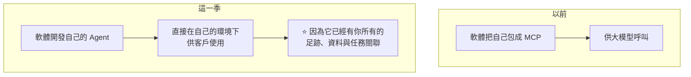
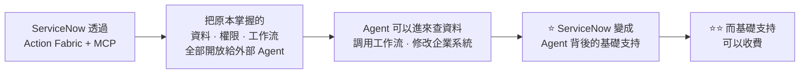
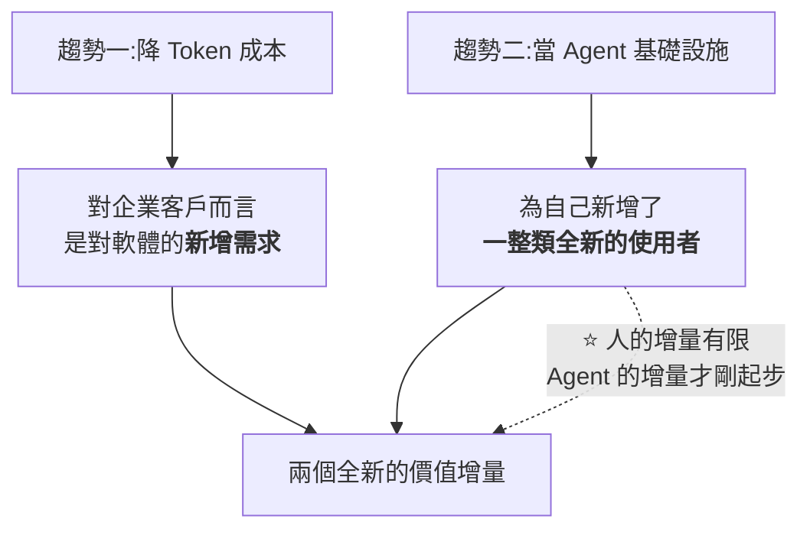

# 軟體股為何集體大漲:從「被 AI 顛覆」到「幫 AI 省 Token」與「當 Agent 的基礎設施」

**主題分類:** 投資 / 個股與產業研究 —— 軟體(SaaS)板塊與 AI 的關係轉向
**來源影片:** YouTube〈为何软件股集体大涨?AI新风口浮出水面!哪些公司能做实反转?〉(美投君 / 美投讲美股,2026-09-06,約 22 分鐘,**無字幕、Whisper 轉錄**)
**整理日期:** 2026-09-07

> ⚠️⚠️ **非投資建議。** 本文為對一支公開影片的整理與查證,不構成任何買賣建議。
> 文中個股僅為說明產業趨勢之用,**作者本人在片中亦明確表示「這可不是薦股」**。

> ⚠️ **立場揭露:** 該頻道為「美投 Pro」付費投研服務的自有媒體,**影片開頭與結尾均為該服務的推廣**,
> 且作者自述在美投 Pro 中對 Snowflake 維持 strong buy 評級。**本文只整理其公開的分析框架,不轉述付費內容。**

> 📎 相關筆記:[[ai-software-stocks-usage-based]](用量計費那條線)、
> [[ai-application-layer-4-trends-earnings]]、[[ai-capital-web-factions-and-mutual-binding]]

---

## 0. 一句話總結

> **半年前軟體股還是「被 AI 顛覆」的重災區;這一季財報季,IGV 五週漲逾兩成。
> 轉折點是兩個新角色:一是幫企業「降 Token 成本」,二是把自己變成「AI Agent 的基礎設施」。**

⭐ 而這兩件事表面上矛盾 —— 前者是**跟大模型掰手腕**,後者是**向大模型低頭** ——
**但同時發生的三家公司財報後全部大漲。** 本文的重點就是解釋這個矛盾。

---

## 1. 背景:半年內的情緒反轉

| 時間 | 軟體股的處境 |
|---|---|
| **約半年前** | ⚠️ **整個美股表現最糟的板塊之一** —— 「AI 顛覆軟體」的擔憂甚囂塵上,**幾乎遭遇無差別掃射** |
| **本次財報季** | ⭐ **表現最好的板塊**。代表性 ETF **IGV** 大漲,Salesforce、Shopify、Atlassian、Snowflake 等**動輒 20–30% 的單日漲幅** |

📌 **核實修正:** 影片說「IGV 一個月上漲近 30%」——
公開資料為 **截至 2026-09-01,IGV 五週上漲約 24.5%**。**方向一致,幅度略高於實際。**

---

## 2. ⭐⭐⭐ 趨勢一:軟體公司幫你「降 Token 成本」

### 2.1 前提:算力平靜(算力短缺)是長期問題

作者三個月前就講過的判斷,這一季被驗證:

> **AI 的算力短缺不會因為某幾家半導體公司的發展、或大模型的進步就徹底解決。**
>
> ⭐ 而一旦短缺長期持續,它帶來的**就不只是「算力需求」這麼簡單**,
> 而是**一個持續需要被解決的問題** —— **誰能系統性地降低 Token 成本,誰就創造巨大的商業價值。**

⭐ 他原本的論證是:**Agent 執行任務之所以吃掉那麼多 token,是因為很多任務都得從零開始跑、
不斷打磨才能交付;而一旦流程固定下來,下次執行相同任務的 token 消耗就會大幅降低。**
**而軟體公司最擅長的,正是「根據應用場景定義流程」。**

### 2.2 ⭐⭐ 手法一:把 Agent 內建進自己的環境(靠 Context 取勝)

**影片舉的例子(Atlassian)很好懂:**

> 你想知道「這個專案為什麼會延期」——
>
> | 在外部大模型問 | 在 Atlassian 自己的 Agent 問 |
> |---|---|
> | ⚠️ 得先去搜 Atlassian 裡**所有**資訊、搞清楚關聯、再判斷哪些相關 | ⭐ **它已經有你所有的足跡,更清楚任務之間的關聯**,可以直接找到關鍵資訊 |
> | **等於在大海撈針** | 直接給答案 |

📌 **核實:這組數字完全屬實,且來自 Atlassian 官方 Q4 FY26 股東信** ——

> **以 Teamwork Graph 做 grounding 的 Agent,回答準確率最高提高 44%,同時 token 消耗最高減少 48%。**

⭐ **補充(影片未提):Teamwork Graph 涵蓋超過 2,000 億個物件與連結。**
另外 CFO 提到,使用 Teamwork Collection 的客戶,**每個實例的付費席位是單獨用 Jira / Confluence 客戶的 4–5 倍。**

⚠️ 影片說「財報後股價大漲 35%」—— **屬實**(Atlassian 財報後股價跳漲 35%)。

⭐ 影片強調這個優勢**不是 Atlassian 獨有** —— HubSpot、MongoDB、Workday、ServiceNow 本季都展現了類似能力。
**這是軟體公司相對於大模型一個很重要的壁壘。**

### 2.3 ⭐⭐ 手法二:模型中立(Model Neutral Platform)

**做法:** 軟體公司把自己建成一個**多模型平台**,使用者依不同需求呼叫最適合該任務的模型,降低整體 Token 成本。

| 公司 | 本季揭露 |
|---|---|
| **Workday** | AI 功能 **Workday Contract Intelligence** 已嵌入多個模型組合 |
| **Snowflake** | 推出 **Cortex AI Gateway** —— 可依任務的**品質、速度、成本偏好**自動選擇合適模型 |
| **Microsoft** | 最早做這件事(Copilot);自稱融合了 **1.1 萬個**模型 |

📌 **核實:Cortex AI Gateway 屬實**,其**動態模型路由(dynamic model routing)**讓企業定義
**核准使用的模型**以及要優先的取捨(**成本、效能、延遲**),與影片描述一致。
⚠️ **但公開資料稱該路由功能「即將進入 private preview」** —— **影片講得比實際進度稍前面一點。**

> ⭐⭐ **這一段最有價值的不是功能,是理由:**
>
> **「更重要的不是模型的個數,而是軟體公司可能比你更了解你自己的需求。」**
> 因為長期深耕垂直領域,**它比你更清楚一個資料分析任務該怎麼執行**,
> 也就更能幫你調用不同模型去省 token —— **而這是你自己在大模型上很難做到的。**

---

## 3. ⭐⭐⭐ 趨勢二:把自己變成 AI Agent 的基礎設施

這一節跟上一節**方向完全相反**,而這正是重點。

**三段管理層發言串起來,趨勢就出現了:**

| 公司 | 管理層說法 |
|---|---|
| **Salesforce** | 未來會**主動進入 Claude 與 ChatGPT 平台**;**「我們可以不再占有使用者的工作介面,你們只需要在那裡完成工作就可以了。」** |
| **Shopify** | 不管未來交易是由人完成還是由 Agent 完成,**Shopify 都希望自己能運行在最底層** |
| **Snowflake** | 希望成為**企業 Agent 的控制中樞** —— 幫企業把資料、模型與工作流連接起來 |

> ⚠️ **乍看是軟體公司向大模型低頭,從「需求的主導者」變成「大模型的服務者」。**
> ⭐ **但弔詭的是:這三家財報後無一例外全部暴漲。**

### 3.1 為什麼低頭反而換來更高的收入:ServiceNow 的例子

**新的計費單位叫 Assist:**

> **Agent 每執行一次工作流就消耗一個 Assist,任務越複雜消耗越多。**

⭐ **關鍵在於:席位數沒有減少。**

| 以前 | 現在 |
|---|---|
| 主要靠給員工賣席位 | ⭐ **席位數沒減少,在此基礎上再增加 Assist 收入** |

📌 **核實:Action Fabric 與 Assist 計費屬實。** 官方資料顯示 **MCP Server 已 GA,包含在每個 Now Assist
與 AI Native SKU 中,而 headless actions 消耗的正是客戶原本就在用的同一種 Assist 額度**,形成統一的用量模型。
⭐ 補充:Action Fabric 有三個組件 —— **MCP Server Console**(對外開放能力)、
**MCP Client**(讓自家 Agent 伸向外部系統)、**A2A**(兩個 Agent 對等協作)。

⚠️ **影片說「管理層強調有 50% 的新增業務採用非席位定價」—— 本文未能核實,請自行回查財報。**

⭐ 影片說類似情況也出現在 Salesforce、Snowflake、Workday 身上,**思路與結果基本相同**。

### 3.2 為什麼使用者沒有離開軟體

> **這些軟體公司雖然把資料開放給了大模型,但資料背後的「工作流、權限、商業邏輯」還是它們自己把控的。**

| 軟體公司握著什麼 | 為什麼大模型不接手 |
|---|---|
| 多年累積的**私有資料與流程管理** | — |
| **責任機制、權限、安全**這些需要人處理的具體事項 | ⭐ **大模型沒有能力,也沒有意願**去接管這些細枝末節的垂直流程 |

> ⭐⭐ **「但它們卻可以在此基礎之上去提升效率 —— 所以最好的辦法是合作,而不是競爭。」**

---

## 4. ⭐⭐ 把兩個趨勢合起來:那個矛盾的解答

⭐ **關鍵的一句:**

> **「軟體公司從此不只是為『人』服務、收固定的席位費,而是開始為『AI Agent』服務、收用量費。
> 人的增量是有限的,但 Agent 的增量才剛起步。」**

### ⭐⭐ 未來的分工:不是誰取代誰

| | 誰主導 | 負責什麼任務 |
|---|---|---|
| **軟體裡的 Agent** | **軟體主導**,負責調用不同的模型 | 非常垂直、**需要很強上下文**、**對 token 成本敏感**的任務 |
| **大模型** | **大模型主導**,負責調動不同的軟體 | 需要**跨系統、跨軟體**的大型任務,或**對 token 成本不敏感**的任務 |

> ⭐ 作者的兩句收束都值得記:
> **「大模型並沒有那麼無所不能 —— 長期來看大部分大模型都是商品屬性,沒有什麼議價權;
> 只有少數頂尖模型才能建立自己的生態、掌握入口優勢。」**
> **「而軟體股也沒有那麼弱不禁風,它們有自己的不可替代性。」**

---

## 5. ⚠️⚠️ 但威脅沒有消失:板塊將進入強分化

**這一節是全片最該記住的風險提醒,作者說得很清楚:**

> ⚠️ **「我們可不是說 AI 對軟體股的威脅就此徹底打消了,而是說我們得辯證地看這件事。」**

| 如果你的公司… | 結果 |
|---|---|
| ⚠️ **無法撬動上下文優勢、自己用起 Agent** | AI 顛覆論仍然對你持續有效 |
| ⚠️ **沒有不可替代的底層壁壘,不敢把自己暴露給大模型** | **AI 仍可以取代你、衝擊你,把你的入口徹底奪走,讓你喪失議價權** |

> ⭐⭐ **「AI 促進和 AI 威脅同時存在 ⇒ 軟體板塊將進入一個強分化的階段:
> 好公司受益於 AI 獲得更高價值,差公司在 AI 衝擊下慢慢出局。」**

### ⭐ 誰比較可能受益(判準,非個股推薦)

| ✅ 較可能受益 | ⚠️ 較難受益、更易被威脅 |
|---|---|
| **掌握企業級的任務入口** | **C 端軟體** |
| **有完整的上下文與執行權限** | **不依賴底層工作流或生態做壁壘** |
| **擁有足夠深的工作流** | ⚠️ **而是靠「表層的使用體驗」做壁壘** |

⭐ 影片點名符合條件的例子包括 **ServiceNow、Salesforce、Snowflake** 等 ——
⚠️ **但他當場聲明「這可不是薦股,只是單純分析在 AI 趨勢下有機會受益的公司」。**

---

## 6. ⭐⭐⭐ 應用案例:兩個可複用的思考框架(本文最耐用的部分)

作者用 Snowflake 復盤時提出的兩點,**脫離個股也成立**。

### ① ⚠️ 「AI 威脅論」的常見謬誤:拿現在的軟體跟未來的 AI 比

> **「如果你拿『現在的軟體、不做任何變化』去跟『未來的 AI』比,
> 那幾乎沒有任何一個軟體能抵抗得了。」**
>
> ⭐ **但軟體公司也是會發展的。應該拿『未來的軟體』跟『未來的 AI』做對比才合理。**

**他相信軟體能發展的理由是「人」:**

> **軟體公司本身擁有最前沿的技術人才,它們比任何人都了解 AI 威脅,也比任何人都有能力針對 AI 做出改變。**
>
> ⭐ **「比起相信『未來 AI 時代所有東西都會被顛覆』,我更願意相信『優秀的人有能力應對變化』。」**

⭐ **講具體一點的版本:未來軟體形態被 AI 顛覆的風險,遠比現在的軟體形態被顛覆的風險低得多 ——
而市場現在卻在以後者當 benchmark,這就顯然高估了顛覆風險。**

⚠️ **這個框架要小心用**:它同樣可以拿來合理化任何一家不會改變的公司。
**它的成立條件是「這家公司真的有在改變」,而那需要證據,不是信念。**
📌 影片自己給的證據是:**Snowflake 新任 CEO 技術出身、曾專門做過 AI 產品**
(核實:現任 CEO 為 **Sridhar Ramaswamy**),且資料分析本身就是 AI 最容易落地的領域之一。

### ② ⭐⭐ 分析師的盲點:企業決策者不是只看賺不賺錢

**市場的普遍擔憂是:企業預算有限,為什麼會單純因為 AI 就多付錢?**

> ⭐ 作者的反駁很有意思,而且他同時具備兩個身份(小公司 CEO + 十多年經驗的分析師):
>
> **「分析師最關注的是收入和利潤,他們會以為企業決策者也是這麼思考問題的 —— 但實際並非如此。
> 企業決策者不會單純因為『能不能賺錢』來決策,而是因為『有沒有真正帶來價值』來決策。」**

**他的自述:**

> **「如果一個新工具能讓我做以前想做卻做不到的事、能讓我嘗試更多可能性 ——
> 哪怕只是讓我了解『做什麼事它不行』—— 即便它無法幫我增加收入,我也會非常願意花錢嘗試。」**

⭐ 而資料分析的需求**沒有邊界**:
**「你不會說我今天分析 100 萬 token 就夠了。你一定能找到新的資料分析需求 —— 就算你找不到,AI 也能幫你找到。」**

> ⭐⭐ **兩點合起來的通則(可套用到大部分軟體股):**
> **AI 威脅確實存在,但可能被高估了;
> 企業預算確實是限制,但軟體股應用 AI 所撬動的增量,也可能被低估了。**

### ③ 怎麼把這套框架用在自己身上

| 步驟 | 做法 |
|---|---|
| **①** | **選一個你真正了解的垂直領域**(作者選資料分析,是因為他懂) |
| **②** | 問:這個領域的軟體**有沒有「上下文 + 執行權限 + 深工作流」三件套**? |
| **③** | 問:它**有沒有實際在改變**(推出自家 Agent?開放給外部 Agent?有沒有新的計費單位?) |
| **④** | ⚠️ 分開看:**「它的入口會不會被奪走」與「它的增量有沒有被低估」是兩個獨立問題** |

---

## 7. 核實狀態

⚠️ **Whisper 對數字與人名容易出錯,以下逐項標示。**

### ✅ 已核實(數字準確)

| 影片說法 | 核實結果 |
|---|---|
| ⭐ **Atlassian:以 Teamwork Graph grounding 的 Agent,準確率最高 +44%、token 消耗最高 −48%** | **完全屬實**,為官方 Q4 FY26 股東信數字 |
| Atlassian 財報後股價大漲 35% | **屬實** |
| **Salesforce 與 Anthropic 的深度合作** | **屬實** —— 2026-08-27 宣布合作開發 **Claudeforce**,當日股價 **+22.6%** |
| **Snowflake Cortex AI Gateway**,依品質/速度/成本自動選模型 | **屬實**(動態模型路由,可定義核准模型與取捨) |
| **ServiceNow 的 Action Fabric + MCP,以 Assist 為計費單位** | **屬實** —— MCP Server 已 GA、包含在每個 Now Assist 與 AI Native SKU;headless actions 消耗同一種 Assist 額度 |
| Snowflake 新任 CEO 技術出身 | **屬實** —— 現任 CEO **Sridhar Ramaswamy**(轉錄中的「Rama」) |

### ⭐ 影片未提、值得補上的三點

1. **Atlassian 的 Teamwork Graph 涵蓋超過 2,000 億個物件與連結**;
   且使用 Teamwork Collection 的客戶,**每實例付費席位是單獨用 Jira / Confluence 的 4–5 倍**。
2. **Action Fabric 的三個組件**:MCP Server Console(對外開放)、MCP Client(伸向外部)、A2A(Agent 對等協作)。
3. ⭐ **Salesforce 執行長 Benioff 在同一場財報後公開說「SaaSpocalypse 是胡說八道」** ——
   這正好是本文 §5「威脅仍在但被高估」的產業版註腳。

### ⚠️ 需要修正 / 未能核實

| 影片說法 | 狀態 |
|---|---|
| **IGV「一個月上漲近 30%」** | ⚠️ **公開資料為「五週約 +24.5%」(截至 2026-09-01)** —— 方向對,幅度略誇大 |
| **Snowflake「距離低點已經翻了三倍」** | ⚠️ **公開資料為「近三個月漲逾一倍」** —— 起算點不同,**倍數請自行回查** |
| **ServiceNow「50% 新增業務採用非席位定價」** | ⚠️ **未能核實** |
| **Microsoft「融合了 1.1 萬個模型」** | ⚠️ **未能核實** |
| Cortex AI Gateway 的動態模型路由「本季推出」 | ⚠️ 公開資料稱**「即將進入 private preview」** —— **進度比影片講的稍晚** |
| HubSpot / MongoDB / Workday 本季的相關能力細節 | ⚠️ 未逐一核實 |

> ⚠️ **所有股價與財報數字均為影片轉述或本文查證當下的公開資料,會隨時間變動。
> 投資決策前請以 SEC 文件與公司官方 IR 為準。**

---

## 來源

- [为何软件股集体大涨?AI新风口浮出水面!哪些公司能做实反转? — 美投君 / 美投讲美股](https://www.youtube.com/watch?v=01s3YdYUCcU)(2026-09-06,約 22 分鐘)
- 核實用官方與外電:
  - [Our Q4 FY26 letter to shareholders — Atlassian](https://www.atlassian.com/blog/company-news/shareholder-letter-q4fy26)(44% / 48% 的一手來源)
  - [Atlassian Announces Fourth Quarter and Fiscal Year 2026 Results](https://www.businesswire.com/news/home/20260806396002/en/Atlassian-Announces-Fourth-Quarter-and-Fiscal-Year-2026-Results)
  - [ServiceNow opens its full system of action to every AI Agent in the enterprise — ServiceNow Newsroom](https://newsroom.servicenow.com/press-releases/details/2026/ServiceNow-opens-its-full-system-of-action-to-every-AI-Agent-in-the-enterprise/default.aspx)
  - [ServiceNow Action Fabric — 官方產品頁](https://www.servicenow.com/platform/action-fabric.html)
  - [Snowflake Unlocks Better AI Economics with Dynamic Model Routing — Snowflake 新聞稿](https://www.snowflake.com/en/news/press-releases/snowflake-unlocks-better-ai-economics-dynamic-model-routing/)
  - [Stock Market Today, Aug. 27: Salesforce Surges 23% on Anthropic Partnership and Q2 Earnings Beat — The Motley Fool](https://www.fool.com/coverage/stock-market-today/2026/08/27/stock-market-today-aug-27-salesforce-surges-23-on-anthropic-partnership-and-q2-earnings-beat/)
  - [SaaSpocalypse Is 'Nonsense' Says Salesforce CEO Amid Earnings Beat and Anthropic Partnership — Yahoo Finance](https://finance.yahoo.com/markets/stocks/articles/saaspocalypse-nonsense-says-salesforce-ceo-040100123.html)
  - [iShares Expanded Tech-Software Sector ETF (IGV) — stockanalysis.com](https://stockanalysis.com/etf/igv/)

> ⚠️ **該片無字幕,逐字稿以 CPU 版 faster-whisper(small / int8 / zh)轉錄取得,非官方字幕**,可能有聽寫誤差。
> **已還原的專有名詞對照:**「美投」/「美頭」/「美肢」→ **美投**、「軟鍵 / 軟間 / 輪件 / 軟箭 / 軟家 / 軟介」→ **軟體**、
> 「Atlaskin / Atlashin / Atlantic」→ **Atlassian**、「Snowflick / Snow Flake」→ **Snowflake**、
> 「Sales First」→ **Salesforce**、「Anstropic」→ **Anthropic**、「Gera」→ **Jira**、
> 「co-pallant」→ **Copilot**、「Deepseak」→ **DeepSeek**、「算力平靜 / 平靖」→ **算力短缺**、
> 「上下聞 / 剩下文」→ **上下文**、「席尾 / 全線」→ **席位 / 權限**、「Rama」→ **Sridhar Ramaswamy**、
> 「METO Pro / 美頭 pro」→ **美投 Pro**。
>
> ⚠️⚠️ **再次強調:本文為公開資訊整理,非投資建議。** 影片作者經營付費投研服務並自述持有相關看多觀點,
> 引用時請將其立場一併考慮。
