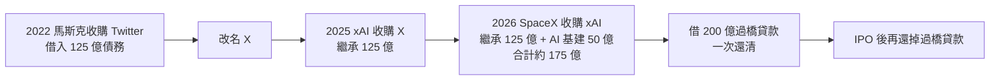

# SpaceX 為什麼這時間點上市?Musk 在 JP Morgan 投資人訪談說了什麼

> 來源:**兩支影片**——(一)996 Rainmaker 造雨俠搬運的 **JP Morgan 主辦 SpaceX IPO 投資人活動**訪談(上市前的願景);(二)⭐ 小Lin说〈[SpaceX 上市,背後在玩什麼資本遊戲?](https://www.youtube.com/watch?v=wpb-DrbhEiY)〉(2026-06-12,官方中文字幕,**上市後的招股書拆解**,見最後一節)。前者原始說明:JP Morgan 訪談——Elon Musk 回答 10 個問題,涵蓋「為何現在上市」「Starlink V3 / Starship 進度」「太空 AI 數據中心」「晶片瓶頸」「AI 策略」「人才文化」。本筆記整理訪談重點與對投資人的觀察。

> ⚠️ **非投資建議,且內容多為願景宣示。** 訪談大量是 Musk 的**長期太空願景**(月球 railgun、火星、百萬倍能源),屬願景而非近期可驗證的財務指引;請與「可追蹤的實際進度」分開看。搬運頻道標題聳動、說明欄有槓桿外匯平台業配,但**訪談主體是 JP Morgan 的正式內容**。投資具高風險,決策請自行查證並自負盈虧。

---

## 一句話總結

Musk 給的上市理由很直接:**SpaceX 2014–15 就能自籌資金、不缺錢,現在上市是因為要進入「一個巨大的新成長期」,需要資本**——這個成長期的核心是 **Starlink V3 + Starship + 把 AI 數據中心搬上太空**。對投資人最務實、可追蹤的訊號其實是他談晶片瓶頸那段:**AI 算力受限於晶片(邏輯/記憶體/封裝),美國目前「零座」高量產記憶體 fab,連最樂觀假設都不夠用**——這也是為什麼他要自建「關稅 fab」、以及記憶體股(Micron)被狂追的底層邏輯。

---

## 為什麼現在上市

- **不是缺錢**:SpaceX 早在 2014–15 就能自籌資金(內部資金 + 員工持股),被問上市問了快 10 年。
- **是要進入大成長期需要資本**:會釋出一大筆股份(讓約「十萬名投資人」級別的盤子能交易)。「我們正展開一個巨大的新成長階段,需要資本。」

---

## 三大成長引擎(訪談技術重點)

### 1. Starlink V3 — 比 V2 強 10–20 倍
- 體積像「一隻龍 / 小巴士」(約 7 公尺寬),**大到只能用 Starship 發射**。
- **自研 3 套晶片設計**(taped out,遠超 state of the art);**頻寬是現行 Starlink 的 100 倍、延遲只有一半**(軌道高度約一半)。
- 更大相控陣天線、更多地面鏈路、更多/更先進的**星間雷射鏈路**、W-band/E-band。
- **可取代海底電纜**——而海底電纜是重大安全風險(波羅的海已有被切斷案例)。

### 2. Starship — 首個「完全可重複使用」的軌道火箭
- 關鍵突破:**完全可重複使用**(Falcon 9 只做到部分)。一旦達成,入軌成本就「只剩推進劑成本」。
- 推進劑用**液氧 + 液態甲烷**(氧取自空氣、甲烷取自天然氣),**成本低於航空燃油** → 送貨上太空可比跨洋飛機貨運更便宜。
- 已飛 12 次;**V3 目標 100 噸入軌、V4 目標 >200 噸且能「每小時發射一次」**。

### 3. 太空 AI 數據中心 —「star power」
- **地面建電廠越來越難**(沒人想要後院有電廠);美國若要把用電翻倍(約 +500GW)得蓋兩倍電廠,社區不買單。
- **上太空可遠超地球發電量**:太陽能(他稱 star power)理論上可放大「百萬倍」,仍用不到太陽輸出的百萬分之一(目前人類文明用不到兆分之一)。
- **比通訊衛星更簡單做**:太空 AI 數據中心其實只是「太陽能 + 散熱器 + 基本設備 + 雷射鏈路」,比複雜的 Starlink V3 通訊衛星簡單;透過 Starlink 星座**用雲穿透頻率回傳地面,任何天氣都能連**。
- **月球 railgun 願景**:月球無大氣 + 1/6 重力,可用電磁加速器 / railgun / mass driver **不靠火箭就把 AI 數據中心射入深空**;用月球材料造太陽能與散熱器,可擴展到 **>1000 TW/年**(對比他估地球做 AI 太空算力約 1 TW/年)。→ 此為長期願景。

---

## 對投資人最務實的一段:晶片瓶頸

> Musk 點名 AI 的**限制因素是晶片**——邏輯、記憶體、封裝。
- **美國目前「零座」高量產的記憶體 fab**;Micron 在愛達荷蓋的要 **2028** 才量產、紐約的約 **2029–30**,且只是所需記憶體的一小部分。
- **即使用記憶體/邏輯廠的最樂觀假設,也不足以滿足預期需求** → 這是 **Micron 股價被追到很高**的底層原因。
- 所以他要做「關稅 fab」自建晶片產能。**「不會有足夠的晶片。」**

> 這段呼應本庫多處:[[us-stocks-rate-hike-risk-2026]](記憶體/AI 半導體題材)、gooaye agent 近期立場的「記憶體缺貨漲價、衛星算力 / Neo Cloud」主軸,以及 [[rtx-spark-gb10-soc]](本地 AI 算力)。

---

## AI 策略與人才文化

- **AI 衛星硬體中立**:SpaceX AI 衛星可放**任何 GPU/TPU**(NVIDIA GPU、Google TPU、Amazon Trainium…),未來也提供自家晶片與 AI 軟體;Grok 已整合進來。
- **愛國/國防**:SpaceX 為國防部做很多,有 **Star Shield** 部門提供軍事通訊(部分機密)。
- **人才板凳**:資深主管任期長(如 Gwynne Shotwell 是第 7 號員工、2002 入職 24 年);留人靠**相信使命**(讓人類成為跨星球文明、去火星與月球、「讓 Star Trek 成真」)。
- **領導反思**:比以前更 chill;招人除了 IQ/能力,**更看「是不是好心人(good heart)」**;「也許未來的 AI 會說:以一個人類來說,還不錯。」

---

## 對投資人的重點與風險提醒

- **分清「願景」與「可追蹤進度」**:月球 railgun、火星、百萬倍能源是**遠期願景**,別當近期催化劑;真正可追的是 **Starship V3/V4 試飛與酬載進度、Starlink V3 部署、太空數據中心是否真落地、以及晶片/記憶體供需**。
- **IPO 題材的本質**:上市理由是「要錢做大擴張」,投資人要評估的是**這些資本支出(Starship、星座、太空算力、自建 fab)能不能轉成可預測營收**——Musk 自稱「營收比以前更可預測」,但這仍待財報驗證。
- **最硬的可驗證訊號是記憶體/晶片瓶頸**:這條不只關 SpaceX,而是整個 AI 算力供應鏈(Micron、記憶體、先進封裝)的需求佐證——與本庫 [[glass-substrate-supply-chain]](先進封裝)、gooaye 記憶層的「記憶體循環 / 衛星算力」可互相參照。
- ⚠️ 來源是搬運頻道、逐字稿為 Whisper 從英文原音轉錄(導言段品質較差),數字/說法請以 SpaceX 官方與 IPO 文件為準。

---

## ⭐⭐ 上市後補:招股書拆出來的硬數字與控制權設計(2026-09-02 新增)

> 本節整理自 **小Lin说**〈[SpaceX 上市,背後在玩什麼資本遊戲?](https://www.youtube.com/watch?v=wpb-DrbhEiY)〉
> (2026-06-12,約 22.1 分鐘,官方中文字幕)。
> 上面那段訪談是**上市前的願景宣示**;本節是**上市後從招股書裡挖出來的實際數字與條款** ——
> 兩者放在一起看,才能分辨哪些是故事、哪些是帳。

### 三塊業務:一個技術底座、一台賺錢機器、一張餅

| 業務 | 2025 營收 | 損益 | 定位 |
|---|---|---|---|
| **Space(火箭)** | >40 億美元 | **虧 6.57 億** | **技術發動機,不是利潤發動機** |
| **Connectivity(Starlink)** | **114 億** | **賺 44 億** | **唯一賺錢的一塊** |
| **AI(收購 xAI 後成形)** | xAI 32 億 | 燒錢 | 未來與「餅」 |

**發射成本的量級變化**(招股書口徑):近地軌道每公斤,
NASA 約 **54,500 美元** → Falcon 9 約 **2,720 美元**(約 1/20)→ Starship 理論上要壓到 **100 美元以下**。
截至 2026-03-31 累計約 **650 次發射**,其中超過 **85% 使用回收推進器**;
2025 年送上軌道的質量占全球 **八成以上**。

> ⭐ 影片對 Starlink 的定位判斷很值得記:**大家看好它不是因為它現在賺的那點錢,
> 而是因為它向市場證明了「把太空商業化」這件事可行** —— 不必永遠依賴政府與 NASA 的訂單。

### TAM 那張圖:招股書的第一張圖表

| 領域 | 總潛在市場 |
|---|---|
| Space | 3,700 億 |
| Connectivity | 1.6 兆 |
| **AI** | **26.5 兆**(其中基礎設施 2.4 兆、**企業應用 22.7 兆**) |

⚠️ 影片翻到第 176 頁才找到「企業應用」的定義,而那段文字**每個字都認得、合起來卻看不懂** ——
硬要理解大概是「AI 代理人與機器人替我們上班」。**22.7 兆這個大頭,定義是最模糊的。**

太空軌道資料中心(靠太陽能供電、向太空輻射散熱)**最早 2028 年開始部署**,
而它只對應到那 2.4 兆的基礎設施部分。

⭐ 已落地的實單:**2026 年 5 月把 Colossus 資料中心租給 Anthropic,每月 12.5 億美元,租到 2029 年 5 月。**
影片的評語很中肯 —— **金額實在,但跟太空關係不大,而且是把算力租給別人、不是訓練自己的模型。**

### 為什麼是現在上市:一條被繼承的債務鏈

上市對馬斯克的成本其實很高(財務公開、控制權稀釋、被輿論與資本裹挾),
他自己早年也說過「過早上市會讓 SpaceX 非常痛苦」。改口的主因是 **AI 要花錢**:

```
2023 年  幾乎沒有融資債務
2024 年  118 億
2025 年  263.5 億
```

而 2026 年的融資裡藏了一筆 **200 億美元的過橋貸款**,用途是清掉**繼承來的債**:



> ⭐ 影片點出的華爾街視角很有意思:**當年 Twitter 那筆百億債主要是跟摩根士丹利借的**,
> 成了華爾街被套最久的併購債之一;**這回終於解套,還能順帶賺一筆 IPO 承銷費。**
>
> 而過橋貸款的五家銀行(高盛、美銀、花旗、摩根大通、摩根士丹利)——
> **正好就是 21 家承銷商裡排在第一排的那五位。過橋貸款是敲門磚,IPO 承銷費才是主菜。**

### 估值:市銷率接近 100 倍

上市即為全美市值第七大、超過特斯拉,但**營收不到 200 億**。因為虧損無法算本益比,改看市銷率:

| 公司 | 市銷率 |
|---|---|
| Apple | 約 10 倍 |
| Tesla | 約 15 倍 |
| NVIDIA | 約 25 倍 |
| **SpaceX(IPO)** | **接近 100 倍** |

⭐ **高估值的直接好處是融資成本極低**:阿里巴巴當年融 250 億消耗約 15% 股份;
**SpaceX 融 750 億只消耗 4.2%。** 這也是選在此刻上市的重要原因之一。

### ⭐⭐ 控制權:上市了,但控制權一點都沒有 Public

三類普通股:**A 類一股一票、B 類一股十票、C 類無投票權**。對外只賣 A 類。

馬斯克持有 12.3% 的 A 類與 **93.6% 的 B 類**,合計投票權 **85.1%**;上市後僅降到約 **84%**。

⚠️ 而且招股書規定 **B 類股東有權選舉董事會過半董事** ——
**不論日後對外進行多少輪 A 類融資,馬斯克都能持續控制董事會。**

> **美國三大公共退休基金為此發出聯名信警告,說這套結構「新奇又極端」。**

### ⭐⭐⭐ 激勵計畫的真相:名為極限挑戰,實為投票權白送

招股書第 235 頁只用一頁帶過兩版激勵計畫,但條件離譜到值得單獨看:

| 版本 | 市值門檻 | 附加條件 | 授予股數 |
|---|---|---|---|
| **太空版** | 最高一檔 **7.5 兆美元**(分 15 階) | **在火星建立永久人類殖民地、至少 100 萬居民** | 10 億股 B 類 |
| **AI 版** | **6.565 兆美元** | **建立非地球資料中心、年算力達 100 太瓦** | 302,072,285 股 |

100 太瓦 = 十萬吉瓦;**目前全球總用電量約 3 太瓦**,等於要達到**全球總功耗的 33 倍**,而且得在外太空。

⭐⭐⭐ **關鍵在附加條款,而它沒寫在正文裡:**

> **參與人自「授予日」起即享有 B 類股持有人的全部權利與特權,包括投票權,立即生效。**

也就是說 —— **就算目標永遠達不到、股票拿不到,那些股票對應的投票權從今天起就歸他了。**

兩版加總:`1,000,000,000 + 302,072,285 = 1,302,072,285` 股 ——
**這個數字正好對上馬斯克那 55 億股 B 類股附註裡的「限制股」數量。**

> ⭐ 影片的結論一針見血:**這哪是什麼「極限挑戰」計畫,應該叫「投票權白送」計畫。**

### 核實與補正

| 影片說法 | 核實結果 |
|---|---|
| 人類史上最大 IPO | **屬實**,且規模約為沙烏地阿美 2019 年紀錄的三倍 |
| 上市時間與代號 | **2026-06-12 於 Nasdaq 掛牌,代號 `SPCX`**,以每股 **135 美元**售出 **5.556 億股** |
| 馬斯克投票權 85.1% | **屬實**;另有報導指其**經濟權益約 42%** —— 42% 的錢控制 85% 的票 |
| 雙層股權 + 三大退休基金示警 | 與哈佛公司治理論壇等公開討論一致 |

⚠️ **兩處需要修正或補充:**

1. **募資金額**:影片說「融 750 億」,而報導的**總募資額為 857 億美元(行使超額配售權之後)**。
   兩者可並存(基礎規模約 750 億、綠鞋後放大),但引用時要講清楚是哪一個口徑。
2. **「之前美股最大 IPO 是阿里巴巴」**:就**美股掛牌**而言正確;
   但**全球紀錄保持者是沙烏地阿美(2019)**。影片只提美股口徑,容易讓人以為阿里是全球紀錄。
3. ⭐ **影片未提的一項治理條款**:有報導指出招股書要求**股東放棄陪審團審判與集體訴訟的權利**。
   若屬實,這與雙層股權疊加後,公眾股東的救濟途徑會更受限 —— 值得自行查閱 S-1 原文確認。

⚠️ 三大業務的營收與損益、TAM 數字、債務鏈金額、市銷率與激勵計畫股數,
**均為影片依招股書轉述,本文未逐項比對 S-1 原文。**

---

## 來源

- ⭐ [SpaceX 上市,背後在玩什麼資本遊戲? — 小Lin说](https://www.youtube.com/watch?v=wpb-DrbhEiY)(2026-06-12,約 22.1 分鐘,官方中文字幕)—— 最後一節的招股書數字、債務鏈、控制權結構與激勵計畫皆來自此片
- 核實用資料:[SpaceX targets $135 IPO price — CNBC](https://www.cnbc.com/2026/06/03/spacex-ipo-stock-price-roadshow-musk.html)、[Top IPO, Weak Governance — Harvard Law School Forum on Corporate Governance](https://corpgov.law.harvard.edu/2026/05/19/top-ipo-weak-governance/)
- 996 Rainmaker 造雨俠(搬運 JP Morgan SpaceX IPO 投資人活動 Musk 訪談),YouTube:<https://youtu.be/Hnf1ExYg3M8>(2026-06-06)
- **該片字幕端點限流(429)無法下載,逐字稿以 CPU 版 faster-whisper 從英文原音轉錄取得,非官方字幕**;中文導言段轉錄品質較差,英文訪談主體較完整,數字與說法可能有聽寫誤差,請以 SpaceX 官方 / IPO 文件查證。
