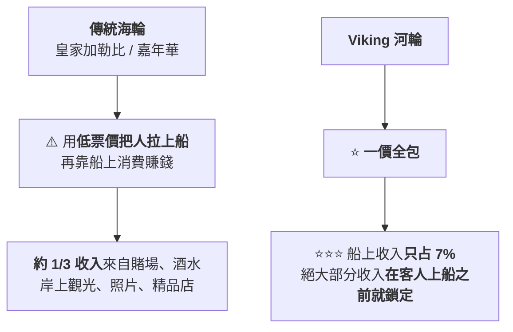
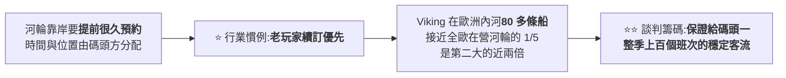

# Viking Holdings(VIK):碼頭權 × 高齡高淨值客群的雙層護城河,與那場被低估的歐洲枯水

> ⚠️⚠️ **非投資建議。本文為知識整理,不構成任何買賣建議。文中所有數字請自行向官方來源查證。**
>
> 整理自 YouTube 頻道 **美投君 / 美投讲美股**〈[不想把投资都堆在AI上?这家公司人称「人类之光」,无惧颠覆,极强上涨!](https://www.youtube.com/watch?v=ajtCT6jl1Nw)〉(2026-09-20,約 20.2 分鐘)。
> **該片無字幕也無自動字幕,逐字稿以 CPU faster-whisper 轉錄取得、非官方字幕**,可能有少量聽寫誤差(專有名詞對照見文末)。
>
> ⚠️⚠️ **立場揭露:該片明說是「美投 Pro」付費訂閱服務中「挖掘新機會」單元的重製版**,
> **片頭片尾都在推廣付費訂閱與付費直播**。⭐ **本文只整理該片公開講述的分析框架,不轉述任何付費素材。**
>
> ⭐⭐⭐ **本文已比對 [Viking 官方 IR 的 2026 Q2 財報新聞稿](https://ir.viking.com/news-events/press-releases/detail/242/viking-reports-second-quarter-2026-financial-results) 逐項核實** ——
> ⚠️⚠️ **抓到三處數字對不上、以及一處風險被明顯低估**(見 §七)。

---

## 一句話總結

> ⭐⭐⭐ **「真正稀缺的不是船,是**最好的城市 × 最好的岸線位置 × 最好的靠岸時間**這三個組合。」**
>
> ⚠️⚠️ **但這篇最值得帶走的不是那個護城河故事,是 §七的一件事:
> **影片把今年歐洲枯水講成「幾乎不取消行程」的短期擾動 ——
> 而法說會揭露的是:超過一半的 Q3 河輪運力受影響、受影響航次有 10–12% 被取消。****

---

## 一、⭐ 這是一家刻意跟 AI 無關的公司

| 影片開場的三個賣點 | ⚠️ 本文查證 |
|---|---|
| **2024 年 5 月 IPO,股價已漲接近 300%** | ⭐ **IPO 日期 2024-05-01 屬實**;⚠️ **漲幅未能獨立核算**(見 §七) |
| **今年整個板塊跌 20%,它自己漲 50%** | ⚠️ **未能核實** |
| **完全與 AI 無關,現在沒有、未來也不會有** | **定性描述** |

---

## 二、⭐⭐ 創辦人:一個 50 多歲剛失去大部分財富的人重新開始

> ⭐⭐ **影片的解讀本文認同:「這個背景,解釋了他後來那種**近乎偏執的聚焦**。」**

📌 **⭐ 本文核實補充:Hagen 目前是**執行董事長(Executive Chairman)**,
**現任總裁兼執行長是 Leah Talactac** —— ⚠️ 影片全程以創辦人視角敘述,沒有提到經營層已經交棒。**

---

## 三、⭐⭐⭐ 那份三十年沒改過的「不做什麼」清單

> ⭐ **「Viking 從第一天起就只做一件事:給**有錢、說英語、對文化有好奇心的成年人**,做目的地導向的河輪。」**
>
> ⭐⭐ **而且是**先偏執地認定要做什麼產品,再讓客群和航線來匹配**,不是先做市調再定位。**

| ⚠️ Viking 明確不做 | ⭐ 為什麼值得注意 |
|---|---|
| **不接 18 歲以下兒童** | — |
| **沒有賭場** | ⚠️ **這是別家的收入來源** |
| **沒有正式晚宴** | — |
| **沒有管家與白手套** | — |
| **沒有藝術品拍賣** | ⚠️ **別家的收入來源** |
| **不賣照片** | ⚠️ **別家的收入來源** |
| **WiFi 與午晚餐酒水不額外收費** | ⚠️ **別家的收入來源** |

> ⭐⭐⭐ **「這裡的每一項,都是其他郵輪的收入來源。但黑根一條都不要。
> 而且這份清單**三十年一個字沒改過**。」**

---

## 四、⭐⭐⭐ 河輪跟海輪根本是兩門生意

### 4.1 船的尺寸決定了整個行業的供給上限

| | **海輪(以皇家加勒比 Icon of the Seas 為例)** | ⭐ **Viking 的塞納河船** |
|---|---|---|
| **造價** | **約 20 億美元** | **不到 5,000 萬美元** |
| **床位** | **5,610 個下鋪床位** | **168 個** |
| **每床位造價** | **約 26 萬美元** | — |
| **長度** | — | ⭐ **只有 125 公尺(為了能進巴黎)** |

> ⭐⭐⭐ **關鍵推論:「河輪的運力只能是**線性增長** —— 要增加 1,000 個床位,就得多 5 條船。
> 規模經濟遠不如海輪。**但反過來,這也意味著整個行業的供給永遠上不來。**」**

**⚠️ 影片給的供給數字(未核實,見 §七):**

| 項目 | 數字 |
|---|---|
| **2025 年全歐洲在營河輪** | **約 400 條,平均船齡 16 年** |
| **2026 年全行業交付** | **16 條** |
| **2027 年** | **19 條** |
| ⭐ **年增率** | **約 4–5%**(受造船廠產能與碼頭容量雙重約束) |

### 4.2 ⭐⭐⭐ 商業模式完全相反

### 4.3 客群與「船的角色」也不同

| | **傳統郵輪** | ⭐ **Viking** |
|---|---|---|
| **客群** | **以家庭為主** | **55 歲以上的歐美嬰兒潮世代** |
| **船是什麼** | ⭐ **船本身就是目的地**(水滑梯、百老匯演出、賭場) | ⭐⭐ **船只是一個移動的酒店** |
| **行程安排** | **娛樂在船上** | ⭐ **白天上岸看博物館、教堂、酒莊;晚上回船睡覺,隔天醒來就到下一個城市** |

### 4.4 ⭐ 海輪對 Viking 的作用不只是第二成長曲線

**2026 年 Q2 收入結構(影片數字,⚠️ 未核實):河輪 52%、海輪 40%。**

> ⭐ **但它的「海輪」其實更像放大版的河輪** —— 只有 900 多人的小船、不去加勒比、
> 航線絕大部分只跑北歐與地中海、**同樣沒有賭場、18 歲以下不能登船、岸上觀光含在票價裡**。
>
> ⭐⭐ **真正的作用:在每年第一季**歐洲內河封航**時,替河輪做**季節性對沖**。**

---

## 五、⭐⭐⭐ 護城河第一層:碼頭權

> ⭐⭐ **「海輪停的是港口,港口建在郊外,怎麼泊船都可以。
> **而河輪停的是城市中心的一段河岸。**」**

### ⭐⭐⭐ 真正稀缺的不是「有沒有位子」

> **「泊位再緊張,船總是能停的 —— 大不了並排靠泊,或換一個離城區遠一點的碼頭。
> **所以真正稀缺的是:最好的城市 × 最好的岸線位置 × 最好的靠岸時間,這三個組合。**」**

**⭐ 影片給的對照非常具體:**

| 同樣是停巴黎 | 客人的體驗 |
|---|---|
| ⭐ **停在艾菲爾鐵塔旁、傍晚亮燈時靠岸** | **走幾步就到** |
| ⚠️ **停在下游兩公里、清早 6 點靠岸** | ⚠️ **還得穿過三條別人的船才能上岸** |

> ⭐⭐⭐ **「客人下船之後能走多少路、看到什麼景觀 —— 這才是河輪遊最重要的價值。」**
> **尤其對以長者為主要客群的服務而言。**

### ⭐ 具體的獨家泊位(⚠️ 影片轉述,未核實)

| 地點 | 說明 |
|---|---|
| ⭐⭐ **巴黎艾菲爾鐵塔以西約 800 公尺** | **長期停泊權,公司談了 7 年才拿下** |
| **埃及路克索** | **卡納克神廟外面是自家泊位** |
| **布達佩斯** | **跟匈牙利政府成立合資公司取得** |
| **萊茵河與易北河一批泊位** | **2000 年收購 KD River Cruises 時接手的資產** |

### ⭐⭐ 其餘泊位的壁壘來自先發優勢

### ⚠️⚠️ 一個很值得注意的政策變化:城市開始主動限流

> **阿姆斯特丹從 2026 年起,要求各家**按上一年的班次數削減 10%**,配額由歷史班次決定。**
>
> ⭐⭐⭐ **影片的觀察很準:「這種機制**有利於關係久、船多的玩家** ——
> **先來的人決定了後來的人能有多少位子。**」**

📌 ⚠️ **本文未能核實阿姆斯特丹該政策的細節與生效範圍。**

---

## 六、⭐⭐⭐ 護城河第二層:客戶

### 6.1 定位:The Thinking Person's Cruise

> **「體力有限、規劃能力弱、不願意頻繁換旅館轉車」的高齡高知客群,
> 對上「夜間航行、白天停靠城市核心碼頭、全程含導覽觀光」的產品 —— ⭐ **契合度極高**。**

### 6.2 ⭐⭐ 定價權的證據:淨收益率是對手的 2–3 倍

| 公司 | **每人每天淨收益率(net yield)** |
|---|---|
| ⭐ **Viking** | **$645** ✅ **已核實**(2026 Q2,年增 6.2%) |
| **皇家加勒比** | **$289**(⚠️ 影片數字,未核實) |
| **嘉年華** | **$209**(⚠️ 影片數字,未核實) |

> 📌 **「淨收益率」= 客人每日付的錢,扣掉佣金、機票、港務費這些直接成本之後,公司實際留下的那部分。**

### 6.3 ⭐⭐⭐ 複購率:從 27% 到 54%

> ⭐⭐ **「Viking 每次開一條全新產品線 —— 2015 年的海輪、2022 年的探險船與密西西比河 ——
> **這些產品的首航季,超過 60% 的訂單都來自老客人。**」**
>
> ⭐⭐⭐ **「這意味著 Viking 進入一個新市場,**幾乎不需要重新獲客**。」**

⚠️ **複購率 27%→54%、首航 60% 來自老客,兩者皆為影片數字,本文未能核實。**

---

## 七、⚠️⚠️⚠️ 本文核實後抓到的四件事

### 7.1 ⚠️⚠️ 預訂數字對不上,而且差了一倍

| 項目 | **影片說** | ⭐ **官方 2026 Q2 財報** |
|---|---|---|
| **2026 年已售運力** | **96%** | ✅ **96%** |
| ⚠️⚠️ **2026 年預訂額** | **30.2 億美元** | ⚠️⚠️ **$6,386 百萬(63.86 億美元)** |
| ⚠️⚠️⚠️ **2027 年已售運力** | ⚠️ **42%** | ⚠️⚠️ **53%** |
| ⚠️⚠️ **2027 年預訂額** | **17.6 億美元** | ⚠️⚠️ **$4,711 百萬(47.11 億美元)** |
| **2027 年每客艙日預訂單價年增** | **9.2%($1,029 vs $942)** | **官方說法是「高 10%」** |

> ⚠️⚠️ **兩個預訂額都只有官方數字的**一半左右**,2027 已售比例更是差了 11 個百分點。**
> ⭐ **推測影片引用的可能是某個子集(例如只算 Core Products 的河輪部分或不同截止日),
> 但影片是以公司整體口吻陳述的。**
> ⭐⭐⭐ **結論:這幾個數字**不要直接引用影片版本**,以官方 IR 為準。**

### 7.2 ⚠️⚠️⚠️ 歐洲枯水的影響被明顯低估了

**影片的說法:**

> **「Viking 幾乎不取消行程,而是想盡辦法繼續完成」**
> **「這更像個短期的經營波動…現在的需求並沒有受到影響」**

**⭐⭐⭐ 但法說會與分析師報導揭露的是:**

| ⚠️ 實際情況 |
|---|
| ⚠️⚠️ **萊茵河與多瑙河部分河段出現歷史性低水位,影響了**超過一半的第三季河輪運力日**** |
| ⚠️⚠️⚠️ **受影響航次中有 **10–12% 被取消**** —— **不是「幾乎不取消」** |
| ⚠️ **公司主動發放未來航程抵用券,管理層明言這會**在 2027 與 2028 年產生財務影響**** |
| ⚠️ **財報後股價一週內下跌約 12.9%–14.5%** |
| **Stifel 將目標價從 $125 下調至 $120(維持買進評等),理由正是水位問題** |

> ⭐⭐⭐ **影片說的「調換船隻、大巴接駁、發抵用券」這些應對手段都屬實,
> ⚠️⚠️ **但「幾乎不取消」與「超過一半運力受影響、10–12% 取消」是兩幅不同的圖。****
>
> ⭐ **而且影片說「不影響收入、只推高成本」——
> ⚠️ **管理層自己講的是抵用券會影響 2027 與 2028。****

📌 **⭐ 公平地說,影片也點出了「如果連續兩年天氣都出問題,確實可能開始傷害品牌和複購率」,
這個風險意識是對的 —— **只是把當期的規模講小了**。**

### 7.3 ✅ 核實屬實的部分

| 項目 | 結果 |
|---|---|
| ⭐ **淨收益率 $645(+6.2%)** | ✅ **屬實** |
| ⭐⭐ **淨槓桿 1.2 倍** | ✅ **屬實**(2026-06-30) |
| **2026 年已售 96%** | ✅ **屬實** |
| **IPO 日期 2024-05-01** | ✅ **屬實** |
| **創辦人 Torstein Hagen** | ✅ **屬實**(⚠️ 但他現為執行董事長,CEO 是 Leah Talactac) |

**⭐ 本文另外補上影片沒給的 2026 Q2 數字:**

| 項目 | 數值 |
|---|---|
| **總收入** | **$2,190.5 百萬(+16.5%)** |
| **調整後 EBITDA** | **$748.4 百萬(+18.2%)** |
| ⚠️ **入住率** | **94.4%(前一年同期 95.6%)** —— ⭐ **是下降的** |
| **船隊規模** | **官方表述為「超過 100 艘船」** |

### 7.4 ⚠️ 股價數字未能核實

**影片說「IPO 以來股價一度上漲超過三倍」、「已漲接近 300%」。**

| ⭐ 本文查到的公開數據(2026-09-18) |
|---|
| **股價 $84.15** |
| **52 週區間 $56.37 – $110.09** |
| **市值 $375.8 億** |
| **2025 年營收 $65.0 億(+21.89%)** |

> ⚠️ **IPO 發行價與累計報酬率本文未獨立核算,「接近 300%」與「一度超過三倍」皆列為未核實。**

---

## 八、⭐⭐⭐ 預售飛輪:為什麼它的資產負債表是全行業最乾淨的

**產能規劃(⚠️ 影片數字,未核實):到 2028 年再加 22 條河輪;到 2031 年再加 9 條海輪與 2 條探險船,合計近 60 億美元資本開支。**

> ⭐⭐⭐ **但關鍵在這裡:**「2026 年扣掉配套融資後,真正付的淨現金只有 6.5 億左右。」**
> ⭐⭐ **淨槓桿只有 **1.2 倍**(✅ 已核實)** —— 意思是**一年多的自由現金流就能把債全部還清**。
> **而皇家加勒比與嘉年華都在 3 倍以上(⚠️ 未核實)。**

> ⚠️⚠️ **為什麼這個指標決定生死:**
> **「郵輪是重資產行業…疫情期間倒下和差點倒下的公司,**都是沒挺過財務槓桿這一關**。」**

---

## 九、⭐⭐ 兩層護城河會互相加固

> ⭐⭐⭐ **「這兩層護城河的相互促進,才是對手最難以複製的地方。」**

---

## 十、⚠️ 風險

| 風險 | 說明 |
|---|---|
| **① 經濟週期** | **郵輪是典型可選消費;景氣一轉弱,長途旅遊常是家庭預算裡第一個被砍的。⚠️ 但船已經在那了,碼頭費、燃油、折舊都是剛性成本** |
| ⭐ **對 Viking 的殺傷力較小** | **客群對價格不敏感;預售模式會把衝擊往後推,多一段緩衝期** |
| ⚠️ **但不是免疫** | **2020 年 Viking 一樣停擺,靠老股東追加 5 億美元優先股融資才撐過來**(⚠️ 未核實) |
| ⚠️⚠️⚠️ **② 極端天氣與枯水** | ⭐ **見 §7.2 —— 本文認為影片低估了當期規模**。歷史上歐洲內河嚴重低水位約每 3–4 年出現一次(⚠️ 未核實) |
| **③ 競爭** | **皇家加勒比準備 2027 年進入河輪、2031 年達 20 條;但 Viking 屆時將有 120 條,而且**最好的碼頭與最佳時段已經沒有了**(⚠️ 未核實) |
| ⚠️ **④ 估值** | **見 §十一** |

---

## 十一、⚠️ 估值:為什麼不用 PE

> ⭐⭐ **「郵輪公司之間的負債水平差太遠,常用的 PE 不好比較 ——
> 比如挪威郵輪的槓桿是 Viking 的 4 倍多。」**
>
> ⭐ **所以行業通用 EV/EBITDA;⭐ 而因為郵輪是重資產、折舊也要考慮,
> 影片作者更傾向看 **EV/EBIT**。**

| 指標(⚠️ 影片數字,未核實) | 數值 |
|---|---|
| **Viking 目前 EV/EBIT** | **21 倍** |
| **過去兩年平均** | **18 倍** → ⚠️ **比自己歷史貴 15%** |
| **皇家加勒比** | **17 倍** → ⚠️ **Viking 貴 20%** |

> ⭐ **影片給的理由本文覺得成立:「未來 5 年業績增速要比皇家加勒比快 10%,
> 而且商業模式帶來的淨槓桿更低 —— **更快的成長 + 更乾淨的資產負債表,就該更貴一些**。」**

---

## 十二、⭐⭐ 影片作者的結論(⚠️ 非投資建議,僅為轉述)

> ⭐ **「當船不夠的時候就能漲價,漲完還不影響需求。
> 一般消費品提價 10%,銷量必然下降 —— **只有真正的奢侈品才能做到量價齊升**。」**
>
> ⭐⭐ **「所以在我看來,Viking 有點像旅遊業裡的愛馬仕。」**

**⚠️ 但作者自己也踩了煞車,本文照錄:**

| 保留意見 |
|---|
| ⚠️ **「一家好公司,現在不一定是個好股票」** |
| ⚠️ **「客觀地說,Viking 現在不便宜」** |
| ⚠️ **「第三季的不確定性會一直壓制短期股價」** |
| ⚠️ **「現在的股價應該還有一些下行空間」** |

> ⚠️⚠️ **本文提醒:作者對第三季的判斷是「大概率是個短期擾動」 ——
> **請務必對照 §7.2 的實際規模自行判斷。****

---

## 應用案例:三個可以帶走的分析框架

### 案例 1|⭐⭐⭐ 「真正稀缺的是什麼」這個提問方式

> ⚠️ **多數人分析護城河會停在「它有幾條船」。**
> ⭐⭐⭐ **這篇的示範是再追問一層:**船不稀缺,泊位也不算稀缺 ——
> 稀缺的是「最好的城市 × 最好的位置 × 最好的時間」這個組合。****

**⭐ 可操作的做法:分析任何一家公司時,把「資源」拆成三層問:**

| 層 | 問題 |
|---|---|
| **① 這個資源本身稀缺嗎?** | ⚠️ **通常答案是「不太稀缺」** |
| **② 那最好的那一檔稀缺嗎?** | ⭐ **這裡才開始有東西** |
| ⭐⭐⭐ **③ 取得最好的那一檔,需要什麼別人補不上的條件?** | **例:Viking 的「保證一整季上百個班次穩定客流」** |

### 案例 2|⭐⭐ 用「船上收入占比」這類結構比例,快速判斷兩家公司是不是同一門生意

| 指標 | Viking | 傳統海輪 |
|---|---|---|
| ⭐ **船上收入占比** | **7%** | **約 1/3** |

> ⭐⭐⭐ **這一個數字就足以說明:一個是**上船前收錢**的生意,一個是**上船後收錢**的生意。
> **定價邏輯、客群、甚至風險曝險都不一樣,拿同一組估值倍數比就會失真。**

⭐ **可以類推的場景:訂閱制 vs 交易制的軟體公司、預付卡 vs 後付費的服務業。**

### 案例 3|⭐⭐⭐ 遇到「公司說沒事」的風險,一定要去看法說會原文

> ⚠️⚠️ **本篇最實際的教訓就在 §7.2:**
> **影片的敘述是「幾乎不取消行程、需求沒受影響」;
> 法說會揭露的是「超過一半 Q3 河輪運力受影響、受影響航次 10–12% 取消、抵用券會影響 2027 與 2028」。**

**⭐ 查證路徑很固定:**

| 步驟 | 去哪裡 |
|---|---|
| **①** | **公司 IR 的財報新聞稿**(數字的權威來源) |
| ⭐⭐ **②** | **法說會逐字稿** —— **新聞稿不會寫的風險細節,通常在 Q&A 裡** |
| **③** | **分析師調整目標價的理由**(看市場把它定性成什麼) |

> 📌 ⭐ **本篇的枯水細節就**不在財報新聞稿裡** —— 新聞稿全篇沒提低水位,是從法說會與分析師報導才查到的。**

---

## 重點回顧(TL;DR)

1. ⭐⭐⭐ **雙層護城河**:①**碼頭權**(控制超過 100 個優質靠泊點,部分獨家,如巴黎艾菲爾鐵塔以西 800 公尺談了 7 年);②**高付費意願、高複購的高齡高淨值客群**。⭐ 而且兩層**互相加固**。
2. ⭐⭐⭐ **「真正稀缺的是最好的城市 × 最好的岸線位置 × 最好的靠岸時間這三個組合。」**
3. ⭐ **河輪與海輪是兩門生意**:船小(125 公尺、168 床位、不到 5,000 萬美元)⇒ **運力只能線性增長** ⇒ **整個行業供給永遠上不來**。
4. ⭐⭐⭐ **船上收入只占 7%(對手約 1/3)** —— **絕大部分收入在客人上船之前就鎖定**。
5. ⭐ **三十年沒改過的「不做什麼」清單**:不接兒童、沒賭場、沒正式晚宴、不賣照片、WiFi 與餐酒不加價 —— **每一項都是別家的收入來源**。
6. ✅ **淨收益率 $645/人日(+6.2%)已核實**;⚠️ 對手 $289 / $209 未核實。
7. ✅ **淨槓桿 1.2 倍已核實** —— **一年多的自由現金流就能還清全部債務**;⚠️ 對手 3 倍以上未核實。**郵輪是重資產業,這個指標基本決定生死。**
8. ⭐⭐ **預售飛輪**:客人提前 12–18 個月付清全款 → 自有資金付造船首付 → 餘款走政府出口信貸(10 年固定低息)→ 4–6 年回本 → 再付下一批船。
9. ⚠️⚠️⚠️ **補正一:預訂數字對不上** —— 影片說 2026 預訂額 30.2 億、2027 已售 42%/17.6 億;**官方是 63.86 億、53%、47.11 億**。**別用影片版本。**
10. ⚠️⚠️⚠️ **補正二:歐洲枯水的規模被低估** —— 影片說「幾乎不取消行程、需求沒受影響」;**實際是超過一半的 Q3 河輪運力受影響、受影響航次 10–12% 取消,抵用券將影響 2027 與 2028**,財報後股價一週跌約 13–14%,Stifel 下調目標價。
11. ⭐ **補正三:Hagen 現為執行董事長,CEO 是 Leah Talactac**(影片未提交棒)。
12. ⭐ **本文補上的 2026 Q2 數字**:收入 $2,190.5M(+16.5%)、調整後 EBITDA $748.4M(+18.2%)、⚠️ **入住率 94.4%,較前一年 95.6% 下降**。
13. ⚠️ **估值不便宜**:EV/EBIT 21 倍,比自己兩年均值貴 15%、比皇家加勒比貴 20%(⚠️ 影片數字未核實)。
14. ⭐⭐⭐ **最可帶走的方法論(§應用案例 3)**:遇到「公司說沒事」的風險,**新聞稿不會寫的細節通常在法說會 Q&A 裡** —— 本篇的枯水規模就完全不在財報新聞稿中。

---

## 核實狀態

### ✅ 已核實(Viking 官方 IR 2026 Q2 財報新聞稿)

| 項目 | 結果 |
|---|---|
| **淨收益率 $645、年增 6.2%** | ✅ |
| **2026 年已售運力 96%** | ✅ |
| **淨槓桿 1.2 倍(2026-06-30)** | ✅ |
| **創辦人 Torstein Hagen** | ✅(⭐ 現職為執行董事長) |
| **IPO 日期 2024-05-01** | ✅ |

### ⚠️ 需修正

| 項目 | 影片 | 官方 |
|---|---|---|
| **2026 年預訂額** | **30.2 億美元** | **63.86 億美元** |
| **2027 年已售運力** | **42%** | **53%** |
| **2027 年預訂額** | **17.6 億美元** | **47.11 億美元** |
| **2027 年每客艙日單價年增** | **9.2%** | **10%** |
| **歐洲枯水影響** | **「幾乎不取消行程」「需求沒受影響」** | ⚠️⚠️ **超過一半 Q3 河輪運力受影響、受影響航次 10–12% 取消、抵用券影響 2027–2028** |
| **經營層** | **以創辦人視角敘述** | **CEO 為 Leah Talactac** |

### ⚠️ 未能核實

- **股價漲幅(「接近 300%」「一度超過三倍」)、板塊今年跌 20% 而它漲 50%。**
- **對手淨收益率($289 / $209)、對手淨槓桿(3 倍以上)。**
- **全歐在營河輪約 400 條、平均船齡 16 年、2026 交付 16 條、2027 交付 19 條、年增 4–5%。**
- **船上收入占比 7% 與對手 1/3、2026 Q2 河輪 52% / 海輪 40% 的收入結構。**
- **複購率 27%→54%、新產品線首航 60% 訂單來自老客。**
- **獨家泊位細節(巴黎談 7 年、路克索、布達佩斯合資、KD River Cruises 收購)、控制超過 100 個靠泊點。**
- **阿姆斯特丹 2026 年起削減 10% 班次配額的政策。**
- **2025 年自由現金流 21.8 億美元、2028 前再加 22 條河輪、2031 前再加 9 海輪 + 2 探險船、近 60 億資本開支、2026 淨現金支出 6.5 億。**
- **EV/EBIT 21 倍 / 歷史 18 倍 / 皇家加勒比 17 倍、未來五年增速快 10%。**
- **2020 年老股東追加 5 億美元優先股;歐洲嚴重低水位每 3–4 年一次;皇家加勒比 2027 進入河輪、2031 達 20 條。**
- **7 月底保加利亞河輪擱淺事件。**

> ⚠️⚠️⚠️ **本文為知識整理,非投資建議。**
> **影片為付費訂閱服務的推廣內容,且多項數字與官方財報不符(見「需修正」),
> 任何決策前請直接查閱 [Viking 官方 IR](https://ir.viking.com/) 與法說會逐字稿。**

### 專有名詞還原對照(Whisper 誤轉)

| 轉錄結果 | 正確 |
|---|---|
| **美肯 / 美育 / 美肤** | **美股** |
| **黑梗 / 黑根 / 黑梦** | **Torstein Hagen(哈根)** |
| **麦肯西 / 麦凯西** | **麥肯錫(McKinsey)** |
| **河美邮轮** | **荷美郵輪(Holland America Line)** |
| **贝尔根行运 / Burgen Line** | **Bergen Line** |
| **Royall Nettoloid** | **Royal Nedlloyd** |
| **围经邮轮 / 维京 / Wiking / Wikings** | **Viking(維京)** |
| **河沦 / 河伦 / 河鲁 / 河轫 / 沽倫** | **河輪** |
| **海轨 / 海轰 / 海车 / 海轫** | **海輪** |
| **独场** | **賭場** |
| **净售率 / 凈收率** | **淨收益率(net yield)** |
| **凈杠杆 / 静杠感** | **淨槓桿** |
| **護程盒 / 互乘盒 / 互成河 / 护程河** | **護城河** |
| **设置品** | **奢侈品** |
| **爱马士** | **愛馬仕** |
| **半寻体 / 半寮体 / 半寨体** | **半導體** |
| **割钱** | **擱淺** |
| **博位 / 泼位 / 狼家博位** | **泊位** |
| **送付款 / 颂付款** | **預付款** |
| **風陷 / 風陰 / 风陕 / 风陨** | **風險** |
| **美头 Pro / 美投军** | **美投 Pro / 美投君** |

---

## 來源

- [不想把投资都堆在AI上?这家公司人称「人类之光」,无惧颠覆,极强上涨! — 美投君 / 美投讲美股](https://www.youtube.com/watch?v=ajtCT6jl1Nw)(2026-09-20,約 20.2 分鐘;**該片無字幕也無自動字幕,逐字稿以 CPU faster-whisper 轉錄取得、非官方字幕**)
- ⚠️ **立場**:該片為「美投 Pro」付費訂閱「挖掘新機會」單元的重製版,片頭片尾推廣付費訂閱與付費直播;本文不轉述付費素材。
- ⭐⭐⭐ **一手素材(核實依據)**:[Viking Reports Second Quarter 2026 Financial Results — Viking 官方 IR](https://ir.viking.com/news-events/press-releases/detail/242/viking-reports-second-quarter-2026-financial-results)
- [Viking Holdings (VIK) — stockanalysis.com](https://stockanalysis.com/stocks/vik/)(股價、市值、52 週區間)
- ⚠️ **§7.2 枯水規模的依據**:2026 Q2 法說會內容與分析師報導(含 Stifel 下調目標價至 $120 的理由)。
- 延伸:本庫 [[us-stocks-five-risks-2026q4-hike-treasury-midterm]]、[[positive-expectancy-rule-hunting-mark-yang]]、[[breakout-four-layers-of-evidence]]。

> ⚠️⚠️ **再次聲明:非投資建議。**
