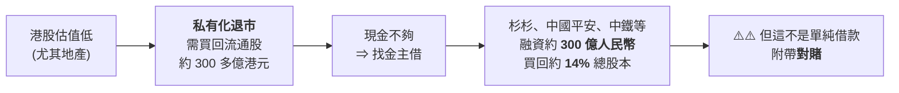
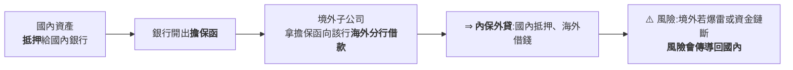
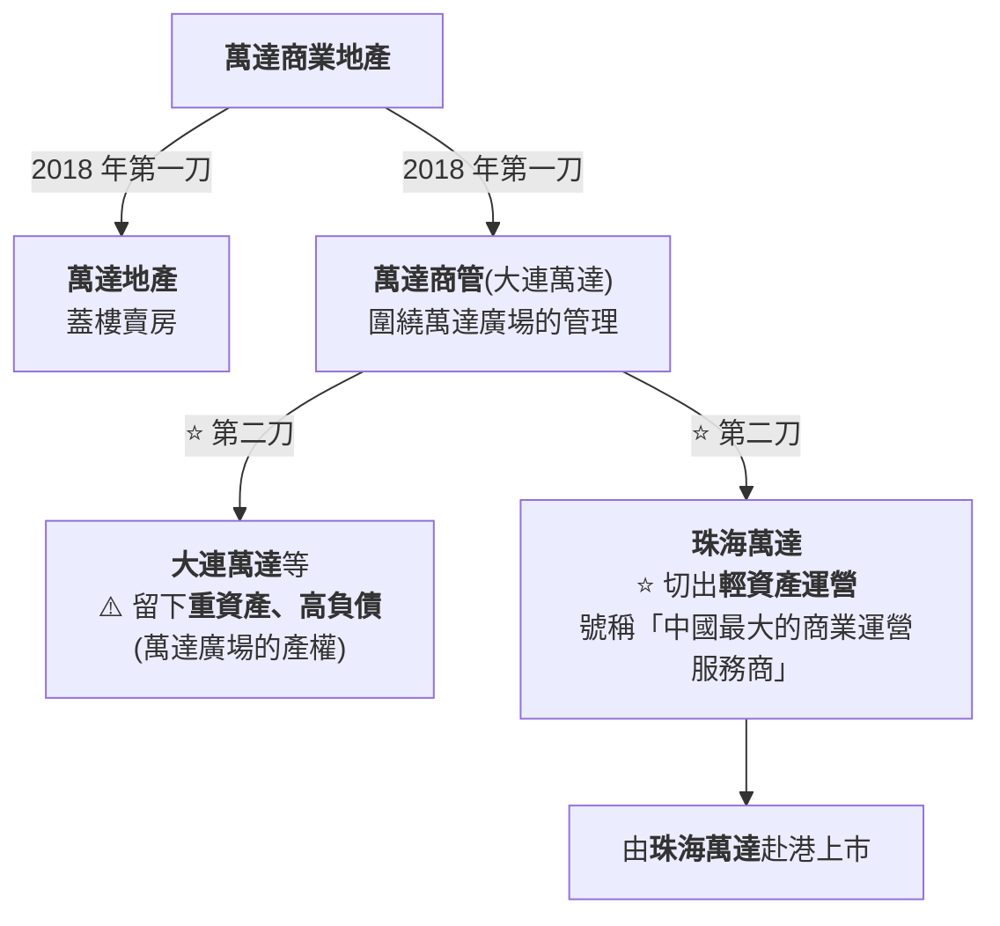
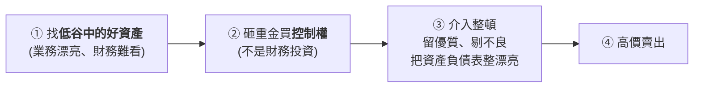

# 萬達怎麼一步步賣掉自己:兩份對賭、四次遞表失敗,與「名字還在、公司換人」

> ⚠️⚠️ **非投資建議。** 本文是對一家公司公開歷史的整理與查證,不含任何買賣建議。
> 整理自 YouTube 頻道 **小Lin说**〈[王健林现在怎么样了? 万达什么情况?](https://www.youtube.com/watch?v=l38ceFOWOAE)〉(2026-08-10,約 22.7 分鐘,官方中文字幕)。
> ⭐ **本文重點不在八卦,在於它是一個非常完整的「資本結構如何反噬經營」的教材。** 核實狀態列在文末。

---

## 一句話總結

> **萬達不是倒在資不抵債,是倒在「上市對賭」的時間表上。**
> 為了換一個更高的估值,它把自己拆開、押上時間表;
> 時間到了而上市沒到,**回購條款就把一家還在賺錢的公司,一塊一塊地變賣掉。**

⭐ **最有畫面感的一句是影片的結尾:**

> **商管是太盟的、電影是儒意的、酒館是同程的,連很多萬達廣場也換了房東 ——
> 「萬達」正在變成一個不再屬於王健林、也不再屬於萬達集團的名字。**

---

## 一、⭐ 起點:一個看起來很划算的估值套利

### 2016 年的萬達有多大

| 指標 | 數字 |
|---|---|
| 總資產 | 接近 **8,000 億人民幣** |
| 年營收 | **2,500 多億** |
| **萬達商業**(核心,商業地產) | 年營收 **1,430 億** |
| **文化板塊** | 年營收 **640 多億**(電影為最大宗) |

**海外併購也很兇:AMC(全球最大院線)、傳奇影業**;
還蓋了十幾座萬達城要對標迪士尼,王健林公開放話「有萬達在,上海迪士尼 20 年內贏不了利」。

### ⚠️ 但有一根刺:港股不給估值

- **2014-12 大連萬達商業地產在香港上市**,是當年港股最大 IPO。
- ⚠️ **上市後股價長期在發行價附近徘徊。**
- ⭐ **對比更扎心**:非主營業務的**萬達院線在 A 股上市,一年股價翻十倍。**
- 📌 **而且當初拉了一堆朋友與大佬(如董明珠)入股** —— 股價這麼慘,面子掛不住。

於是有了那個大膽的方案:**港股退市 → 回 A 股上市。**

### ⚠️⚠️ 第一份對賭

| 條件 | 內容 |
|---|---|
| **期限** | **2018-08-31 前完成上市** |
| **成功** | 皆大歡喜 |
| ⚠️ **失敗** | **王健林得花錢把股份買回來,外加年化 10%–12% 的利息** |

> ⭐⭐ **這裡有一個值得單獨記住的判斷失誤:**
> **當時「A 股上市」被當成一件手拿把掐的事** ——
> 所以對賭的期限被寫得很緊。**它把一個「監管審批」風險,當成了「執行」風險。**

---

## 二、支線任務:海外併購被監管一套組合拳打斷

### 錢從哪來:「內保外貸」

**萬達海外投資估計 250–300 億美元**,約當時總資產的 20%。
2016 上半年,中國公司海外可查投資額達 **2,158 億美元**(萬達、海航、復星、安邦都在買)。

⭐ **地產公司的本質:資產很多,現金很少 —— 是一個槓桿遊戲。**

### ⚠️ 2017 年的組合拳

| 時間 | 動作 |
|---|---|
| **1 月** | 外管局**收緊內保外貸審查** |
| **6 月** | 銀監會要求各銀行**排查萬達、海航、復星、安邦**等海外併購激進企業的授信與風險敞口 |
| **8 月** | 國務院辦公廳把**房地產、酒店、影城、娛樂業、體育俱樂部**的境外投資列為**「限制類」** |

⚠️ **最後那一條列的,恰好就是萬達在海外最愛買的東西。**

📌 **後果不只是貸款收緊,更致命的是市場信心:國內「股債雙殺」——
萬達電影臨時停牌、商業地產債券價格暴跌 ⇒ 融資成本再往上。**

> ⭐⭐⭐ **影片在這裡做了一個很好的診斷,值得單獨記住:**
>
> **「假如你是老王,你接到這個任務,是不是覺得目標就是缺錢?**
> **非也 —— 這時候萬達還不至於那麼缺錢。它真正缺的是『市場與監管的信心』。」**
>
> ⇒ **所以主要目標不是融資,是降槓桿,做給監管與市場看。**

---

## 三、⭐ 斷臂求生:賣什麼,是一道很好的取捨題

**站在 2017 年的王健林角度:**

| 資產 | 判斷 |
|---|---|
| 核心商業地產 | ⚠️ **不能賣**(根基) |
| 影視 | 國內現金流很好,**不想動** |
| 海外資產 | 可以賣,⚠️ **但流程慢,解不了燃眉之急** |
| ⭐ **13 座文旅城** | **前期投入大、回本期長** ⇒ **圈出來** |
| ⭐ **77 家酒店** | **投報率約 4%,不怎麼賺錢** ⇒ **圈出來** |

> ⭐⭐ **選擇標準非常清楚:賣掉「佔用資本最多、回報最差」的,
> 既能快速降負債,又不動到根基。**
> 📌 **這是一個可以直接搬到個人資產配置上的判準。**

### ⚠️ 但買方也缺錢:一個沒做成的「左手倒右手」

融創的孫宏斌看到 13 座文旅城背後幾千萬平方米的物業土地,幾乎是白送的價格,立刻答應。
**但交易超過 600 億,而融創 2017 年剛花 150 億入股樂視,槓桿已經拉滿,缺約 300 億。**

⚠️ **雙方想出的辦法:萬達透過中間銀行以「委託貸款」借約 300 億給融創,
讓融創拿萬達的錢來買萬達的資產。**

> ⚠️⚠️ **這個左手倒右手的結構因為各種原因沒通過。**
> **公告已經發了、交易眼看要黃 —— 這時富力地產的李思廉聞著味進場,接走酒店。**

### 那場著名的簽約發布會

📌 **2017-07-19,中國房地產史上規模最大的交易,簽約當天出了一齣戲:**

- 媒體到場發現**背景板多了富力的 logo**;
- 工作人員突然衝進來清場,說要**推遲一小時彩排**;
- 貴賓室裡傳出**爭吵、巨響與摔杯子的聲音**;
- 有記者遠遠看到**背景板被噴繪布蓋住,富力 logo 被遮掉**;
  工作人員抱著印表機狂奔送新文件進貴賓室,出來的人邊走邊把舊文件撕碎;
- **推遲一個半小時後開場,背景板又換回來,富力 logo 也回來了。**

⭐ 王健林事後的回應:「哪有什麼摔杯子,我們三個在裡邊談笑風生,
主要是今天合同太多太厚,工作人員忙著找印表機。」

### 成交結果

| 標的 | 買方 | 金額 |
|---|---|---|
| **13 座文旅城** | **融創** | **438 億** |
| **77 家酒店** | **富力** | **199 億** |

📌 **效果顯著:萬達商管 15 個月內減了 2,000 多億負債;到 2019 年海外有息負債基本解決。**
**支線任務,渡劫成功。**

---

## 四、⚠️⚠️ 主線任務回來了:「房住不炒」與五年續命針

**港股退市後三個月,中央提出「房住不炒」。**
作為地產龍頭,自然被拿放大鏡檢查 —— **2018 年前 A 股上市,前景烏雲密布。**

⭐ **於是有了第二次資本操作:Roll(借新債還舊債,把貸款往後滾)。**

| 項目 | 內容 |
|---|---|
| **時間** | **2018 年 1 月** |
| **投資方** | **騰訊聯合蘇寧、融創、京東** |
| **金額** | **340 億**,接盤前一批投資人手上的 **14%** 股份 |
| ⚠️ **新對賭** | **上市期限從 2018 推遲到 2023-10-31**;沒上成,王健林要用**更多現金**回購 |

> ⭐⭐ **一句話總結這次操作:花了不少利息,給自己打了一針五年的續命針。**

---

## 五、⭐⭐⭐ 三步走:把「賺錢的部分」單獨切出來上市

### 第一步:棄 A 赴港

**2020 年「三條紅線」政策出台 ⇒ A 股 IPO 基本別想了。**

⭐ **而港股的偏好剛好相反:**

| 港股**不喜歡** | 港股**喜歡** |
|---|---|
| 重資產、高負債(如萬達廣場的產權本身) | ⭐ **物業運營、商業管理** —— 固定資產少、現金流持續,**估值吃香** |

### 第二步:拆

> ⚠️⚠️ **影片在這裡的吐槽正是後來被卡住的原因:**
> **「你把重資產、背負債的部分拿走,把肉留下、賺錢的部分單獨上市 ——
> 你以為你夾菜呢還挑?」**

### 第三步:拉投資人(⚠️ 第三份對賭)

| 項目 | 內容 |
|---|---|
| **投資人** | **22 家**,含中信、螞蟻、騰訊、碧桂園、鄭裕彤家族…… |
| **金額** | **380 億**,持珠海萬達約 **21%** |
| ⚠️ **對賭** | **2023 年底前完成上市**,否則王健林回購 |
| ⭐ **出錢最多的那家** | **太盟(PAG)** —— 記住這個名字,**後面是關鍵先生** |

📌 **此時萬達身上背了兩份大對賭(騰訊牽頭、太盟牽頭),核心條件都是 2023 下半年前上市。**

---

## 六、⚠️ 四次遞表,四次沒下文

**2021-10 首次向港交所遞交 → 2022-04 再遞 → 2022-10 再遞 → 2023-06 再遞。四次都沒被批准。**

⭐ **官方沒有明確解釋,市場普遍猜測的原因,跟上面那個「夾菜還挑」的質疑一模一樣:**

| 疑點 | 具體表現 |
|---|---|
| **關聯交易過重** | 珠海萬達一年營收一兩百億,**但客戶有一大半來自萬達集團自己人** |
| **風險傳導** | **大連萬達債務那麼多,大客戶一出事就會連累珠海萬達** |
| ⚠️⚠️ **資金往母公司輸送** | **2020 年淨利 11 億,卻分紅 51 億** —— 自然主要進了大股東大連萬達 |

> ⭐⭐ **影片的評語很精準:「珠海大連、大連珠海,『珠連璧合』,很難說清楚。」**
> 📌 **這是一個非常好的一般性教訓:**
> **把資產拆乾淨很容易,把「經濟實質」拆乾淨很難 ——
> 而審批看的是後者。**

---

## 七、⚠️⚠️ 對賭到期:回購 700 億 vs 帳上 134 億

| 項目 | 金額 |
|---|---|
| **協議約定需回購股份** | **至少 700 億** |
| ⚠️ **2023 年底大連萬達帳上現金** | **僅 134 億**(而且不是閒錢) |
| ⚠️ **一年內到期的非流動負債** | **600 多億** |

**2023 年賣了幾座萬達廣場、賣了萬達電影股權,回籠 100 多億 —— 遠遠不夠。**
去找投資人談豁免與展期,**這次沒人給面子。**

### ⭐ 關鍵先生:太盟(PAG)與「危機套利」

| 項目 | 內容 |
|---|---|
| **定位** | 亞洲最大的獨立另類資產管理公司之一,**管理規模超 550 億美元** |
| **創始人** | **單偉建** |
| ⭐ **拿手打法** | **「危機套利」** —— 找低谷裡的**好公司/優質資產**,砸重金買下**控制權**,介入整頓:保留優質資產、剔除不良資產,**把資產負債表整漂亮再高價賣出** |
| **前例** | 亞洲金融危機時拿下**韓國第一銀行**控制權,整頓七年後賣掉,大賺 |

**開出的條件:給 600 億,但要珠海萬達 60% 的股權 —— 也就是控制權。**

| 結果 | 股權變化 |
|---|---|
| **大連萬達持珠海萬達** | **79% → 40%** |
| **太盟 + 中信資本 + Ares + 兩支中東基金** | **60%** |

> ⚠️ **影片特別澄清一個常見誤解:萬達跟恒大完全不一樣 ——
> 萬達還遠遠沒到資不抵債的程度,主要資產仍是商業地產。**
> **它的問題是「非常缺現金」,不是「資產是假的」。**

---

## 八、之後:一路賣到今天

| 時間 | 動作 |
|---|---|
| 2023 | 開始賣萬達廣場、賣萬達電影股權 |
| 2024 | 賣掉二三十座萬達廣場 |
| ⭐ **2025-05** | **一口氣打包賣掉 48 座萬達廣場**,買方仍是**太盟牽頭的集團**(含騰訊等) |
| 2025-05 | **連同運營這些地產的商管公司,也賣掉 60% 股權,控制權讓出** |

⚠️ **而商管正是王健林說過「什麼企業都能丟,這個不能丟」的命根子。**

| 指標 | 變化 |
|---|---|
| 累計回籠資金 | 約 **900 億**(影片說法) |
| **負債率** | **90% → 65%** |
| ⚠️ **但仍然** | **每天一睜眼就多 2,000 萬利息** |

> ⭐ **影片的收尾沒有嘲弄,反而是敬意:**
> **72 歲的王健林沒跑也沒躺平,還在飛貴州、飛新疆、飛福建,
> 一個縣一個縣考察文旅專案 —— 像 30 多年前那個接手爛攤子的轉業軍人一樣。**

---

## 九、⭐⭐ 應用案例:五個可以直接搬走的判準

### 案例 1|⭐⭐⭐ 對賭(VAM)最危險的地方:它把「不可控風險」寫成了「你的責任」

| 對賭條件的性質 | 風險是誰的 | 合理性 |
|---|---|---|
| 「營收/利潤達到 X」 | ⭐ **經營者可控** | 合理 |
| ⚠️⚠️ **「某年某月前完成上市」** | ⚠️ **監管審批,經營者不可控** | **非常危險** |

> 📌 **萬達的兩份對賭都押在第二種。**
> **「房住不炒」、「三條紅線」、港交所四次不批 —— 沒有一件是王健林能決定的,
> 但違約的代價全部由他承擔。**
>
> ⭐ **一般化的教訓:簽任何附條件的協議前,先把條件分成「我能控制的」與「我不能控制的」。**
> **不能控制的那些,要嘛別簽,要嘛把代價談小。**

### 案例 2|⭐ 「拆分上市」要拆的是經濟實質,不是法律結構

**檢查一家分拆上市公司的三個問題(直接來自港交所卡住珠海萬達的疑點):**

1. **關聯交易佔營收多少?**(珠海萬達:一大半來自集團自己人)
2. **有沒有異常分紅?**(淨利 11 億、分紅 51 億)
3. **母公司出事,子公司會不會被連累?**

### 案例 3|⭐ 診斷「缺什麼」比診斷「缺多少」重要

> **2017 年萬達缺的不是錢,是信心。**
> ⇒ 所以正確動作是**降槓桿做給市場看**,不是去融更多資。
>
> 📌 **推廣:遇到危機時先問「這是流動性問題、償付能力問題,還是信心問題?」
> 三者的解法完全不同,用錯了會加速惡化。**

### 案例 4|賣資產的排序:先賣「佔用資本最多、回報最低」的

**萬達 2017 年的選法(文旅城 + 4% 投報率的酒店)是教科書級的。**
⚠️ **而 2023 年之後就沒有邊角料可賣了 —— 只剩核心業務。**

> ⭐⭐ **這正是「早一點斷臂」與「晚一點斷臂」的差距:
> 早賣的是不賺錢的,晚賣的是命根子。**

### 案例 5|⭐ 認識一種投資風格:危機套利

**單偉建的打法可以拆成四步,是一個可辨識的模式:**

> 📌 **辨識重點在第二步:要的是「控制權」而不是股權比例。**
> **當一個買方開口就要 60% 時,它想做的不是投資,是重整。**

---

## 重點回顧(TL;DR)

1. **2016 年巔峰:總資產近 8,000 億、年營收 2,500 多億。**
2. **起點是估值套利**:港股不給估值(而 A 股的萬達院線一年漲十倍)⇒ 決定港股退市回 A 股。
3. ⚠️ **退市要買回流通股約 300 多億港元,向杉杉/平安/中鐵等融 300 億人民幣 ——
   附帶第一份對賭:2018-08-31 前上市,否則回購 + 年化 10%–12% 利息。**
4. **2017 年監管組合拳**(1 月收緊內保外貸、6 月排查授信、8 月把地產/酒店/影城/娛樂/體育的境外投資列為限制類)⇒ 國內股債雙殺。
5. ⭐⭐⭐ **當時真正缺的是信心不是錢** ⇒ 正解是降槓桿。
6. **2017-07-19 賣掉 13 座文旅城(融創 438 億)+ 77 家酒店(富力 199 億)**;
   ⭐ 選的是**佔資本最多、回報最低**的兩塊;15 個月減負債 2,000 多億。
7. **2018-01 騰訊/蘇寧/融創/京東投 340 億接盤 14%,上市期限展延到 2023-10-31**(第二份對賭)。
8. ⭐⭐ **三步走:棄 A 赴港 → 把商管再拆一刀、把輕資產切成珠海萬達 → 拉 22 家投資人融 380 億(第三份對賭)。**
9. ⚠️ **2021-10 至 2023-06 四次遞表全部沒下文** —— 市場普遍歸因於關聯交易過重與異常分紅(2020 年淨利 11 億、分紅 51 億)。
10. ⚠️⚠️ **對賭到期:需回購至少 700 億,而 2023 年底帳上現金僅 134 億。**
11. **太盟(PAG)以「危機套利」進場**:給 600 億換珠海萬達 **60%** 控制權;
    **大連萬達持股 79% → 40%。**
12. **2025-05 打包賣掉 48 座萬達廣場**(仍是太盟牽頭,含騰訊);
    **負債率 90% → 65%,但每天仍多 2,000 萬利息。**
13. ⭐ **萬達 ≠ 恒大**:還遠未到資不抵債,問題是**極度缺現金**。

⚠️ **再次聲明:本文為公司歷史整理,非投資建議。**

---

## 核實狀態

### ✅ 已核實

| 影片說法 | 核實結果 |
|---|---|
| **2025-05 打包出售 48 座萬達廣場,太盟牽頭、含騰訊** | **屬實**;⭐ **交易規模約 500 億人民幣**,2025-05-06 獲市場監管總局無條件批准,買方為**太盟(珠海)、高和豐德、騰訊、北京潘達、陽光人壽**共同設立的合營企業;涉及北京、廣州、成都、杭州、南京、武漢等一二線城市 |
| **交易後由萬達商管繼續負責日常營運,但產權易主** | **屬實** |
| **2017 年融創 438 億買文旅、富力 199 億買酒店** | **屬實**(合計約 637.5 億);⭐ 影片說的「先公告 632 億」也對應到 **7 月初最初版本的公告金額**,7-19 才拆成融創/富力兩方 |

### ⚠️ 未能獨立查證(以影片轉述看待)

- **2016 年總資產近 8,000 億、營收 2,500 多億、萬達商業 1,430 億、文化 640 多億** —— 未核對年報。
- **私有化融資約 300 億、對賭利息年化 10%–12%、回購股份約佔總股本 14%** —— 未核對原始協議揭露。
- **2018-01 騰訊等投 340 億、期限展延至 2023-10-31** —— 方向與公開報導一致,細節未逐項核對。
- **22 家投資人、380 億、約 21% 股權** 與 **太盟 600 億換 60%、大連萬達 79%→40%** —— 未核對交易公告原文。
- **四次遞表的具體日期**、**珠海萬達 2020 年淨利 11 億/分紅 51 億** —— 未核對招股書。
- **2023 年底帳上現金 134 億、一年內到期非流動負債 600 多億、需回購至少 700 億** —— 未核對財報。
- **累計回籠約 900 億、負債率 90%→65%、每天 2,000 萬利息** —— ⚠️ **48 座那筆已核實為約 500 億,其餘為累計估算**,未逐項驗算。
- **海外投資 250–300 億美元、2016 上半年中國企業海外投資 2,158 億美元** —— 未核對統計來源。
- **太盟管理規模超 550 億美元、韓國第一銀行前例** —— 方向屬實(單偉建確以此案聞名),**確切數字未核對。**
- **2017-07-19 簽約會場的摔杯子/換背景板等細節** —— **屬當時媒體現場報導與傳聞,本文未再查證。**

---

## 來源

- [王健林现在怎么样了? 万达什么情况? — 小Lin说](https://www.youtube.com/watch?v=l38ceFOWOAE)(2026-08-10,約 22.7 分鐘,官方中文字幕)
- 核實用公開報導:
  - [500亿「清仓」48座万达广场,王健林还剩多少家底 — 腾讯新闻](https://news.qq.com/rain/a/20250528A01B9900)
  - [48座万达广场将易主 王健林再度「断腕」以破解债务难题 — 财联社](https://www.cls.cn/detail/2041299)
  - [王健林再卖48座万达广场,太盟腾讯等组团接手 — 新浪财经](https://finance.sina.com.cn/roll/2025-05-26/doc-inexwxmc2457939.shtml)
  - [王健林甩卖48个万达广场:仍有巨额债务,「老友」出手接盘 — 观察者网](https://www.guancha.cn/economy/2025_05_26_777214.shtml)

> ⚠️ **非投資建議。** 本文為對一支公開影片的整理,大部分財務細節未能逐項核對原始揭露,
> 已在核實狀態中明確標示。**具體數字請以萬達相關主體的公開公告與財報為準。**
